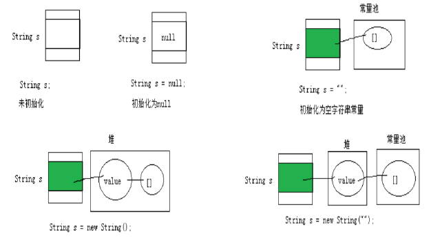
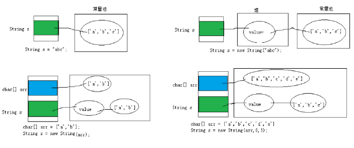
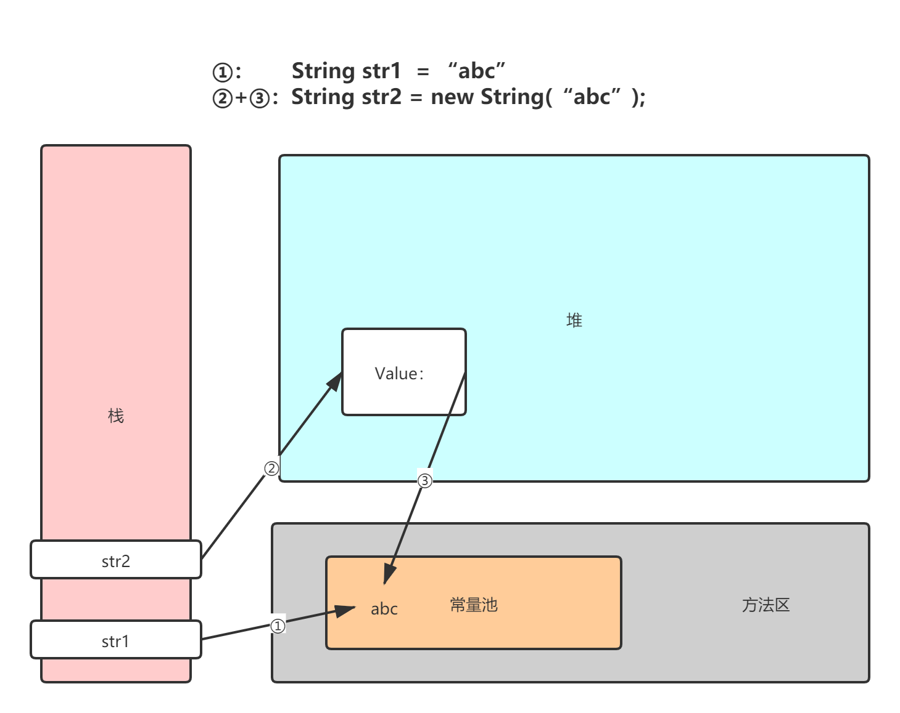
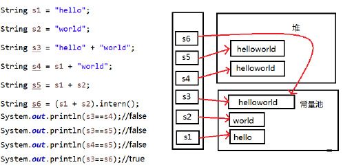
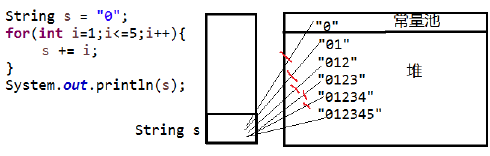
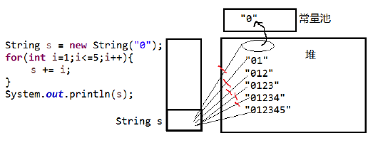
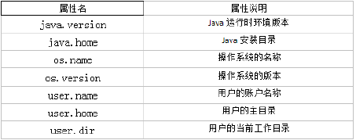

# Java常用类

## 字符串相关的类

### String

- String:字符串，使用一对""引起来表示。

- String声明为final的，不可被继承

- String实现了Serializable接口：表示字符串是支持序列化的。实现了Comparable接口：表示String可以比较大小

- String内部定义了final char[] value用于存储字符串数据

- 通过字面量的方式（区别于new给一个字符串赋值，此时的字符串值声明在字符串常量池中)。

- 字符串常量池中是不会存储相同内容(使用String类的equals()比较，返回true)的字符串的。

- String**的不可变性**

  - 当对字符串重新赋值时，需要重写指定内存区域赋值，不能使用原有的value进行赋值。
  - 当对现的字符串进行连接操作时，也需要重新指定内存区域赋值，不能使用原有的value进行赋值。
  - 当调用String的replace()方法修改指定字符或字符串时，也需要重新指定内存区域赋值，不能使用原有的value进行赋值。

  ```java
  @Test
  public void  testString(){
      String s1 = "abc";//字面量的定义方式
      String s2 = "abc";
      s1 = "hello";
  
      System.out.println(s1 == s2);//比较s1和s2的地址值
  
      System.out.println(s1);//hello
      System.out.println(s2);//abc
  
      System.out.println("*****************");
  
      String s3 = "abc";
      s3 += "def";
      System.out.println(s3);//abcdef
      System.out.println(s2);
  
      System.out.println("*****************");
  
      String s4 = "abc";
      String s5 = s4.replace('a', 'm');
      System.out.println(s4);//abc
      System.out.println(s5);//mbc
  }
  ```

- String实例化的不同方式

  - 方式一：通过字面量定义的方式
    - `String str = "hello"`;
  - 方式二：通过new + 构造器的方式
    - `String s1 = new String(); `
      - 本质上`this.value = new char[0];`
    - `String s2 = new String(String original); `
      - 本质上`this.value = original.value;`
    - `String s3 = new String(char[] a); `
      - `this.value = Arrays.copyOf(value, value.length);`

- String理解

  



- 两种创建String字符串的区别

  

- 字符串常量存储在字符串常量池，目的是共享

- 字符串非常量对象存储在堆中。

- 字符串的特性

  

  - 常量与常量的拼接结果在常量池。且常量池中不会存在相同内容的常量。
  - 只要其中有一个是变量，结果就在堆中
  - 如果拼接的结果调用intern()方法，返回值就在常量池中

- 深入理解字符串

  - `String s1 = "a"`;
    - 说明：在字符串常量池中创建了一个字面量为"a"的字符串。
  - `s1 = s1 + "b"`;
    - 说明：实际上原来的“a”字符串对象已经丢弃了，现在在堆空间中产生了一个字符串s1+"b"（也就是"ab")。如果多次执行这些改变串内容的操作，会导致大量副本字符串对象存留在内存中，降低效率。如果这样的操作放到循环中，会极大影响程序的性能。
  - `String s2 = "ab"`;
    - 说明：直接在字符串常量池中创建一个字面量为"ab"的字符串。
  - `String s3 = "a" + "b"`;
    - 说明：s3指向字符串常量池中已经创建的"ab"的字符串。
  - `String s4 = s1.intern()`;
    - 说明：堆空间的s1对象在调用intern()之后，会将常量池中已经存在的"ab"字符串赋值给s4。
  - 
  - 
  - 本质都是调用`StringBulider`变成可变字符串然后进行改变
  - 但是为什么既然调用了`StringBuilder`为什么 当`s ="01"`和`s="012"`时不等呢？
  - 因为调用`StringBuilder`后还有一个创建对象的操作`toString()`

  ```java
  public class StringMethod {
      String str = "good";
  
      char[] ch = {'t', 'e', 's', 't'};
  
      public static void main(String[] args) {
          StringMethod ex = new StringMethod();
          ex.swap(ex.str, ex.ch);
          System.out.println(ex.str); // good
          System.out.println(ex.ch); // best
      }
  
      public void swap(String str, char[] ch) {
          str = "test ok";
          ch[0] = 'b';
      }
  }
  ```

- String常用方法

  - `int length()`：返回字符串的长度： return value.length

  - `char charAt(int index)`： 返回某索引处的字符return value[index]

  - `boolean isEmpty()`：判断是否是空字符串：return value.length == 0

  - `String toLowerCase()`：使用默认语言环境，将 String 中的所有字符转换为小写

  - `String toUpperCase()`：使用默认语言环境，将 String 中的所有字符转换为大写

  - `String trim()`：返回字符串的副本，忽略前导空白和尾部空白

  - `boolean equals(Object obj)`：比较字符串的内容是否相同

  - `boolean equalsIgnoreCase(String anotherString)`：与equals方法类似，忽略大小写

  - `String concat(String str)`：将指定字符串连接到此字符串的结尾。 等价于用“+”

  - `int compareTo(String anotherString)`：比较两个字符串的大小

  - `String substring(int beginIndex)`：返回一个新的字符串，它是此字符串的从beginIndex开始截取到最后的一个子字符串。

  - `String substring(int beginIndex, int endIndex) `：返回一个新字符串，它是此字符串从beginIndex开始截取到endIndex(不包含)的一个子字符串。

  - `boolean endsWith(String suffix)`：测试此字符串是否以指定的后缀结束

  - `boolean startsWith(String prefix)`：测试此字符串是否以指定的前缀开始

  - `boolean startsWith(String prefix, int toffset)`：测试此字符串从指定索引开始的子字符串是否以指定前缀开始

  - `boolean contains(CharSequence s)`：当且仅当此字符串包含指定的 char 值序列时，返回 true

  - `int indexOf(String str)`：返回指定子字符串在此字符串中第一次出现处的索引

  - `int indexOf(String str, int fromIndex)`：返回指定子字符串在此字符串中第一次出现处的索引，从指定的索引开始

  - `int lastIndexOf(String str)`：返回指定子字符串在此字符串中最右边出现处的索引

  - `int lastIndexOf(String str, int fromIndex)`：返回指定子字符串在此字符串中最后一次出现处的索引，从指定的索引开始反向搜索

    - indexOf和lastIndexOf方法如果未找到都是返回-1

  - `String replace(char oldChar, char newChar)`：返回一个新的字符串，它是通过用newChar 替换此字符串中出现的所有oldChar 得到的。

  - `String replace(CharSequence target, CharSequence replacement)`：使用指定的字面值替换序列替换此字符串所有匹配字面值目标序列的子字符串。

  - `String replaceAll(String regex, String replacement) `： 使用 给 定 的replacement 替换此字符串所有匹配给定的正则表达式的子字符串。

    ```java
    String str = "12hello34world5java7891mysql456";
    //把字符串中的数字替换成,，如果结果中开头和结尾有，的话去掉
    String string = str.replaceAll("\\d+", ",").replaceAll("^,|,$", ""); System.out.println(string);
    ```

  - `String replaceFirst(String regex, String replacement) `：使用给定的replacement 替换此字符串匹配给定的正则表达式的第一个子字符串。

  - `boolean matches(String regex)`：告知此字符串是否匹配给定的正则表达式。

    ```java
    String str = "12345";
    //判断str字符串中是否全部有数字组成，即有1-n个数字组成boolean matches = str.matches("\\d+");
    System.out.println(matches);
    String tel = "0571-4534289";
    //判断这是否是一个杭州的固定电话
    boolean result = tel.matches("0571-\\d{7,8}"); System.out.println(result);
    ```

  - `String[] split(String regex)`：根据给定正则表达式的匹配拆分此字符串。

  - `String[] split(String regex, int limit)`：根据匹配给定的正则表达式来拆分此字符串，最多不超过limit个，如果超过了，剩下的全部都放到最后一个元素中。

    ```java
    public class StringTest {
        public static void main(String[] args) {
            String str = "hello|world|java";
            String[] strs = str.split("\\|");
            for (int i = 0; i < strs.length; i++) {
                System.out.println(strs[i]);
            }
        }
    }
    ```

- 字符串->基本数据类型、包装类

  - Integer包装类的public static int parseInt(String s)：可以将由“数字”字符组成的字符串转换为整型。
  - 类似地,使用java.lang包中的Byte、Short、Long、Float、Double类调相应的类方法可以将由“数字”字符组成的字符串，转化为相应的基本数据类型。
  
- 基本数据类型、包装类->字符串
  
  - 调用String类的`public String valueOf(int n)`可将int型转换为字符串
  - 相应的`valueOf(byte b)、valueOf(long l)、valueOf(float f)、valueOf(doubled)valueOf(boolean b)`可由参数的相应类型到字符串的转换
  
  ```java
  //与字符数组之间的转换
  //  String --> char[]:调用String的toCharArray()
  // char[] --> String:调用String的构造器*/
  
  @Test
  public void test4() {
      String str1 = "abc123";  //题目： a21cb3
  
      char[] charArray = str1.toCharArray();
      for (int i = 0; i < charArray.length; i++) {
          System.out.println(charArray[i]);
      }
      char[] arr = new char[]{'h', 'e', 'l', 'l', 'o'};
      String str2 = new String(arr);
    System.out.println(str2);
  }
  ```
```
  
- 字符数组->字符串
  
  - String 类的构造器：`String(char[]) 和 String(char[]，int offset，int length) `分别用字符数组中的全部字符和部分字符创建字符串对象。
  
- 字符串->字符数组
  
  - `public byte[] getBytes()` ：使用平台的默认字符集将此 String 编码为byte 序列，并将结果存储到一个新的 byte 数组中。
  - `public byte[] getBytes(String charsetName) `：使用指定的字符集将此 String 编码到 byte 序列，并将结果存储到新的 byte 数组。
  
  ```java
  // 编码：String --> byte[]:调用String的getBytes()
  // 解码：byte[] --> String:调用String的构造器
  @Test
      public void test5() throws UnsupportedEncodingException {
          String str1 = "abc123中国";
          byte[] bytes = str1.getBytes();//使用默认的字符集，进行编码。
          System.out.println(Arrays.toString(bytes));
          byte[] gbks = str1.getBytes("gbk");//使用gbk字符集进行编码。
          System.out.println(Arrays.toString(gbks));
          System.out.println("******************");
          String str2 = new String(bytes);//使用默认的字符集，进行解码。
          System.out.println(str2);
          String str3 = new String(gbks);
          System.out.println(str3);//出现乱码。原因：编码集和解码集不一致！
        String str4 = new String(gbks, "gbk");
          System.out.println(str4);//没出现乱码。原因：编码集和解码集一致！
    }
```


### StringBuffer

- java.lang.StringBuffer代表可变的字符序列，JDK1.0中声明，可以对字符串内容进行增删，此时不会产生新的对象。
- 很多方法与String相同。
- 作为参数传递时，方法内部可以改变值。
- StringBuffer类不同于String，其对象必须使用构造器生成。有三个构造器：
  - `StringBuffer()`：初始容量为16的字符串缓冲区
  - `StringBuffer(int size)`：构造指定容量的字符串缓冲区
  - `StringBuffer(String str)`：将内容初始化为指定字符串内容
- StringBuffer类的常用方法
  - `StringBuffer append(xxx)`：提供了很多的append()方法，用于进行字符串拼接
  - `StringBuffer delete(int start,int end)`：删除指定位置的内容
  - `StringBuffer replace(int start, int end, String str)`：把[start,end)位置替换为str 
  - `StringBuffer insert(int offset, xxx)`：在指定位置插入xxx
  - `StringBuffer reverse()` ：把当前字符序列逆转
  - `public int indexOf(String str)`：查看str的索引位置
  - `public String substring(int start,int end) `：切分子串
  - `public int length()`：长度
  - `public char charAt(int n )`查找当前位置字符
  - `public void setCharAt(int n ,char ch)`：修改当前位置字符
- 当append和insert时，如果原来value数组长度不够，可扩容。
- 如上这些方法支持方法链操作。

### StringBuilder

- `StringBuilder` 和` StringBuffer` 非常类似，均代表可变的字符序列，而且提供相关功能的方法也一样
- 对比`String`、`StringBuffer`、`StringBuilder`
  - `String(JDK1.0)`：不可变字符序列
  - `StringBuffer(JDK1.0)`：可变字符序列、效率低、线程安全
  - `StringBuilder(JDK 5.0)`：可变字符序列、效率高、线程不安全

## 日期时间API

### JDK8之前日期时间API


-  `java.lang.System`类

  - `System`类提供的`public static long currentTimeMillis()`用来返回当前时间与1970年1月1日0时0分0秒之间以毫秒为单位的时间差。
  - 此方法适于计算时间差。
  - 计算世界时间的主要标准有：
    - UTC(Coordinated Universal Time)
    - GMT(Greenwich Mean Time)
    - CST(Central Standard Time)

- `java.util.Date`类和`java.sql.Date`:表示特定的瞬间，精确到毫秒

  - `java.sql.Date`是`java.util.Date`的子类

  - 构造器：

    - `Date()`：使用无参构造器创建的对象可以获取本地当前时间。
    - `Date(long date)`

  - 常用方法

    - getTime():返回自 1970 年 1 月 1 日 00:00:00 GMT 以来此 Date 对象表示的毫秒数。
    - toString():把此 Date 对象转换为以下形式的 `String： dow mon dd hh:mm:ss zzz yyyy 其中： dow 是一周中的某一天 (Sun, Mon, Tue, Wed, Thu, Fri, Sat)，zzz是时间标准。`
    - 其它很多方法都过时了。

    ```java
    @Test
    public void test2(){
        //构造器一：Date()：创建一个对应当前时间的Date对象
        Date date1 = new Date();
        System.out.println(date1.toString());
        System.out.println(date1.getTime());
    
        //构造器二：创建指定毫秒数的Date对象
        Date date2 = new Date(155030620410L);
        System.out.println(date2.toString());
    
        //创建java.sql.Date对象
        java.sql.Date date3 = new java.sql.Date(35235325345L);
        System.out.println(date3);//1971-02-13
    
        //如何将java.util.Date对象转换为java.sql.Date对象
        //情况一：
        //        Date date4 = new java.sql.Date(2343243242323L);
        //        java.sql.Date date5 = (java.sql.Date) date4;
        //情况二：
        Date date6 = new Date();
        java.sql.Date date7 = new java.sql.Date(date6.getTime());
    }
    ```

- `java.text.SimpleDataFormat`类

  - `SimpleDateFormat`对日期Date类的格式化和解析
  - 格式化：
    - `SimpleDateFormat()` ：默认的模式和语言环境创建对象
    - `public SimpleDateFormat(String pattern)`：该构造方法可以用参数pattern指定的格式创建一个对象，该对象调用：
    - `public String format(Date date)`：方法格式化时间对象date
  - 解析：
    - `public Date parse(String source)`：从给定字符串的开始解析文本，以生成一个日期。

  ```java
  public class SimpleDateFormatDemo {
      public static void main(String[] args) {
          Date date = new Date(); // 产生一个Date实例
  		// 产生一个formater格式化的实例
          SimpleDateFormat formater = new SimpleDateFormat();
          System.out.println(formater.format(date));// 打印输出默认的格式
          SimpleDateFormat formater2 = new SimpleDateFormat("yyyy年MM月dd日 EEE HH:mm:ss");
          System.out.println(formater2.format(date));
          // 实例化一个指定的格式对象
          Date date2 = null; // 将指定的日期解析后格式化按指定的格式输出
          try {
              date2 = formater2.parse("2008年08月08日 星期一 08:08:08");
          } catch (ParseException e) {
              e.printStackTrace();
          }
          System.out.println(date2.toString());
      }
  }
  ```

- `java.util.Calendar(日历)`类

  - `Calendar`是一个抽象基类，主用用于完成日期字段之间相互操作的功能。
  - 获取`Calendar`实例的方法
    - 使用`Calendar.getInstance()`方法
    - 调用它的子类`GregorianCalendar`的构造器。
  - 一个Calendar的实例是系统时间的抽象表示，通过get(int field)方法来取得想要的时间信息。比如`YEAR、MONTH、DAY_OF_WEEK、HOUR_OF_DAY 、 MINUTE、SECOND`
    - `public void set(int field,int value)`
    - `public void add(int field,int amount)`
    - `public final Date getTime()`
    - `public final void setTime(Date date)`
  - 注意:
    - 获取月份时：一月是0，二月是1，以此类推，12月是11
    - 获取星期时：周日是1，周二是2 ， 。。。。周六是7

  ```java
  public class CalendarDemo {
      public static void main(String[] args) {
          Calendar calendar = Calendar.getInstance();
          // 从一个 Calendar 对象中获取 Date 对象
          Date date = calendar.getTime();
          System.out.println(date);
          // 使用给定的 Date 设置此 Calendar 的时间
          date = new Date(234234235235L);
          calendar.setTime(date);
          calendar.set(Calendar.DAY_OF_MONTH, 8);
          System.out.println("当前时间日设置为8后,时间是:" + calendar.getTime());
          calendar.add(Calendar.HOUR, 2);
          System.out.println("当前时间加2小时后,时间是:" + calendar.getTime());
          calendar.add(Calendar.MONTH, -2);
          System.out.println("当前日期减2个月后,时间是:" + calendar.getTime());
      }
  }
  ```

### JDK8中新日期时间API

- JDK 1.0中包含了一个`java.util.Date`类，但是它的大多数方法已经在JDK 1.1引入Calendar类之后被弃用了。而Calendar并不比Date好多少。它们面临的问题是：

  - 可变性：像日期和时间这样的类应该是不可变的。
  - 偏移性：Date中的年份是从1900开始的，而月份都从0开始。
  - 格式化：格式化只对Date有用，Calendar则不行。
  - 此外，它们也不是线程安全的；不能处理闰秒等。

- 第三次引入的API是成功的，并且Java 8中引入的java.time API 已经纠正了过去的缺陷，将来很长一段时间内它都会为我们服务。

- Java 8 吸收了 Joda-Time 的精华，以一个新的开始为 Java 创建优秀的API。新的 java.time 中包含了所有关于本地日期（LocalDate）、本地时间（LocalTime）、本地日期时间（LocalDateTime）、时区（ZonedDateTime）和持续时间（Duration）的类。历史悠久的 Date 类新增了 toInstant() 方法，用于把 Date 转换成新的表示形式。这些新增的本地化时间日期API 大大简化了日期时间和本地化的管理。

- 新时间日期API

  - `java.time` – 包含值对象的基础包
  - `java.time.chrono` – 提供对不同的日历系统的访问
  - `java.time.format` – 格式化和解析时间和日期
  - `java.time.temporal` – 包括底层框架和扩展特性
  - `java.time.zone `– 包含时区支持的类

- `LocalDate、LocalTime、LocalDateTime `类是其中较重要的几个类，它们的实例是不可变的对象，分别表示使用 ISO-8601日历系统的日期、时间、日期和时间。它们提供了简单的本地日期或时间，并不包含当前的时间信息，也不包含与时区相关的信息。

  - `LocalDate`代表IOS格式（yyyy-MM-dd）的日期,可以存储 生日、纪念日等日期。

  - `LocalTime`表示一个时间，而不是日期。

    ```java
    @Test
    public void testLocalTime() {
        /*
            getHour()/getMinute()/getSecond():获得当前对象对应的小时、分钟、秒
            */
        LocalTime now = LocalTime.now();
        int hour = now.getHour();
        System.out.println(hour);
        int minute = now.getMinute();
        int second = now.getSecond();
        System.out.println(minute);
        System.out.println(second);
    }
    
    ```

  - `LocalDateTime`是用来表示日期和时间的，这是一个最常用的类之一。

    ```java
    @Test
    public void testLocalDateTime() {
        LocalDateTime now = LocalDateTime.now();
        int nano = now.getNano();
        System.out.println(nano);
        long aLong = now.getLong(ChronoField.MONTH_OF_YEAR);
        System.out.println(aLong);
        /*
            有返回值
             set ：withDayOfMonth()/withDayOfYear()/withMonth()/withYear() :将月份天数、年份天数、月份、年份修改为指定的值并返回新的对象
             add + ： plusDays(), plusWeeks(), plusMonths(), plusYears(),plusHours()：向当前对象添加几天、几周、几个月、几年、几小时
                 - ：minusMonths() / minusWeeks()/minusDays()/minusYears()/minusHours()：从当前对象减去几月、几周、几天、几年、几小时
             */
    
        LocalDateTime localDateTime = now.withHour(6);
        System.out.println(localDateTime);
    }
    ```

| 方法                                                         | 描述                                                         |
| ------------------------------------------------------------ | ------------------------------------------------------------ |
| `now() / *  now(ZoneId zone)`                                | 静态方法，根据当前时间创建对象/指定时区的对象                |
| `of()`                                                       | 静态方法，根据指定日期/时间创建对象                          |
| `getDayOfMonth()/getDayOfYear()`                             | 获得月份天数(1-31) /获得年份天数(1-366)                      |
| `getDayOfWeek()`                                             | 获得星期几(返回一个 DayOfWeek 枚举值)                        |
| `getMonth()`                                                 | 获得月份, 返回一个 Month 枚举值                              |
| `getMonthValue() / getYear()`                                | 获得月份(1-12) /获得年份                                     |
| `getHour()/getMinute()/getSecond()`                          | 获得当前对象对应的小时、分钟、秒                             |
| `withDayOfMonth()/withDayOfYear()/withMonth()/withYear()`    | 将月份天数、年份天数、月份、年份修改为指定的值并返回新的对象 |
| `plusDays(), plusWeeks(), plusMonths(), plusYears(),plusHours()` | 向当前对象添加几天、几周、几个月、几年、几小时               |
| `minusMonths() / minusWeeks()/minusDays()/minusYears()/minusHours()` | 从当前对象减去几月、几周、几天、几年、几小时                 |

- `getDayOfLocalDate`

  ```java
  @Test
  public void testgetDayOfLocalDate() {
      /*
          getDayOfMonth()/getDayOfYear():获得月份天数(1-31) /获得年份天数(1-366)
          getDayOfWeek():获得星期几(返回一个 DayOfWeek 枚举值)
          getMonth():获得月份, 返回一个 Month 枚举值
          */
      LocalDate now = LocalDate.now();
      int dayOfMonth = now.getDayOfMonth();
      System.out.println(dayOfMonth);
      DayOfWeek dayOfWeek = now.getDayOfWeek();
      System.out.println(dayOfWeek);
      int dayOfYear = now.getDayOfYear();
      System.out.println(dayOfYear);
      Month month = now.getMonth();
      System.out.println(month);
      int monthValue = now.getMonthValue();
      System.out.println(monthValue);
      System.out.println();
  
  }
  ```

- `Of()`

  ```java
  @Test
  public void testOf() {
      LocalDate of = LocalDate.of(2019, 2, 28);
      System.out.println(of);
  }
  ```

- `LocalDate.now()`

  ```java
  @Test
  public void testLocalDateNow() {
      // 静态方法，根据当前时间创建对象/指定时区的对象
      LocalDate now = LocalDate.now();
      System.out.println(now);
  }
  ```

- `Instant`

  - 时间线上的一个瞬时点。 概念上讲，它只是简单的表示自1970年1月1日0时0分0秒（UTC开始的秒数。）
    - 类似于 `java.util.Date`类
  - `now()`:静态方法，返回默认UTC时区的Instant类的对象
  - `ofEpochMilli(long epochMilli)`:静态方法，返回在1970-01-01 00:00:00基础上加上指定毫秒数之后的Instant类的对象
  - `atOffset(ZoneOffset offset)`:结合即时的偏移来创建一个OffsetDateTime
  - `toEpochMilli()`:返回1970-01-01 00:00:00到当前时间的毫秒数，即为时间戳

  ```java
  @Test
  public void testIntant() {
      /*
          构造对象
          now():静态方法，返回默认UTC时区的Instant类的对象
          ofEpochMilli(long epochMilli):静态方法，返回在1970-01-01 00:00:00基础上加上指定毫秒数之后的Instant类的对象   Date(long Milli)
          偏移和获取时间戳
          atOffset(ZoneOffset offset):结合即时的偏移来创建一个OffsetDateTime
          toEpochMilli():返回1970-01-01 00:00:00到当前时间的毫秒数，即为时间戳 Date.getTime()
           */
      Instant now = Instant.now();
      System.out.println(now);
      OffsetDateTime time = now.atOffset(ZoneOffset.ofHours(8));
      System.out.println(time);
      long l = now.toEpochMilli();
      System.out.println(l);
      Instant instant = Instant.ofEpochMilli(l);
      System.out.println(instant);
  }
  ```

- 日期时间格式化类：`DateTimeFormatter`

  - 格式化或解析日期、时间
    - 类似于SimpleDateFormat
  - 预定义的标准格式。
    - 如：`ISO_LOCAL_DATE_TIME;ISO_LOCAL_DATE;ISO_LOCAL_TIME`
  - 本地化相关的格式。
    - 如：`ofLocalizedDateTime(FormatStyle.LONG)`
  - 自定义的格式。
    - 如：`ofPattern("9yyyy-MM-dd hh:mm:ss")`
  - 常用方法
    - `ofPattern(String pattern)`：静态方法 ， 返 回 一 个 指 定 字 符 串 格 式 的DateTimeFormatter
    - `format(TemporalAccessor t)`：格式化一个日期、时间，返回字符串
    - `parse(CharSequence text)`：将指定格式的字符序列解析为一个日期、时间

  ```java
  @Test
  public void testDateTimeFormatter() {
      DateTimeFormatter formatter = DateTimeFormatter.ISO_LOCAL_DATE_TIME;
      LocalDateTime now = LocalDateTime.now();
      System.out.println(now);
      String format = formatter.format(now);
      System.out.println(format);
      TemporalAccessor parse = formatter.parse(format);
      LocalDateTime time = LocalDateTime.from(parse);
      System.out.println(time);
  }
  ```

- `ZoneId`：该类中包含了所有的时区信息，一个时区的ID，如 Europe/Paris

  ```java
  //ZoneId:类中包含了所有的时区信息
  // ZoneId的getAvailableZoneIds():获取所有的ZoneId
  Set<String> zoneIds = ZoneId.getAvailableZoneIds();
  for (String s : zoneIds) {
  System.out.println(s);
  }
  // ZoneId的of():获取指定时区的时间
  LocalDateTime localDateTime = LocalDateTime.now(ZoneId.of("Asia/Tokyo")); System.out.println(localDateTime);
  ```

- `ZonedDateTime`：一个在ISO-8601日历系统时区的日期时间，如 2007-12-03T10:15:30+01:00 Europe/Paris。

  - 其中每个时区都对应着ID，地区ID都为“{区域}/{城市}”的格式，例如：Asia/Shanghai等

  ```java
  //ZonedDateTime:带时区的日期时间
  // ZonedDateTime的now():获取本时区的ZonedDateTime对象
  ZonedDateTime zonedDateTime = ZonedDateTime.now();
  System.out.println(zonedDateTime);
  // ZonedDateTime的now(ZoneId id):获取指定时区的ZonedDateTime对象ZonedDateTime zonedDateTime1 = ZonedDateTime.now(ZoneId.of("Asia/Tokyo")); System.out.println(zonedDateTime1);
  ```

- `Clock`：使用时区提供对当前即时、日期和时间的访问的时钟。

- 持续时间：`Duration`，用于计算两个“时间”间隔

  ```java
  //Duration:用于计算两个“时间”间隔，以秒和纳秒为基准
  LocalTime localTime = LocalTime.now();
  LocalTime localTime1 = LocalTime.of(15, 23, 32);
  //between():静态方法，返回Duration对象，表示两个时间的间隔
  Duration duration = Duration.between(localTime1, localTime);
  System.out.println(duration);
  System.out.println(duration.getSeconds());
  System.out.println(duration.getNano());
  LocalDateTime localDateTime = LocalDateTime.of(2016, 6, 12, 15, 23, 32); LocalDateTime localDateTime1 = LocalDateTime.of(2017, 6, 12, 15, 23, 32);
  Duration duration1 = Duration.between(localDateTime1, localDateTime); System.out.println(duration1.toDays());
  ```

- 日期间隔：`Period`，用于计算两个“日期”间隔

  ```java
  //Period:用于计算两个“日期”间隔，以年、月、日衡量LocalDate localDate = LocalDate.now();
  LocalDate localDate1 = LocalDate.of(2028, 3, 18);
  Period period = Period.between(localDate, localDate1); System.out.println(period);
  System.out.println(period.getYears());
  System.out.println(period.getMonths());
  System.out.println(period.getDays());
  Period period1 = period.withYears(2);
  System.out.println(period1);
  ```

- `TemporalAdjuster` : 时间校正器。有时我们可能需要获取例如：将日期调整到“下一个工作日”等操作。

  ```java
  @Test
  public void temporalAdjusterTest() {
      // TemporalAdjuster:时间校正器
      // 获取当前日期的下一个周日是哪天？
      TemporalAdjuster temporalAdjuster = TemporalAdjusters.next(DayOfWeek.SUNDAY);
      LocalDateTime localDateTime = LocalDateTime.now().with(temporalAdjuster);
      System.out.println(localDateTime);
      // 获取下一个工作日是哪天？
      LocalDate localDate = LocalDate.now().with(new TemporalAdjuster() {
          @Override
          public Temporal adjustInto(Temporal temporal) {
              LocalDate date = (LocalDate) temporal;
              if (date.getDayOfWeek().equals(DayOfWeek.FRIDAY)) {
                  return date.plusDays(3);
              } else if (date.getDayOfWeek().equals(DayOfWeek.SATURDAY)) {
                  return date.plusDays(2);
              } else {
                  return date.plusDays(1);
              }
          }
      });
      System.out.println("下一个工作日是：" + localDate);
  }
  ```

- `TemporalAdjusters` : 该类通过静态方法(firstDayOfXxx()/lastDayOfXxx()/nextXxx())提供了大量的常用TemporalAdjuster 的实现。

### 与传统日期处理的转换

| 类                                                         | To 遗留类                               | From 遗留类                   |
| ---------------------------------------------------------- | --------------------------------------- | ----------------------------- |
| `java.time.Instant与java.util.Date`                        | `Date.from(instant)`                    | `date.toInstant()`            |
| `java.time.Instant与java.sql.Timestamp`                    | `Timestamp.from(instant)`               | `timestamp.toInstant()`       |
| `java.time.ZonedDateTime与java.util.GregorianCalendar`     | `GregorianCalendar.from(zonedDateTime)` | `cal.toZonedDateTime()`       |
| `java.time.LocalDate与java.sql.Time`                       | `Date.valueOf(localDate)`               | `cal.toZonedDateTime()`       |
| `java.time.LocalDate与java.sql.Time`                       | `Date.valueOf(localDate)`               | `date.toLocalDate()`          |
| `java.time.LocalTime与java.sql.Time`                       | `Date.valueOf(localDate)`               | `date.toLocalTime()`          |
| `java.time.LocalDateTime与java.sql.Timestamp`              | `Timestamp.valueOf(localDateTime)`      | `timestamp.toLocalDateTime()` |
| `java.time.ZoneId与java.util.TimeZone`                     | `Timezone.getTimeZone(id)`              | `timeZone.toZoneId()`         |
| `java.time.format.DateTimeFormatter与java.text.DateFormat` | `formatter.toFormat()`                  |                               |

## Java比较器

- 在Java中经常会涉及到对象数组的排序问题，那么就涉及到对象之间的比较问题。
- Java实现对象排序的方式有两种：
  - 自然排序：`java.lang.Comparable`
  - 定制排序：`java.util.Comparator`

### 自然排序

- 像String、包装类等实现了Comparable接口，重写了compareTo(obj)方法，给出了比较两个对象大小的方式。

- 像String、包装类重写compareTo()方法以后，进行了从小到大的排列

- 重写compareTo(obj)的规则：

  - 如果当前对象this大于形参对象obj，则返回正整数，
  - 如果当前对象this小于形参对象obj，则返回负整数，
  - 如果当前对象this等于形参对象obj，则返回零。

- 对于自定义类来说，如果需要排序，我们可以让自定义类实现Comparable接口，重写compareTo(obj)方法。在compareTo(obj)方法中指明如何排序

- 自定义类代码举例：

  ```java
  class Goods implements Comparable {
      private String name;
      private double price;
  
      public Goods() {
      }
  
      public Goods(String name, double price) {
          this.name = name;
          this.price = price;
      }
  
      public String getName() {
          return name;
      }
  
      public void setName(String name) {
          this.name = name;
      }
  
      public double getPrice() {
          return price;
      }
  
      public void setPrice(double price) {
          this.price = price;
      }
  
      @Override
      public String toString() {
          return com.google.common.base.MoreObjects.toStringHelper(this)
                  .add("name", name)
                  .add("price", price)
                  .toString();
      }
  
      @Override
      public int compareTo(Object o) {
          if (o instanceof Goods) {
              Goods goods = (Goods) o;
              if (this.price > goods.price) {
                  return 1;
              } else if (this.price < goods.price) {
                  return -1;
              } else {
                  return 0;
              }
              // 第二种方式
  //            return Double.compare(this.price,goods.price);
          }
          throw new RuntimeException("输入的数据类型不一致");
      }
  }
  ```

### 定制排序

- 当元素的类型没有实现`java.lang.Comparable`接口而又不方便修改代码，或者实现了java.lang.Comparable接口的排序规则不适合当前的操作，那么可以考虑使用 `Comparator `的对象来排序，强行对多个对象进行整体排序的比较。

- 重写`compare(Object o1,Object o2)`方法，比较o1和o2的大小：如果方法返回正整数，则表示o1大于o2；如果返回0，表示相等；返回负整数，表示o1小于o2。

- 可以将` Comparator` 传递给 `sort `方法（如 `Collections.sort `或`Arrays.sort`），从而允许在排序顺序上实现精确控制。

- 还可以使用 `Comparator` 来控制某些数据结构（如有序 set或有序映射）的顺序，或者为那些没有自然顺序的对象` collection` 提供排序。

  ```java
  @Test
  public void test() {
      Goods[] arr = new Goods[6];
      arr[0] = new Goods("lenovoMouse", 34);
      arr[1] = new Goods("dellMouse", 43);
      arr[2] = new Goods("xiaomiMouse", 12);
      arr[3] = new Goods("huaweiMouse", 65);
      arr[4] = new Goods("huaweiMouse", 224);
      arr[5] = new Goods("microsoftMouse", 43);
  
      Arrays.sort(arr, new Comparator() {
          //指明商品比较大小的方式:按照产品名称从低到高排序,再按照价格从高到低排序
          @Override
          public int compare(Object o1, Object o2) {
              if (o1 instanceof Goods && o2 instanceof Goods) {
                  Goods g1 = (Goods) o1;
                  Goods g2 = (Goods) o2;
                  if (g1.getName().equals(g2.getName())) {
                      return -Double.compare(g1.getPrice(), g2.getPrice());
                  } else {
                      return g1.getName().compareTo(g2.getName());
                  }
              }
              throw new RuntimeException("输入的数据类型不一致");
          }
      });
      System.out.println(Arrays.toString(arr));
  }
  ```

## System类

- System类代表系统，系统级的很多属性和控制方法都放置在该类的内部。该类位于java.lang包。

- 由于该类的构造器是private的，所以无法创建该类的对象，也就是无法实例化该类。其内部的成员变量和成员方法都是static的，所以也可以很方便的进行调用。

- 成员变量

  - `System`类内部包含in、out和err三个成员变量:
    - `in`:标准输入流(键盘输入)
    - `out`:标准输出流(显示器)
    - `err`:和标准错误输出流(显示器)

- 成员方法

  - `native long currentTimeMillis()`：

    - 该方法的作用是返回当前的计算机时间，时间的表达格式为当前计算机时间和GMT时间(格林威治时间)1970年1月1号0时0分0秒所差的毫秒数。

  - `void exit(int status)`：

    - 该方法的作用是退出程序。其中status的值为0代表正常退出，非零代表异常退出。使用该方法可以在图形界面编程中实现程序的退出功能等。

  - `void gc()`：

    - 该方法的作用是请求系统进行垃圾回收。至于系统是否立刻回收，则取决于系统中垃圾回收算法的实现以及系统执行时的情况。

  - `String getProperty(String key)`：

    - 该方法的作用是获得系统中属性名为key的属性对应的值。系统中常见的属性名以及属性的作用如下表所示：

    

  ```java
  @Test
  public void test() {
      // java 的 version
      String javaVersion = System.getProperty("java.version");
      System.out.println("java的version:" + javaVersion);
      // java 安装目录
      String javaHome = System.getProperty("java.home");
      System.out.println("java的home:" + javaHome);
      // 操作系统名称
      String osName = System.getProperty("os.name");
      System.out.println("os的name:" + osName);
      // 操作系统版本
      String osVersion = System.getProperty("os.version");
      System.out.println("os的version:" + osVersion);
      // 用户名称
      String userName = System.getProperty("user.name");
      System.out.println("user的name:" + userName);
      // 用户的主目录
      String userHome = System.getProperty("user.home");
      System.out.println("user的home:" + userHome);
      // 用户当前工作的目录
      String userDir = System.getProperty("user.dir");
      System.out.println("user的dir:" + userDir);
  }
  ```

## Math类

- `java.lang.Math`提供了一系列静态方法用于科学计算。其方法的参数和返回值类型一般为`double`型。


```java
/*
    abc:绝对值
    cbrt:立方根
    acos:反余弦, asin :反正弦, atan:反正切 cos：余弦,sin:正弦 ,tan:正切
    addExact ：返回其参数的总和，如果结果溢出，则引发异常。
    long:自然对数
    exp：e为底指数
    sqrt：平方根
    expm1(double x)返回e^x-1。
    max:最大
    min: 最小
    random():返回0.0到1.0的随机数
    long round(double a)：四舍五入
    toDegrees(double angrad):弧度—>角度
    toRadians(double angdeg)：角度—>弧度
     */
```

## BigInteger与BigDecimal

### BigInteger

- `Intege`r类作为`int`的包装类，能存储的最大整型值为`2^31-1`，Long类也是有限的，最大为`2^63-1`。如果要表示再大的整数，不管是基本数据类型还是他们的包装类都无能为力，更不用说进行运算了。
- `java.math`包的`BigInteger`可以表示不可变的任意精度的整数。`BigInteger` 提供所有` Java` 的基本整数操作符的对应物，并`java.lang.Math` 的所有相关方法。另外，`BigInteger` 还提供以下运算：模算术、GCD 计算、质数测试、素数生成、位操作以及一些其他操作。
- 构造器
  - `BigInteger(String val)`：根据字符串构建BigInteger对象
- 常用方法
  - `public BigInteger abs()`：返回此 BigInteger 的绝对值的 BigInteger。
  - `BigInteger add(BigInteger val) `：返回其值为 (this + val) 的 BigInteger
  - `BigInteger subtract(BigInteger val)` ：返回其值为 (this - val) 的 BigInteger
  - `BigInteger multiply(BigInteger val)` ：返回其值为 (this * val) 的 BigInteger
  - `BigInteger divide(BigInteger val)`：返回其值为 (this / val) 的 BigInteger。整数相除只保留整数部分。
  - `BigInteger remainder(BigInteger val)` ：返回其值为 (this % val) 的 BigInteger。
  - `BigInteger[] divideAndRemainder(BigInteger val)`：返回包含 (this / val) 后跟(this % val) 的两个 BigInteger 的数组。
  - `BigInteger pow(int exponent)` ：返回其值为 (thise^xponent) 的 BigInteger。

### BigDecimal

- 一般的Float类和Double类可以用来做科学计算或工程计算，但在商业计算中，要求数字精度比较高，故用到`java.math.BigDecimal`类。
- `BigDecimal`类支持不可变的、任意精度的有符号十进制定点数。
- 构造器
  - `public BigDecimal(double val)`
  - `public BigDecimal(String val)`
- 常用方法
  - `public BigDecimal add(BigDecimal augend)`
  - `public BigDecimal subtract(BigDecimal subtrahend)`
  - `public BigDecimal multiply(BigDecimal multiplicand)`
  - `public BigDecimal divide(BigDecimal divisor, int scale, int roundingMode)`

```java
@Test
public void test2() {
    BigInteger bi = new BigInteger("1243324112234324324325235245346567657653");
    BigDecimal bd = new BigDecimal("12435.351");
    BigDecimal bd2 = new BigDecimal("11");
    System.out.println(bi);
    // System.out.println(bd.divide(bd2));
    System.out.println(bd.divide(bd2, BigDecimal.ROUND_HALF_UP));
    System.out.println(bd.divide(bd2, 25, BigDecimal.ROUND_HALF_UP));

}
```


