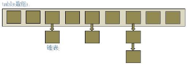

#  Java 集合源码解读

## ArrayList

### 1.底层实现

```java
// 底层都使用数组实现
private transient Object[] elementData;
```

### 2.构造器

- **jdk1.7**

  - ArrayList 提供了三种方式的构造器，可以构造一个默认初始容量为 10 的空列表、构造一个指定初始容量的空列表以及构造一个包含指定 collection 的元素的列表，这些元素按照该 collection 的迭代器返回它们的顺序排列的。 

    ```java
    /**
      * 1.0：默认构造一个长度为10的空列表.
      */
    public ArrayList() {
        this(10);
    }
    
    /**
      *:2.0：构造一个指定容量的数组
      */
    public ArrayList(int initialCapacity) {
        super();
        if (initialCapacity < 0)
            throw new IllegalArgumentException("Illegal Capacity: "+
                                               initialCapacity);
        this.elementData = new Object[initialCapacity];
    }
    
    /**
      *3.0：构造一个包含指定元素的列表集合，按集合的返回顺序迭代器。
      */
    public ArrayList(Collection<? extends E> c) {
        elementData = c.toArray();
        size = elementData.length;
        // c.toArray might (incorrectly) not return Object[] (see 6260652)
        if (elementData.getClass() != Object[].class)
            elementData = Arrays.copyOf(elementData, size, Object[].class);
    }
    ```

- **jdk1.8**

  - ArrayList 1.8的构造器和1.7的不同1.7使用了默认长度为10的空参构造器，而1.8实现了懒加载，初始化默认构造器`elementData `是一个大小为0 的空数组，

    ```java
    transient Object[] elementData;
    private static final Object[] DEFAULTCAPACITY_EMPTY_ELEMENTDATA = {};
    // 由此可见1.8中的空参构造器为大小为0的elementData数组
    public ArrayList() {
        this.elementData = DEFAULTCAPACITY_EMPTY_ELEMENTDATA;
    }
    
    private static final Object[] EMPTY_ELEMENTDATA = {};
    // 指定了初始大小的时候，elementData 的初始大小就变成了指定的初始化大小
    public ArrayList(int initialCapacity) {
        // 长度大于0 创建一个长尾为initialCapacity的数组
        if (initialCapacity > 0) {
            this.elementData = new Object[initialCapacity];
        // 长度等于 0 创建一个empty 数组
        } else if (initialCapacity == 0) {
            this.elementData = EMPTY_ELEMENTDATA;
        } else {
            throw new IllegalArgumentException("Illegal Capacity: "+
                                               initialCapacity);
        }
    }
    
    
    //构造一个包含指定元素的列表集合，按集合的返回顺序迭代器。
    public ArrayList(Collection<? extends E> c) {
        Object[] a = c.toArray();
        if ((size = a.length) != 0) {
            if (c.getClass() == ArrayList.class) {
                elementData = a;
            } else {
                elementData = Arrays.copyOf(a, size, Object[].class);
            }
        } else {
            // replace with empty array.
            elementData = EMPTY_ELEMENTDATA;
        }
    }
    ```

### 3.存储

- **jdk1.7**

  - `ArrayList` 提供的添加元素的方法。

    - `set(int index, E element)`

      ```java
      //用指定的元素替代此列表中指定位置上的元素，并返回以前位于该位置上的元素。
      public E set(int index, E element) {
          rangeCheck(index);
      
          E oldValue = elementData(index);
          elementData[index] = element;
          return oldValue;
      }
      // 检查index
      private void rangeCheck(int index) {
          if (index >= size)
              throw new IndexOutOfBoundsException(outOfBoundsMsg(index));
      }
      ```

    - `add(E e)`

      ```java
      // 将指定的元素添加到此列表的尾部。
      public boolean add(E e) {
          ensureCapacityInternal(size + 1);  // Increments modCount!!
          elementData[size++] = e;
          return true;
      }
      ```

    - `add(int index, E element)`

      ```java
      // 将指定的元素插入此列表中的指定位置。
      // 如果当前位置有元素，则向右移动当前位于该位置的元素以及所有后续元素（将其索引加 1）。 
      public void add(int index, E element) {
          rangeCheckForAdd(index);
      	
          // 如果数组长度不足进行扩容
          ensureCapacityInternal(size + 1);  // Increments modCount!!
      	// 将 elementData中从 Index位置开始、长度为 size-index的元素，
      	// 拷贝到从下标为 index+1位置开始的新的 elementData数组中。
      	// 即将当前位于该位置的元素以及所有后续元素右移一个位置。
          System.arraycopy(elementData, index, elementData, index + 1,
                           size - index);
          elementData[index] = element;
          size++;
      }
      // 检查index
      private void rangeCheckForAdd(int index) {
          if (index > size || index < 0)
              throw new IndexOutOfBoundsException(outOfBoundsMsg(index));
      }
      ```

    - `addAll(Collection<? extends E> c)`

      ```java
      // 按照指定 collection的迭代器所返回的元素顺序，将该 collection中的所有元素添加到此列表的尾部。
      public boolean addAll(Collection<? extends E> c) {
          Object[] a = c.toArray();
          int numNew = a.length;
          // 数组扩容
          ensureCapacityInternal(size + numNew);  // Increments modCount
          System.arraycopy(a, 0, elementData, size, numNew);
          size += numNew;
          return numNew != 0;
      }
      ```

    - `addAll(int index, Collection<? extends E> c)`

      ```java
      // 从指定的位置开始，将指定 collection中的所有元素插入到此列表中。
      public boolean addAll(int index, Collection<? extends E> c) {
          rangeCheckForAdd(index);
      
          Object[] a = c.toArray();
          int numNew = a.length;
          ensureCapacityInternal(size + numNew);  // Increments modCount
      
          int numMoved = size - index;
          if (numMoved > 0)
              System.arraycopy(elementData, index, elementData, index + numNew,
                               numMoved);
      
          System.arraycopy(a, 0, elementData, index, numNew);
          size += numNew;
          return numNew != 0;
      }
      ```

- **jdk1.8**

  - `add`操作的时候与`1.7`的不同

    ```java
    //确认容量方法
    private void ensureCapacityInternal(int minCapacity) {
        ensureExplicitCapacity(calculateCapacity(elementData, minCapacity));
    }
    
    // 判断如果elementData 为空数组 也就是第一次add操作，将创建DEFAULT_CAPACITY=10的数组
    private static int calculateCapacity(Object[] elementData, int minCapacity) {
        if (elementData == DEFAULTCAPACITY_EMPTY_ELEMENTDATA) {
            return Math.max(DEFAULT_CAPACITY, minCapacity);
        }
        return minCapacity;
    }
    
    // 是否需要扩容
    private void ensureExplicitCapacity(int minCapacity) {
        modCount++;
    
        // overflow-conscious code
        if (minCapacity - elementData.length > 0)
            grow(minCapacity);
    }
    ```

  - 在插入元素之前，它会先检查是否需要扩容，然后再把元素添加到数组中最后一个元素的后面。在 ensureCapacityInternal 方法中，如果当 elementData 为空数组时，它会使用默认的大小去扩容。所以说，通过无参构造方法来创建 ArrayList 时，它的大小其实是为 0 的，只有在使用到的时候，才会通过grow 方法去创建一个大小为10 的数组。 

  - 第一个add 方法的复杂度为 O(1)，虽然有时候会涉及到扩容的操作，但是扩容的次数是非常少的，所以这一部分的时间可以忽略不计。如果使用的是带指定下标的 add方法，则复杂度为O(n)，因为涉及到对数组中元素的移动，这一操作是非常耗时的。 

### 4.读取

```java
// 获取当前索引的数据
public E get(int index) {
    rangeCheck(index);

    return elementData(index);
}
```

### 5.删除

- ArrayList 提供了根据下标或者指定对象两种方式的删除功能。

  - 指定对象删除是Collection接口中的方法

    ```java
    //移除此列表中首次出现的指定元素（如果存在）。因为：ArrayList中允许存放重复的元素。 
    public boolean remove(Object o) {
        // 由于 ArrayList中允许存放 null，因此下面通过两种情况来分别处理。
        if (o == null) {
            // 遍历哪个元素为null 并删除
            for (int index = 0; index < size; index++)
                if (elementData[index] == null) {
                    // 类似于通过index 删除元素
                    fastRemove(index);
                    return true;
                }
        } else {
            // 判断元素是否equals相等 因此自定义的对象如果用ArrayList进行删除判断要重写equals
            for (int index = 0; index < size; index++)
                if (o.equals(elementData[index])) {
                    fastRemove(index);
                    return true;
                }
        }
        return false;
    }
    
    // 删除指定index的元素，并将后面的元素左移一个位置
    private void fastRemove(int index) {
        modCount++;
        int numMoved = size - index - 1;
        if (numMoved > 0)
            System.arraycopy(elementData, index+1, elementData, index,
                             numMoved);
        elementData[--size] = null; // Let gc do its work
    }
    ```

  - 根据下标删除指定位置上的元素

    ```java
    // 根据下标删除指定位置上的元素
    public E remove(int index) {
        // 检查index 是否越界
        rangeCheck(index);
    
        modCount++;
        E oldValue = elementData(index);
    	// 删除当前位置的元素，并把后面的元素都左移一个位置
        int numMoved = size - index - 1;
        if (numMoved > 0)
            System.arraycopy(elementData, index+1, elementData, index,
                             numMoved);
        elementData[--size] = null; // Let gc do its work
    
        return oldValue;
    }
    ```

### 6.数组扩容

- 向 ArrayList 中存储元素的代码中，我们看到，每当向数组中添加元素时，都要去检查添加后元素的个数是否会超出当前数组的长度，如果超出，数组将会进行扩容。

- 数组扩容通过一个公开的方法 `ensureCapacityInternal(int minCapacity)` 和`grow`来实现

  ```java
  // 确保内部容量:判断minCapacity和数组长度的大小，大于就需要grow方法进行扩容
  private void ensureCapacityInternal(int minCapacity) {
      modCount++;
      // overflow-conscious code
      if (minCapacity - elementData.length > 0)
          grow(minCapacity);
  }
  // 扩容方法
  private void grow(int minCapacity) {
      // overflow-conscious code
      // oldCapacity = 10
      int oldCapacity = elementData.length;
      // newCapacity =  10 + 10/2 = 15 因此是1.5倍扩容
      int newCapacity = oldCapacity + (oldCapacity >> 1);
      // 如果扩容后的长度还是小于minCapacity 直接让长度等于minCapacity
      if (newCapacity - minCapacity < 0)
          newCapacity = minCapacity;
      // 如果扩容后的长度大于Integer.MAX_VALUE - 8 就最大长度Integer.MAX_VALUE 否则就是Integer.MAX_VALUE - 8
      if (newCapacity - MAX_ARRAY_SIZE > 0)
          newCapacity = hugeCapacity(minCapacity);
      // minCapacity is usually close to size, so this is a win:
      elementData = Arrays.copyOf(elementData, newCapacity);
  }
  // 超过长度了
  private static int hugeCapacity(int minCapacity) {
      if (minCapacity < 0) // overflow
          throw new OutOfMemoryError();
      return (minCapacity > MAX_ARRAY_SIZE) ?
          Integer.MAX_VALUE :
      MAX_ARRAY_SIZE;
  }
  ```

- 从上述代码中可以看出，数组进行扩容时，会将老数组中的元素重新拷贝一份到新的数组中，每次数组容量的增长大约是其原容量的 1.5 倍。这种操作的代价是很高的，因此在实际使用时，我们应该尽量避免数组容量的扩张。当我们可预知要保存的元素的多少时，要在构造 ArrayList 实例时，就指定其容量，以避免数组扩容的发生。或者根据实际需求，通过调用 grow 方法来手动增加 ArrayList 实例的容量。

- ArrayList 还给我们提供了将底层数组的容量调整为当前列表保存的实际元素的大小的功能。它可以通过 trimToSize 方法来实现。代码如下： 

  ```java
  public void trimToSize() {
      modCount++;
      int oldCapacity = elementData.length;
      if (size < oldCapacity) {
          elementData = Arrays.copyOf(elementData, size);
      }
  }
  ```

### 7. Fail-Fast 机制：

- ArrayList 也采用了快速失败的机制，通过记录 modCount 参数来实现。在面对并发的修改时，迭代器很快就会完全失败，而不是冒着在将来某个不确定时间发生任意不确定行为的风险。

### 8.`1.7`和`1.8`对比

- 初始化创建数组长度不一样
  - 1.7：默认创建长度为10的数组
  - 1.8：默认创建长度为0的数组
- add 操作时候
  - 1.8需要判断长度如果等于创建为长度为10的数组
  - 1.8是一个懒创建的操作，延迟了数组的创建，节省内存。

## HashMap

### 1.概述

HashMap 是基于哈希表的 Map 接口的非同步实现。此实现提供所有可选的映射操作，并允许使用 null 值和 null 键。此类不保证映射的顺序，特别是它不保证该顺序恒久不变。 

### 2.数据结构

在 java 编程语言中，最基本的结构就是两种，一个是数组，另外一个是模拟指针（引用），所有的数据结构都可以用这两个基本结构来构造的，HashMap 也不例外。HashMap实际上是一个“链表散列”的数据结构，即数组和链表的结合体。 

- jdk1.7中的HashMap



- jdk1.8中的HashMap


### 3.底层实现

- 1.7:`Entry`

  ```java
  transient Entry[] table;
  
  static class Entry<K,V> implements Map.Entry<K,V> {
      final K key;
      V value;
      Entry<K,V> next;
      int hash;
  
      /**
        * Creates new entry.
        */
      Entry(int h, K k, V v, Entry<K,V> n) {
          value = v;
          next = n;
          key = k;
          hash = h;
      }
  
      public final K getKey() {
          return key;
      }
  
      public final V getValue() {
          return value;
      }
  
      public final V setValue(V newValue) {
          V oldValue = value;
          value = newValue;
          return oldValue;
      }
  
      public final boolean equals(Object o) {
          if (!(o instanceof Map.Entry))
              return false;
          Map.Entry e = (Map.Entry)o;
          Object k1 = getKey();
          Object k2 = e.getKey();
          if (k1 == k2 || (k1 != null && k1.equals(k2))) {
              Object v1 = getValue();
              Object v2 = e.getValue();
              if (v1 == v2 || (v1 != null && v1.equals(v2)))
                  return true;
          }
          return false;
      }
  
      public final int hashCode() {
          return (key==null   ? 0 : key.hashCode()) ^
              (value==null ? 0 : value.hashCode());
      }
  
      public final String toString() {
          return getKey() + "=" + getValue();
      }
  
      /**
           * This method is invoked whenever the value in an entry is
           * overwritten by an invocation of put(k,v) for a key k that's already
           * in the HashMap.
           */
      void recordAccess(HashMap<K,V> m) {
      }
  
      /**
           * This method is invoked whenever the entry is
           * removed from the table.
           */
      void recordRemoval(HashMap<K,V> m) {
      }
  }
  ```

- 1.8:`Node`

  ```java
  transient Node<K,V>[] table;
  static class Node<K,V> implements Map.Entry<K,V> {
          final int hash;
          final K key;
          V value;
          Node<K,V> next;
  
          Node(int hash, K key, V value, Node<K,V> next) {
              this.hash = hash;
              this.key = key;
              this.value = value;
              this.next = next;
          }
  
          public final K getKey()        { return key; }
          public final V getValue()      { return value; }
          public final String toString() { return key + "=" + value; }
  
          public final int hashCode() {
              return Objects.hashCode(key) ^ Objects.hashCode(value);
          }
  
          public final V setValue(V newValue) {
              V oldValue = value;
              value = newValue;
              return oldValue;
          }
  
          public final boolean equals(Object o) {
              if (o == this)
                  return true;
              if (o instanceof Map.Entry) {
                  Map.Entry<?,?> e = (Map.Entry<?,?>)o;
                  if (Objects.equals(key, e.getKey()) &&
                      Objects.equals(value, e.getValue()))
                      return true;
              }
              return false;
          }
      }
  ```

- 1.7存储kv的数据叫做`Entry`而在1.8中则改成了`Node`，他们本质都是是一个` key-value `对，它持有一个指向下一个元素的引用，这就构成了链表。 

### 4.存储

- `jdk1.7`

  - 

  - 构造器

    ```java
    // 默认构建 长度为16 负载因子为0.75的Entry数组
    public HashMap() {
        this(DEFAULT_INITIAL_CAPACITY, DEFAULT_LOAD_FACTOR);
    }
    
    // 创建长度为：initialCapacity
    public HashMap(int initialCapacity) {
        // this 指向下面
        this(initialCapacity, DEFAULT_LOAD_FACTOR);
    }
    
    public HashMap(int initialCapacity, float loadFactor) {
        // 如果initialCapacity < 0 报错
        if (initialCapacity < 0)
            throw new IllegalArgumentException("Illegal initial capacity: " +
                                               initialCapacity);
        // 如果大于最大值 就为最大值2^30
        if (initialCapacity > MAXIMUM_CAPACITY)
            initialCapacity = MAXIMUM_CAPACITY;
        // 如果加载因子小于0 或者 加载因子为0 报错
        if (loadFactor <= 0 || Float.isNaN(loadFactor))
            throw new IllegalArgumentException("Illegal load factor: " +
                                               loadFactor);
    
        // Find a power of 2 >= initialCapacity
        // capacity 决定造数组的长度 他要求必须是2的次幂 >initialCapacity 这个长度的2的次幂
        int capacity = 1;
        while (capacity < initialCapacity)
            capacity <<= 1;
    
        this.loadFactor = loadFactor;
        //  threshold = 16 * 0.75 与 最大值+1 取最小 = 为12
        threshold = (int)Math.min(capacity * loadFactor, MAXIMUM_CAPACITY + 1);
        // 创建capacity长度的 Entry数组
        table = new Entry[capacity];
        useAltHashing = sun.misc.VM.isBooted() &&
            (capacity >= Holder.ALTERNATIVE_HASHING_THRESHOLD);
        init();
    }
    ```

  - 初始化数组是2的次幂的解析

    ```java
    int capacity = 1;
    while (capacity < initialCapacity)
        capacity <<= 1;
    ```

    - 这段代码保证初始化时 HashMap 的容量总是 2 的 n 次方，即底层数组的长度总是为 2的 n 次方。当 length 总是 2 的 n 次方时，h& (length-1)运算等价于对 length 取模，也就是h%length，但是&比%具有更高的效率。 

    -  这看上去很简单，其实比较有玄机的，举个例子来说明： 

    -  假设数组长度分别为 15 和 16，优化后的hash 码分别为 8 和 9，那么&运算后的结果如下： 

      

    - 从上面的例子中可以看出：当它们和 15-1（1110）“与”的时候，产生了相同的结果，也就是说它们会定位到数组中的同一个位置上去，这就产生了碰撞，8 和 9 会被放到数组中的同一个位置上形成链表，那么查询的时候就需要遍历这个链 表，得到 8 或者 9，这样就降低了查询的效率。同时，我们也可以发现，当数组长度为 15 的时候，hash 值会与 15-1（1110）进行“与”，那么 最后一位永远是 0，而 0001，0011，0101，1001，1011，0111，1101 这几个位置永远都不能存放元素了，空间浪费相当大，更糟的是这种情况中，数组可以使用的位置比数组长度小了很多，这意味着进一步增加了碰撞的几率，减慢了查询的效率！而当数组长度为 16 时，即为 2 的 n 次方时，2n-1 得到的二进制数的每个位上的值都为 1，这使得在低位上&时，得到的和原 hash的低位相同，加之 hash(int h)方法对key的 hashCode的进一步优化，加入了高位计算，就使得只有相同的 hash 值的两个值才会被放到数组中的同一个位置上形成链表。所以说，当数组长度为 2 的 n 次幂的时候，不同的 key 算得得 index相同的几率较小，那么数据在数组上分布就比较均匀，也就是说碰撞的几率小，相对的，查询的时候就不用遍历某个位置上的链表，这样查询效率也就较高了。 

  - 增加`put`

    ```java
    public V put(K key, V value) {
        // HashMap允许存放 null键和 null值。
        // 当 key为 null时，调用 putForNullKey方法，将 value放置在数组第0个位置。
        if (key == null)
            return putForNullKey(value);
        // 如果key不为null 先调用hash方法算出hash值
        int hash = hash(key);
        // 搜索指定 hash值在对应 table中的索引。
        int i = indexFor(hash, table.length);
        // 如果第i索引处的 Entry e 不为 null，通过循环不断遍历 e 元素的下一个元素。
        for (Entry<K,V> e = table[i]; e != null; e = e.next) {
            Object k;
            // 如何hash值相等 并且 key也相等(先判断地址是不是相等)
            if (e.hash == hash && ((k = e.key) == key || key.equals(k))) {
                // 进行替换 返回原来的
                V oldValue = e.value;
                e.value = value;
                e.recordAccess(this);
                return oldValue;
            }
        }
    	// 如果第i索引处的Entry e 为 null，表明此处还没有Entry
        modCount++;
        // 将 key、value添加到 i索引处。
        addEntry(hash, key, value, i);
        return null;
    }
    ```

  - `putForNullKey(value)`

    ```java
    private V putForNullKey(V value) {
        // 如果第0索引处的 Entry e 不为 null，通过循环不断遍历 e 元素的下一个元素。
        for (Entry<K,V> e = table[0]; e != null; e = e.next) {
            if (e.key == null) {
                V oldValue = e.value;
                e.value = value;
                e.recordAccess(this);
                return oldValue;
            }
        }
        // 如果第0索引处的Entry e 为 null，表明此处还没有Entry
        modCount++;
        // 将null、value添加到 0 索引处。
        addEntry(0, null, value, 0);
        return null;
    }
    ```

  - `hash(key)`

    ```java
    transient final int hashSeed = sun.misc.Hashing.randomHashSeed(this);
    
    final int hash(Object k) {
        int h = 0;
        // 如果是字符串讲调用字符串的hash算法
        if (useAltHashing) {
            if (k instanceof String) {
                return sun.misc.Hashing.stringHash32((String) k);
            }
            // 调用另一个hash算法
            h = hashSeed;
        }
        
    	// 对key的hashcode进一步进行计算以及二进制位的调整等来保证最终获取的存储位置尽量分布均匀
        // 因此为了remove 等操作正常运行 需要我们重写hashCode 方法
        h ^= k.hashCode();
        
        h ^= (h >>> 20) ^ (h >>> 12);
        return h ^ (h >>> 7) ^ (h >>> 4);
    }
    ```

  - `indexFor`根据`hash`来判断在`table`中的位置

    ```java
    // 通过与运算来确定位置 eg:一个很大的数&15 结果一定为0-15 
    static int indexFor(int h, int length) {
        return h & (length-1);
    }
    ```

  - `addEntry`

    ```java
    void addEntry(int hash, K key, V value, int bucketIndex) {
        // 如果当前存的size=13 大于 12个 && 要存放的位置为空
        if ((size >= threshold) && (null != table[bucketIndex])) {
            // 进行扩容为原来的2倍
            resize(2 * table.length);
            hash = (null != key) ? hash(key) : 0;
            bucketIndex = indexFor(hash, table.length);
        }
    
        createEntry(hash, key, value, bucketIndex);
    }
    ```

  - `resize()`

    ```java
    void resize(int newCapacity) {
        Entry[] oldTable = table;
        int oldCapacity = oldTable.length;
        if (oldCapacity == MAXIMUM_CAPACITY) {
            threshold = Integer.MAX_VALUE;
            return;
        }
    
        Entry[] newTable = new Entry[newCapacity];
        boolean oldAltHashing = useAltHashing;
        useAltHashing |= sun.misc.VM.isBooted() &&
            (newCapacity >= Holder.ALTERNATIVE_HASHING_THRESHOLD);
        boolean rehash = oldAltHashing ^ useAltHashing;
        transfer(newTable, rehash);
        table = newTable;
        threshold = (int)Math.min(newCapacity * loadFactor, MAXIMUM_CAPACITY + 1);
    }
    ```

  - `createEntry()`

    ```java
    void createEntry(int hash, K key, V value, int bucketIndex) {
        // 把原有的元素取出来
        Entry<K,V> e = table[bucketIndex];
        // 创建了一个新的Entry key vaule是新加入的Entry 然后吧e传入 e代表的是 Entry的next
        // 因此7上8下的 7上就显示出来，每次创建新的都在table的指定位置上，原来位置上的 都是新创建的next
        table[bucketIndex] = new Entry<>(hash, key, value, e);
        size++;
    }
    ```

    

- **jdk1.8**

  - 构造器

    ```java
    // 没有向1.7 一样构造完成数组 而仅做了属性的赋值 loadFactor = 0.75f
    public HashMap() {
        this.loadFactor = DEFAULT_LOAD_FACTOR; // all other fields defaulted
    }
    ```

    

  - 增加`put`

    ```java
    public V put(K key, V value) {
        return putVal(hash(key), key, value, false, true);
    }
    ```

    

    - ①判断键值对数组 table[i]是否为空或为 null，否则执行 resize()进行扩容；
    - ②根据键值 key 计算 hash 值得到插入的数组索引 i，如果 table[i]==null，直接新建节点添加，转向⑥，如果 table[i]不为空，转向③；
    - ③判断 table[i]的首个元素是否和 key 一样，如果相同直接覆盖 value，否则转向④，这里的相同指的是 hashCode 以及 equals；
    - ④判断 table[i] 是否为 treeNode，即 table[i] 是否是红黑树，如果是红黑树，则直接在树中插入键值对，否则转向⑤
    - ⑤遍历 table[i]，判断链表长度是否大于 8，大于 8 的话把链表转换为红黑树，在红黑树中执行插入操作，否则进行链表的插入操作；遍历过程中若发现 key 已经存在直接覆盖 value 即可；
    - ⑥插入成功后，判断实际存在的键值对数量 size 是否超多了最大容量 threshold，如果超过，进行扩容。

  - `putVal()`

    ```java
    transient Node<K,V>[] table;
    
    final V putVal(int hash, K key, V value, boolean onlyIfAbsent,
                   boolean evict) {
        Node<K,V>[] tab; Node<K,V> p; int n, i;
        // 1：当前未初始化 tab为Node<K,V>[]为空  首次添加的逻辑
        if ((tab = table) == null || (n = tab.length) == 0)
            // 11:n = 返回resize()方法后的长度
            n = (tab = resize()).length;
        // 12:n = 16 ,p = null
        // 如果 put的元素 经过hash计算并且& 15 找到了在hashMap的位置 并且这个位置为null
        // 14 :(情况为插入的元素经过计算 该位置上为null)
        if ((p = tab[i = (n - 1) & hash]) == null)
            // 15: 不是第一次并且添加成功的情况
            // 13: 创建一个 key = key,value= value,next=null的Node
            tab[i] = newNode(hash, key, value, null);
        // 16:(情况为插入的元素经过计算 该位置上不为null,也就是该位置有值)
        else {
            Node<K,V> e; K k;
            // 17:如果新插入的hash值等于这个位置上元素hash值&& (引用地址都相同 或者equals 相同)
            // 18：如果这两个hash相等等
            // 21:如果这两个hash不等 
            //如果桶上节点的 key与当前 key重复，那你就是我要找的节点了
            if (p.hash == hash &&
                ((k = p.key) == key || (key != null && key.equals(k))))
                // 19：把p的值放在e里
                e = p;
    		//如果是采用红黑树的方式处理冲突，则通过红黑树的 putTree Val方法去插入这个键值对
            else if (p instanceof TreeNode)
                e = ((TreeNode<K,V>)p).putTreeVal(this, tab, hash, key, value);
            // 22：进入else
            else {
                for (int binCount = 0; ; ++binCount) {
                    // 23:判断p.next是否是null 如果是 说明这个位置就一个元素
                    if ((e = p.next) == null) {
                        // 24：新造一个newNode 然后把它作为p.next 7上8下的下
                        p.next = newNode(hash, key, value, null);
                        // 25:如果binCount 大于TREEIFY_THRESHOLD = 8 也就是一个链上的元素>=8 进入treeifyBin方法
                        if (binCount >= TREEIFY_THRESHOLD - 1) // -1 for 1st
                            treeifyBin(tab, hash);
                        break;
                    }
                    // 26:计算p.next元素 hash值是否一样，找到key相同的元素结束for循环，进行替换
                    if (e.hash == hash &&
                        ((k = e.key) == key || (key != null && key.equals(k))))
                        break;
                    p = e;
                }
            }
            // 27：20: e=p 不为null 因此满足找到位置上元素并且hash值相等并且equals相等进行元素替换
            // 替换逻辑
            if (e != null) { // existing mapping for key
                V oldValue = e.value;
                if (!onlyIfAbsent || oldValue == null)
                    e.value = value;
                afterNodeAccess(e);
                return oldValue;
            }
        }
        ++modCount;
        if (++size > threshold)
            resize();
        afterNodeInsertion(evict);
        return null;
    }
    ```

  - `treeifyBin()`

    ```java
    // 将桶内所有的 链表节点 替换成 红黑树节点
    final void treeifyBin(Node<K,V>[] tab, int hash) {
        int n, index; Node<K,V> e;
        // 如果tab 为空 或者 tab的长度<64 我们进行扩容不变成红黑树 可以理解为如果单个链表长度>=8，但是总列表长度还是<64我们先扩容，不直接变成红黑树
        if (tab == null || (n = tab.length) < MIN_TREEIFY_CAPACITY)
            resize();
        // 将链表变成红黑树
        else if ((e = tab[index = (n - 1) & hash]) != null) {
            //如果哈希表中的元素个数超过了 树形化阈值，进行树形化
            // e 是哈希表中指定位置桶里的链表节点，从第一个开始
            TreeNode<K,V> hd = null, tl = null;
            do {
                //新建一个树形节点，内容和当前链表节点 e 一致
                TreeNode<K,V> p = replacementTreeNode(e, null);
                if (tl == null) //确定树头节点
                    hd = p;
                else {
                    p.prev = tl;
                    tl.next = p;
                }
                tl = p;
            } while ((e = e.next) != null);
            //让桶的第一个元素指向新建的红黑树头结点，以后这个桶里的元素就是红黑树而不是链表了
            if ((tab[index] = hd) != null)
                hd.treeify(tab);
        }
    }
    ```

  - `hash()`

    ```java
    // jdk1.8的hash 方法比较简单 判断key是否是null 
    // 如果是null 则为0 否则用(key.hashCode())^(key.hashCode())>>>16
    static final int hash(Object key) {
        int h;
        return (key == null) ? 0 : (h = key.hashCode()) ^ (h >>> 16);
    }
    ```

  - `tableSizeFor()`

    ```java
    static final int tableSizeFor(int cap) {
        // 默认传过来initialCapacity = 11 jdk 1.8中 为什么我也不知道还在找原因 
            int n = cap - 1;
            n |= n >>> 1;
            n |= n >>> 2;
            n |= n >>> 4;
            n |= n >>> 8;
            n |= n >>> 16;
            return (n < 0) ? 1 : (n >= MAXIMUM_CAPACITY) ? MAXIMUM_CAPACITY : n + 1;
        }
    ```

    - `int n = cap - 1;` —>  `n = 10(二进制表示：0000 1010)`
    - `n |= n >>> 1;`

    ```
        n             ->  0000 1010
        n >>> 1       ->  0000 0101
        n |= n >>> 1  ->  0000 1111
    ```

    - `n |= n >>> 2;`

    ```
        n             ->  0000 1111
        n >>> 2       ->  0000 0011
        n |= n >>> 2  ->  0000 1111
    ```

    此时`n`所有位均为1，后续的位操作均不再改变`n`的值。

    ...

    ```
        n            ->  0000 1111  (15)
        n + 1        ->  0001 0000  (16) 
    ```

    最终，`tableSizeFor(11)`的结果为`16`。

  - `resize()`

    ```java
    final Node<K,V>[] resize() {
        // 2：第一次put：oldTab 目前为空
        Node<K,V>[] oldTab = table;
        // 3：第一次put：oldCap 为 0 
        int oldCap = (oldTab == null) ? 0 : oldTab.length;
        // 4：第一次put：oldThr = threshold = 0
        int oldThr = threshold;
        int newCap, newThr = 0;
        if (oldCap > 0) {
            if (oldCap >= MAXIMUM_CAPACITY) {
                threshold = Integer.MAX_VALUE;
                return oldTab;
            }
            else if ((newCap = oldCap << 1) < MAXIMUM_CAPACITY &&
                     oldCap >= DEFAULT_INITIAL_CAPACITY)
                newThr = oldThr << 1; // double threshold
        }
        else if (oldThr > 0) // initial capacity was placed in threshold
            newCap = oldThr;
        else {   
            // zero initial threshold signifies using defaults
            // 5：第一次put：newCap = 16
            newCap = DEFAULT_INITIAL_CAPACITY;
            // 5:第一次put：newThr = threshold = 16 * 0.75 = 12
            newThr = (int)(DEFAULT_LOAD_FACTOR * DEFAULT_INITIAL_CAPACITY);
        }
        if (newThr == 0) {
            // ft = 16 * 0.75 = 0
            float ft = (float)newCap * loadFactor;
            // 16 < 最大的容量(2^30) true 并且 ft < 最大的容量(2^30) true 
            // newThr ft 
            newThr = (newCap < MAXIMUM_CAPACITY && ft < (float)MAXIMUM_CAPACITY ?
                      (int)ft : Integer.MAX_VALUE);
        }
        // 7:第一次put：threshold = newThr = 12
        threshold = newThr;
        // 8:第一次put：创建长度为newCap = 16的Node<K,V>[]
        @SuppressWarnings({"rawtypes","unchecked"})
        Node<K,V>[] newTab = (Node<K,V>[])new Node[newCap];
        table = newTab;
        // 9:第一次put： oldTab = null 
        if (oldTab != null) {
            for (int j = 0; j < oldCap; ++j) {
                Node<K,V> e;
                if ((e = oldTab[j]) != null) {
                    oldTab[j] = null;
                    if (e.next == null)
                        newTab[e.hash & (newCap - 1)] = e;
                    else if (e instanceof TreeNode)
                        ((TreeNode<K,V>)e).split(this, newTab, j, oldCap);
                    else { // preserve order
                        Node<K,V> loHead = null, loTail = null;
                        Node<K,V> hiHead = null, hiTail = null;
                        Node<K,V> next;
                        do {
                            next = e.next;
                            if ((e.hash & oldCap) == 0) {
                                if (loTail == null)
                                    loHead = e;
                                else
                                    loTail.next = e;
                                loTail = e;
                            }
                            else {
                                if (hiTail == null)
                                    hiHead = e;
                                else
                                    hiTail.next = e;
                                hiTail = e;
                            }
                        } while ((e = next) != null);
                        if (loTail != null) {
                            loTail.next = null;
                            newTab[j] = loHead;
                        }
                        if (hiTail != null) {
                            hiTail.next = null;
                            newTab[j + oldCap] = hiHead;
                        }
                    }
                }
            }
        }
        // 10:第一次put：返回一个长度为16的newTab
        return newTab;
    }
    ```

  - 一些属性

    ```java
    	/**
         * The default initial capacity - MUST be a power of two.
         * 默认初始容量-必须为2的幂。 16
         */
        static final int DEFAULT_INITIAL_CAPACITY = 1 << 4; // aka 16
    
        /**
         * The maximum capacity, used if a higher value is implicitly specified
         * by either of the constructors with arguments.
         * MUST be a power of two <= 1<<30.
         * 最大容量上限2的30次幂
         */
        static final int MAXIMUM_CAPACITY = 1 << 30;
    
        /**
         * The load factor used when none specified in constructor.
         * 负载因子 默认是0.75f 
         */
        static final float DEFAULT_LOAD_FACTOR = 0.75f;
    
        /**
         * The bin count threshold for using a tree rather than list for a
         * bin.  Bins are converted to trees when adding an element to a
         * bin with at least this many nodes. The value must be greater
         * than 2 and should be at least 8 to mesh with assumptions in
         * tree removal about conversion back to plain bins upon
         * shrinkage.
         * 变成树型结构的临界值为 8
         */
        static final int TREEIFY_THRESHOLD = 8;
    
        /**
         * The bin count threshold for untreeifying a (split) bin during a
         * resize operation. Should be less than TREEIFY_THRESHOLD, and at
         * most 6 to mesh with shrinkage detection under removal.
         * 恢复链式结构的临界值为 6
         */
        static final int UNTREEIFY_THRESHOLD = 6;
    
        /**
         * The smallest table capacity for which bins may be treeified.
         * (Otherwise the table is resized if too many nodes in a bin.)
         * Should be at least 4 * TREEIFY_THRESHOLD to avoid conflicts
         * between resizing and treeification thresholds.
         */
        static final int MIN_TREEIFY_CAPACITY = 64;
    
        //它是通过 capacity*load factor计算出来的，当 size到达这个值时，就会进行扩容操作 
        int threshold;
    	// 负载因子
    	//负载因子就是键值对个数与哈希表长度的一个比值
        // 当比值超过负载因子之后，HashMap 就会进行 rehash操作来进行扩容。
        final float loadFactor; 
        //当哈希表的大小超过这个阈值，才会把链式结构转化成树型结构，否则仅采取扩容来尝试减少冲突 
        static final int MIN_TREEIFY_CAPACITY = 64; 
    ```

  - put 方法比较复杂，实现步骤大致如下： 

    - 先通过hash 值计算出 key 映射到哪个桶。 
    - 如果桶上没有碰撞冲突，则直接插入。 
    - 如果出现碰撞冲突了，则需要处理冲突： 
      - 如果该桶使用红黑树处理冲突，则调用红黑树的方法插入。
      - 否则采用传统的链式方法插入。如果链的长度到达临界值，则把链转变为红黑树
    - 如果桶中存在重复的键，则为该键替换新值。
    - 如果size 大于阈值，则进行扩容。 

### 5.读取

- **jdk1.7**

  - `get(Object obj)`

    ```java
    public V get(Object key) {
        // 如果key 为null 通过getForNullKey()方法进行返回
        if (key == null)
            return getForNullKey();
        // 通过getEntry方法去读取
        Entry<K,V> entry = getEntry(key);
    
        return null == entry ? null : entry.getValue();
    }
    
    final Entry<K,V> getEntry(Object key) {
        // 先计算出key的hash值
        int hash = (key == null) ? 0 : hash(key);
        // 链表查询时间复杂度为O(n)
        for (Entry<K,V> e = table[indexFor(hash, table.length)];
             e != null;
             e = e.next) {
            Object k;
            // 如果hash值相等 key相等(通过equals判断或者地址值)
            if (e.hash == hash &&
                ((k = e.key) == key || (key != null && key.equals(k))))
                return e;
        }
        return null;
    }
    ```

  - 从 HashMap 中 get 元素时，首先计算 key 的 hashCode，找到数组中对应位置的某一元素，然后通过 key 的 equals 方法在对应位置的链表中找到需要的元素。 

- **jdk1.8**

  

## HashSet

### 1.底层实现

```java
// 底层使用 HashMap来保存 HashSet中所有元素
private transient HashMap<E,Object> map;

// 定义一个虚拟的 Object对象作为 HashMap的 value，将此对象定义为 static final
private static final Object PRESENT = new Object();
```

### 2.构造器

```java
/**
  * 默认的无参构造器，构造一个空的 HashSet。实际底层会初始化一个空的 HashMap，并使用默认初始容量为 16和加载因子 0.75
  */
public HashSet() {
    map = new HashMap<>();
}

/**
  * 构造一个包含指定 collection中的元素的新 set。
  * 实际底层使用默认的加载因子 0.75和足以包含指定
  * collection中所有元素的初始容量来创建一个 HashMap。
*/
public HashSet(Collection<? extends E> c) {
    map = new HashMap<>(Math.max((int) (c.size()/.75f) + 1, 16));
    addAll(c);
}

/**
  *以指定的 initialCapacity和 loadFactor构造一个空的 HashSet。实际底层以相应的参数构造一个空的 HashMap。
  */
public HashSet(int initialCapacity, float loadFactor) {
    map = new HashMap<>(initialCapacity, loadFactor);
}

/**
  * 以指定的 initialCapacity构造一个空的 HashSet。实际底层以相应的参数及加载因子 loadFactor为 0.75构造一个空的 HashMap。
  */
public HashSet(int initialCapacity) {
    map = new HashMap<>(initialCapacity);
}
```

### 3.存储

```java
// 调用map.put 方法 把 e 当做key 把present当做vaule 本质就是static final new Object();
// 如果此 set尚未包含指定元素，则返回 true。
public boolean add(E e) {
    return map.put(e, PRESENT)==null;
}
/**
  *如果此 set中尚未包含指定元素，则添加指定元素。
  * 更确切地讲，如果此 set 没有包含满足(e==null ? e2==null : e.equals(e2))
  * 的元素 e2，则向此 set 添加指定的元素 e。
  * 如果此 set已包含该元素，则该调用不更改 set并返回 false。
  * 底层实际将将该元素作为 key放入 HashMap。
  * 由于 HashMap的 put()方法添加 key-value对时，当新放入 HashMap的 Entry中 key
  * 与集合中原有 Entry的 key相同（hashCode()返回值相等，通过 equals比较也返回 ture()
  * 新添加的 Entry的 value会将覆盖原来 Entry的 value，但 key不会有任何改变，
  * 因此如果向 HashSet中添加一个已经存在的元素时，新添加的集合元素将不会被放入 HashMap中，
  * 原来的元素也不会有任何改变，这也就满足了 Set中元素不重复的特性。
  */
```

### 4.删除

```java
// 调用 HashMap的 remove方法删除指定 {key:元素,value:null}。
public boolean remove(Object o) {
        return map.remove(o)==PRESENT;
    }
/**
  * 如果指定元素存在于此 set中，则将其移除。
  * 更确切地讲，如果此 set包含一个满足(o==null ? e==null : o.equals(e))的元素e,
  * 则将其移除。如果此 set已包含该元素，则返回 true
  * （或者：如果此 set因调用而发生更改，则返回 true）。（一旦调用返回，则此 set不再包含该元素）。
```


