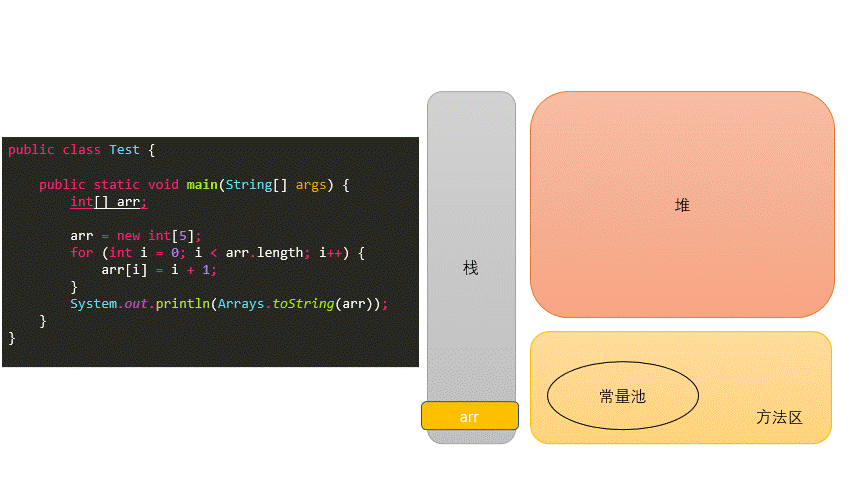
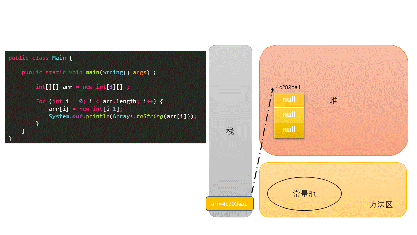
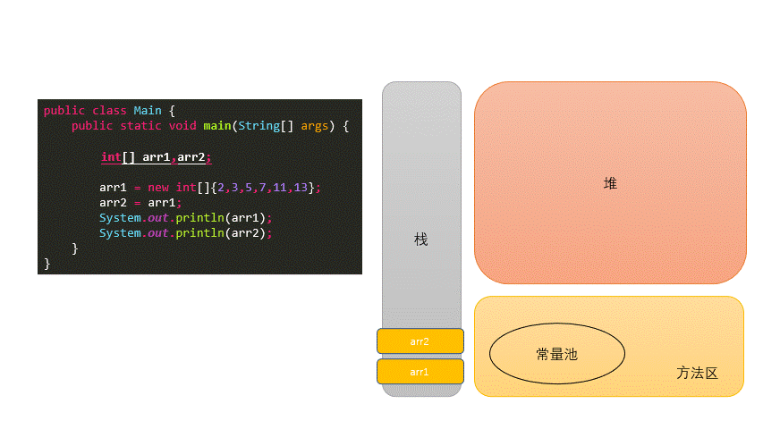
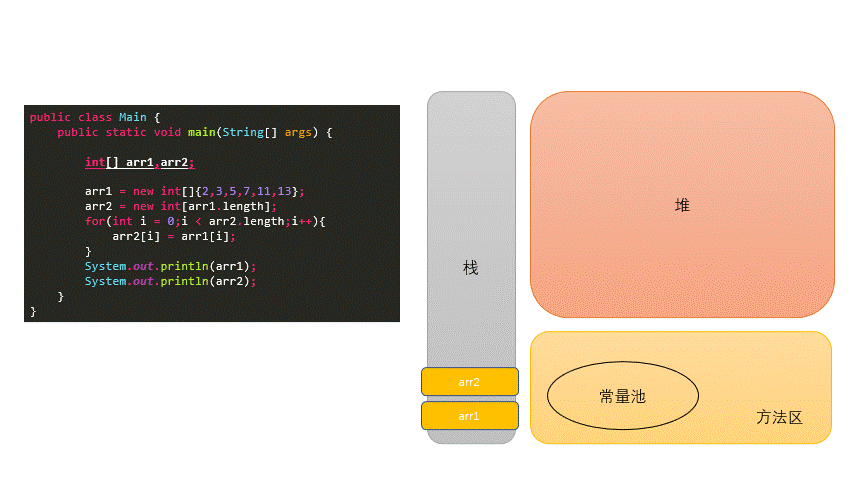
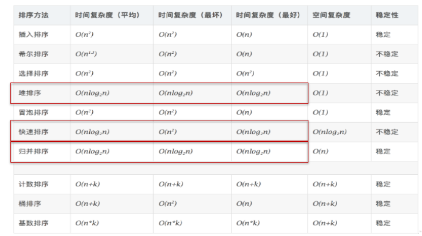

# 数组

## 数组概述

- 数组(Array)，是多个相同类型数据按一定顺序排列的集合，并使用一个名字命名，并通过编号的方式对这些数据进行统一管理。
- 数组的常见概念
  - 数组名
  - 下标(或索引)
  - 元素
  - 数组的长度
- 数组本身是引用数据类型，而数组中的元素可以是任何数据类型，包括基本数据类型和引用数据类型。
- 创建数组对象会在内存中开辟一整块连续的空间，而数组名中引用的是这块连续空间的首地址。
- 数组的长度一旦确定，就不能修改。
- 我们可以直接通过下标(或索引)的方式调用指定位置的元素，速度很快。
- 数组的分类：
  - 按照维度：一维数组、二维数组、三维数组、…
  - 按照元素的数据类型分：基本数据类型元素的数组、引用数据类型元素的数组(即对象数组)

## 一维数组

### 声明

- 声明方式

  `type var[]`或者`type[] var`

- `Java`语言中声明数组时不能指定其长度(数组中元素的数)例如： `int a[5];`---->非法

### 初始化

- 动态初始化：数组声明且为数组元素分配空间与赋值的操作分开进行

- 静态初始化：在定义数组的同时就为数组元素分配空间并赋值。

  ```java
  int[] ids;//声明
  //1.1 静态初始化:数组的初始化和数组元素的赋值操作同时进行
  ids = new int[]{1001,1002,1003,1004};
  //1.2动态初始化:数组的初始化和数组元素的赋值操作分开进行
  String[] names = new String[5]; // 声明 + 初始化
  //1.3类型推断
  int[] arr4 = {1,2,3,4,5};
  ```

### 数组元素的引用

- 定义并用运算符`new`为之分配空间后，才可以引用数组中的每个元素
- 数组元素的引用方式：数组名[数组元素下标]
  - 数组元素下标可以是整型常量或整型表达式。如`a[3] , b[i] , c[6*i];`
  - 数组元素下标从`0`开始；长度为n的数组合法下标取值范围: `0~n-1`；如`int a[]=new int[3];`  可引用的数组元素为`a[0]、a[1]、a[2]`
- 每个数组都有一个属性`length`指明它的长度，例如：`a.length` 指明数组a的长度(元素个数)
  - 数组一旦初始化，其长度是不可变的
- 数组是引用类型，它的元素相当于类的成员变量，因此数组一经分配空间，其中的每个元素也被按照成员变量同样的方式被隐式初始化。
  - 对于基本数据类型而言，默认初始化值各有不同
  - 对于引用数据类型而言，默认初始化值为`null`

### 数组元素默认初始化值

| 数组元素类型 | 元素默认初始化值            |
| ------------ | --------------------------- |
| byte         | 0                           |
| short        | 0                           |
| int          | 0                           |
| long         | 0L                          |
| float        | 0.0F                        |
| double       | 0.0                         |
| char         | 0 或写为:`\u0000`(表现为空) |
| boolean      | false                       |
| 引用类型     | null                        |

### 一维数组创建过程



## 多维数组

### 何为二维数组

- 数组属于引用数据类型
- 数组的元素也可以是引用数据类型
- 一个一维数组A的元素如果还是一个一维数组类型的，则，此数组A称为二维数组。

### 二维数组的声明与初始化

```java
int[] arr = new int[]{1, 2, 3};//一维数组
//静态初始化1
int[][] arr1 = new int[][]{{1, 2, 3}, {4, 5}, {6, 7, 8}};
//动态初始化
String[][] arr2 = new String[3][2];
// 动态初始化2
String[][] arr3 = new String[3][];
// 正确写法
int[] arr4[] = new int[][]{{1, 2, 3}, {4, 5, 9, 10}, {6, 7, 8}};
int[] arr5[] = {{1, 2, 3}, {4, 5}, {6, 7, 8}}; // 类型推断
```

- 注意特殊写法情况：`int[] x,y[];` x是一维数组，y是二维数组。
- Java中多维数组不必都是规则矩阵形式

### 二维数组初始化值

- 二维数组分为外层数组的元素，内层数组的元素

  ```java
  int[][] arr = new int[4][3];
  //外层元素：arr[0],arr[1]等
  //内层元素：arr[0][0],arr[1][2]等
  ```

- 数组元素的默认初始化值 
  *   针对于初始化方式一：比如：`int[][] arr = new int[4][3];`
      *   外层元素的初始化值为：地址值
      *   内层元素的初始化值为：与一维数组初始化情况相同
  *   针对于初始化方式二：比如：`int[][] arr = new int[4][];`
      *   外层元素的初始化值为：`null`
      *   内层元素的初始化值为：不能调用，否则报错。



### 数组数据元素的访问

- 通过索引下标

  - 数组通过索引下标`index`来进行数组元素的访问，第一个元素的`index`为0
  - `java`不能像`python`一样通过 `-1, -2` 进行倒序索引查找

- 通过循环来访问

  ```java
  // 普通的for循环
  public class Main {
      public static void main(String[] args) {
          int[] arr = new int[10];
          //普通for循环
          for(int i = 0;i<arr.length;i++) {
              arr[i] = (int)(Math.random()*100);
          }
          for(int i = 0; i<arr.length;i++) {
              System.out.println(arr[i]);
          }
      }
  }
  
  // for each 
  public class Main {
      public static void main(String[] args) {
          int[] arr = new int[10];
          for(int i = 0;i<arr.length;i++) {
              arr[i] = (int)(Math.random()*100);
          }
          // for each
          for(int num : arr) {
              System.out.println(num);
          }
      }
  }
  ```

下面代码方便理解`java`二维数组

```java
public class Main {
    public static void main(String[] args) {
        // 动态
        int[][] ints1 = new int[4][];
        int[][] ints2 = new int[4][3];
//        System.out.println(ints1[1][0]); // java.lang.NullPointerException
        System.out.println(ints2[1][0]);

        int[][] ints5 = new int[5][3];
        System.out.println(ints5[0]);
        System.out.println(ints5[1][0]);


        String[][] strings2 = new  String[4][];
        System.out.println(strings2[0]);
//        System.out.println(strings2[1][2]); // java.lang.NullPointerException
    }
}
// console :0, [I@4c203ea1 ,0 ,null
```

## 数组的常见算法

### 数组的创建与元素赋值：

- 杨辉三角
  ```java
   /*
    1
    1  1
    1  2  1
    1  3  3  1
    1  4  6  4  1
    1  5  10  10  5  1
    1  6  15  20  15  6  1
    1  7  21  35  35  21  7  1
    1  8  28  56  70  56  28  8  1
    1  9  36  84  126  126  84  36  9  1  
    */
  public class YangHui {
      public static void main(String[] args) {
          int[][] yangHui = new int[10][];
          for (int i = 0; i < yangHui.length; i++) {
              // 给二维数组赋值
              yangHui[i] = new int[i + 1];
              yangHui[i][0] = yangHui[i][i] = 1;
              for (int j = 1; j < yangHui[i].length - 1; j++) {
                  yangHui[i][j] = yangHui[i - 1][j - 1] + yangHui[i - 1][j];
              }
          }
          for (int i = 0; i < yangHui.length; i++) {
              for (int j = 0; j < yangHui[i].length; j++) {
                  System.out.print(yangHui[i][j] + "  ");
  
              }
              System.out.println();
          }
      }
  }
  ```
  
- 螺旋矩阵
  ```java
   /*
    *  1   2   3
    *  8   9   4
    *  7   6   5  
    */
  
  public class SpiralMatrixII {
      public static void main(String[] args) {
          Scanner scanner = new Scanner(System.in);
          System.out.println("请输入你想构建的螺旋矩阵长度为：");
          int number = scanner.nextInt();
          int[][] spiralMatrix = new int[number][number];
          // 左
          int left = 0;
          // 右
          int right = number - 1;
          // 上
          int top = 0;
          // 下
          int bottom = number - 1;
          int insertNumber = 1;
          int resultNumber = number * number;
          while (insertNumber <= resultNumber) {
              for (int i = left; i <= right; i++) {
                  spiralMatrix[top][i] = insertNumber++;
              }
              top++;
              for (int i = top; i <= bottom; i++) {
                  spiralMatrix[i][right] = insertNumber++;
              }
              right--;
              for (int i = right; i >= left; i--) {
                  spiralMatrix[bottom][i] = insertNumber++;
              }
              bottom--;
              for (int i = bottom; i >= top; i--) {
                  spiralMatrix[i][left] = insertNumber++;
              }
              left++;
          }
          for (int i = 0; i < spiralMatrix.length; i++) {
              for (int j = 0; j < spiralMatrix[i].length; j++) {
                  System.out.printf("%2d  ", spiralMatrix[i][j]);
              }
              System.out.println();
          }
      }
  }
  ```

### 针对于数值型的数组：

- 最大值
- 最小值
- 总和
- 平均值

### 数组的赋值与复制

- 赋值

  

- 复制(浅copy)

  

  - 验证浅copy代码

    ```java
    public class Main {
        public static void main(String[] args) {
            Person[] arr1, arr2;
            arr1 = new Person[2];
            arr1[0] = new Person();
            arr1[1] = new Person();
            arr2 = new Person[arr1.length];
            for (int i = 0; i < arr2.length; i++) {
                arr2[i] = arr1[i];
            }
            System.out.println(arr2[0] == arr1[0]);
            System.out.println(arr1[0].name);
            System.out.println(arr2[0].name);
            arr1[0].name = "李四";
            System.out.println(arr1[0].name);
            System.out.println(arr2[0].name);
        }
    }
    class Person {
        String name = "张三";
        int age = 10;
    }
    ```

### 数组元素的反转

```java
// 方法一
public class Main {
    public static void main(String[] args) {
        int[] arr;
        arr = new int[]{2,3,5,7,11,13};
        for(int i = 0;i < arr.length / 2;i++){
			int temp = arr[i];
			arr[i] = arr[arr.length - i -1];
			arr[arr.length - i -1] = temp;
		}
        System.out.println(Arrays.toString(arr));
    }
}
// 方法二
public class Main {
    public static void main(String[] args) {
        int[] arr;
        arr = new int[]{2,3,5,7,11,13};
        for(int i = 0,j = arr.length - 1;i < j;i++,j--){
			int temp = arr[i];
			arr[i] = arr[j];
			arr[j] = temp;
		}
        System.out.println(Arrays.toString(arr));
    }
}
```

### 数组中指定元素的查找：搜索、检索

- 线性查找： 
  - 实现思路：通过遍历的方式，一个一个的数据进行比较、查找。
  
  - 适用性：具有普遍适用性。
  
    ```java
    public class Hello {
        public static void main(String[] args) {
            String[] arr = new String[]{"JJ","DD","MM","BB","GG","AA"};
            String dest = "BB";
            boolean isFlag = true;
            for (int i = 0; i < arr.length; i++) {
                if (dest.equals(arr[i])) {
                    System.out.println("找到了指定的元素，位置为：" + i);
                    isFlag = false;
                    break;
                }
            }
            if (isFlag) {
                System.out.println("很遗憾，没有找到的啦！");
            }
        }
    }
    
    ```
- 二分法查找：
  - 实现思路：每次比较中间值，折半的方式检索。

  - 适用性：（前提：数组必须有序）

    ```java
    public class Hello {
        public static void main(String[] args) {
            //二分法查找：(熟悉)
            //前提：所要查找的数组必须有序。
            int[] arr = new int[]{-98, -34, 2, 34, 54, 66, 79, 105, 210, 333};
            int dest = -34;
            int head = 0;//初始的首索引
            int end = arr.length - 1;//初始的末索引
            boolean isFlag = true;
            while (head <= end) {
                int middle = (head + end) / 2;
                if (dest == arr[middle]) {
                    System.out.println("找到了指定的元素，位置为：" + middle);
                    isFlag = false;
                    break;
                } else if (arr[middle] > dest) {
                    end = middle - 1;
                } else {//arr2[middle] < dest1
                    head = middle + 1;
                }
            }
            if (isFlag) {
                System.out.println("很遗憾，没有找到的啦！");
            }
        }
    }
    ```

## 数组的排序算法

### 十大内部排序算法

- 选择排序
  - 直接选择排序、堆排序
- 交换排序
  - **冒泡排序**、**快速排序**
- 插入排序
  - 直接插入排序、折半插入排序、Shell排序
- 归并排序
- 桶式排序
- 基数排序

### 衡量排序算法的优劣：

- 时间复杂度
- 空间复杂度
- 稳定性

### 排序的分类：

- 内部排序 
- 外部排序（需要借助于磁盘）

### 不同排序算法的时间复杂度



### 冒泡和快排的实现

- 冒泡排序

  

  ```java
  public class Bubble {
      public static void main(String[] args) {
          int[] ints = new int[]{-77, -2, 13, -32, 7, 0, 11, 28, 79, 22};
          // 只需要排-1 次就够了
          for (int i = 0; i < ints.length - 1; i++) {
              for (int j = 0; j < ints.length - 1 - i; j++) {
                  if (ints[j] > ints[j + 1]) {
                      int temp = ints[j];
                      ints[j] = ints[j + 1];
                      ints[j + 1] = temp;
                  }
              }
          }
          for (int i = 0; i < ints.length; i++) {
              System.out.print(ints[i] + "\t");
          }
      }
  }
  ```

- 快速排序

  

  ```java
  public class QuickSort {
  	private static void swap(int[] data, int i, int j) {
  		int temp = data[i];
  		data[i] = data[j];
  		data[j] = temp;
  	}
  
  	private static void subSort(int[] data, int start, int end) {
  		if (start < end) {
  			int base = data[start];
  			int low = start;
  			int high = end + 1;
  			while (true) {
  				while (low < end && data[++low] - base <= 0)
  					;
  				while (high > start && data[--high] - base >= 0)
  					;
  				if (low < high) {
  					swap(data, low, high);
  				} else {
  					break;
  				}
  			}
  			swap(data, start, high);
  			
  			subSort(data, start, high - 1);//递归调用
  			subSort(data, high + 1, end);
  		}
  	}
  	public static void quickSort(int[] data){
  		subSort(data,0,data.length-1);
  	}
  ```
