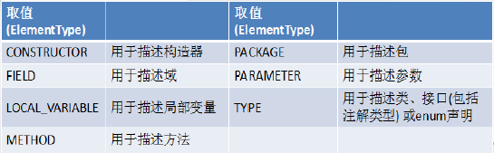

# 枚举类与注解

## 枚举类（Enum）

### 枚举类的使用

- 枚举类的理解：类的对象只有有限个，确定的。我们称此类为枚举类
- 当需要定义一组常量时，强烈建议使用枚举类
- 如果枚举类中只一个对象，则可以作为单例模式的实现方式。
- Enum类的主要方法：
  - values()方法：返回枚举类型的对象数组。该方法可以很方便地遍历所有的枚举值。
  - valueOf(String str)：可以把一个字符串转为对应的枚举类对象。要求字符串必须是枚举类对象的“名字”。如不是，会有运行时异常：IllegalArgumentException。
  - toString()：返回当前枚举类对象常量的名称
- 和普通 Java 类一样，枚举类可以实现一个或多个接口
- 若每个枚举值在调用实现的接口方法呈现相同的行为方式，则只要统一实现该方法即可。
- 若需要每个枚举值在调用实现的接口方法呈现出不同的行为方式,则可以让每个枚举值分别来实现该方法

### 自定义枚举类

- 私有化类的构造器，保证不能在类的外部创建其对象
2.	在类的内部创建枚举类的实例。声明为：public static final
3.	对象如果有实例变量，应该声明为private final，并在构造器中初始化

```java
// 自定义枚举类
class MySeason {
    // 提供当前枚举类的多个对象 必须声明为 public static final的
    public static final MySeason SPRING = new MySeason("SPRING");
    public static final MySeason SUMMER = new MySeason("SUMMER");
    public static final MySeason AUTOMN = new MySeason("AUTOMN");
    public static final MySeason WINTER = new MySeason("WINTER");
    // 声明属性
    private String seasonName;

    // 私有化构造器
    private MySeason(String seasonName) {
        this.seasonName = seasonName;
    }

    public String getSeasonName() {
        return seasonName;
    }

    @Override
    public String toString() {
        return com.google.common.base.MoreObjects.toStringHelper(this)
                .add("seasonName", seasonName)
                .toString();
    }
}
```

### Enum定义枚举类

- 使用 enum 定义的枚举类默认继承了 java.lang.Enum类，因此不能再继承其他类
- 枚举类的构造器只能使用 private 权限修饰符
- 枚举类的所有实例必须在枚举类中显式列出(, 分隔 ; 结尾)。列出的实例系统会自动添加 public static final 修饰
- 必须在枚举类的第一行声明枚举类对象
- JDK 1.5 中可以在 switch 表达式中使用Enum定义的枚举类的对象作为表达式, case 子句可以直接使用枚举值的名字, 无需添加枚举类作为限定。

```java
public enum Season implements info {
    // 提供枚举类对象 并提前 其余不变 多个对象用","隔开 最后用";"隔开
    SPRING("SPRING"){
        @Override
        public void show() {
            System.out.println("This is spring");
        }
    },
    SUMMER("SUMMER"){
        @Override
        public void show() {
            System.out.println("This is summer");
        }
    },
    AUTOMN("AUTOMN"){
        @Override
        public void show() {
            System.out.println("This is automn");
        }
    },
    WINTER("WINTER"){
        @Override
        public void show() {
            System.out.println("This is winter");
        }
    };

    private String seasonName;

    private Season(String seasonName) {
        this.seasonName = seasonName;
    }

    public String getSeasonName() {
        return seasonName;
    }
}
```

## 注解（Annotation）

- 从 JDK 5.0 开始, Java 增加了对元数据(MetaData) 的支持, 也就是Annotation(注解)
- Annotation 其实就是代码里的特殊标记, 这些标记可以在编译, 类加载, 运行时被读取, 并执行相应的处理。通过使用Annotation, 程序员可以在不改变原有逻辑的情况下, 在源文件中嵌入一些补充信息。代码分析工具、开发工具和部署工具可以通过这些补充信息进行验证或者进行部署。
- Annotation 可以像修饰符一样被使用, 可用于修饰包,类, 构造器, 方法, 成员变量, 参数, 局部变量的声明, 这些信息被保存在Annotation的 “name=value” 对中。
- 在JavaSE中，注解的使用目的比较简单，例如标记过时的功能，忽略警告等。在JavaEE/Android中注解占据了更重要的角色，例如用来配置应用程序的任何切面，代替JavaEE旧版中所遗留的繁冗代码和XML配置等。
- 未来的开发模式都是基于注解的，JPA是基于注解的，Spring2.5以上都是基于注解的，Hibernate3.x以后也是基于注解的，现在的Struts2有一部分也是基于注解的了，注解是一种趋势，一定程度上可以说：**框架 = 注解 + 反射 + 设计模式。**

### 常用注解

- 使用Annotation 时要在其前面增加 @ 符号, 并把该Annotation 当成一个修饰符使用。用于修饰它支持的程序元素
- 生成文档相关的注解
  - @author 标明开发该类模块的作者，多个作者之间使用,分割
  - @version 标明该类模块的版本
  - @see 参考转向，也就是相关主题
  - @since 从哪个版本开始增加的
  - @param 对方法中某参数的说明，如果没有参数就不能写
  - @return 对方法返回值的说明，如果方法的返回值类型是void就不能写
  - @exception 对方法可能抛出的异常进行说明，如果方法没有用throws显式抛出的异常就不能写其中
  - 其中
    - @param @return 和@exception 这三个标记都是只用于方法的。 @param的格式要求：@param 形参名形参类型 形参说明
    - @return 的格式要求：@return 返回值类型返回值说明
    - @exception的格式要求：@exception 异常类型异常说明
    - @param和@exception可以并列多个
- 在编译时进行格式检查(JDK内置的三个基本注解)
  - @Override: 限定重写父类方法, 该注解只能用于方法
  - @Deprecated: 用于表示所修饰的元素(类, 方法等)已过时。通常是因为所修饰的结构危险或存在更好的选择
  - @SuppressWarnings: 抑制编译器警告
- 跟踪代码依赖性，实现替代配置文件功能
  - Servlet3.0提供了注解(annotation),使得不再需要在web.xml文件中进行Servlet的部署。
  - spring框架中关于“事务”的管理

### 自定义Annotation

- 定义新的Annotation 类型使用@interface 关键字

- 自定义注解自动继承了java.lang.annotation.Annotation接口

- Annotation 的成员变量在 Annotation 定义中以无参数方法的形式来声明。其方法名和返回值定义了该成员的名字和类型。我们称为配置参数。类型只能是八种基本数据类型、String类型、Class类型、enum类型、Annotation类型、以上所有类型的数组。

- 可以在定义 Annotation 的成员变量时为其指定初始值, 指定成员变量的初始值可使用default 关键字

- 如果只有一个参数成员，建议使用参数名为value

- 如果定义的注解含有配置参数，那么使用时必须指定参数值，除非它有默认值。格式是“参数名 = 参数值”，如果只有一个参数成员，且名称为value，可以省略“value=”

- 没有成员定义的 Annotation 称为标记; 包含成员变量的 Annotation 称为元数据Annotation

- JDK5.0提供了4个标准的meta-annotation类型，分别是：

  - Retention

    - @Retention: 只能用于修饰一个Annotation 定义, 用于指定该Annotation 的生命周期, @Rentention 包含一个 RetentionPolicy 类型的成员变量, 使用@Rentention 时必须为该 value 成员变量指定值:
      - RetentionPolicy.SOURCE:在源文件中有效（即源文件保留），编译器直接丢弃这种策略的注释
      - RetentionPolicy.CLASS:在class文件中有效（即class保留） ， 当运行 Java 程序时, JVM不会保留注解。 这是默认值
      - RetentionPolicy.RUNTIME:在运行时有效（即运行时保留），当运行 Java 程序时, JVM 会保留注释。程序可以通过反射获取该注释。
    - 只有声明为RUNTIME生命周期的注解，才能通过反射获取。

  - Target

    - 用于修饰Annotation 定义, 用于指定被修饰的Annotation 能用于修饰哪些程序元素。 @Target 也包含一个名为 value 的成员变量。

      

  - Documented

    - @Documented: 用于指定被该元Annotation 修饰的Annotation 类将被javadoc 工具提取成文档。默认情况下，javadoc是不包括注解的。
    - 定义为Documented的注解必须设置Retention值为RUNTIME。

  - Inherited

    - @Inherited: 被它修饰的Annotation 将具有继承性。如果某个类使用了被@Inherited 修饰的Annotation, 则其子类将自动具有该注解。
    - 比如：如果把标有@Inherited注解的自定义的注解标注在类级别上，子类则可以继承父类类级别的注解
    - 实际应用中，使用较少

### JDK8中注解的新特性：可重复注解、类型注解

- 可重复注解：

  -  在MyAnnotation上声明@Repeatable，成员值为MyAnnotations.class
  - MyAnnotation的Target和Retention等元注解与MyAnnotations相同。

- 类型注解：

  - `ElementType.TYPE_PARAMETER` 表示该注解能写在类型变量的声明语句中
    - 如：泛型声明。
  - `ElementType.TYPE_USE` 表示该注解能写在使用类型的任何语句中。

- `MyAnnotaion`

  ```java
  @Inherited
  @Documented
  @Repeatable(MyAnnotations.class) // jdk 1.8 可重复注解的关键
  @Retention(RetentionPolicy.RUNTIME)
  @Target({TYPE, FIELD, METHOD, PARAMETER, CONSTRUCTOR, LOCAL_VARIABLE,TYPE_PARAMETER,TYPE_USE})
  public @interface MyAnnotation {
      String value() default "frenude";
  }
  ```

- `MyAnnotaions`

  ```java
  @Inherited
  @Documented
  @Retention(RetentionPolicy.RUNTIME)
  @Target({TYPE, FIELD, METHOD, PARAMETER, CONSTRUCTOR, LOCAL_VARIABLE,TYPE_PARAMETER,TYPE_USE})
  public @interface MyAnnotations {
      MyAnnotation[] value();
  }
  ```

- `AnnotationDemo`

  ```java
  public class AnnotationDemo {
      @Test
      public void testAnnotation() {
          @SuppressWarnings("unused")
          int num = 10;
      }
      // 反射获取注解的信息参数
      @Test
      public void testGetAnnotation(){
          Class clazz = Student.class;
          Annotation[] annotations = clazz.getAnnotations();
          for(int i = 0;i < annotations.length;i++){
              System.out.println(annotations[i]);
          }
      }
  }
  //jdk 8之前的写法
  //@MyAnnotations({@MyAnnotation("hi"),@MyAnnotation("hi")})
  @MyAnnotation("id")
  @MyAnnotation(value="abc")
  class Person {
      private String name;
      private int age;
  
      public Person() {
      }
  
      @MyAnnotation
      public Person(String name, int age) {
          this.name = name;
          this.age = age;
      }
  
      @MyAnnotation
      public void walk() {
          System.out.println("人走路");
      }
  
      public void eat() {
          System.out.println("人吃饭");
      }
  }
  
  class Student extends Person implements info {
  
      @Override
      public void walk() {
          System.out.println("学生走路");
      }
  
      @Override
      public void show() {
          System.out.println("展示");
      }
  }
  // TYPE_PARAMETER 表示该注解能写在类型变量的声明语句中（如：泛型声明）。
  class Generic<@MyAnnotation T>{
  
      public void show() throws @MyAnnotation RuntimeException{
          // ElementType.TYPE_USE 表示该注解能写在使用类型的任何语句中。
          ArrayList<@MyAnnotation String> list = new ArrayList<>();
          //ElementType.TYPE_USE 表示该注解能写在使用类型的任何语句中。
          int num = (@MyAnnotation int) 10L;
      }
  
  }
  ```

  