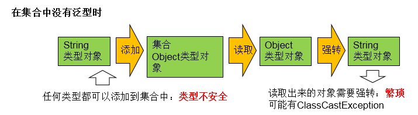
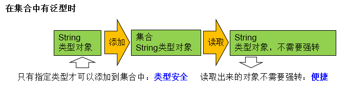

# 泛型

## 泛型的概念

- 所谓泛型，就是允许在定义类、接口时通过一个标识表示类中某个属性的类型或者是某个方法的返回值及参数类型。这个类型参数将在使用时（例如，继承或实现这个接口，用这个类型声明变量、创建对象时）确定（即传入实际的类型参数，也称为类型实参）。
- 从JDK1.5以后，Java引入了“参数化类型（Parameterized type）”的概念，允许我们在创建集合时再指定集合元素的类型，正如：`List<String>·，这表明该List只能保存字符串类型的对象。
- JDK1.5改写了集合框架中的全部接口和类，为这些接口、类增加了泛型支持，从而可以在声明集合变量、创建集合对象时传入类型实参。
- Java泛型可以保证如果程序在编译时没有发出警告，运行时就不会产生ClassCastException异常。同时，代码更加简洁、健壮。

## 在集合中使用泛型



- 没有泛型时

  ```java
  @Test
  public void test1(){
      ArrayList list = new ArrayList();
      //需求：存放学生的成绩
      list.add(78);
      list.add(76);
      list.add(89);
      list.add(88);
      //问题一：类型不安全
      //        list.add("Tom");
      for(Object score : list){
          //问题二：强转时，可能出现ClassCastException
          int stuScore = (Integer) score;
  
          System.out.println(stuScore);
  
      }
  
  }
  ```



- 有泛型时

  ```java
  @Test
  public void test3(){
      //        Map<String,Integer> map = new HashMap<String,Integer>();
      //jdk7新特性：类型推断
      Map<String,Integer> map = new HashMap<>();
  
      map.put("Tom",87);
      map.put("Jerry",87);
      map.put("Jack",67);
  
      //        map.put(123,"ABC");
      //泛型的嵌套
      Set<Map.Entry<String,Integer>> entry = map.entrySet();
      Iterator<Map.Entry<String, Integer>> iterator = entry.iterator();
  
      while(iterator.hasNext()){
          Map.Entry<String, Integer> e = iterator.next();
          String key = e.getKey();
          Integer value = e.getValue();
          System.out.println(key + "----" + value);
      }
  
  }
  ```

- 集合接口或集合类在jdk5.0时都修改为带泛型的结构。

- 在实例化集合类时，可以指明具体的泛型类型

-  指明完以后，在集合类或接口中凡是定义类或接口时，内部结构（比如：方法、构造器、属性等）使用到类的泛型的位置，都指定为实例化的泛型类型。

  - 比如：add(E e)  --->实例化以后：add(Integer e)

- 注意点：泛型的类型必须是类，不能是基本数据类型。需要用到基本数据类型的位置，拿包装类替换

- 如果实例化时，没指明泛型的类型。默认类型为java.lang.Object类型。

## 自定义泛型结构

- 泛型的声明

  - `interface List<T> `和 `class GenTest<K,V> `其中，T,K,V不代表值，而是表示类型。这里使用任意字母都可以。常用T表示，是Type的缩写。

- 泛型的实例化：

  - 一定要在类名后面指定类型参数的值（类型）。如：
    - `List<String> strList = new ArrayList<String>();` 
    - `Iterator<Customer> iterator = customers.iterator();`
  - T只能是类，不能用基本数据类型填充。但可以使用包装类填充
  - 把一个集合中的内容限制为一个特定的数据类型，这就是generics背后的核心思想

- 注意：

  1. 泛型类可能有多个参数，此时应将多个参数一起放在尖括号内。比如：<E1,E2,E3>

  2. 泛型类的构造器如下：`public GenericClass(){}`。
     而下面是错误的：`public GenericClass<E>(){}`

  3. 实例化后，操作原来泛型位置的结构必须与指定的泛型类型一致。

  4. 泛型不同的引用不能相互赋值。

     4.	尽管在编译时`ArrayList<String>和ArrayList<Integer>`是两种类型，但是，在运行时只有一个`ArrayList`被加载到JVM中。

  5. 泛型如果不指定，将被擦除，泛型对应的类型均按照Object处理，但不等价于Object。经验：泛型要使用一路都用。要不用，一路都不要用。

  6. 如果泛型结构是一个接口或抽象类，则不可创建泛型类的对象。

  7. jdk1.7，泛型的简化操作：`ArrayList<Fruit> flist = new ArrayList<>();`

  8. 泛型的指定中不能使用基本数据类型，可以使用包装类替换。

  9. 在类/接口上声明的泛型，在本类或本接口中即代表某种类型，可以作为非静态属性的类型、非静态方法的参数类型、非静态方法的返回值类型。但在静态方法中不能使用类的泛型。

  10. 异常类不能是泛型的

  11. 不能使用new E[]。但是可以：E[] elements = (E[])new Object[capacity];参考：ArrayList源码中声明：Object[] elementData，而非泛型参数类型数组。

  12. 父类有泛型，子类可以选择保留泛型也可以选择指定泛型类型：

      - 子类不保留父类的泛型：按需实现
        - 没有类型 擦除
        - 具体类型
      - 子类保留父类的泛型：泛型子类
        - 全部保留
        - 部分保留

      ```java
      class Father<T1, T2> {
      }
      // 子类不保留父类的泛型
      // 1)没有类型 擦除
      class Son1 extends Father {// 等价于class Son extends Father<Object,Object>{ }
      // 2)具体类型
      class Son2 extends Father<Integer, String> {
      }
      // 子类保留父类的泛型
      // 1)全部保留
      class Son3<T1, T2> extends Father<T1, T2> {
      }
      // 2)部分保留
      class Son4<T2> extends Father<Integer, T2> {
      }
          
      class Father<T1, T2> {
      }
      // 子类不保留父类的泛型
      // 1)没有类型 擦除
      class Son1 extends Father {// 等价于class Son extends Father<Object,Object>{ }
      // 2)具体类型
      class Son2 extends Father<Integer, String> {
      }
      // 子类保留父类的泛型
      // 1)全部保留
      class Son3<T1, T2> extends Father<T1, T2> {
      }
      // 2)部分保留
      class Son4<T2> extends Father<Integer, T2> {
      }
      ```

- 子类必须是“富二代”，子类除了指定或保留父类的泛型，还可以增加自己的泛型

- 自定义泛型类

  ```java
  class Order<T> {
      String orderName;
      int orderId;
  
      //类的内部结构就可以使用类的泛型
  
      T orderT;
  
      public Order() {
          //编译不通过
  //        T[] arr = new T[10];
          //编译通过
          T[] arr = (T[]) new Object[10];
      }
  
      public Order(String orderName, int orderId, T orderT) {
          this.orderName = orderName;
          this.orderId = orderId;
          this.orderT = orderT;
      }
  
      //如下的个方法都不是泛型方法
      public T getOrderT() {
          return orderT;
      }
  
      public void setOrderT(T orderT) {
          this.orderT = orderT;
      }
  
      @Override
      public String toString() {
          return "Order{" +
                  "orderName='" + orderName + '\'' +
                  ", orderId=" + orderId +
                  ", orderT=" + orderT +
                  '}';
      }
      //静态方法中不能使用类的泛型。
      /*public static void show(T orderT){
          System.out.println(orderT);
      }*/
  
      public void show() {
          //编译不通过
         /* try {
          } catch (T t) {
          }*/
      }
  }
  //异常类不能声明为泛型类
  /*
  public class MyException<T> extends Exception{
  }*/
  ```

- 自定义泛型接口

  ```java
  public interface Person<T> {
  }
  ```

- 自定义泛型方法

  ```java
  //泛型方法：在方法中出现了泛型的结构，泛型参数与类的泛型参数没任何关系。
  //换句话说，泛型方法所属的类是不是泛型类都没关系。
  //泛型方法，可以声明为静态的。原因：泛型参数是在调用方法时确定的。并非在实例化类时确定。
  public static <E> List<E> copyFromArrayToList(E[] arr) {
  
      ArrayList<E> list = new ArrayList<>();
  
      for (E e : arr) {
          list.add(e);
      }
      return list;
  }
  ```

## 泛型在继承上的体现

- 如果B是A的一个子类型（子类或者子接口），而G是具有泛型声明的类或接口，`G<B>`并不是`G<A>`的子类型！

  - String是Object的子类，但是`List<String >`并不是`List<Object>`的子类。

-  补充：类A是类B的父类，`A<G> `是 `B<G>` 的父类

  ```java
  @Test
  public void test1(){
  
      Object obj = null;
      String str = null;
      obj = str;
  
      Object[] arr1 = null;
      String[] arr2 = null;
      arr1 = arr2;
      //编译不通过
      //        Date date = new Date();
      //        str = date;
      List<Object> list1 = null;
      List<String> list2 = new ArrayList<String>();
      //此时的list1和list2的类型不具有子父类关系
      //编译不通过
      //        list1 = list2;
      /*
          反证法：
          假设list1 = list2;
             list1.add(123);导致混入非String的数据。出错。
  
           */
      show(list1);
      show1(list2);
  
  }
  
  @Test
  public void test2(){
  
      AbstractList<String> list1 = null;
      List<String> list2 = null;
      ArrayList<String> list3 = null;
  
      list1 = list3;
      list2 = list3;
  
      List<String> list4 = new ArrayList<>();
  
  }
  ```

## 通配符

- 使用类型通配符：？

  - `比如：List<?>   ，Map<?,?>`
  - `List<?>是List<String>、List<Object>等各种泛型List的父类`。

- 读取`List<?>`的对象list中的元素时，永远是安全的，因为不管list的真实类型是什么，它包含的都是Object。

- 写入list中的元素时，不行。因为我们不知道c的元素类型，我们不能向其中添加对象。

  - 唯一的例外是null，它是所有类型的成员。

- 将任意元素加入到其中不是类型安全的：

  ```java
  Collection<?> c = new ArrayList<String>();
  c.add(new Object()); // 编译时错误
  ```

- 因为我们不知道c的元素类型，我们不能向其中添加对象。add方法有类型参数E作为集合的元素类型。我们传给add的任何参数都必须是一个未知类型的子类。因为我们不知道那是什么类型，所以我们无法传任何东西进去。

- 唯一的例外的是null，它是所有类型的成员。

```java
@Test
public void test3() {
    List<?> list = null;
    List<Object> list1 = null;
    List<String> list2 = null;
    //编译通过
    list = list1;
    list = list2;

    List<String> list3 = new ArrayList<>();
    list3.add("AA");
    list3.add("BB");
    list3.add("CC");
    list = list3;
    //添加(写入)：对于List<?>就不能向其内部添加数据。
    //除了添加null之外。
    //        list.add("DD");
    list.add(null);

    //获取(读取)：允许读取数据，读取的数据类型为Object。
    Object o = list.get(0);
    System.out.println(o);
}
```

- 注意
  - 不能用在泛型方法声明上，返回值类型前面<>不能使用?:
    - `public static <?> void test(ArrayList<?> list){}`
  - 不能用在泛型类的声明上:
    - `class GenericTypeClass<?>{}`
  - 不能用在创建对象上，右边属于创建集合对象:
    - `ArrayList<?> list2 = new ArrayList<?>();`
- `<?>`允许所有泛型的引用调用
- 通配符指定上限
  - 上限extends：使用时指定的类型必须是继承某个类，或者实现某个接口，即<=
  - `? extends A`:
    - `G<? extends A> 可以作为G<A>和G<B>的父类，其中B是A的子类`
- 通配符指定下限
  - 下限super：使用时指定的类型不能小于操作的类，即>=
  - `? super A:`:
    - ` G<? super A> 可以作为G<A>和G<B>的父类，其中B是A的父类`
- 例如
  - `<? extends Number>`:  (无穷小 , Number]
    - 只允许泛型为Number及Number子类的引用调用
  - `<? super Number>`: [Number , 无穷大)
    - 只允许泛型为Number及Number父类的引用调用
  - `<? extends Comparable>`
    - 只允许泛型为实现Comparable接口的实现类的引用调用

