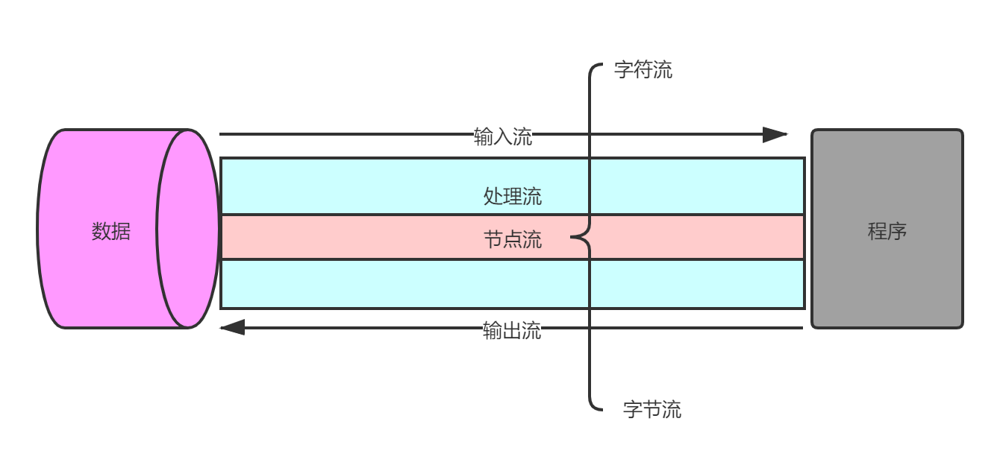
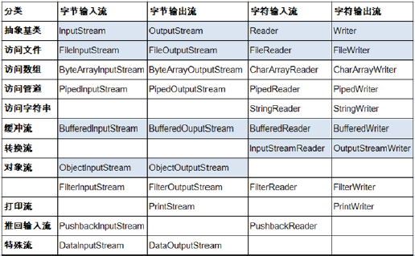

# IO流

## File类

- java.io.File类：文件和文件目录路径的抽象表示形式，与平台无关
- File 能新建、删除、重命名文件和目录，但 File 不能访问文件内容本身。如果需要访问文件内容本身，则需要使用输入/输出流。
- 想要在Java程序中表示一个真实存在的文件或目录，那么必须有一个File对象，但是Java程序中的一个File对象，可能没有一个真实存在的文件或目录。
- File对象可以作为参数传递给流的构造器
- 常用构造器
  - `public File(String pathname)`：以pathname为路径创建File对象，可以是绝对路径或者相对路径，如果pathname是相对路径，则默认的当前路径在系统属性user.dir中存储。
    - 绝对路径：是一个固定的路径,从盘符开始
    - 相对路径：是相对于某个位置开始
  - `public File(String parent,String child)`：以parent为父路径，child为子路径创建File对象。
  - `public File(File parent,String child)`：根据一个父File对象和子文件路径创建File对象
- 路径中的每级目录之间用一个路径分隔符隔开。
- 路径分隔符和系统有关：
  - `windows和DOS`系统默认使用`\`来表示
  - `UNIX和URL`使用`/`来表示
- Java程序支持跨平台运行，因此路径分隔符要慎用。为了解决这个隐患，File类提供了一个常量：
  - `public  static final String separator`。根据操作系统，动态的提供分隔符。

### File类的获取功能

- `public String getAbsolutePath()`：获取绝对路径
- `public String getPath()` ：获取路径
- `public String getName()` ：获取名称
- `public String getParent()`：获取上层文件目录路径。若无，返回null
- `public long length()` ：获取文件长度（即：字节数）。不能获取目录的长度。
- `public long lastModified() `：获取最后一次的修改时间，毫秒值
- `public String[] list()` ：获取指定目录下的所有文件或者文件目录的名称数组
- `public File[] listFiles()` ：获取指定目录下的所有文件或者文件目录的File数组

### File类的重命名功能

- `public boolean renameTo(File dest)`:把文件重命名为指定的文件路径

### File类的判断功能

- `public boolean isDirectory()`：判断是否是文件目录
- `public boolean isFile() `：判断是否是文件
- `public boolean exists()` ：判断是否存在
- `public boolean canRead()` ：判断是否可读
- `public boolean canWrite() `：判断是否可写
- `public boolean isHidden()` ：判断是否隐藏

### File类的创建功能

- `public boolean createNewFile()` ：创建文件。若文件存在，则不创建，返回false
- `public boolean mkdir() `：创建文件目录。如果此文件目录存在，就不创建了。如果此文件目录的上层目录不存在，也不创建
- `public boolean mkdirs() `：创建文件目录。如果上层文件目录不存在，一并创建

### File类的删除功能

- `public boolean delete()`：删除文件或者文件夹

## IO流原理

- I/O是Input/Output的缩写， I/O技术是非常实用的技术，用于处理设备之间的数据传输。如读/写文件，网络通讯等。
- Java程序中，对于数据的输入/输出操作以“流(stream)” 的方式进行。
- java.io包下提供了各种“流”类和接口，用以获取不同种类的数据，并通过标准的方法输入或输出数据。
- 输入input：读取外部数据（磁盘、光盘等存储设备的数据）到程序（内存）中。
- 输出output：将程序（内存）数据输出到磁盘、光盘等存储设备中。

## 流的分类

- 按操作数据单位不同分为：
  - 字节流(8 bit)，字符流(16 bit)
- 按数据流的流向不同分为：
  - 输入流，输出流
- 按流的角色的不同分为：
  - 节点流：直接从数据源或目的地读写数据
  - 处理流：不直接连接到数据源或目的地，而是“连接”在已存在的流（节点流或处理流）之上，通过对数据的处理为程序提供更为强大的读写功能。



## IO 流体系



## 输入流

- `InputStream 和 Reader`是所有输入流的基类

- `InputStream`:字节流（典型实现：FileInputStream）

  - `int read()`
    - 从输入流中读取数据的下一个字节。返回0 到255 范围内的int 字节值。如果因为已经到达流末尾而没有可用的字节，则返回值-1。
  - `int read(byte[] b)`
    - 从此输入流中将最多 b.length 个字节的数据读入一个 byte 数组中。如果因为已经到达流末尾而没有可用的字节，则返回值 -1。否则以整数形式返回实际读取的字节数。
  - `int read(byte[] b, int off, int len)`
    - 将输入流中最多 len 个数据字节读入 byte 数组。尝试读取 len 个字节，但读取的字节也可能小于该值。以整数形式返回实际读取的字节数。如果因为流位于文件末尾而没有可用的字节，则返回值-1。

  ```java
  @Test
  public void testInputStream() throws IOException {
      FileInputStream stream = new FileInputStream(new File("exercise1.txt"));
      ByteArrayOutputStream bao = new ByteArrayOutputStream();
      byte[] buf = new byte[1024];
      int len;
      while ((len = stream.read(buf))!=-1){
          bao.write(buf,0,len);
          System.out.println(bao.toString());
      }
      bao.close();
      stream.close();
  }
  ```

- Reader：字符流（典型实现：FileReader）

  - `int read()`
    - 读取单个字符。作为整数读取的字符，范围在 0 到 65535 之间 (0x00-0xffff)（2个字节的Unicode码），如果已到达流的末尾，则返回-1
  - `int read(char [] c)`
    - 将字符读入数组。如果已到达流的末尾，则返回 -1。否则返回本次读取的字符数。
  - `int read(char [] c, int off, int len)`
    - 将字符读入数组的某一部分。存到数组cbuf中，从off处开始存储，最多读len个字符。如果已到达流的末尾，则返回-1。否则返回本次读取的字符数。

  ```java
  @Test
  public void testReader() throws IOException {
      //1.File类的实例化
      File file = new File("exercise.txt");
      FileReader fileReader = new FileReader(file);
      char[] buffer = new char[1024];
      int len;
      while ((len = fileReader.read(buffer)) != -1) {
          String s = new String(buffer, 0, len);
          System.out.println(s);
      }
  }
  ```

- 程序中打开的文件 IO 资源不属于内存里的资源，垃圾回收机制无法回收该资源，所以应该显式关闭文件 IO 资源。

- `FileInputStream `从文件系统中的某个文件中获得输入字节。`FileInputStream`用于读取非文本数据之类的原始字节流。要读取字符流，需要使用 `FileReader`

## 输出流

- `OutputStream 和 Writer`

- `OutputStream`：字节流

  - `void write(int b)`
    - 将指定的字节写入此输出流。write 的常规协定是：向输出流写入一个字节。要写入的字节是参数b 的八个低位。b 的24 个高位将被忽略。即写入0~255范围的。
  - `void write(byte[] b)`
    - 将b.length 个字节从指定的byte 数组写入此输出流。write(b) 的常规协定是：应该与调用write(b, 0, b.length) 的效果完全相同。
  - `void write(byte[] b,int off,int len)`
    - 将指定byte 数组中从偏移量off 开始的len 个字节写入此输出流。
  - `public void flush()throws IOException`
    - 刷新此输出流并强制写出所有缓冲的输出字节，调用此方法指示应将这些字节立即写入它们预期的目标。

  ```java
  @Test
  public void testOutputStream () throws IOException {
      FileOutputStream stream = new FileOutputStream(new File("exercise1.txt"));
      stream.write("这是FileOutputStream的练习".getBytes());
      stream.close();
  }
  ```

- Writer：字符流

  - `void write(int c)`
    - 写入单个字符。要写入的字符包含在给定整数值的 16 个低位中，16 高位被忽略。 即写入0 到65535 之间的Unicode码。
  - `void write(char[] cbuf)`
    - 写入字符数组。
  - `void write(char[] cbuf,int off,int len)`
    - 写入字符数组的某一部分。从off开始，写入len个字符
  - `void write(String str)`
    - 写入字符串。
  - `void write(String str,int off,int len)`
    - 写入字符串的某一部分。
  - `void flush()`
    - 刷新该流的缓冲，则立即将它们写入预期目标。

  ```java
  @Test
  public void testWriter() throws IOException {
      //1.File类的实例化
      File file = new File("exercise.txt");
      FileWriter fileWriter = new FileWriter(file);
      fileWriter.write("这是FileWriter的练习");
      fileWriter.close();
  }
  ```

## 缓冲流

- 为了提高数据读写的速度，Java API提供了带缓冲功能的流类，在使用这些流类时，会创建一个内部缓冲区数组，缺省使用8192个字节(8Kb)的缓冲区。

- 缓冲流要套接在相应的节点流之上，根据数据操作单位可以把缓冲流分为：

  - `BufferedInputStream 和 BufferedOutputStream`
  - `BufferedReader 和 BufferedWriter`

- 当读取数据时，数据按块读入缓冲区，其后的读操作则直接访问缓冲区

- 当使用BufferedInputStream读取字节文件时，BufferedInputStream会一次性从文件中读取8192个(8Kb)，存在缓冲区中，直到缓冲区装满了，才重新从文件中读取下一个8192个字节数组。

- 向流中写入字节时，不会直接写到文件，先写到缓冲区中直到缓冲区写满， BufferedOutputStream才会把缓冲区中的数据一次性写到文件里。使用方法flush()可以强制将缓冲区的内容全部写入输出流

- 关闭流的顺序和打开流的顺序相反。只要关闭最外层流即可，关闭最外层流也会相应关闭内层节点流

- flush()方法的使用：手动将buffer中内容写入文件

- 如果是带缓冲区的流对象的close()方法，不但会关闭流，还会在关闭流之前刷新缓冲区，关闭后不能再写出

- 图片复制

  ```java
  @Test
  public void testBuffer() throws IOException {
      BufferedInputStream bis = new BufferedInputStream(new FileInputStream("photo.jpg"));
      BufferedOutputStream bos = new BufferedOutputStream(new FileOutputStream("photo1.jpg"));
      byte[] buf = new byte[1024];
      int len;
      while ((len = bis.read(buf)) != -1) {
          bos.write(buf, 0, len);
      }
      bos.close();
      bis.close();
  }
  ```

## 转换流

- 转换流提供了在字节流和字符流之间的转换
- Java API提供了两个转换流：
  - `InputStreamReader`：将InputStream转换为Reader
  - `OutputStreamWriter`：将Writer转换为OutputStream
- 字节流中的数据都是字符时，转成字符流操作更高效。
  很多时候我们使用转换流来处理文件乱码问题。实现编码和解码的功能。
- `InputStreamReader`
  - 实现将字节的输入流按指定字符集转换为字符的输入流。
    - 需要和`InputStream`套接。
    - 构造器
      - `public InputStreamReader(InputStream in)``
      - ``public InputSreamReader(InputStream in,String charsetName)`
- `OutputStreamWriter`
  - 实现将字符的输出流按指定字符集转换为字节的输出流。
    - 需要和`OutputStream`套接。
    - 构造器
      - `public OutputStreamWriter(OutputStream out)`
      - `public OutputSreamWriter(OutputStream out,String charsetName)`

```java
@Test
public void test() throws IOException {

    FileInputStream fis = new FileInputStream("exercise.txt");
    FileOutputStream fos = new FileOutputStream("exercise2.txt");
    InputStreamReader isr = new InputStreamReader(fis, "UTF-8");
    OutputStreamWriter osw = new OutputStreamWriter(fos, "GBK");

    BufferedReader br = new BufferedReader(isr);
    BufferedWriter bw = new BufferedWriter(osw);
    String str = null;
    while ((str = br.readLine()) != null) {
        bw.write(str);
        bw.newLine();
        bw.flush();
    }
    bw.close();
    br.close();
}
```

## 字符编码

- 编码表的由来

  - 计算机只能识别二进制数据，早期由来是电信号。为了方便应用计算机，让它可以识别各个国家的文字。就将各个国家的文字用数字来表示，并一一对应，形成一张表。这就是编码表。

- 常见的编码表

  - ASCII：美国标准信息交换码。用一个字节的7位可以表示。
  - ISO8859-1：拉丁码表。欧洲码表。用一个字节的8位表示。
  - GB2312：中国的中文编码表。最多两个字节编码所有字符
  - GBK：中国的中文编码表升级，融合了更多的中文文字符号。最多两个字节编码
  - Unicode：国际标准码，融合了目前人类使用的所有字符。为每个字符分配唯一的字符码。所有的文字都用两个字节来表示
  - UTF-8：变长的编码方式，可用1-4个字节来表示一个字符。

- 在Unicode出现之前，所有的字符集都是和具体编码方案绑定在一起的（即字符集≈编码方式），都是直接将字符和最终字节流绑定死了。

- GBK等双字节编码方式，用最高位是1或0表示两个字节和一个字节

- Unicode不完美，这里就有三个问题，一个是，我们已经知道，英文字母只用一个字节表示就够了，第二个问题是如何才能区别Unicode和ASCII？计算机怎么知道两个字节表示一个符号，而不是分别表示两个符号呢？第三个，如果和GBK等双字节编码方式一样，用最高位是1或0表示两个字节和一个字节，就少了很多值无法用于表示字符，不够表示所有字符。Unicode在很长一段时间内无法推广，直到互联网的出现。

- 面向传输的众多 UTF（UCS Transfer Format）标准出现了，顾名思义，UTF-8就是每次8个位传输数据，而UTF-16就是每次16个位。这是为传输而设计的编码，并使编码无国界，这样就可以显示全世界上所有文化的字符了。

- Unicode只是定义了一个庞大的、全球通用的字符集，并为每个字符规定了唯一确定的编号，具体存储成什么样的字节流，取决于字符编码方案。推荐的Unicode编码是UTF-8和UTF-16。

  > 	Unicode符号范围 | UTF-8编码方式
  > (十六进制)               |        （二进制）—————————————————————–
  > 0000 0000-0000 007F | 0xxxxxxx（兼容原来的ASCII） 0000 0080-0000 07FF | 110xxxxx 10xxxxxx
  > 0000 0800-0000 FFFF | 1110xxxx 10xxxxxx 10xxxxxx
  > 0001 0000-0010 FFFF | 11110xxx 10xxxxxx 10xxxxxx 10xxxxxx

- 编码：字符串字节数组

- 解码：字节数组字符串

- 转换流的编码应用

  - 可以将字符按指定编码格式存储
  - 可以对文本数据按指定编码格式来解读
  - 指定编码表的动作由构造器完成

## 标准输入、输出流

- System.in和System.out分别代表了系统标准的输入和输出设备
- 默认输入设备是：键盘，输出设备是：显示器
- System.in的类型是InputStream
- System.out的类型是PrintStream，其是OutputStream的子类FilterOutputStream 的子类
- 重定向：通过System类的setIn，setOut方法对默认设备进行改变。
  - `public static void setIn(InputStream in)`
  - `public static void setOut(PrintStream out)`

```java
@Test
public void testSystem() throws IOException {
    System.out.println("请输入信息(退出输入e或exit):");
    BufferedReader br = new BufferedReader(new InputStreamReader(System.in));
    String str;
    while ((str = br.readLine()) != null) {
        if ("e".equalsIgnoreCase(str) || "exit".equalsIgnoreCase(str)) {
            System.out.println("安全退出!!");
            break;
        }
        // 将读取到的整行字符串转成大写输出
        System.out.println("-->:" + str.toUpperCase());
        System.out.println("继续输入信息");
    }
}
```

## 打印流

- 实现将基本数据类型的数据格式转化为字符串输出
- 打印流：PrintStream和PrintWriter
  - 提供了一系列重载的print()和println()方法，用于多种数据类型的输出
  - PrintStream和PrintWriter的输出不会抛出IOException异常
  - PrintStream和PrintWriter有自动flush功能
  - PrintStream 打印的所有字符都使用平台的默认字符编码转换为字节。在需要写入字符而不是写入字节的情况下，应该使用 PrintWriter 类。
  - System.out返回的是PrintStream的实例

## 数据流

- 为了方便地操作Java语言的基本数据类型和String的数据，可以使用数据流。
- 数据流有两个类：(用于读取和写出基本数据类型、String类的数据）
  - `DataInputStream 和 DataOutputStream`
  - 分别套接在` InputStream 和 OutputStream `子类的流上
- `DataInputStream`中的方法
  - `boolean readBoolean()`
  - `char readChar()`
  - `double readDouble()`
  - `long readLong()`
  - `String readUTF()`
- `DataOutputStream`中的方法
  - `byte readByte() `
  - `float readFloat()`
  -  `short readShort()`
  - `int readInt()`
  - `void readFully(byte[] b)`

```java
@Test
public void testDataOutputStream() throws IOException {
    // 创建连接到指定文件的数据输出流对象
    DataOutputStream dos = new DataOutputStream(new FileOutputStream("destData.dat"));
    dos.writeUTF("我爱北京天安门"); // 写UTF字符串
    dos.writeBoolean(false); // 写入布尔值
    dos.writeLong(1234567890L); // 写入长整数
    System.out.println("写文件成功!");
}

@Test
public void testDataOutputStream() throws IOException {
    DataInputStream dis = new DataOutputStream(new FileInputStream("destData.dat"));
    String info = dis.readUTF();
    boolean flag = dis.readBoolean();
    long time = dis.readLong();
    System.out.println(info);
    System.out.println(flag);
    System.out.println(time);

}
```

## 对象流

- `ObjectInputStream`和`OjbectOutputSteam`

- 用于存储和读取基本数据类型数据或对象的处理流。它的强大之处就是可以把Java中的对象写入到数据源中，也能把对象从数据源中还原回来。

- 序列化：用`ObjectOutputStream`类保存基本类型数据或对象的机制

- 反序列化：用`ObjectInputStream`类读取基本类型数据或对象的机制

- `ObjectOutputStream`和`ObjectInputStream`不能序列化static和transient修饰的成员变量

- 对象的序列化

  - 对象序列化机制允许把内存中的Java对象转换成平台无关的二进制流，从而允许把这种二进制流持久地保存在磁盘上，或通过网络将这种二进制流传输到另一个网络节点。//当其它程序获取了这种二进制流，就可以恢复成原来的Java对象
  - 序列化的好处在于可将任何实现了Serializable接口的对象转化为字节数据，使其在保存和传输时可被还原
  - 序列化是 RMI（Remote Method Invoke – 远程方法调用）过程的参数和返回值都必须实现的机制，而 RMI 是 JavaEE 的基础。因此序列化机制是JavaEE 平台的基础
  - 如果需要让某个对象支持序列化机制，则必须让对象所属的类及其属性是可序列化的，为了让某个类是可序列化的，该类必须实现如下两个接口之一。否则，会抛出NotSerializableException异常
    - Serializable
    - Externalizable

- 凡是实现`Serializable`接口的类都有一个表示序列化版本标识符的静态变量：

  - `private static final long serialVersionUID;`
  - `serialVersionUID`用来表明类的不同版本间的兼容性。简言之，其目的是以序列化对象进行版本控制，有关各版本反序列化时是否兼容。
  - 如果类没有显示定义这个静态常量，它的值是Java运行时环境根据类的内部细节自动生成的。若类的实例变量做了修改，serialVersionUID 可能发生变化。故建议，显式声明。

- 简单来说，Java的序列化机制是通过在运行时判断类的`serialVersionUID`来验证版本一致性的。在进行反序列化时，JVM会把传来的字节流中的serialVersionUID与本地相应实体类的`serialVersionUID`进行比较，如果相同就认为是一致的，可以进行反序列化，否则就会出现序列化版本不一致的异常。(InvalidCastException)

- 使用对象流序列化对象

  - 若某个类实现了 Serializable 接口，该类的对象就是可序列化的：
    - 创建一个 ObjectOutputStream
    - 调用 ObjectOutputStream 对象的 writeObject(对象) 方法输出可序列化对象
    - 注意写出一次，操作flush()一次

  ```java
  @Test
  public void testObjectOutputStream() throws IOException {
      ObjectOutputStream oos = new ObjectOutputStream(new FileOutputStream("object.dat"));
      //2.
      oos.writeObject(new String("我爱北京天安门"));
      oos.flush();//刷新操作
  
      oos.writeObject(new Person("王铭", 23));
      oos.flush();
  
      oos.writeObject(new Person("张学良", 23, 1001, new Account(5000)));
      oos.flush();
  }
  ```

  

  - 反序列化
    - 创建一个 ObjectInputStream
    - 调用 readObject() 方法读取流中的对象

  ```java
  @Test
  public void testObjectInputStream() throws IOException, ClassNotFoundException {
      ObjectInputStream ois = new ObjectInputStream(new FileInputStream("object.dat"));
  
      Object obj = ois.readObject();
      String str = (String) obj;
      Person p = (Person) ois.readObject();
      Person p1 = (Person) ois.readObject();
      System.out.println(str);
      System.out.println(p);
      System.out.println(p1);
  
  }
  ```

- 强调：如果某个类的属性不是基本数据类型或 String  类型，而是另一个引用类型，那么这个引用类型必须是可序列化的，否则拥有该类型的Field 的类也不能序列化

## RandomAccessFile

- `RandomAccessFile` 声明在java.io包下，但直接继承于java.lang.Object类。并且它实现了DataInput、DataOutput这两个接口，也就意味着这个类既可以读也可以写。

- `RandomAccessFile` 类支持 随机访问”的方式，程序可以直接跳到文件的任意地方来读、写文件

  - 支持只访问文件的部分内容
  - 可以向已存在的文件后追加内容

- `RandomAccessFile` 对象包含一个记录指针，用以标示当前读写处的位置。

-  `RandomAccessFile` 类对象可以自由移动记录指针：

  - `long getFilePointer()`：获取文件记录指针的当前位置
  - `void seek(long pos)`：将文件记录指针定位到 pos 位置

- 构造器

  - `public RandomAccessFile(File file, String mode)`
  - `public RandomAccessFile(String name, String mode)`

- 创建 RandomAccessFile 类实例需要指定一个 mode 参数，该参数指定 RandomAccessFile 的访问模式：

  - `r`: 以只读方式打开
  - `rw`：打开以便读取和写入
  - `rwd`:打开以便读取和写入；同步文件内容的更新
  - `rws`:打开以便读取和写入；同步文件内容和元数据的更新

- 如果模式为只读r。则不会创建文件，而是会去读取一个已经存在的文件，如果读取的文件不存在则会出现异常。 如果模式为rw读写。如果文件不存在则会去创建文件，如果存在则不会创建。

- 图片复制

  ```java
  @Test
  public void  testRandomAccessFile() throws IOException {
      RandomAccessFile r = new RandomAccessFile("photo.jpg", "r");
      RandomAccessFile rw = new RandomAccessFile("photo3.jpg", "rw");
      byte[] bytes = new byte[1024];
      int len;
      while ((len = r.read(bytes))!=-1){
          rw.write(bytes,0,len);
      }
      rw.close();
      r.close();
  }
  ```

- 使用RandomAccessFile实现数据的插入效果

  ```java
  @Test
  public void test() throws IOException {
  
      RandomAccessFile raf1 = new RandomAccessFile("hello.txt","rw");
      raf1.seek(3);//将指针调到角标为3的位置
      //保存指针3后面的所数据到StringBuilder中
      StringBuilder builder = new StringBuilder((int) new File("hello.txt").length());
      byte[] buffer = new byte[20];
      int len;
      while((len = raf1.read(buffer)) != -1){
          builder.append(new String(buffer,0,len)) ;
      }
      //调回指针，写入“xyz”
      raf1.seek(3);
      raf1.write("xyz".getBytes());
  
      //将StringBuilder中的数据写入到文件中
      raf1.write(builder.toString().getBytes());
      raf1.close();
  }
  ```

## Path、Paths、Files类的使用

- Paths 类提供的静态 get() 方法用来获取 Path 对象：
  - `static Path get(String first, String … more)` : 用于将多个字符串串连成路径
  - `static Path get(URI uri)`: 返回指定uri对应的Path路径
- Path 常用方法：
  - `String toString() `： 返回调用 Path 对象的字符串表示形式
  - `boolean startsWith(String path)` : 判断是否以 path 路径开始
  - `boolean endsWith(String path)`: 判断是否以 path 路径结束
  - `boolean isAbsolute() `: 判断是否是绝对路径
  - `Path getParent()` ：返回Path对象包含整个路径，不包含 Path 对象指定的文件路径
  - `Path getRoot()` ：返回调用 Path 对象的根路径
  - `Path getFileName() `: 返回与调用 Path 对象关联的文件名
  - `int getNameCount()` : 返回Path 根目录后面元素的数量
  - `Path getName(int idx)` : 返回指定索引位置 idx 的路径名称
  - `Path toAbsolutePath()` : 作为绝对路径返回调用 Path 对象
  - `Path resolve(Path p) `:合并两个路径，返回合并后的路径对应的Path对象
  - `File toFile()`: 将Path转化为File类的对象
- Files常用方法：
  - `Path copy(Path src, Path dest, CopyOption … how)` : 文件的复制
  - `Path createDirectory(Path path, FileAttribute<?> … attr) `: 创建一个目录
  - `Path createFile(Path path, FileAttribute<?> … arr)` : 创建一个文件
  - `void delete(Path path)` : 删除一个文件/目录，如果不存在，执行报错
  - `void deleteIfExists(Path path)` : Path对应的文件/目录如果存在，执行删除
  - `Path move(Path src, Path dest, CopyOption…how) `: 将 src 移动到 dest 位置
  - `long size(Path path)` : 返回 path 指定文件的大小
- Files常用方法：用于判断
  - `boolean exists(Path path, LinkOption … opts)` : 判断文件是否存在
  - `boolean isDirectory(Path path, LinkOption … opts)` : 判断是否是目录
  - `boolean isRegularFile(Path path, LinkOption … opts) `: 判断是否是文件
  - `boolean isHidden(Path path)` : 判断是否是隐藏文件
  - `boolean isReadable(Path path)` : 判断文件是否可读
  - `boolean isWritable(Path path) `: 判断文件是否可写
  - `boolean notExists(Path path, LinkOption … opts)` : 判断文件是否不存在
- Files常用方法：用于操作内容
  - `SeekableByteChannel newByteChannel(Path path, OpenOption…how) `: 获取与指定文件的连接，how 指定打开方式。
  - `DirectoryStream<Path>  newDirectoryStream(Path path)` : 打开 path 指定的目录
  - `InputStream newInputStream(Path path, OpenOption…how)`:获取InputStream 对象
  - `OutputStream newOutputStream(Path path, OpenOption…how)` : 获取 OutputStream 对象