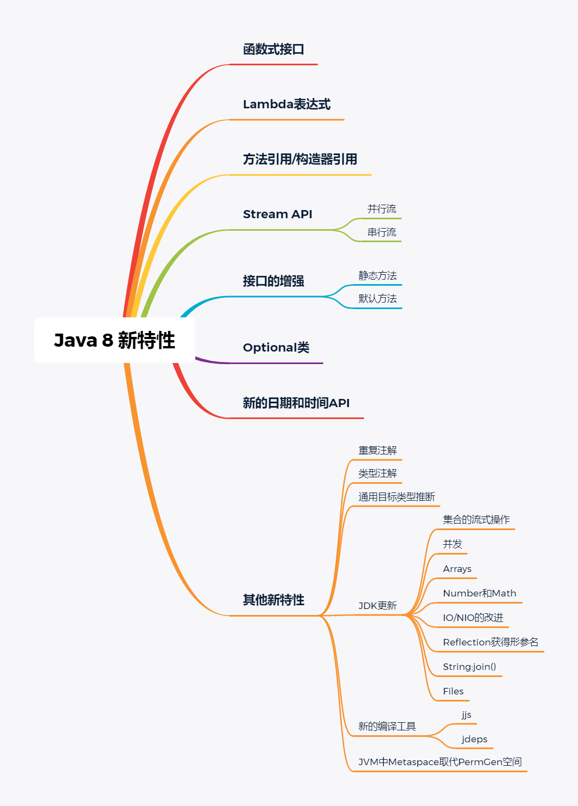
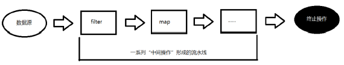

# [Java 8 新特性](https://www.oracle.com/java/technologies/javase/8-whats-new.html)

## 简介

- Java 8 (又称为 jdk 1.8) 是 Java 语言开发的一个主要版本。 
- Java 8 是oracle公司于2014年3月发布，可以看成是自Java 5 以来最具革命性的版本。Java 8为Java语言、编译器、类库、开发工具与JVM带来了大量新特性。

## 结构



## 新特性

### 并行流与串行流

并行流就是把一个内容分成多个数据块，并用不同的线程分别处理每个数据块的流。相比较串行的流，并行的流可以很大程度上提高程序的执行效率。

1. 使用多核对数组进行排序:

   ```java
   Arrays.parallelSort(numbers); 
   ```

2. 根据特定的条件（比如：素数和非素数）对数组进行分组：

   ```java
   Map<Boolean, List<Integer>> groupByPrimary = numbers.parallelStream().collect(Collectors.groupingBy(s -> Utility.isPrime(s))); 
   ```

3. 对数组进行过滤：

   ```java
   Integer[]  prims = numbers.parallelStream().filter(s -> Utility.isPrime(s)).toArray(); 
   ```

### Lambda表达式

Lambda 是一个匿名函数，我们可以把 Lambda 表达式理解为是一段可以传递的代码（将代码像数据一样进行传递）。使用它可以写出更简洁、更灵活的代码。作为一种更紧凑的代码风格，使Java的语言表达能力得到了提升。

python的 lambda就是传统的匿名函数

```python
x = 10
y = 14
# 传统函数
def addTowNumber(x, y):
    return x + y
print(addTowNumber(x,y))
# 匿名函数
func = lambda x,y: x + y
print(func(x,y))
```

 Lambda 表达式：在Java 8 语言中引入的一种新的语法元素和操作符。这个操作符为 “->” ， 该操作符被称为 Lambda 操作符或箭头操作符。它将 Lambda 分为两个部分：

- 左侧：指定了 Lambda 表达式需要的参数列表
- 右侧：指定了 Lambda 体，是抽象方法的实现逻辑，也即Lambda 表达式要执行的功能。

语法：

1. 语法格式一：无参，无返回值

   ```java
   @Test
   public void test() {
       // 常规写法
       Runnable r1 = new Runnable() {
           @Override
           public void run() {
               System.out.println("Lambda Test");
           }
       };
       r1.run();
       // lambda 写法
       Runnable r2 = () -> {System.out.println("Lambda Test")};
       r2.run();
   }
   ```

2. 语法格式二：Lambda 需要一个参数，但是没有返回值。

   ```java
   @Test
   public void test1(){
       // 常规写法
       Consumer<String> c1 = new Consumer<String>() {
           @Override
           public void accept(String s) {
               System.out.println(s);
           }
       };
       c1.accept("带参数的Lambda Test");
   	// lambda 写法
       Consumer<String> c2 = (String str) -> {System.out.println(str)};
       c2.accept("带参数的Lambda Test");
   }
   ```

3. 语法格式三：数据类型可以省略，因为可由编译器推断得出，称为“类型推断”

   ```java
   @Test
   public void test1(){
       // 常规写法
       Consumer<String> c1 = new Consumer<String>() {
           @Override
           public void accept(String s) {
               System.out.println(s);
           }
       };
       c1.accept("带参数的Lambda Test");
   	// lambda 写法
       Consumer<String> c2 = (str) -> { System.out.println(str)};
       c2.accept("带参数的Lambda Test");
   }
   ```

4. 语法格式四：Lambda 若只需要一个参数时，参数的小括号可以省略

   ```java
   @Test
   public void test1(){
       // 常规写法
       Consumer<String> c1 = new Consumer<String>() {
           @Override
           public void accept(String s) {
               System.out.println(s);
           }
       };
       c1.accept("带参数的Lambda Test");
   	// lambda 写法
       Consumer<String> c2 = str -> { System.out.println(str)};
       c2.accept("带参数的Lambda Test");
   }
   ```

5. 语法格式五：Lambda 需要两个或以上的参数，多条执行语句，并且可以有返回值

   ```java
   @Test
   public void test2() {
       // 常规写法
       Comparator<Integer> comparator = new Comparator<Integer>() {
           @Override
           public int compare(Integer o1, Integer o2) {
               System.out.println("o1:" + o1 + "和 o2：" + o2);
               return Integer.compare(o1, o2);
           }
       };
       comparator.compare(12, 24);
   	// lambda 写法
       Comparator<Integer> com = (x, y) -> {
           System.out.println("o1:" + x + "和 o2：" + y);
           return Integer.compare(x, y);
       };
   }
   ```

6. 语法格式六：当 Lambda 体只有一条语句时，return 与大括号若有，都可以省略

   ```java
   @Test
   public void test2() {
       Comparator<Integer> comparator = new Comparator<Integer>() {
           @Override
           public int compare(Integer o1, Integer o2) {
               System.out.println("o1:" + o1 + "和 o2：" + o2);
               return Integer.compare(o1, o2);
           }
       };
       comparator.compare(12, 24);
   
       Comparator<Integer> com = (x, y) -> Integer.compare(x, y);
       com.compare(24, 20);
   }
   ```

类型推断:

- 上述 Lambda 表达式中的参数类型都是由编译器推断得出的。Lambda 表达式中无需指定类型，程序依然可以编译，这是因为 javac 根据程序的上下文，在后台推断出了参数的类型。Lambda 表达式的类型依赖于上下文环境，是由编译器推断出来的。这就是所谓的“类型推断”。

### 函数式(Functional)接口

- 概述：

  - 只包含一个抽象方法的接口，称为函数式接口。
  - 你可以通过 Lambda 表达式来创建该接口的对象。（若 Lambda 表达式抛出一个受检异常(即：非运行时异常)，那么该异常需要在目标接口的抽象方法上进行声明）。
  - 我们可以在一个接口上使用 @FunctionalInterface 注解，这样做可以检查它是否是一个函数式接口。同时 javadoc 也会包含一条声明，说明这个接口是一个函数式接口。
  - 在java.util.function包下定义了Java 8 的丰富的函数式接口

- 如何理解函数式接口

  - Java从诞生日起就是一直倡导“一切皆对象”，在Java里面面向对象(OOP)编程是一切。但是随着python、scala等语言的兴起和新技术的挑战，Java不得不做出调整以便支持更加广泛的技术要求，也即java不但可以支持OOP还可以支持OOF（面向函数编程
  - 在函数式编程语言当中，函数被当做一等公民对待。在将函数作为一等公民的编程语言中，Lambda表达式的类型是函数。但是在Java8中，有所不同。在Java8中，Lambda表达式是对象，而不是函数，它们必须依附于一类特别的对象类型——函数式接口。
  - 简单的说，在Java8中，Lambda表达式就是一个函数式接口的实例。这就是Lambda表达式和函数式接口的关系。也就是说，只要一个对象是函数式接口的实例，那么该对象就可以用Lambda表达式来表示。
  - 所以以前用匿名实现类表示的现在都可以用Lambda表达式来写。

- 自定义函数式接口

  ```java
  @FunctionalInterface
  public interface MyInterface {
      String getValue();
  }
  
  // 带泛型的
  @FunctionalInterface
  public interface MyInterface<T> {
      String getValue(T t);
  }
  
  ```

- 作为参数传递 Lambda 表达式

  ```java
  public class MyInterfaceDemo {
      public static void main(String[] args) {
          MyInterfaceDemo demo = new MyInterfaceDemo();
          String newStr = demo.toUpperString(str -> str.toUpperCase(), "abcdef");
          System.out.println(newStr);
  
      }
  
      public String toUpperString(MyInterface<String> mf, String str) {
          return mf.getValue(str);
      }
  }
  ```

- Java 内置四大核心函数式接口

| 函数式接口                 | 参数类型 | 返回类型 | 用途                                                         |
| -------------------------- | :------- | -------- | ------------------------------------------------------------ |
| `Consumer<T>消费型接口`    | T        | void     | 对类型为T的对象应用操作，包含方法：void accept(T t)          |
| `Supplier<T>供给型接口`    |          | T        | 返回类型为T的对象，包含方法：T get()                         |
| `Function<T, R>函数型接口` | T        | R        | 对类型为T的对象应用操作，并返回结果。结果是R类型的对象。包含方法：R apply(T t) |
| `Predicate<T>断定型接口`   | T        | boolean  | 确定类型为T的对象是否满足某约束，并返回boolean 值。包含方法：boolean test(T t) |

- [其他接口](https://docs.oracle.com/en/java/javase/11/docs/api/java.base/java/util/function/package-summary.html)
- 总结带Bi的基本都是可以带两个参数的
- To都是转换型的

### 方法引用(Method References)

- 当要传递给Lambda体的操作，已经有实现的方法了，可以使用方法引用！

- 方法引用可以看做是Lambda表达式深层次的表达。换句话说，方法引用就是Lambda表达式，也就是函数式接口的一个实例，通过方法的名字来指向一个方法，可以认为是Lambda表达式的一个语法糖。

- 要求：实现接口的抽象方法的参数列表和返回值类型，必须与方法引用的方法的参数列表和返回值类型保持一致！

- 格式：使用操作符 `::` 将类(或对象) 与 方法名分隔开来。

- 如下三种主要使用情况：

  - `对象::实例方法名`

    ```java
    @Test
    public void test(){
        Consumer<String> con1 = new Consumer<String>() {
            @Override
            public void accept(String s) {
                System.out.println(s);
            }
        };
        con1.accept("原始方法");
        Consumer<String> con2 = s -> System.out.println(s);
        con2.accept("Lambda方法");
        Consumer<String> con3 = System.out::println;
        con3.accept("Method References 方法");
    }
    ```

  - `类::静态方法名`

    ```java
    @Test
    public void test2() {
        Comparator<Integer> com1 = (t1, t2) -> Integer.compare(t1,t2);
        System.out.println(com1.compare(12,21));
    
        Comparator<Integer> com2 = Integer::compare;
        System.out.println(com2.compare(12,3));
    
    }
    
    @Test
    public void test3(){
        DoubleFunction<Long> con = d -> Math.round(d);
        long apply1 = con.apply(10.7);
        System.out.println(apply1);
    
        DoubleFunction<Long> consumer = Math::round;
        Long apply = consumer.apply(3.14);
        System.out.println(apply);
    
    }
    ```

  - `类::实例方法名`

    ```java
    @Test
    public void test4() {
        Comparator<String> com1 = (s1, s2) -> s1.compareTo(s2);
        int compare1 = com1.compare("abc", "abd");
        System.out.println(compare1);
    
        Comparator<String> com2 = String::compareTo;
        int compare = com2.compare("abc", "adc");
        System.out.println(compare);
    
    }
    ```

  - 注意：当函数式接口方法的第一个参数是需要引用方法的调用者，并且第二个参数是需要引用方法的参数(或无参数)时：ClassName::methodName

### 构造器引用

- 格式：`ClassName::new` 

- 与函数式接口相结合，自动与函数式接口中方法兼容。

- 可以把构造器引用赋值给定义的方法，要求构造器参数列表要与接口中抽象方法的参数列表一致！且方法的返回值即为构造器对应类的对象。

  ```java
  @Test
  public void test5(){
      Function<Integer, Integer> func = n -> new Integer(n);
      Integer apply1 = func.apply(11);
      System.out.println(apply1);
  
      Function<Integer, Integer> function = Integer::new;
      Integer apply = function.apply(10);
      System.out.println(apply);
  }
  ```

- 可以满足空参和1个参数和两个参数的构造器，多参的还不能创建

### 数组引用

- 格式： `type[] :: new`

  ```java
  @Test
  public void test6(){
      Function<Integer,int[]> func = i -> new int[i];
      int[] apply1 = func.apply(10);
      System.out.println(Arrays.toString(apply1));
  
      Function<Integer,int[]> aNew = int[]::new;
      int[] apply = aNew.apply(10);
      System.out.println(Arrays.toString(apply));
  }
  ```

### 强大的Stream API

- 为什么要使用Stream API

  - 实际开发中，项目中多数数据源都来自于Mysql，Oracle等。但现在数据源可以更多了，有MongDB，Radis等，而这些NoSQL的数据就需要Java层面去处理。
  - Stream 和 Collection 集合的区别：Collection 是一种静态的内存数据结构，而 Stream 是有关计算的。前者是主要面向内存，存储在内存中，后者主要是面向 CPU，通过 CPU 实现计算。

- Stream到底是什么呢？

  - 和`SQL`语言类似
  - 是数据渠道，用于操作数据源（集合、数组等）所生成的元素序列。 `集合讲的是数据，Stream讲的是计算!`

- Stream 的操作三个步骤

  - 创建 Stream

  - 中间操作

  - 终止操作(终端操作)

  - 一旦执行终止操作，就执行中间操作链，并产生结果。之后，不会再被使用

    

- **创建 Stream:**

  - 通过集合

  - Java8 中的 Collection 接口被扩展，提供了两个获取流的方法：

    - `default Stream<E> stream()` : 返回一个顺序流
    - `default Stream<E> parallelStream() `: 返回一个并行流

    ```java
    @Test
    public void test() {
        Stream<Integer> stream = Arrays.asList(1, 2, 3, 4, 5, 6).stream();
        stream.forEach(System.out::println);
        System.out.println();
        Stream<Integer> integerStream = Arrays.asList(1, 2, 3, 4, 5, 6).parallelStream();
        integerStream.forEach(System.out::println);
    }
    // 1,2,3,4,5,6
    // 4,6,5,2,3,1
    ```

  - 通过数组

    - Java8 中的Arrays 的静态方法 stream() 可以获取数组流：
    - `static <T> Stream<T> stream(T[] array)`: 返回一个流
    - 重载形式，能够处理对应基本类型的数组：
    - `public static IntStream stream(int[] array)`
    - `public static LongStream stream(long[] array)`
    - `public static DoubleStream stream(double[] array)`

    ```java
    @Test
    public void test2() {
        Function<Integer, int[]> func = int[]::new;
        int[] apply = func.apply(10);
        IntStream stream = Arrays.stream(apply);
        stream.forEach(System.out::println);
    }
    // 0,0,0,0,0,0,0,0,0,0
    ```

  - 通过Stream的of()

    - 可以调用Stream类静态方法 of(), 通过显示值创建一个流。它可以接收任意数量的参数。
    - `public static<T> Stream<T> of(T... values) `: 返回一个流

    ```java
    @Test
    public void test3(){
        Stream<Integer> stream = Stream.of(1, 2, 3, 4, 5, 6);
    }
    ```

  - 创建无限流

    - 可以使用静态方法 Stream.iterate() 和 Stream.generate(), 创建无限流。
    - 迭代：`public static<T> Stream<T> iterate(final T seed, final UnaryOperator<T> f) `
      - 注意：java9增强了 `iterate`
    - 生产：`public static<T> Stream<T> generate(Supplier<T> s) `

    ```java
    @Test
    public void test4() {
    //      迭代
        //      public static<T> Stream<T> iterate(final T seed, final UnaryOperator<T> f)
      //遍历前10个偶数
        Stream.iterate(0, t -> t + 2).limit(10).forEach(System.out::println);
      // java9 新增强的iterate的方法
        //Stream.iterate(0,x -> x <20,x -> x + 2).forEach(System.out::println);
      //      生成
        //      public static<T> Stream<T> generate(Supplier<T> s)
      Stream.generate(Math::random).limit(10).forEach(System.out::println);
    
    }
    ```
  
- **Stream 的中间操作**

  - 多个中间操作可以连接起来形成一个流水线，除非流水线上触发终止操作，否则中间操作不会执行任何的处理！而在终止操作时一次性全部处理，称为`惰性求值`。

  - 筛选与切片

    1. `filter(Predicate p)`:接收 Lambda ， 从流中排除某些元素

       - 相当于`SQL`的`where条件`

       ```java
       @Test
       public void testFilter() {
           List<Integer> list = Arrays.asList(70, 20, 15, 7, 60, 99, 40);
           list.stream().filter(i -> i>50).forEach(System.out::println);
       }
       //70,60,99
       ```

    2. `distinct()`:筛选，通过流所生成元素的 hashCode() 和 equals() 去除重复元素

       - 相当于`SQL`的`distict`

       ```java
       @Test
       public void  testDistict() {
           List<Integer> list = Arrays.asList(7, 20, 15, 7, 60, 99, 7);
           list.stream().distinct().forEach(System.out::println);
       }
       //7,20,15,60,99
       ```

    3. `limit(long maxSize)`:截断流，使其元素不超过给定数量

       - 相当于`SQL`的`limit`

       ```java
       @Test
       public void testLimit(){
           List<Integer> list = Arrays.asList(7, 20, 15, 7, 60, 99, 7);
           list.stream().limit(3).forEach(System.out::println);
       }
       // 7,20,15
       ```

    4. `skip(long n)`:跳过元素，返回一个扔掉了前 n 个元素的流。若流中元素不足 n 个，则返回一个空流。与 limit(n) 互补

       - 相当于`SQL`的`offset`

       ```java
       @Test
       public void testSkip() {
           List<Integer> list = Arrays.asList(7, 20, 15, 7, 60, 99, 7);
           list.stream().skip(3).forEach(System.out::println);
       }
       // 7,60,99,7
       ```

  - 映 射

    1. `map(Function f)`:接收一个函数作为参数，该函数会被应用到每个元素上，并将其映射成一个新的元素。

       - 有点类似于`Selet 后面的元素` 主要目的是取出想要操作的元素

       ```java
       @Test
       public void testMap(){
           List<String> list = Arrays.asList("aa", "bb", "cc", "dd");
           list.stream().map(str -> str.toUpperCase()).forEach(System.out::println);
       }
       // AA,BB,CC,DD
       ```

    2. `flatMap(Function f)`:接收一个函数作为参数，将流中的每个值都换成另一个流，然后把所有流连接成一个流。

       ```java
       @Test
       public void testMap(){
           Stream<Character> characterStream = list.stream().flatMap(StreamAPIDemo::fromStringToStream);
           characterStream.forEach(System.out::println);
       }
       
       //将字符串中的多个字符构成的集合转换为对应的Stream的实例
       public static Stream<Character> fromStringToStream(String str){//aa
           ArrayList<Character> list = new ArrayList<>();
           for(Character c : str.toCharArray()){
               list.add(c);
           }
           return list.stream();
       }
       // a,a,b,b,c,c,d,d
       ```

    3. `mapToXxx(ToXxxFunction f)`:接收一个函数作为参数，该函数会被应用到每个元素上，产生一个新的 `XxxtStream`。

    4. `map 和 flatMap`区别

       - `flatMap`更像嵌套循环举个例子`ArrayList`中如果有`Array`他会吧每个元素都拆分
       - 而`map`会把`Array`当做`ArrayList`的一个元素
       - 参考理解

       ```java
       @Test
       public void test3(){
           ArrayList list1 = new ArrayList();
           list1.add(1);
           list1.add(2);
           list1.add(3);
       
           ArrayList list2 = new ArrayList();
           list2.add(4);
           list2.add(5);
           list2.add(6);
       
           //        list1.add(list2); add 更像：Map
           list1.addAll(list2);// addAll 更像：flatMap
           System.out.println(list1);
       
       }
       ```

  - 排序

    1. `sorted()`:产生一个新流，其中按自然顺序排序

       ```java
       @Test
       public void testSorted(){
           List<Integer> list = Arrays.asList(12, 43, 65, 34, 87, 0, -98, 7);
           list.stream().sorted().forEach(System.out::println);
       }
       ```

    2. `sorted(Comparator com)`:产生一个新流，其中按比较器顺序排序

       ```java
       @Test
       public void testSortedByComparator(){
           List<Integer> list = Arrays.asList(12, 43, 65, 34, 87, 0, -98, 7);
           list.stream().sorted(Integer::compare).forEach(System.out::println);
       }
       ```

    3. 类似以`SQL`的`ORDER BY`

- **Stream 的终止操作**

  - 终端操作会从流的流水线生成结果。其结果可以是任何不是流的值，例如：List、Integer，甚至是 void 。

  - 流进行了终止操作后，不能再次使用。

  - 匹配与查找

    - `allMatch(Predicate p)`:检查是否匹配所有元素

      ```java
      @Test
      public void testAllMatch(){
          List<Integer> list = Arrays.asList(12, 43, 65, 34, 87, 0, -98, 7);
          System.out.println(list.stream().allMatch(n -> n > 50));
      }
      // false
      ```

    - `anyMatch(Predicate p)`:检查是否至少匹配一个元素

      ```java
      @Test
      public void testAnyMatch(){
          List<Integer> list = Arrays.asList(12, 43, 65, 34, 87, 0, -98, 7);
          System.out.println(list.stream().anyMatch(n -> n > 50));
      }
      // true
      ```

    - `noneMatch(Predicate p)`:检查是否没有匹配所有元素

      ```java
      @Test
      public void testNoneMatch(){
          List<Integer> list = Arrays.asList(12, 43, 65, 34, 87, 0, -98, 7);
          System.out.println(list.stream().noneMatch(n -> n > 50));
      }
      // false
      ```

    - `findFirst()`:返回第一个元素

      ```java
      @Test
      public void testFindFirst(){
          List<Integer> list = Arrays.asList(12, 43, 65, 34, 87, 0, -98, 7);
          System.out.println(list.stream().findFirst());
      }
      // Optional[12]
      ```

    - `findAny()`:返回当前流中的任意元素

      ```java
      @Test
      public void testFindAny(){
          List<Integer> list = Arrays.asList(12, 43, 65, 34, 87, 0, -98, 7);
          System.out.println(list.stream().findAny());
      }
      //  Optional[12]
      ```

    - `count()`:返回流中元素总数

      ```java
      @Test
      public void testCount(){
          List<Integer> list = Arrays.asList(12, 43, 65, 34, 87, 0, -98, 7);
          System.out.println(list.stream().filter(n -> n > 10).count());
      }
      // 5
      ```

    - `max(Comparator c)`:返回流中最大值

      ```java
      @Test
      public void testMax() {
          List<Integer> list = Arrays.asList(12, 43, 65, 34, 87, 0, -98, 7);
          System.out.println(list.stream().max(Integer::compare));
      }
      //  Optional[87]
      ```

    - `min(Comparator c)`:返回流中最小值

      ```java
      @Test
      public void testMin() {
          List<Integer> list = Arrays.asList(12, 43, 65, 34, 87, 0, -98, 7);
          System.out.println(list.stream().min(Integer::compare));
      }
      //  Optional[-98]
      ```

    - `forEach(Consumer c)`:内部迭代(使用 Collection 接口需要用户去做迭代，称为外部迭代。相反，Stream API 使用内部迭
      代——它帮你把迭代做了)

  - 归约

    - `reduce(T iden, BinaryOperator b)`:可以将流中元素反复结合起来，得到一个值。返回 T

      ```java
      @Test
      public void testReduce(){
          List<Integer> list = Arrays.asList(1,2,3,4,5,6,7,8,9,10);
          Integer sum = list.stream().reduce(0, Integer::sum);
          System.out.println(sum);
      }
      // 55
      ```

    - `reduce(BinaryOperator b)`:可以将流中元素反复结合起来，得到一个值。返回 Optional<T>

      ```java
      @Test
      public void testReduce(){
          List<Integer> list = Arrays.asList(1,2,3,4,5,6,7,8,9,10);
          Optional<Integer> reduce = list.stream().reduce(Integer::sum);
          System.out.println(reduce.get());
      }
      // 55
      ```

    - `map` 和 `reduce` 的连接通常称为 `map-reduce `模式，因 `Google` 用它来进行网络搜索而出名。

  - 收集

    - `collect(Collector c)`:将流转换为其他形式。接收一个 Collector接口的实现，用于给Stream中元素做汇总的方法

    - Collector 接口中方法的实现决定了如何对流执行收集的操作(如收集到 List、Set、 Map)。

    - `toList`:把流中元素收集到List

      ```java
      @Test
      public void testCollector(){
          List<Integer> list = Arrays.asList(12, 43, 65, 34, 87, 0, -98, 7);
          List<Integer> collect = list.stream().filter(n -> n > 50).collect(Collectors.toList());
          System.out.println(collect);
      }
      ```

    - `toSet`:把流中元素收集到Set

    - `toCollection`:把流中元素收集到创建的集合

    - [更多API](https://docs.oracle.com/en/java/javase/11/docs/api/java.base/java/util/stream/Collectors.html)

### Optional类

- 到目前为止，臭名昭著的空指针异常是导致Java应用程序失败的最常见原因。以前，为了解决空指针异常，Google公司著名的Guava项目引入了Optional类， Guava通过使用检查空值的方式来防止代码污染，它鼓励程序员写更干净的代码。受到Google Guava的启发，Optional类已经成为Java 8类库的一部分。

- Optional<T> 类(java.util.Optional) 是一个容器类，它可以保存类型T的值，代表这个值存在。或者仅仅保存null，表示这个值不存在。原来用 null 表示一个值不存在，现在 Optional 可以更好的表达这个概念。并且可以避免空指针异常。

- Optional类的Javadoc描述如下：这是一个可以为null的容器对象。如果值存在则isPresent()方法会返回true，调用get()方法会返回该对象。

- 创建Optional类对象的方法：

  - `Optional.of(T t)` : 创建一个 Optional 实例，t必须非空；
  - `Optional.empty() `: 创建一个空的 Optional 实例
  - `Optional.ofNullable(T t)`：t可以为null

- 判断Optional容器中是否包含对象：

  - `boolean isPresent() `: 判断是否包含对象
  - `void ifPresent(Consumer<? super T> consumer)` ：如果有值，就执行Consumer接口的实现代码，并且该值会作为参数传给它。

- 获取Optional容器的对象：

  - `T get()`: 如果调用对象包含值，返回该值，否则抛异常
  - `T orElse(T other) `：如果有值则将其返回，否则返回指定的other对象。
  - `T orElseGet(Supplier<? extends T> other) `：如果有值则将其返回，否则返回由Supplier接口实现提供的对象。
  - `T orElseThrow(Supplier<? extends X> exceptionSupplier)` ：如果有值则将其返回，否则抛出由Supplier接口实现提供的异常。

- 搭配使用

  - `Optional.of(T t)`和`T get()`
  - `Optional.ofNullable(T t)`和`T orElseGet(Supplier<? extends T> other) `

- 代码理解

  ```java
  import org.junit.Test;
  import java.util.Optional;
  
  /**
   * @Author: Frenude
   * @Description: //TODO
   * @Date: Created in 01 04,2021
   * @Modified By:
   **/
  public class OptionalDemo {
      @Test
      public void test1() {
          Girl girl = new Girl();
  //        girl = null;
          //of(T t):保证t是非空的
          Optional<Girl> optionalGirl = Optional.of(girl);
  
      }
  
      @Test
      public void test2() {
          Girl girl = new Girl();
  //        girl = null;
          //ofNullable(T t)：t可以为null
          Optional<Girl> optionalGirl = Optional.ofNullable(girl);
          System.out.println(optionalGirl);
          //orElse(T t1):如果单前的Optional内部封装的t是非空的，则返回内部的t.
          //如果内部的t是空的，则返回orElse()方法中的参数t1.
          Girl girl1 = optionalGirl.orElse(new Girl("赵丽颖"));
          System.out.println(girl1);
  
      }
  
  
      public String getGirlName(Boy boy) {
          return boy.getGirl().getName();
      }
  
      @Test
      public void test3() {
          Boy boy = new Boy();
          boy = null;
          String girlName = getGirlName(boy);
          System.out.println(girlName);
  
      }
  
      //优化以后的getGirlName():
      public String getGirlName1(Boy boy) {
          if (boy != null) {
              Girl girl = boy.getGirl();
              if (girl != null) {
                  return girl.getName();
              }
          }
  
          return null;
  
      }
  
      @Test
      public void test4() {
          Boy boy = new Boy();
          boy = null;
          String girlName = getGirlName1(boy);
          System.out.println(girlName);
  
      }
  
      //使用Optional类的getGirlName():
      public String getGirlName2(Boy boy) {
  
          Optional<Boy> boyOptional = Optional.ofNullable(boy);
          //此时的boy1一定非空
          Boy boy1 = boyOptional.orElse(new Boy(new Girl("迪丽热巴")));
          Girl girl = boy1.getGirl();
          Optional<Girl> girlOptional = Optional.ofNullable(girl);
          //girl1一定非空
          Girl girl1 = girlOptional.orElse(new Girl("古力娜扎"));
          return girl1.getName();
      }
  
      @Test
      public void test5() {
          Boy boy = null;
          boy = new Boy();
          boy = new Boy(new Girl("苍老师"));
          String girlName = getGirlName2(boy);
          System.out.println(girlName);
  
      }
  }
  
  class Girl {
  
      private String name;
  
      public Girl() {
      }
  
      public Girl(String name) {
          this.name = name;
      }
  
      @Override
      public String toString() {
          return "Girl{" +
                  "name='" + name + '\'' +
                  '}';
      }
  
      public String getName() {
          return name;
      }
  
      public void setName(String name) {
          this.name = name;
      }
  }
  
  class Boy {
      private Girl girl;
  
      public Boy() {
      }
  
      public Boy(Girl girl) {
          this.girl = girl;
      }
  
      @Override
      public String toString() {
          return "Boy{" +
                  "girl=" + girl +
                  '}';
      }
  
      public Girl getGirl() {
          return girl;
      }
  
      public void setGirl(Girl girl) {
          this.girl = girl;
      }
  }
  ```

  

​    

  

  

  
