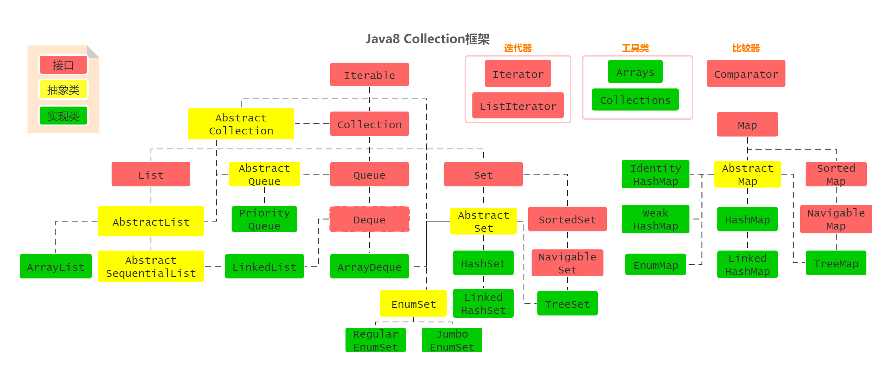
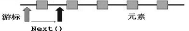
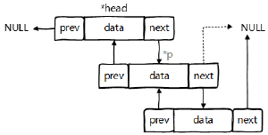
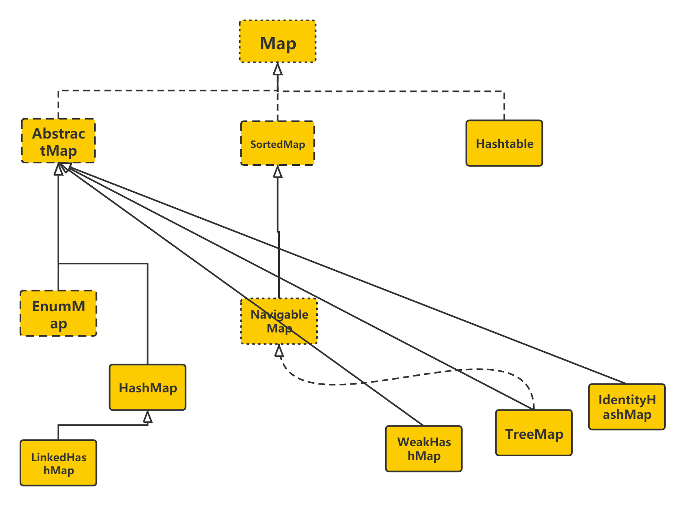
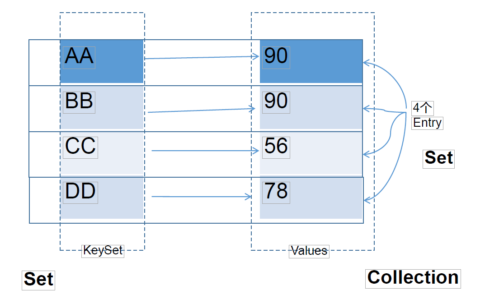
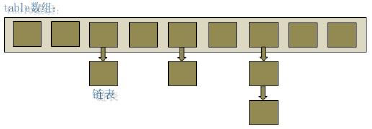
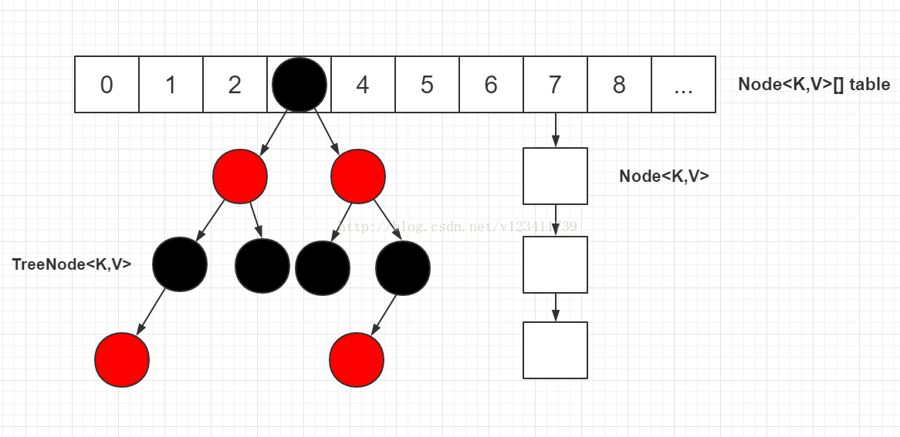

# Java 集合

## 概述

- 一方面， 面向对象语言对事物的体现都是以对象的形式，为了方便对多个对象的操作，就要对对象进行存储。另一方面，使用Array存储对象方面具有一些弊端，而Java 集合就像一种容器，可以动态地把多个对象的引用放入容器中。
- 数组在内存存储方面的特点：
  - 数组初始化以后，长度就确定了。
  - 数组声明的类型，就决定了进行元素初始化时的类型
- 数组在存储数据方面的弊端：
  - 数组初始化以后，长度就不可变了，不便于扩展
  - 数组中提供的属性和方法少，不便于进行添加、删除、插入等操作，且效率不高。同时无法直接获取存储元素的个数
  - 数组存储的数据是有序的、可以重复的。---->存储数据的特点单一
- Java 集合类可以用于存储数量不等的多个对象，还可用于保存具有映射关系的关联数组。
- Java 集合可分为 Collection 和 Map 两种体系
  - Collection接口：单列数据，定义了存取一组对象的方法的集合
    - List：元素有序、可重复的集合
    - Set：元素无序、不可重复的集合
  - Map接口：双列数据，保存具有映射关系`key-value对`的集合

## Collection



- Collection接口：单列集合，用来存储一个一个的对象

  - List接口：存储序的、可重复的数据。  -->动数组
    - ArrayList
    - LinkedList
    - Vector
  - Set接口：存储无序的、不可重复的数据   -->集合
    - HashSet
    - LinkedHashSet
    - TreeSet

- Collection 接口是 List、Set 和 Queue 接口的父接口，该接口里定义的方法既可用于操作 Set 集合，也可用于操作 List 和 Queue 集合。

- JDK不提供此接口的任何直接实现，而是提供更具体的子接口(如：Set和List)实现。

- 在 Java5 之前，Java 集合会丢失容器中所有对象的数据类型，把所有对象都当成 Object 类型处理；从 JDK 5.0 增加了泛型以后，Java 集合可以记住容器中对象的数据类型。

- Collection 接口方法

  - 添加:
    - `add(Object obj)`
    - `addAll(Collection coll)`
  - 获取有效元素的个数
    - `int size()`
  - 清空集合
    - `void clear()`
  - 是否是空集合
    - `boolean isEmpty()`
  - 是否包含某个元素
    - `boolean contains(Object obj)`：是通过元素的equals方法来判断是否是同一个对象
    - `boolean containsAll(Collection c)`：也是调用元素的equals方法来比较的。拿两个集合的元素挨个比较。
  - 删除
    - `boolean remove(Object obj) `：通过元素的equals方法判断是否是要删除的那个元素。只会删除找到的第一个元素
    - `boolean removeAll(Collection coll)`：取当前集合的差集
  - 取两个集合的交集
    - `boolean retainAll(Collection c)`：把交集的结果存在当前集合中，不影响c
  - 集合是否相等
    - `boolean equals(Object obj)`
  - 转成对象数组
    - `Object[] toArray()`
  - 获取集合对象的哈希值
    - `hashCode()`
  - 遍历
    - `iterator()`：返回迭代器对象，用于集合遍历

  ```java
  public class CollectionTest {
      @Test
      public void test1(){
          Collection coll = new ArrayList();
          coll.add(123);
          coll.add(456);
  //        Person p = new Person("Jerry",20);
  //        coll.add(p);
          coll.add(new Person("Jerry",20));
          coll.add(new String("Tom"));
          coll.add(false);
          //1.contains(Object obj):判断当前集合中是否包含obj
          //我们在判断时会调用obj对象所在类的equals()。
          boolean contains = coll.contains(123);
          System.out.println(contains);
          System.out.println(coll.contains(new String("Tom")));
  //        System.out.println(coll.contains(p));//true
          System.out.println(coll.contains(new Person("Jerry",20)));//false -->true
  
          //2.containsAll(Collection coll1):判断形参coll1中的所有元素是否都存在于当前集合中。
          Collection coll1 = Arrays.asList(123,4567);
          System.out.println(coll.containsAll(coll1));
      }
  
      @Test
      public void test2(){
          //3.remove(Object obj):从当前集合中移除obj元素。
          Collection coll = new ArrayList();
          coll.add(123);
          coll.add(456);
          coll.add(new Person("Jerry",20));
          coll.add(new String("Tom"));
          coll.add(false);
  
          coll.remove(1234);
          System.out.println(coll);
  
          coll.remove(new Person("Jerry",20));
          System.out.println(coll);
  
          //4. removeAll(Collection coll1):差集：从当前集合中移除coll1中所有的元素。
          Collection coll1 = Arrays.asList(123,456);
          coll.removeAll(coll1);
          System.out.println(coll);
  
  
      }
  
      @Test
      public void test3(){
          Collection coll = new ArrayList();
          coll.add(123);
          coll.add(456);
          coll.add(new Person("Jerry",20));
          coll.add(new String("Tom"));
          coll.add(false);
  
          //5.retainAll(Collection coll1):交集：获取当前集合和coll1集合的交集，并返回给当前集合
  //        Collection coll1 = Arrays.asList(123,456,789);
  //        coll.retainAll(coll1);
  //        System.out.println(coll);
  
          //6.equals(Object obj):要想返回true，需要当前集合和形参集合的元素都相同。
          Collection coll1 = new ArrayList();
          coll1.add(456);
          coll1.add(123);
          coll1.add(new Person("Jerry",20));
          coll1.add(new String("Tom"));
          coll1.add(false);
  
          System.out.println(coll.equals(coll1));
  
  
      }
  
      @Test
      public void test4(){
          Collection coll = new ArrayList();
          coll.add(123);
          coll.add(456);
          coll.add(new Person("Jerry",20));
          coll.add(new String("Tom"));
          coll.add(false);
  
          //7.hashCode():返回当前对象的哈希值
          System.out.println(coll.hashCode());
  
          //8.集合 --->数组：toArray()
          Object[] arr = coll.toArray();
          for(int i = 0;i < arr.length;i++){
              System.out.println(arr[i]);
          }
  
          //拓展：数组 --->集合:调用Arrays类的静态方法asList()
          List<String> list = Arrays.asList(new String[]{"AA", "BB", "CC"});
          System.out.println(list);
  
          List arr1 = Arrays.asList(new int[]{123, 456});
          System.out.println(arr1.size());//1
  
          List arr2 = Arrays.asList(new Integer[]{123, 456});
          System.out.println(arr2.size());//2
  
          //9.iterator():返回Iterator接口的实例，用于遍历集合元素。放在IteratorTest.java中测试
  
      }
  }
  ```

## Iterator接口与foreach循环 

### Iterator

- Iterator对象称为迭代器(设计模式的一种)，主要用于遍历 Collection 集合中的元素。

- GOF给迭代器模式的定义为：提供一种方法访问一个容器(container)对象中各个元素，而又不需暴露该对象的内部细节。迭代器模式，就是为容器而生。

- Collection接口继承了java.lang.Iterable接口，该接口有一个iterator()方法，那么所有实现了Collection接口的集合类都有一个iterator()方法，用以返回一个实现了Iterator接口的对象。

- Iterator 仅用于遍历集合，Iterator 本身并不提供承装对象的能力。如果需要创建Iterator 对象，则必须有一个被迭代的集合。

- 集合对象每次调用iterator()方法都得到一个全新的迭代器对象，默认游标都在集合的第一个元素之前。

- `iterator`接口的方法

  - `hasNext()`：判断你是否还有下一个

  - `next()`

    

    - 在调用`it.next()`方法之前必须要调用`it.hasNext()`进行检测。若不调用，且下一条记录无效，直接调用`it.next()`会抛出`NoSuchElementException`异常。

  - `remove()`

    - `Iterator`可以删除集合的元素，但是是遍历过程中通过迭代器对象的`remove方法，不是集合对象的`remove方`法。
    - 如果还未调用`next()`或在上一次调用 `next `方法之后已经调用了 `remove `方法，再调用`remove`都会报`IllegalStateException`。

    ```java
    //测试Iterator中的remove()
    //如果还未调用next()或在上一次调用 next 方法之后已经调用了 remove 方法，再调用remove会报IllegalStateException。
    //内部定义了remove(),可以在遍历的时候，删除集合中的元素。此方法不同于集合直接调用remove()
    @Test
    public void test3(){
        Collection coll = new ArrayList();
        coll.add(123);
        coll.add(456);
        coll.add(new Person("Jerry",20));
        coll.add(new String("Tom"));
        coll.add(false);
    
        //删除集合中"Tom"
        Iterator iterator = coll.iterator();
        while (iterator.hasNext()){
            //            iterator.remove();
            Object obj = iterator.next();
            if("Tom".equals(obj)){
                iterator.remove();
                //                iterator.remove();
            }
        }
        //遍历集合
        iterator = coll.iterator();
        while (iterator.hasNext()){
            System.out.println(iterator.next());
        }
    }
    
    ```

    

  - `iterator`遍历集合

    ```java
    @Test
    public void testIterator(){
        List<Integer> list = Arrays.asList(1, 2, 3, 4, 5, 6, 7);
        Iterator<Integer> iterator = list.iterator();
        while (iterator.hasNext()){
            System.out.println(iterator.next());
        }
    }
    ```

### foreach

- Java 5.0 提供了 foreach 循环迭代访问 Collection和数组。
- 遍历操作不需获取Collection或数组的长度，无需使用索引访问元素。
- 遍历集合的底层调用Iterator完成操作。
- foreach还可以用来遍历数组。

```java
@Test
public void testForeach() {
    List<Integer> list = Arrays.asList(1, 2, 3, 4, 5, 6, 7);
    for (Integer i : list) {
        System.out.println(i);
    }
}
```

- foreach易错题

```java
public class ForEachDemo {
    public static void main(String[] args) {
        String[] strings = {"MM", "MM", "MM"};
        for (String s : strings) {
            System.out.println(s);
        }
    }

    @Test
    public void forEachTest() {
        String[] strings = {"MM", "MM", "MM"};
        for (String s : strings) {
            s = "GG";
        }
        for (int i = 0; i < strings.length; i++) {
            System.out.println(strings[i]);
        }
        for (int i = 0; i < strings.length; i++) {
            strings[i] = "GG";
        }
        for (int i = 0; i < strings.length; i++) {
            System.out.println(strings[i]);
        }
    }
}
```

### Collection遍历的方法

- `Iterator`

  ```java
  @Test
  public void testIterator(){
      List<Integer> list = Arrays.asList(1, 2, 3, 4, 5, 6, 7);
      Iterator<Integer> iterator = list.iterator();
      while (iterator.hasNext()){
          System.out.println(iterator.next());
      }
  }
  ```

- `Iterator.forEachRemaining`

  ```java
  @Test
  public void testForEachRemaining(){
      List<Integer> integers = Arrays.asList(1, 2, 3, 4, 5, 6, 7);
      Iterator<Integer> iterator = integers.iterator();
      iterator.forEachRemaining(System.out::println);
  }
  ```

- `foreach`

  ```java
  @Test
  public void testForeach() {
      List<Integer> list = Arrays.asList(1, 2, 3, 4, 5, 6, 7);
      for (Integer i : list) {
          System.out.println(i);
      }
  }
  ```

## List

### List接口概述

- 存储的数据特点：存储序的、可重复的数据。

### List接口方法

- `List`除了从`Collection`集合继承的方法外，List 集合里添加了一些根据索引来操作集合元素的方法。
- `void add(int index, Object ele)`:在index位置插入ele元素
- `boolean addAll(int index, Collection eles)`:从index位置开始将eles中的所有元素添加进来
- `Object get(int index)`:获取指定index位置的元素
- `int indexOf(Object obj)`:返回obj在集合中首次出现的位置
- `int lastIndexOf(Object obj)`:返回obj在当前集合中末次出现的位置
- `Object remove(int index)`:移除指定index位置的元素，并返回此元素
- `Object set(int index, Object ele)`:设置指定index位置的元素为ele
- `List subList(int fromIndex, int toIndex)`:返回从fromIndex到toIndex位置的子集合

### ArrayList

- 作为List接口的主要实现类；线程不安全的，效率高；底层使用Object[]

- JDK7

  ```java
  ArrayList list = new ArrayList();//底层创建了长度是10的Object[]数组elementData
  list.add(123);//elementData[0] = new Integer(123);
  list.add(11);//如果此次的添加导致底层elementData数组容量不够，则扩容。
  结论：建议开发中使用带参的构造器：ArrayList list = new ArrayList(int capacity)
  ```

- JDK8

  ```java
  ArrayList list = new ArrayList();//底层Object[] elementData初始化为{}.并没创建长度为10的数组
  list.add(123);//第一次调用add()时，底层才创建了长度10的数组，并将数据123添加到elementData[0]
  // 后续的添加和扩容操作与jdk 7 无异。
  ```

- jdk7中的ArrayList的对象的创建类似于单例的饿汉式，而jdk8中的ArrayList的对象的创建类似于单例的懒汉式，延迟了数组的创建，节省内存。

### LinkedList

- 对于频繁的插入或删除元素的操作，建议使用`LinkedList`类，效率较高
- 新增方法：
  - `void addFirst(Object obj)`
  - `void addLast(Object obj)`
  - `Object getFirst()`
  - `Object getLast()`
  - `Object removeFirst()`
  - `Object removeLast()`
- `LinkedList`：双向链表，内部没有声明数组，而是定义了Node类型的first和last，用于记录首末元素。同时，定义内部类Node，作为`LinkedList`中保存数据的基本结构。Node除了保存数据，还定义了两个变量：
  - `prev`变量记录前一个元素的位置
  - `next`变量记录下一个元素的位置



```java
private static class Node<E> {
    E item;
    Node<E> next;
    Node<E> prev;
    Node(Node<E> prev, E element, Node<E> next) {
        this.item = element; 
        this.next = next; 
        this.prev = prev;
    }
}
```

### Vector

- `Vector` 是一个古老的集合，`JDK1.0`就有了。大多数操作与`ArrayList`相同，**区别之处在于Vector是线程安全的。**
- 在各种list中，最好把`ArrayList`作为缺省选择。当插入、删除频繁时，使用`LinkedList`；`Vector`总是比`ArrayList`慢，所以尽量避免使用。
- 新增方法：
  - `void addElement(Object obj)`
  - `void insertElementAt(Object obj,int index)`
  - `void setElementAt(Object obj,int index)`
  - `void removeElement(Object obj)`
  - `void removeAllElements()`

### List面试题

- 请问ArrayList/LinkedList/Vector的异同？谈谈你的理解？ArrayList底层是什么？扩容机制？Vector和ArrayList的最大区别?
- ArrayList和LinkedList的异同
  - 二者都线程不安全，相对线程安全的Vector，执行效率高。
    此外，ArrayList是实现了基于动态数组的数据结构，LinkedList基于链表的数据结构。对于随机访问get和set，ArrayList觉得优于LinkedList，因为LinkedList要移动指针。对于新增和删除操作add(特指插入)和remove，LinkedList比较占优势，因为ArrayList要移动数据。
- ArrayList和Vector的区别
  - Vector和ArrayList几乎是完全相同的,唯一的区别在于Vector是同步类(synchronized)，属于强同步类。因此开销就比ArrayList要大，访问要慢。正常情况下,大多数的Java程序员使用ArrayList而不是Vector,因为同步完全可以由程序员自己来控制。Vector每次扩容请求其大小的2倍空间，而ArrayList是1.5倍。Vector还有一个子类Stack。

## Set

- 存储的数据特点：无序的、不可重复的元素
- Set接口是Collection的子接口，set接口没有提供额外的方法
- Set 集合不允许包含相同的元素，如果试把两个相同的元素加入同一个Set 集合中，则添加操作失败。
- Set 判断两个对象是否相同不是使用 == 运算符，而是根据 equals() 方法

### HashSet

- 基于HashMap实现原理就是key 存储值 value存储常量
  - `private static final Object PRESENT = new Object();`
- HashSet 是 Set 接口的典型实现，大多数时候使用 Set 集合时都使用这个实现类。
- HashSet 按 Hash 算法来存储集合中的元素，因此具有很好的存取、查找、删除性能。
- HashSet 具有以下特点：
  1. 不能保证元素的排列顺序
  2. HashSet 不是线程安全的
  3. 集合元素可以是 null
- HashSet 集合判断两个元素相等的标准：两个对象通过 hashCode() 方法比较相等，并且两个对象的 equals() 方法返回值也相等。
- 对于存放在Set容器中的对象，对应的类一定要重写equals()和hashCode(Object obj)方法，以实现对象相等规则。即：“相等的对象必须具有相等的散列码”。
- 底层也是数组，初始容量为16，当如果使用率超过0.75，（16*0.75=12）就会扩大容量为原来的2倍。（16扩容为32，依次为64,128....等）
- 向HashSet中添加元素的过程：
- 我们向HashSet中添加元素a,首先调用元素a所在类的hashCode()方法，计算元素a的哈希值，此哈希值接着通过某种算法计算出在HashSet底层数组中的存放位置（即为：索引位置，判断数组此位置上是否已经元素：
  - 如果此位置上没其他元素，则元素a添加成功。 --->情况1
  - 如果此位置上其他元素b(或以链表形式存在的多个元素，则比较元素a与元素b的hash值：
    - 如果hash值不相同，则元素a添加成功。--->情况2
    - 如果hash值相同，进而需要调用元素a所在类的equals()方法：
      - equals()返回true,元素a添加失败
      - equals()返回false,则元素a添加成功。--->情况2
- 对于添加成功的情况2和情况3而言：元素a 与已经存在指定索引位置上数据以链表的方式存储。
- jdk 7 :元素a放到数组中，指向原来的元素。
- jdk 8 :原来的元素在数组中，指向元素a
- 总结：七上八下
- HashSet底层：数组+链表的结构。（前提：jdk7)
- HashSet底层：数组+链表+红黑树的结构。（前提：jdk8)
- 重写 hashCode() 方法的基本原则
  - 在程序运行时，同一个对象多次调用 hashCode() 方法应该返回相同的值。
  - 当两个对象的 equals() 方法比较返回 true 时，这两个对象的 hashCode()方法的返回值也应相等。
  - 对象中用作 equals() 方法比较的 Field，都应该用来计算 hashCode 值。
- 重写 equals() 方法的基本原则
  - 当一个类有自己特有的`逻辑相等`概念,当改写equals()的时候，总是要改写hashCode()，根据一个类的equals方法（改写后），两个截然不同的实例有可能在逻辑上是相等的，但是，根据Object.hashCode()方法，它们仅仅是两个对象。
  - 因此，违反了`相等的对象必须具有相等的散列码`。
  - 结论：**复写equals方法的时候一般都需要同时复写hashCode方法。通常参与计算hashCode的对象的属性也应该参与到equals()中进行计算。**

### LinkedHashSet

- LinkedHashSet 是 HashSet 的子类
- LinkedHashSet 根据元素的 hashCode 值来决定元素的存储位置，但它同时使用双向链表维护元素的次序，这使得元素看起来是以插入顺序保存的。
- LinkedHashSet插入性能略低于 HashSet，但在迭代访问 Set 里的全部元素时有很好的性能。
- LinkedHashSet 不允许集合元素重复。

### TreeSet

- TreeSet 是 SortedSet 接口的实现类，TreeSet 可以确保集合元素处于排序状态。
- TreeSet底层使用红黑树结构存储数据
- 新增的方法如下： (了解)
  - `Comparator comparator()`
  - `Object first()`
  - `Object last()`
  - `Object lower(Object e)`
  - `Object higher(Object e)`
  - `SortedSet subSet(fromElement, toElement)`
  - `SortedSet headSet(toElement)`
  - `SortedSet tailSet(fromElement)`
  - `TreeSet` 两种排序方法：自然排序和定制排序。默认情况下，TreeSet 采用自然排序。
- 自然排序
  - 向 TreeSet 中添加元素时，只有第一个元素无须比较compareTo()方法，后面添加的所有元素都会调用compareTo()方法进行比较。
  - 因为只有相同类的两个实例才会比较大小，所以向 TreeSet 中添加的应该是同一个类的对象。
  - 对于 TreeSet 集合而言，它判断两个对象是否相等的唯一标准是：两个对象通过 compareTo(Object obj) 方法比较返回值。
  - 当需要把一个对象放入 TreeSet 中，重写该对象对应的 equals() 方法时，应保证该方法与 compareTo(Object obj) 方法有一致的结果：如果两个对象通过equals() 方法比较返回 true，则通过 compareTo(Object obj) 方法比较应返回 0。否则，让人难以理解。
- 定制排序
  - TreeSet的自然排序要求元素所属的类实现Comparable接口，如果元素所属的类没有实现Comparable接口，或不希望按照升序(默认情况)的方式排列元素或希望按照其它属性大小进行排序，则考虑使用定制排序。定制排序，通过Comparator接口来实现。需要重写compare(T o1,T o2)方法。
  - 利用int compare(T o1,T o2)方法，比较o1和o2的大小：如果方法返回正整数，则表示o1大于o2；如果返回0，表示相等；返回负整数，表示o1小于o2。
  - 要实现定制排序，需要将实现Comparator接口的实例作为形参传递给TreeSet的构造器。
  - 此时，仍然只能向TreeSet中添加类型相同的对象。否则发生ClassCastException异常。
  - 使用定制排序判断两个元素相等的标准是：通过Comparator比较两个元素返回了0。

## Map



- Map常用实现类结构

  > ```
  > |----Map:双列数据，存储key-value对的数据   ---类似于高中的函数：y = f(x)
  >        |----HashMap:作为Map的主要实现类；线程不安全的，效率高；存储null的key和value
  >               |----LinkedHashMap:保证在遍历map元素时，可以照添加的顺序实现遍历。
  >                     原因：在原的HashMap底层结构基础上，添加了一对指针，指向前一个和后一个元素。
  >                     对于频繁的遍历操作，此类执行效率高于HashMap。
  >        |----TreeMap:保证照添加的key-value对进行排序，实现排序遍历。此时考虑key的自然排序或定制排序
  >                       底层使用红黑树
  >        |----Hashtable:作为古老的实现类；线程安全的，效率低；不能存储null的key和value
  >               |----Properties:常用来处理配置文件。key和value都是String类型
  > ```

- Map与Collection并列存在。用于保存具有映射关系的数据:key-value

- Map 中的 key 和 value 都可以是任何引用类型的数据

- Map 中的 key 用Set来存放，不允许重复，即同一个Map 对象所对应的类，须重写hashCode()和equals()方法

- 常用String类作为Map的“键”

- key 和 value 之间存在单向一对一关系，即通过指定的key 总能找到唯一的、确定的 value

- Map接口的常用实现类：HashMap、TreeMap、LinkedHashMap和Properties。其中，HashMap是 Map 接口使用频率最高的实现类



- 存储结构的理解:
  - Map中的key:无序的、不可重复的，使用Set存储所的key  ---> key所在的类要重写equals()和hashCode() （以HashMap为例)
  - Map中的value:无序的、可重复的，使用Collection存储所的value --->value所在的类要重写equals()
  - 一个键值对：key-value构成了一个Entry对象。
  - Map中的entry:无序的、不可重复的，使用Set存储所的entry
- 添加、删除、修改操作：
  
  - `Object put(Object key,Object value)`：将指定key-value添加到(或修改)当前map对象中
  - `void putAll(Map m)`:将m中的所有key-value对存放到当前map中
  - `Object remove(Object key)`：移除指定key的key-value对，并返回value
  - `void clear()`：清空当前map中的所有数据
- 元素查询的操作：
  - `Object get(Object key)`：获取指定key对应的value
  - `boolean containsKey(Object key)`：是否包含指定的key
  - `boolean containsValue(Object value)`：是否包含指定的value
  - `int size()`：返回map中key-value对的个数
  - `boolean isEmpty()`：判断当前map是否为空
  - `boolean equals(Object obj)`：判断当前map和参数对象obj是否相等
- 元视图操作的方法：
  - `Set keySet()`：返回所有key构成的Set集合
  - `Collection values()`：返回所有value构成的Collection集合
  - `Set entrySet()`：返回所有key-value对构成的Set集合

### HashMap

- HashMap是 Map 接口使用频率最高的实现类。

- 允许使用null键和null值，与HashSet一样，不保证映射的顺序。

- 所有的key构成的集合是Set:无序的、不可重复的。所以，key所在的类要重写：equals()和hashCode()

- 所有的value构成的集合是Collection:无序的、可以重复的。所以，value所在的类要重写：equals()

- 一个key-value构成一个entry

- 所有的entry构成的集合是Set:无序的、不可重复的

- HashMap 判断两个 key 相等的标准是：两个 key 通过 equals() 方法返回 true， hashCode 值也相等。

- HashMap 判断两个 value相等的标准是：两个 value 通过 equals() 方法返回 true。

- JDK 7及以前版本：HashMap是数组+链表结构(即为链地址法) 

  

- JDK 8版本发布以后：HashMap是数组+链表+红黑树实现。

  

- HashMap在jdk7中实现原理：

  - HashMap map = new HashMap():
  *      在实例化以后，底层创建了长度是16的一维数组Entry[] table。
  *      map.put(key1,value1):
  *      首先，调用key1所在类的hashCode()计算key1哈希值，此哈希值经过某种算法计算以后，得到在Entry数组中的存放位置。
  *      如果此位置上的数据为空，此时的key1-value1添加成功。 ----情况1
  *      如果此位置上的数据不为空，(意味着此位置上存在一个或多个数据(以链表形式存在)),比较key1和已经存在的一个或多个数据的哈希值：
  *              如果key1的哈希值与已经存在的数据的哈希值都不相同，此时key1-value1添加成功。----情况2
  - 如果key1的哈希值和已经存在的某一个数据(key2-value2)的哈希值相同，继续比较：调用key1所在类的equals(key2)方法，比较：
    *                      如果equals()返回false:此时key1-value1添加成功。----情况3
    - 如果equals()返回true:使用value1替换value2。
  - 补充：关于情况2和情况3：此时key1-value1和原来的数据以链表的方式存储。
  *     在不断的添加过程中，会涉及到扩容问题，当超出临界值(且要存放的位置非空)时，扩容。默认的扩容方式：扩容为原来容量的2倍，并将原的数据复制过来。

- HashMap在jdk8中相较于jdk7在底层实现方面的不同：

  - HashMap map = new HashMap();//默认情况下，先不创建长度为16的数组
  2.	当首次调用map.put()时，再创建长度为16的数组
  3.	数组为Node类型，在jdk7中称为Entry类型
  3.	 jdk7底层结构只：数组+链表。jdk8中底层结构：数组+链表+红黑树。
  4.	形成链表结构时，新添加的key-value对在链表的尾部（七上八下）
  5.	当数组指定索引位置的链表长度>8时，且map中的数组的长度> 64时，此索引位置上的所有key-value对使用红黑树进行存储。

- HashMap底层典型属性的属性的说明：

  - `DEFAULT_INITIAL_CAPACITY `: HashMap的默认容量，16
  - `DEFAULT_LOAD_FACTOR`：HashMap的默认加载因子：0.75
  - `threshold`：扩容的临界值，=容量*填充因子：16 * 0.75 => 12
  - `TREEIFY_THRESHOLD`：Bucket中链表长度大于该默认值，转化为红黑树:8
  - `MIN_TREEIFY_CAPACITY`：桶中的Node被树化时最小的hash表容量:64

### LinkedHashMap

- LinkedHashMap 是 HashMap 的子类

- 在HashMap存储结构的基础上，使用了一对双向链表来记录添加元素的顺序

- 与LinkedHashSet类似，LinkedHashMap 可以维护 Map 的迭代顺序：迭代顺序与 Key-Value 对的插入顺序一致

- HashMap中的内部类：Node

  ```java
  static class Node<K,V> implements Map.Entry<K,V> {
      final int hash; 
      final K key;
  	V value;
  	Node<K,V> next;
  }
  ```

- LinkedHashMap中的内部类：Entry

  ```java
  static class Entry<K,V> extends HashMap.Node<K,V> {
      Entry<K,V> before, after;
  	Entry(int hash, K key, V value, Node<K,V> next) {
          super(hash, key, value, next);
      }
  }
  ```

### TreeMap

- TreeMap存储 Key-Value 对时，需要根据 key-value 对进行排序。 TreeMap 可以保证所有的 Key-Value 对处于有序状态。
- TreeSet底层使用红黑树结构存储数据
- TreeMap 的 Key 的排序：
- 自然排序：TreeMap 的所有的 Key 必须实现 Comparable 接口，而且所有的 Key 应该是同一个类的对象，否则将会抛出 ClasssCastException
- 定制排序：创建 TreeMap 时，传入一个 Comparator 对象，该对象负责对TreeMap 中的所有 key 进行排序。此时不需要 Map 的 Key 实现Comparable 接口
- TreeMap判断两个key相等的标准：两个key通过compareTo()方法或者compare()方法返回0。

### Hashtable

- Hashtable是个古老的 Map 实现类，JDK1.0就提供了。不同于HashMap， Hashtable是线程安全的。
- Hashtable实现原理和HashMap相同，功能相同。底层都使用哈希表结构，查询速度快，很多情况下可以互用。
- 与HashMap不同，Hashtable 不允许使用 null 作为 key 和 value
- 与HashMap一样，Hashtable 也不能保证其中 Key-Value 对的顺序
- Hashtable判断两个key相等、两个value相等的标准，与HashMap一致。

### Properties

- Properties 类是 Hashtable 的子类，该对象用于处理属性文件
- 由于属性文件里的 key、value 都是字符串类型，所以 Properties 里的 key和 value 都是字符串类型
- 存取数据时，建议使用setProperty(String key,String value)方法和getProperty(String key)方法

### [ConcurrentHashMap](https://mp.weixin.qq.com/s?__biz=MzI4NjI1OTI4Nw==&mid=2247487563&idx=1&sn=0a223ae2bba963e3ac40b7ce6d9ecd56&scene=21#wechat_redirect)

- `HashTable`的`put`, `get`,`remove`等方法是通过`synchronized`来修饰保证其线程安全性的。
- `HashTable`是 不允许key跟value为null的。
- 问题是`synchronized`是个关键字级别的重量锁，在get数据的时候任何写入操作都不允许。相对来说性能不好。因此目前主要用的`ConcurrentHashMap`来保证线程安全性。

## Collections工具类

- Collections 是一个操作 Set、List 和 Map 等集合的工具类
- Collections 中提供了一系列静态的方法对集合元素进行排序、查询和修改等操作，还提供了对集合对象设置不可变、对集合对象实现同步控制等方法
- 排序操作：（均为static方法）
  - `reverse(List)`：反转 List 中元素的顺序
  - `shuffle(List)`：对 List 集合元素进行随机排序
  - `sort(List)`：根据元素的自然顺序对指定 List 集合元素按升序排序
  - `sort(List，Comparator)`：根据指定的 Comparator 产生的顺序对 List 集合元素进行排序
  - `swap(List，int， int)`：将指定 list 集合中的 i 处元素和 j 处元素进行交换
- Collections常用方法
  - `Object max(Collection)`：根据元素的自然顺序，返回给定集合中的最大元素
  - `Object max(Collection，Comparator)`：根据 Comparator 指定的顺序，返回给定集合中的最大元素
  - `Object min(Collection)`
  - `Object min(Collection，Comparator)`
  - `int frequency(Collection，Object)`：返回指定集合中指定元素的出现次数
  - `void copy(List dest,List src)`：将src中的内容复制到dest中
  - `boolean replaceAll(List list，Object oldVal，Object newVal)`：使用新值替换List 对象的所有旧值

### Enumeration

- Enumeration 接口是 Iterator 迭代器的 “古老版本”

  ```java
  Enumeration stringEnum = new StringTokenizer("a-b*c-d-e-g", "-");
  while(stringEnum.hasMoreElements()){
      Object obj = stringEnum.nextElement();
      System.out.println(obj);
  }
  ```

  