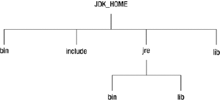
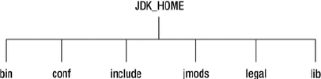

# Java 新特性(9-11)

## [Java 9 的新特性](https://developer.ibm.com/zh/articles/the-new-features-of-Java-9/)

### JDK 9 的发布

- 经过4次跳票，历经曲折的Java 9 终于终于在2017年9月21日发布。
- 从Java 9 这个版本开始，Java 的计划发布周期是6 个月，下一个Java 的主版本将于2018 年3 月发布，命名为Java 18.3，紧接着再过六个月将发布Java 18.9。
- 这意味着Java的更新从传统的以特性驱动的发布周期，转变为以时间驱动的（6 个月为周期）发布模式，并逐步的将Oracle JDK 原商业特性进行开源。
- 针对企业客户的需求，Oracle 将以三年为周期发布长期支持版本（L T S）。
- Java 9 提供了超过150项新功能特性，包括备受期待的模块化系统、可交互的 REPL 工具：jshell，JDK 编译工具，Java 公共 API 和私有代码，以及安全增强、扩展提升、性能管理改善等。可以说Java 9是一个庞大的系统工程，完全做了一个整体改变。

### [Java 9 的新特性](https://docs.oracle.com/javase/9/whatsnew/toc.htm#JSNEW-GUID-5B808B2F-E891-43CD-BF6E-78787E547071)

- **目录结构改变**

  - jdk9以前

    

    - bin 目录：包含命令行开发和调试工具，如javac，jar和javadoc。
    - include目录：包含在编译本地代码时使用的C/C++头文件
    - lib 目录：包含JDK工具的几个JAR和其他类型的文件。 它有一个tools.jar文件，其中包含javac编译器的Java类
    - jre 目录
      - bin 目录：包含基本命令，如java命令。 在Windows平台上，它包含系统的运行时动态链接库（DLL）。
      - lib 目录：包含用户可编辑的配置文件，如.properties和.policy文件。包含几个JAR。 rt.jar文件包含运行时的Java类和资源文件。

  - jdk9以后

    

    - 没有名为jre的子目录
    - bin 目录：包含所有命令。 在Windows平台上，它继续包含系统的运行时动态链接库。
    - conf 目录：包含用户可编辑的配置文件，例如以前位于jre\lib目录中的.properties和.policy文件
    - include 目录：包含要在以前编译本地代码时使用的C/C++头文件。 它只存在于JDK中
    - jmods 目录：包含JMOD格式的平台模块。 创建自定义运行时映像时需要它。 它只存在于JDK中
    - legal 目录：包含法律声明
    - lib 目录：包含非Windows平台上的动态链接本地库。 其子目录和文件不应由开发人员直接编辑或使用

- **模块化系统(Jigsaw->Modularity)**

  - 谈到 Java 9 大家往往第一个想到的就是 Jigsaw 项目。众所周知，Java 已经发展超过 20 年（95 年最初发布），Java 和相关生态在不断丰富的同时也越来越暴露出一些问题：

    - Java 运行环境的膨胀和臃肿。每次JVM启动的时候，至少会有30～60MB的内存加载，主要原因是JVM需要加载rt.jar，不管其中的类是否被classloader加载，第一步整个jar都会被JVM加载到内存当中去（而模块化可以根据模块的需要加载程序运行需要的class）
    - 当代码库越来越大，创建复杂，盘根错节的“意大利面条式代码”的几率呈指数级的增长。不同版本的类库交叉依赖导致让人头疼的问题，这些都阻碍了 Java 开发和运行效率的提升。
    - 很难真正地对代码进行封装, 而系统并没有对不同部分（也就是 JAR 文件）之间的依赖关系有个明确的概念。每一个公共类都可以被类路径之下任何其它的公共类所访问到，这样就会导致无意中使用了并不想被公开访问的API。

  - 本质上讲也就是说，用模块来管理各个package，通过声明某个package暴露，，模块(module)的概念，其实就是package外再裹一层，不声明默认就是隐藏。因此，模块化使得代码组织上更安全，因为它可以指定哪些部分可以暴露，哪些部分隐藏。

  - 实现目标

    - 模块化的主要目的在于减少内存的开销
    - 只须必要模块，而非全部jdk模块，可简化各种类库和大型应用的开发和维护
    - 改进 Java SE 平台，使其可以适应不同大小的计算设备
    - 改进其安全性，可维护性，提高性能

  - 模块将由通常的类和新的模块声明文件（module-info.java）组成。该文件是位于java代码结构的顶层，该模块描述符明确地定义了我们的模块需要什么依赖关系，以及哪些模块被外部使用。在exports子句中未提及的所有包默认情况下将封装在模块中，不能在外部使用。

  - 当一个Model想使用另一个Model中的定义的类或者接口

    - 使用

      - 在src下创建`module-info.java`文件

        ```java
        module currentModel {
            requires usedModel;
        }
        ```

      - requires：指明对其它模块的依赖。

    - 被使用 

      - 在src下创建`module-info.java`文件

        ```java
        module usedModel {
            exports com.JigsawClass;
        }
        ```

      - exports：控制着哪些包可以被其它模块访问到。所有不被导出的包默认都被封装在模块里面。

- **jShell命令**

  - 像Python 和 Scala 之类的语言早就有交互式编程环境 REPL (read - evaluate - print -loop)了，以交互式的方式对语句和表达式进行求值。开发者只需要输入一些代码，就可以在编译前获得对程序的反馈。而之前的Java版本要想执行代码，必须创建文件、声明类、提供测试方法方可实现。

  - 设计理念：即写即得、快速运行

  - Java 9 中终于拥有了 REPL工具：jShell。让Java可以像脚本语言一样运行，从控制台启动jShell，利用jShell在没有创建类的情况下直接声明变量，计算表达式，执行语句。即开发时可以在命令行里直接运行Java的代码，而无需创建Java文件，无需跟人解释”public static void main(String[] args)”这句废话。

  - jShell也可以从文件中加载语句或者将语句保存到文件中。

  - jShell也可以是tab键进行自动补全和自动添加分号。

  - jShell使用

    1. 调出jShell

       ```shell
       jshell
       
       结果：
       |  欢迎使用 JShell -- 版本 11.0.9
       |  要大致了解该版本, 请键入: /help intro
       ```

    2. 帮助

       ```shell
       /help [commond]
       
       结果：
       |  键入 Java 语言表达式, 语句或声明。
       |  或者键入以下命令之一:
       |  /list [<名称或 id>|-all|-start]
       |       列出您键入的源
       |  /edit <名称或 id>
       |       编辑源条目
       |  /drop <名称或 id>
       |       删除源条目
       |  /save [-all|-history|-start] <文件>
       |       将片段源保存到文件
       |  /open <file>
       |       打开文件作为源输入
       |  /vars [<名称或 id>|-all|-start]
       |       列出已声明变量及其值
       |  /methods [<名称或 id>|-all|-start]
       |       列出已声明方法及其签名
       |  /types [<名称或 id>|-all|-start]
       |       列出类型声明
       |  /imports
       |       列出导入的项
       |  /exit [<integer-expression-snippet>]
       |       退出 jshell 工具
       |  /env [-class-path <路径>] [-module-path <路径>] [-add-modules <模块>] ...
       |       查看或更改评估上下文
       |  /reset [-class-path <路径>] [-module-path <路径>] [-add-modules <模块>]...
       |       重置 jshell 工具
       |  /reload [-restore] [-quiet] [-class-path <路径>] [-module-path <路径>]...
       |       重置和重放相关历史记录 -- 当前历史记录或上一个历史记录 (-restore)
       |  /history [-all]
       |       您键入的内容的历史记录
       |  /help [<command>|<subject>]
       |       获取有关使用 jshell 工具的信息
       |  /set editor|start|feedback|mode|prompt|truncation|format ...
       |       设置配置信息
       |  /? [<command>|<subject>]
       |       获取有关使用 jshell 工具的信息
       |  /!
       |       重新运行上一个片段 -- 请参阅 /help rerun
       |  /<id>
       |       按 ID 或 ID 范围重新运行片段 -- 参见 /help rerun
       |  /-<n>
       |       重新运行以前的第 n 个片段 -- 请参阅 /help rerun
       |
       |  有关详细信息, 请键入 '/help', 后跟
       |  命令或主题的名称。
       |  例如 '/help /list' 或 '/help intro'。主题:
       |
       |  intro
       |       jshell 工具的简介
       |  keys
       |       类似 readline 的输入编辑的说明
       |  id
       |       片段 ID 以及如何使用它们的说明
       |  shortcuts
       |       片段和命令输入提示, 信息访问以及
       |       自动代码生成的按键说明
       |  context
       |       /env /reload 和 /reset 的评估上下文选项的说明
       |  rerun
       |       重新评估以前输入片段的方法的说明
       ```

    3. 基本使用

       ```java
       jshell> System.out.println("Helllo World!");
       Helllo World!
       ```

    4. 导包

       ```shell
       import java.util.*;
       
       查看已经导入的包
       /imports
       |    import java.io.*
       |    import java.math.*
       |    import java.net.*
       |    import java.nio.file.*
       |    import java.util.concurrent.*
       |    import java.util.function.*
       |    import java.util.prefs.*
       |    import java.util.regex.*
       |    import java.util.stream.*
       |    import java.util.*
       ```

    5. Tab 自动补全

    6. 列出当前session 里所有有效的代码片段

       ```java
       /list
       
          1 : System.out.println("Helllo World!");
          2 : import java.util.*;
       ```

    7. 查看当前session 下所有创建过的变量:`/vars`;

    8. 查看当前session 下所有创建过的方法:`/methods`;

    9. 使用外部代码编辑器来编写Java 代码:`/edit`;

    10. 命令调用：`/open xxx.java`

    11. 没有受检异常（编译时异常）

    12. 退出jShell:`/exit`

- **多版本兼容jar包**

- **接口的私有方法**

  - 在Java 9中，接口更加的灵活和强大，连方法的访问权限修饰符都可以声明为private的了，此时方法将不会成为你对外暴露的API的一部分

  - `MyInterface.java`

    ```java
    public interface MyInterface {
        // 默认前面都是 public
        void normalInterfaceMethod();
    
        default void methodDefault1() {
            init();
        }
    
        private void init() {
            System.out.println("默认方法中的通用操作");
        }
    }
    ```

  - `MyInterfaceDemo.java`

    ```java
    class MyInterfaceImpl implements MyInterface{
    
        @Override
        public void normalInterfaceMethod() {
            System.out.println("实现接口的方法");
        }
    }
    
    public class MyInterfaceDemo {
        public static void main(String[] args) {
            MyInterfaceImpl impl = new MyInterfaceImpl();
            impl.methodDefault();
        	// impl.init();//不能调用
        }
    }
    ```

- **钻石操作符的使用升级**

  - java8

    ```java
    Comparator<Object> com = new Comparator<Object>(){
        @Override
    	public int compare(Object o1, Object o2) {
            return 0;
        }
    };
    ```

  - java9

    ```java
    Comparator<Object> com = new Comparator<>(){
        @Override
    	public int compare(Object o1, Object o2) {
            return 0;
        }
    };
    ```

  - java8 会编译报错信息：`Cannot use “<>” with anonymous inner classes.`

- **语法改进：try语句**

  - java7

    ```java
    @Test
    public void java7TryTest() {
        InputStreamReader reader = null;
        try {
            reader = new InputStreamReader(System.in);
            char[] buf = new char[1024];
            int len;
            while ((len = reader.read(buf))!=-1){
                String str = new String(buf, 0, len);
                System.out.println(str);
            }
        } catch (IOException e) {
            e.printStackTrace();
        } finally {
            if(reader != null){
                try {
                    reader.close();
                } catch (IOException e) {
                    e.printStackTrace();
                }
            }
        }
    }
    ```

  - java8

    ```java
    @Test
    public void java8TryTest(){
        try (InputStreamReader reader = new InputStreamReader(System.in)){
            char[] buf = new char[1024];
            int len;
            while ((len = reader.read(buf))!=-1){
                String str = new String(buf, 0, len);
                System.out.println(str);
            }
        } catch (IOException e) {
            e.printStackTrace();
        }
    }
    ```

  - java9

    ```java
    @Test
    public void java9TryTest() {
        InputStreamReader reader = new InputStreamReader(System.in);
        try (reader) {
            char[] buf = new char[1024];
            int len;
            while ((len = reader.read(buf)) != -1) {
                String str = new String(buf, 0, len);
                System.out.println(str);
            }
        } catch (IOException e) {
            e.printStackTrace();
        }
    }
    ```

  - 多个就在try() 中用`；`分割，就会自动关闭流

  - 用资源语句编写try将更容易，我们可以在try子句中使用已经初始化过的资源，此时的资源是final的：

- **String存储结构变更**

  - String 再也不用 char[] 来存储啦，改成了 byte[] 加上编码标记，节约了一些空间。
  - StringBuffer 和StringBuilder 也相应的更改

- **快速创建只读集合特性：of()**

  - 什么叫只读集合：当调用add方法的时候会抛出异常

  - 创建方法

    - `Arrays.toList()`

      ```java
      @Test
      public void ArraysAsListTest(){
          List<Integer> list = Arrays.asList(1, 2, 3, 4, 5);
          list.add(6);
          System.out.println(list.toString());
      }
      
      // java.lang.UnsupportedOperationException 报错
      ```

    - `Collections.unmodifiableList`

      ```java
      @Test
      public void test() {
          List<String> namesList = new ArrayList<>();
          namesList.add("Joe");
          namesList.add("Bob");
          namesList.add("Bill");
          namesList = Collections.unmodifiableList(namesList);
          System.out.println(namesList);
      }
      
      @Test
      public void test2() {
          List<String> list = Collections.unmodifiableList(Arrays.asList("a", "b", "c"));
          Set<String> set = Collections.unmodifiableSet(new HashSet<>(Arrays.asList("a", "b", "c")));
          // 如下操作不适用于jdk 8 及之前版本,适用于jdk 9
          Map<String, Integer> map = Collections.unmodifiableMap(new HashMap<>() {
              {
                  put("a", 1);
                  put("b", 2);
                  put("c", 3);
              }
          });
          map.forEach((k, v) -> System.out.println(k + ":" + v));
      
      }
      ```

    - `Collection.of()`

      ```java
      @Test
      public void test3() {
          List<String> list = List.of("a", "b", "c");
          Set<String> set = Set.of("a", "b", "c");
          Map<String, Integer> map1 = Map.of("Tom", 12, "Jerry", 21, "Lilei", 33, "HanMeimei", 18);
          Map<String, Integer> map2 = Map.ofEntries(Map.entry("Tom", 89),
                                                    Map.entry("Jim", 78), Map.entry("Tim", 98));
      
      }
      ```

- **InputStream 加强**

  - InputStream 终于有了一个非常有用的方法：transferTo，可以用来将数据直接传输到OutputStream，这是在处理原始数据流时非常常见的一种用法，如下示例。

  - `transferTo`

    ```java
    @Test
    public void transferToTest() {
        ClassLoader cl = this.getClass().getClassLoader();
        try (InputStream is = cl.getResourceAsStream("hello.txt");
             OutputStream os = new FileOutputStream("src\\hello1.txt")) {
            is.transferTo(os); // 把输入流中的所有数据直接自动地复制到输出流中
        } catch (IOException e) {
            e.printStackTrace();
        }
    }
    ```

  - Java 的Steam API 是java标准库最好的改进之一，让开发者能够快速运算，从而能够有效的利用数据并行计算。Java 8 提供的Steam 能够利用多核架构实现声明式的数据处理。

  - 在Java 9 中，Stream API 变得更好，Stream 接口中添加了4 个新的方法：takeWhile, dropWhile, ofNullable，还有个iterate 方法的新重载方法，可以让你提供一个Predicate (判断条件)来指定什么时候结束迭代。

  - 除了对Stream 本身的扩展，Optional 和Stream 之间的结合也得到了改进。现在可以通过Optional 的新方法stream() 将一个Optional 对象转换为一个(可能是空的) Stream 对象。

- **增强的Stream Api**

  - takeWhile(): 返回从开头开始的按照指定规则尽量多的元素

    - 用于从 Stream 中获取一部分数据，接收一个 Predicate 来进行选择。在有序的Stream 中，takeWhile 返回从开头开始的尽量多的元素。

    ```java
    @Test
    public void takeWhileTest() {
        List<Integer> integers = Arrays.asList(12, 27, 50, 78, 11, 9, 88);
        // takeWhile 找满足条件的元素 当遇到一个不满足就不继续找。
        integers.stream().takeWhile(integer -> integer < 50).forEach(System.out::println);
    }
    ```

    - dropWhile():dropWhile 的行为与takeWhile 相反，返回剩余的元素。

      ```java
      @Test
      public void takeWhileTest() {
          List<Integer> integers = Arrays.asList(12, 27, 50, 78, 11, 9, 88);
          integers.stream().takeWhile(integer -> integer < 50).forEach(System.out::println);
          //12,27
          System.out.println();
          integers.stream().dropWhile(integer -> integer < 50).forEach(System.out::println);
          // 50,78,11,9,88
      }
      ```

    - ofNullable()：

      - Java 8 中Stream 不能完全为null，否则会报空指针异常。
      - 而Java 9 中的ofNullable 方法允许我们创建一个单元素 Stream，可以包含一个非空元素，也可以创建一个空Stream。

      ```java
       @Test
          public void test() {
              // of()参数中的多个元素，可以包含null值
              Stream<Integer> stream1 = Stream.of(1, 2, 3, null);
              stream1.forEach(System.out::println);
              // of()参数不能存储单个null值。否则，报异常
      		// Stream<Object> stream2 = Stream.of(null);
      		// stream2.forEach(System.out::println);
              Integer i = 10;
              i = null;
              // ofNullable()：形参变量是可以为null值的单个元素
              Stream<Integer> stream3 = Stream.ofNullable(i);
              long count = stream3.count();
              System.out.println(count);
          }
      ```

    - iterate()重载的使用：

    - 这个 iterate 方法的新重载方法，可以让你提供一个 Predicate (判断条件)来指定什么时候结束迭代。

      ```java
      @Test
      public void iterateTest(){
          Stream.iterate(0,x -> x + 1).limit(10).forEach(System.out::println);
          //java9中新增的重载的方法
          Stream.iterate(0,x -> x < 100,x -> x + 1).forEach(System.out::println);
      }
      ```

- **Optional类中stream()的使用**

  ```java
      @Test
      public void OptionalTest() {
          List<String> list = new ArrayList<>();
          list.add("Tom");
          list.add("Jerry");
          list.add("Tim");
          Optional<List<String>> optional = Optional.ofNullable(list);
          Stream<List<String>> stream = optional.stream();
          stream.flatMap(x -> x.stream()).forEach(System.out::println);
      }
  ```

- Javascript引擎升级：Nashorn

  - Nashorn 项目在 JDK 9 中得到改进，它为 Java 提供轻量级的 Javascript 运行时。 Nashorn 项目跟随 Netscape 的 Rhino 项目，目的是为了在 Java 中实现一个高性能但轻量级的 Javascript 运行时。Nashorn 项目使得 Java 应用能够嵌入Javascript。它在JDK 8 中为Java 提供一个Javascript 引擎。
  - JDK 9 包含一个用来解析 Nashorn 的 ECMAScript 语法树的 API。这个 API 使得IDE 和服务端框架不需要依赖 Nashorn 项目的内部实现类，就能够分析ECMAScript 代码。

## [Java 10 的新特性](https://developer.ibm.com/zh/articles/the-new-features-of-Java-10/)

### JDK 10 发布

- 2018年3月21日，Oracle官方宣布Java10正式发布。
- 需要注意的是 Java 9 和 Java 10 都不是 LTS (Long-Term-Support) 版本。和过去的 Java 大版本升级不同，这两个只有半年左右的开发和维护期。而未来的 Java 11，也就是 18.9 LTS，才是 Java 8 之后第一个 LTS 版本。
- JDK10一共定义了109个新特性，其中包含12个JEP（对于程序员来讲，真正的新特性其实就一个），还有一些新API和JVM规范以及JAVA语言规范上的改动。
- JDK10的12个JEP（JDK Enhancement Proposal特性加强提议）参阅官方文档：[http://openjdk.java.net/projects/jdk/10/](http://openjdk.java.net/projects/jdk/10/)

### Java 10 新特性

- 局部变量的类型推断 var 关键字

  - 这个新功能将为 Java 增加一些语法糖 - 简化它并改善开发者体验。新的语法将减少与编写 Java 相关的冗长度，同时保持对静态类型安全性的承诺。 

  - 这可能是 Java10 给开发者带来的最大的一个新特性。下面主要看例子： 

    ```java
    @Test
    public void varTest(){
        var list = new ArrayList<String>();
        list.add("hello，world！");
        System.out.println(list);
    }
    ```

  - 适用于以下情况：

    1. 局部变量的初始化
    2. 增强for循环中的索引
    3. 传统for循环中

    ```java
    @Test
    public void test() {
        //1.局部变量的初始化
        var list = new ArrayList<>();
        //2.增强for循环中的索引
        for (var v : list) {
            System.out.println(v);
        }
        //3.传统for循环中
        for (var i = 0; i < 100; i++) {
            System.out.println(i);
        }
    }
    ```

  - 不适用以下情况

    1. 初始值为null
    2. 方法引用
    3. Lambda表达式
    4. 为数组静态初始化
    5. 没有初始化的局部变量声明
    6. 方法的返回类型
    7. 方法的参数类型
    8. 构造器的参数类型
    9. 属性
    10. catch块

  - 在处理 var时，编译器先是查看表达式右边部分，并根据右边变量值的类型进行推断，作为左边变量的类型，然后将该类型写入字节码当中。

- GC 改进和内存管理 并行全垃圾回收器 G1

  - JDK 10 中有 2 个 JEP 专门用于改进当前的垃圾收集元素。 
  - Java 10 的第二个 JEP 是针对 G1 的并行完全 GC（JEP 307），其重点在于通过完全 GC 并行来改善 G1 最坏情况的等待时间。G1 是 Java 9 中的默认 GC，并且此 JEP 的目标是使 G1 平行。 

- 垃圾回收器接口

  - 这不是让开发者用来控制垃圾回收的接口；而是一个在 JVM 源代码中的允许另外的垃圾回收器快速方便的集成的接口。 

- 线程-局部变量管控

  - 这是在 JVM 内部相当低级别的更改，现在将允许在不运行全局虚拟机安全点的情况下实现线程回调。这将使得停止单个线程变得可能和便宜，而不是只能启用或停止所有线程。 

- 合并 JDK 多个代码仓库到一个单独的储存库中

  - 在 JDK9 中，有 8 个仓库： root、corba、hotspot、jaxp、jaxws、jdk、langtools 和 nashorn 。在 JDK10 中这些将被合并为一个，使得跨相互依赖的变更集的存储库运行 atomic commit （原子提交）成为可能。 

- 新增 API：ByteArrayOutputStream

  - String toString(Charset): 重载 toString()，通过使用指定的字符集解码字节，将缓冲区的内容转换为字符串。 

- 新增 API：List、Map、Set

  - 这 3 个接口都增加了一个新的静态方法，copyOf(Collection）。这些函数按照其迭代顺序返回一个不可修改的列表、映射或包含给定集合的元素的集合。 

  - ```java
    //示例1：
    var list1 = List.of("Java", "Python", "C"); var copy1 = List.copyOf(list1);
    System.out.println(list1 == copy1); // true
    //示例2：
    var list2 = new ArrayList<String>();
    var copy2 = List.copyOf(list2);
    System.out.println(list2 == copy2); // false
    ```

  - 从 源 码 分 析 ， 可以 看出 copyOf 方 法 会 先 判 断 来 源 集 合 是 不 是AbstractImmutableList 类型的，如果是，就直接返回，如果不是，则调用 of 创建一个新的集合。

  - 示例2因为用的 new 创建的集合，不属于不可变 AbstractImmutableList 类的子类，所以copyOf 方法又创建了一个新的实例，所以为false。

  - 注意：使用of和copyOf创建的集合为不可变集合，不能进行添加、删除、替换、排序等操作，不然会报java.lang.UnsupportedOperationException 异常。

  - 上面演示了List 的of 和copyOf 方法，Set 和Map 接口都有。

- 新增 API：java.util.Properties

  - 增加了一个新的构造函数，它接受一个 int 参数。这将创建一个没有默认值的空属性列表，并且指定初始大小以容纳指定的元素数量，而无需动态调整大小。还有一个新的重载的 replace 方法，接受三个 Object 参数并返回一个布尔值。只有在当前映射到指定值时，才会替换指定键的条目。 

- 新增 API： Collectors 收集器

  - toUnmodifiableList(): 
  - toUnmodifiableSet(): 
  - toUnmodifiableMap(Function, Function): 
  - toUnmodifiableMap(Function, Function, BinaryOperator): 
  - 这四个新方法都返回 Collectors ，将输入元素聚集到适当的不可修改的集合中。 

## [Java 11 的新特性](https://developer.ibm.com/zh/articles/the-new-features-of-Java-11/)

### JDK 11的发布

北京时间 2018年9 月 26 日， Oracle 官方宣布 Java 11 正式发布。这是 Java 大版本周期变化后的第一个长期支持版本，非常值得关注。从官网即可下载,最新发布的 Java11 将带来 ZGC、 Http Client 等重要特性，一共包含 17 个 JEP（JDK Enhancement Proposals，JDK 增强提案）。其实，总共更新不止17个，只是我们更关注如下的17个JEP更新。

### Java 11的新特性

- **基于嵌套的访问控制**

  - 与 Java 语言中现有的嵌套类型概念一致, 嵌套访问控制是一种控制上下文访问的策略，允许逻辑上属于同一代码实体，但被编译之后分为多个分散的 class 文件的类，无需编译器额外的创建可扩展的桥接访问方法，即可访问彼此的私有成员，并且这种改进是在 Java 字节码级别的。
  - 在 Java 11 之前的版本中，编译之后的 class 文件中通过 InnerClasses 和 Enclosing Method 两种属性来帮助编译器确认源码的嵌套关系，每一个嵌套的类会编译到自己所在的 class 文件中，不同类的文件通过上面介绍的两种属性的来相互连接。这两种属性对于编译器确定相互之间的嵌套关系已经足够了，但是并不适用于访问控制。这里大家可以写一段包含内部类的代码，并将其编译成 class 文件，然后通过 `javap` 命令行来分析，碍于篇幅，这里就不展开讨论了。
  - Java 11 中引入了两个新的属性：一个叫做 NestMembers 的属性，用于标识其它已知的静态 nest 成员；另外一个是每个 nest 成员都包含的 NestHost 属性，用于标识出它的 nest 宿主类。

- **标准 HTTP Client 升级**

  - Java 11 对 Java 9 中引入并在 Java 10 中进行了更新的 Http Client API 进行了标准化，在前两个版本中进行孵化的同时，Http Client 几乎被完全重写，并且现在完全支持异步非阻塞。

  - 新版 Java 中，Http Client 的包名由 jdk.incubator.http 改为 java.net.http，该 API 通过 CompleteableFutures 提供非阻塞请求和响应语义，可以联合使用以触发相应的动作，并且 *RX Flo w* 的概念也在 Java 11 中得到了实现。现在，在用户层请求发布者和响应发布者与底层套接字之间追踪数据流更容易了。这降低了复杂性，并最大程度上提高了 HTTP/1 和 HTTP/2 之间的重用的可能性。

  - Java 11 中的新 Http Client API，提供了对 HTTP/2 等业界前沿标准的支持，同时也向下兼容 HTTP/1.1，精简而又友好的 API 接口，与主流开源 API（如：Apache HttpClient、Jetty、OkHttp 等）类似甚至拥有更高的性能。与此同时它是 Java 在 Reactive-Stream 方面的第一个生产实践，其中广泛使用了 Java Flow API，终于让 Java 标准 HTTP 类库在扩展能力等方面，满足了现代互联网的需求，是一个难得的现代 Http/2 Client API 标准的实现，Java 工程师终于可以摆脱老旧的 HttpURLConnection 了。下面模拟 Http GET 请求并打印返回内容：

  - GET 请求示例

    ```java
        HttpClient client = HttpClient.newHttpClient();
        HttpRequest request = HttpRequest.newBuilder()
              .uri(URI.create("http://openjdk.java.net/"))
              .build();
        client.sendAsync(request, BodyHandlers.ofString())
              .thenApply(HttpResponse::body)
              .thenAccept(System.out::println)
              .join();
    ```

- **Epsilon：低开销垃圾回收器**

  - Epsilon 垃圾回收器的目标是开发一个控制内存分配，但是不执行任何实际的垃圾回收工作。它提供一个完全消极的 GC 实现，分配有限的内存资源，最大限度的降低内存占用和内存吞吐延迟时间。
  - Java 版本中已经包含了一系列的高度可配置化的 GC 实现。各种不同的垃圾回收器可以面对各种情况。但是有些时候使用一种独特的实现，而不是将其堆积在其他 GC 实现上将会是事情变得更加简单。
  - 下面是 no-op GC 的几个使用场景：
    - 性能测试：什么都不执行的 GC 非常适合用于 GC 的差异性分析。no-op （无操作）GC 可以用于过滤掉 GC 诱发的性能损耗，比如 GC 线程的调度，GC 屏障的消耗，GC 周期的不合适触发，内存位置变化等。此外有些延迟者不是由于 GC 引起的，比如 scheduling hiccups, compiler transition hiccups，所以去除 GC 引发的延迟有助于统计这些延迟。
    - 内存压力测试：在测试 Java 代码时，确定分配内存的阈值有助于设置内存压力常量值。这时 no-op 就很有用，它可以简单地接受一个分配的内存分配上限，当内存超限时就失败。例如：测试需要分配小于 1G 的内存，就使用-Xmx1g 参数来配置 no-op GC，然后当内存耗尽的时候就直接 crash。
    - VM 接口测试：以 VM 开发视角，有一个简单的 GC 实现，有助于理解 VM-GC 的最小接口实现。它也用于证明 VM-GC 接口的健全性。
    - 极度短暂 job 任务：一个短声明周期的 job 任务可能会依赖快速退出来释放资源，这个时候接收 GC 周期来清理 heap 其实是在浪费时间，因为 heap 会在退出时清理。并且 GC 周期可能会占用一会时间，因为它依赖 heap 上的数据量。
    - 延迟改进：对那些极端延迟敏感的应用，开发者十分清楚内存占用，或者是几乎没有垃圾回收的应用，此时耗时较长的 GC 周期将会是一件坏事。
    - 吞吐改进：即便对那些无需内存分配的工作，选择一个 GC 意味着选择了一系列的 GC 屏障，所有的 OpenJDK GC 都是分代的，所以他们至少会有一个写屏障。避免这些屏障可以带来一点点的吞吐量提升。
  - Epsilon 垃圾回收器和其他 OpenJDK 的垃圾回收器一样，可以通过参数 `-XX:+UseEpsilonGC` 开启。
  - Epsilon 线性分配单个连续内存块。可复用现存 VM 代码中的 TLAB 部分的分配功能。非 TLAB 分配也是同一段代码，因为在此方案中，分配 TLAB 和分配大对象只有一点点的不同。Epsilon 用到的 barrier 是空的(或者说是无操作的)。因为该 GC
  - 执行任何的 GC 周期，不用关系对象图，对象标记，对象复制等。引进一种新的 barrier-set 实现可能是该 GC 对 JVM 最大的变化。

- **简化启动单个源代码文件的方法**

  - Java 11 版本中最令人兴奋的功能之一是增强 Java 启动器，使之能够运行单一文件的 Java 源代码。此功能允许使用 Java 解释器直接执行 Java 源代码。源代码在内存中编译，然后由解释器执行。唯一的约束在于所有相关的类必须定义在同一个 Java 文件中。

  - 此功能对于开始学习 Java 并希望尝试简单程序的人特别有用，并且能与 jshell 一起使用，将成为任何初学者学习语言的一个很好的工具集。不仅初学者会受益，专业人员还可以利用这些工具来探索新的语言更改或尝试未知的 API。

  - 如今单文件程序在编写小实用程序时很常见，特别是脚本语言领域。从中开发者可以省去用 Java 编译程序等不必要工作，以及减少新手的入门障碍。在基于 Java 10 的程序实现中可以通过三种方式启动：

    - 作为 `* .class` 文件
    - 作为 `* .jar` 文件中的主类
    - 作为模块中的主类

  - 而在最新的 Java 11 中新增了一个启动方式，即可以在源代码中声明类，例如：如果名为 `HelloWorld.java` 的文件包含一个名为 `hello.World` 的类，那么该命令：

  - ```shelll
    $ java HelloWorld.java
    ```

  - 也等同于：

    ```java
    $ javac HelloWorld.java
    $ java -cp . hello.World
    ```

- **用于 Lambda 参数的局部变量语法**

  - 在 Lambda 表达式中使用局部变量类型推断是 Java 11 引入的唯一与语言相关的特性，这一节，我们将探索这一新特性。
  
  - 从 Java 10 开始，便引入了局部变量类型推断这一关键特性。类型推断允许使用关键字 var 作为局部变量的类型而不是实际类型，编译器根据分配给变量的值推断出类型。这一改进简化了代码编写、节省了开发者的工作时间，因为不再需要显式声明局部变量的类型，而是可以使用关键字 var，且不会使源代码过于复杂。
  
    - 可以使用关键字 var 声明局部变量，如下所示：
  
      ```java
      var s = "Hello Java 11";
      System.out.println(s);
      ```
  
    - 但是在 Java 10 中，还有下面几个限制：
  
      - 只能用于局部变量上
      - 声明时必须初始化
      - 不能用作方法参数
      - 不能在 Lambda 表达式中使用
  
    - Java 11 与 Java 10 的不同之处在于允许开发者在 Lambda 表达式中使用 var 进行参数声明。乍一看，这一举措似乎有点多余，因为在写代码过程中可以省略 Lambda 参数的类型，并通过类型推断确定它们。但是，添加上类型定义同时使用 `@Nonnull` 和 `@Nullable` 等类型注释还是很有用的，既能保持与局部变量的一致写法，也不丢失代码简洁。
  
      - Lambda 表达式使用隐式类型定义，它形参的所有类型全部靠推断出来的。隐式类型 Lambda 表达式如下：
  
        ```java
        (x, y) -> x.process(y)
        ```
  
      - Java 10 为局部变量提供隐式定义写法如下：
  
        ```java
        var x = new Foo();
        for (var x : xs) { ... }
        try (var x = ...) { ... } catch ..
        ```
  
      - 为了 Lambda 类型表达式中正式参数定义的语法与局部变量定义语法的不一致，且为了保持与其他局部变量用法上的一致性，希望能够使用关键字 `var` 隐式定义 Lambda 表达式的形参：
  
        ```java
        (var x, var y) -> x.process(y)
        ```
  
      - 于是在 Java 11 中将局部变量和 Lambda 表达式的用法进行了统一，并且可以将注释应用于局部变量和 Lambda 表达式：
  
        ```java
        @Nonnull var x = new Foo();
        (@Nonnull var x, @Nullable var y) -> x.process(y)
        ```
  
- **低开销的 Heap Profiling**

- **支持 TLS 1.3 协议**

- **ZGC：可伸缩低延迟垃圾收集器**

  - ZGC 即 Z Garbage Collector（垃圾收集器或垃圾回收器），这应该是 Java 11 中最为瞩目的特性，没有之一。ZGC 是一个可伸缩的、低延迟的垃圾收集器，主要为了满足如下目标进行设计：
    - GC 停顿时间不超过 10ms
  - 即能处理几百 MB 的小堆，也能处理几个 TB 的大堆
    - 应用吞吐能力不会下降超过 15%（与 G1 回收算法相比）
    - 方便在此基础上引入新的 GC 特性和利用 colord
    - 针以及 Load barriers 优化奠定基础
    - 当前只支持 Linux/x64 位平台
  - 停顿时间在 10ms 以下，10ms 其实是一个很保守的数据，即便是 10ms 这个数据，也是 GC 调优几乎达不到的极值。根据 SPECjbb 2015 的基准测试，128G 的大堆下最大停顿时间才 1.68ms，远低于 10ms，和 G1 算法相比，改进非常明显。
  
- **飞行记录器**

- **动态类文件常量**

- **新增了一系列字符串处理方法**

| 描述                 | 举例                                             |
| -------------------- | ------------------------------------------------ |
| 判断字符串是否为空白 | `" ".isBlank(); // true`                         |
| 去除首尾空白         | `" Javastack ".strip(); // "Javastack"`          |
| 去除尾部空格         | `" Javastack ".stripTrailing(); // " Javastack"` |
| 去除首部空格         | `" Javastack ".stripLeading(); // "Javastack "`  |
| 复制字符串           | `"Java".repeat(3);// "JavaJavaJava"`             |
| 行数统计             | `"A\nB\nC".lines().count(); // 3`                |

```java
//java 11新特性一：String中新增的方法
@Test
public void test1(){
    //        isBlank():判断字符串是否为空白
    System.out.println("  \t  \t  \n  ".isBlank());
    //        strip():去除首尾空白
    System.out.println("-----" + "  \t abc \t  \n  ".strip() + "-------");
    System.out.println("-----" + "  \t abc \t  \n  ".trim() + "-------");
    //        stripTrailing():去除尾部空格
    System.out.println("-----" + "  \t abc \t  \n  ".stripTrailing() + "-------");
    //        stripLeading():去除首部空格
    System.out.println("-----" + "  \t abc \t  \n  ".stripLeading() + "-------");
    //        repeat(int count):复制字符串
    String str1 = "abc";
    String str2 = str1.repeat(5);
    System.out.println(str2);

    //        lines().count():行数统计
    String str3 = "abc\ndef\ng";
    System.out.println(str3.lines().count());


}
```

- **Optional 加强**

| 新增方法                                                     | 描述                                                         | 新增的版本 |
| ------------------------------------------------------------ | ------------------------------------------------------------ | ---------- |
| `boolean isEmpty()`                                          | 判断value是否为空                                            | JDK 11     |
| `ifPresentOrElse(Consumer<? <br/>super T> action, Runnable emptyAction)` | value非空，执行参数1功能；如果value为空，执行参数2功能       | JDK 9      |
| `Optional<T> or(Supplier<? <br/>extends Optional<? extends T>> supplier)` | value非空，返回对应的Optional；value为空，返回形参封装的Optional | JDK 9      |
| `Stream<T> stream()`                                         | value非空，返回仅包含此value的Stream；否则，返回一个空的Stream | JDK 9      |
| `T orElseThrow()`                                            | value非空，返回value；否则抛异常NoSuchElementException       | JDK 10     |

```java
//java11新特性二：Optional新增的方法
@Test
public void test2(){
    var op = Optional.empty();
    System.out.println(op.isPresent());//判断内部的value是否存在
    System.out.println(op.isEmpty());//判断内部的value是否为空

    op = Optional.of("abc");
    //orElseThrow():value非空，返回value；否则抛异常NoSuchElementException
    var obj = op.orElseThrow();
    System.out.println(obj);

    Optional<String> op1 = Optional.of("hello");
    //        op = Optional.empty();
    //or:value非空，返回对应的Optional；value为空，返回形参封装的Optional
    Optional<Object> op2 = op.or(() -> op1);
    System.out.println(op2);//
}
```

