# 面向对象-上

## 何为面向对象

### Java类及类的成员：

- 属性
- 方法
- 构造器
- 代码块
- 内部类

### 面向对象的三大特征

- 封装性
- 继承性
- 多态性
- (抽象性)

### 其它关键字：

`this、super、static、final、abstract、interface、package、import`

### 面向过程(POP) 与 面向对象(OOP)

- 面向过程：强调的是功能行为，以函数为最小单位，考虑怎么做。
- 面向对象：强调具备了功能的对象，以类/对象为最小单位，考虑谁来做。
- 面向对象更加强调运用人类在日常的思维逻辑中采用的思想方法与原则，如抽象、分类、继承、聚合、多态等。

## 类与对象

### 类与对象

- 类：对一类事物的描述，是抽象的、概念上的定义

- 对象：是实际存在的该类事物的每个个体，因而也称为实例(`instance`)

- 对象，是由类new出来的，派生出来的。

- > 面向对象程序设计的重点是类的设计
  > 设计类，就是设计类的成员。

### 常见的类的成员

- 属 性：对应类中的成员变量

- 行为：对应类中的成员方法

- 概念说明

  - 属性 = 成员变量 = 域、字段= field
   *  方法 = 成员方法 = 函数 = method
   *  创建类的对象 = 类的实例化 = 实例化类

- `类version_1.0`

  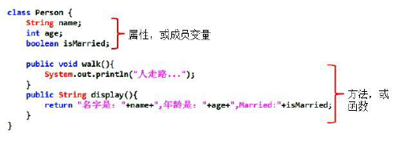

- `类version_2.0`

  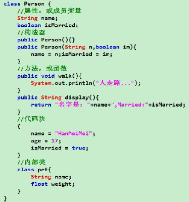

### 类的语法格式

```java
修饰符 class 类名{
    属性声明;
    方法声明;
}
类的正文要用{  }括起来
```

### 对象的创建和使用

- 创建对象语法：` 类名 对象名 = new 类名();`
- 使用`对象名.对象成员`的方式访问对象成员（包括属性和方法）
- 注意：如果创建了一个类的多个对象，对于类中定义的属性，每个对象都拥有各自的一套副本，且互不干扰。

### 类加载与实例化流程

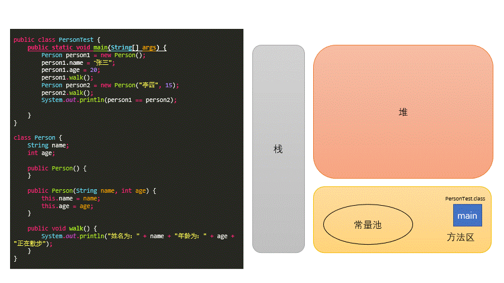

- 执行`main`函数首先在方法区加载`PersonTest.class`文件

- `Person person1 = new Person();`

  - 在栈内存中开辟`main`函数的空间,建立`main`函数中的局部变量`person1`
  - 加载类文件：因为`new`要用到`Person.class`,所以要先从硬盘中找到`Person.class`类文件，并加载到内存中。
  - 加载类文件时，除了非静态成员变量（对象的特有属性）不会被加载，其它的都会被加载。
  - 在堆空间中创建`person`对象`4c203e2a`并且默认初始值`name = null;age = 0`。

- `person1.name = "张三" `

  - 在常量池创建`String  "张三"`,并将`name`指向`"张三" `。

- `person1.age = 20`

  - 修改`age`的值为`20`。

- `person1.walk();`

  - 在`Person.class`文件加载时，静态方法和非静态方法都会加载到方法区中，只不过要调用到非静态方法时需要先实例化一个对象，对象才能调用非静态方法。如果让类中所有的非静态方法都随着对象的实例化而建立一次，那么会大量消耗内存资源，
    所以才会让所有对象共享这些非静态方法，然后用`this`关键字指向调用非静态方法的对象。

  - 方法`walk()`中省略了`this`

  - 不省略的写法为

    ```java
     public void walk() {
            System.out.println("姓名为：" + this.name + "年龄为：" + this.age + "正在散步");
        }
    ```

### 类的访问机制

- 在一个类中的访问机制：类中的方法可以直接访问类中的成员变量。
- 例外：`static方法访问非static，编译不通过。`
- 在不同类中的访问机制：先创建要访问类的对象，再用对象访问类中定义的成员。

### 匿名对象

- 我们也可以不定义对象的句柄，而直接调用这个对象的方法。这样的对象叫做匿名对象。

  ```java
  new Person().walk();
  ```

- 使用情况

  - 如果对一个对象只需要进行一次方法调用，那么就可以使用匿名对象。
  - 我们经常将匿名对象作为实参传递给一个方法调用。

- 使用

  ```java
  //匿名对象的使用
  mall.show(new Phone());
  其中，
  class PhoneMall{
  	public void show(Phone phone){
  		phone.sendEmail();
  		phone.playGame();
  	}
  	
  }
  ```

### 对象的声明周期

- 出生:
  - 每次使用new关键字的时候,就会在堆内存空间中开辟新空间,此时对象就开始存在了
- 死亡:
  - 当堆中的对象,没有任何变量的引用,此时对象就会成为垃圾,就会等待`GC`来回收,对象销毁后,会释放原有的空间

## 类与类之间的关系说明

### 依赖关系（Dependency） 

- 对象之间最弱的一种关联方式，是临时性的关联。代码中一般指由局部变量、函数参数、返回值建立的对于其他对象的调用关系。 

  ```java
  class A {
      public B method (C c , D d){
          E e = new E();
          B b = new B();
          return b;
      }
  }
  ```

  这个代码结构中，表示A 类依赖了B,C,D,E 类

  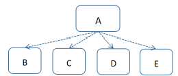

### 关联关系（Association） 

- 对象之间一种引用关系，比如客户类与订单类之间的关系。这种关系通常使用类的属性表达。  关联可以有方向，即导航。一般不作说明的时候，导航是双向的，不需要在线上标出箭头.大部分情况下导航是单向的，可以加一个箭头表示

  ```java
  class Employee{
      private int eid;//员工编号 
      private String name;//员工姓名 
      private Computer coumputer;//员工所使用的电脑
      ...
  }
  
  class Computer{ 
  } 
  ```

  

- 关联表示类之间的“持久”关系，这种关系一般表示一种重要的业务之间的关系，需要保存的，或者说需要“持久化”的，或者说需要保存到数据库中的。另外，依赖表示类之间的是一种“临时、短暂”关系，这种关系是不需要保存的。

### 聚合（Aggregation）

- 聚合（关联关系的一种）：表示 has-a 的关系。与关联关系一样，聚合关系也是通过实例变量来实现这样关系的。关联关系和聚合关系来语法上是没办法区分的，从语义上才能更好的区分两者的区别。 

- 如汽车类与引挚类，轮胎类之间的关系就是整体与个体的关系。 与关联关系一样，聚合关系也是通过实例变量来实现的。

  ```java
  class Car{ 
      private Engine engine;//引擎 
      private Tyre[] tyres;//轮胎 
  }
  ```

  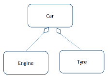

- 关联和聚集（聚合）的区别： 

  - 关联关系所涉及的两个对象是处在同一个层次上的。比如人和自行车就是一种关联关系，而不是聚合关系，因为人不是由自行车组成的。 
  - 聚合关系涉及的两个对象处于不平等的层次上，一个代表整体，一个代表部分。比如电脑和它的显示器、键盘、主板以及内存就是聚集关系，因为主板是电脑的组成部分。

### 组合（Composite） 

- 对象A 包含对象 B，对象 B 离开对象A 没有实际意义。是一种更强的关联关系。人包含手，手离开人的躯体就失去了它应有的作用。 

- 组合：表示 contains-a 的关系，是一种强烈的包含关系。组合类负责被组合类的生命周期。也使用属性表达组合关系，是关联关系的一种，是比聚合关系强的关系。

  ```java
  class Window{ 
      private Menu menu;//菜单 
      private Slider slider;//滑动条 
      private Panel panel;//工作区 
  }
  ```

  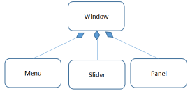

### 继承（Generalization，又称为泛化，is-a 的关系） 

- 类与类的继承关系，类与接口的实现关系。 

- 场景：父与子、动物与人、植物与树 

  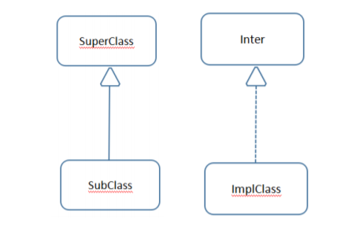

## 类的结构之一：属性

### 属性

+ 语法格式：

  `修饰符 数据类型 属性名 = 初始化值 ; `

  + 修饰符
    + 常用的权限修饰符有：private、缺省、protected、public
    + 其他修饰符：static、final 
  + 数据类型
    + 任何基本数据类型(如int、Boolean) 或 任何引用数据类型。
  + 属性名
    + 属于标识符，符合命名规则和规范即可。

### 变量的分类：成员变量与局部变量

- 在方法体外，类体内声明的变量称为成员变量。

- 在方法体内部声明的变量称为局部变量。

  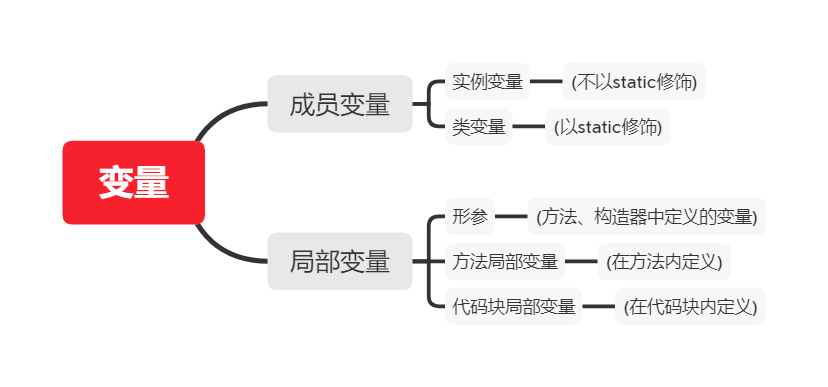

- 成员变量(属性)和局部变量的异同

  - 相同点

    - 定义变量的格式：`数据类型  变量名 = 变量值`
    - 先声明，后使用
    - 变量都其对应的作用域
  
- 不同点
  
  - 在类中声明的位置的不同
      - 属性：直接定义在类的一对{}内
      - 局部变量：声明在方法内、方法形参、代码块内、构造器形参、构造器内部的变量
    - 关于权限修饰符的不同
      - 可以在声明属性时，指明其权限，使用权限修饰符。常用的权限修饰符：private、public、缺省、protected
      - 局部变量：不可以使用权限修饰符。
    - 默认初始化值的情况：
      - 类的属性，根据其类型，都默认初始化值。
        - 整型（byte、short、int、long：0）
        - 浮点型（float、double：0.0）
        - 字符型（char：0  （或'\u0000'））
        - 布尔型（boolean：false）
        - 引用数据类型（类、数组、接口：null）
      - 局部变量：没默认初始化值。局部变量除形参外，均需显式初始化。
    
  - 成员变量（属性）和局部变量的区别对照表

|              | 成员变量                           | 局部变量                                 |
| :----------- | :--------------------------------- | :--------------------------------------- |
| 声明的位置   | 直接声明在类中                     | 方法形参或内部、代码块内、构造器内等     |
| 修饰符       | `private、public、static、final`等 | 不能用权限修饰符修饰，可以用final修饰    |
| 初始化值     | 有默认初始化值                     | 没有默认初始化值，必须显式赋值，方可使用 |
| 内存加载位置 | 堆空间 或 静态域内                 | 栈空间                                   |

## 类的结构之一：方法

### 方法(method  函数)

- 方法是类或对象行为特征的抽象，用来完成某个功能操作。在某些语言中也称为函数或过程。

- 将功能封装为方法的目的是，可以实现代码重用，简化代码

- Java里的方法不能独立存在，所有的方法必须定义在类里。

- 方法的声明格式：

  ```java
  修饰符 返回值 类型 方法名(参数类型形参1, 参数类型形参2, …){
      方法体程序代码;
      return 返回值;
  }
  ```

  - 修饰符：`public,缺省,private, protected`等
  - 返回值类型：
    - 没有返回值：void。
    - 有返回值，声明出返回值的类型。与方法体中`return 返回值`搭配使用
  - 方法名：属于标识符，命名时遵循标识符命名规则和规范，`见名知意`。 
  - 形参列表：可以包含零个，一个或多个参数。多个参数时，中间用`,`隔开
  - 返回值：方法在执行完毕后返还给调用它的程序的数据

### 方法的分类：

- 按照是否有形参及返回值

|        | 无返回值                   | 有返回值                           |
| ------ | -------------------------- | ---------------------------------- |
| 无形参 | `void 方法名 (){}`         | `返回值的类型 方法名 () {}`        |
| 有形参 | `void 方法名 (形参列表){}` | `返回值的类型 方法名(形参列表) {}` |

### 方法的调用

- 方法通过方法名被调用，且只有被调用才会执行。

- 方法调用的过程分析

  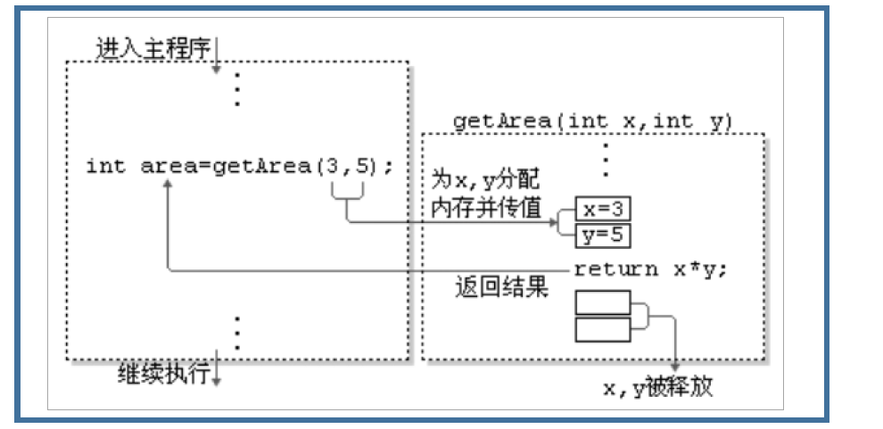

- 注 意：

  - 方法被调用一次，就会执行一次
  - 没有具体返回值的情况，返回值类型用关键字void表示，那么方法体中可以不必使用return语句。如果使用，仅用来结束方法。
  - 定义方法时，方法的结果应该返回给调用者，交由调用者处理。
  - 方法中只能调用方法或属性，不可以在方法内部定义方法。

### `return`关键字：

- 使用范围：使用在方法体中
- 作用:
  -  结束方法
  - 针对于返回值类型的方法，使用`return 数据`方法返回所要的数据。
  - 注意点：`return`关键字后面不可以声明执行语句。

### 重载

- 定义：在同一个类中，允许存在一个以上的同名方法，只要它们的参数个数或者参数类型不同即可。
- 特点：与返回值类型无关，只看参数列表，且参数列表必须不同。(参数个数或参数类型)。调用时，根据方法参数列表的不同来区别。
- 两同一不同:
  - 两同：
    - 同一个类
    - 相同方法名
  - 一不同：
    - 参数列表不同：参数个数不同，参数类型不同

### 可变个数的形参

- `JavaSE 5.0 `中提供了`Varargs(variable number of arguments)`机制，允许直接定义能和多个实参相匹配的形参。从而，可以用一种更简单的方式，来传递个数可变的实参。

- `JDK 5.0`以前：采用数组形参来定义方法，传入多个同一类型变量

  `public static void test(int a ,String[] books){};`

- `JDK5.0`：采用可变个数形参来定义方法，传入多个同一类型变量

  `public static void test(int a ,String…books){};`

- 说明

  1. 声明格式：方法名(参数的类型名 ...参数名)
  2. 可变参数：方法参数部分指定类型的参数个数是可变多个：0个，1个或多个
  3. 可变个数形参的方法与同名的方法之间，彼此构成重载
  4. 可变参数方法的使用与方法参数部分使用数组是一致的
  5. **方法的参数部分有可变形参，需要放在形参声明的最后**
  6. 在一个方法的形参位置，最多只能声明一个可变个数形参

  ```java
  public static void test(int a, String[] books) {}
  public static void test(int a, String... books) {}
  // 这个不构成重载 他们两个本质一样
  ```

### 方法内变量的赋值

- 规则

  - 如果变量是基本数据类型，此时赋值的是变量所保存的数据值。
  - 如果变量是引用数据类型，此时赋值的是变量所保存的数据的地址值。

  ```java
  public class Main {
      public static void main(String[] args) {
          System.out.println("***********基本数据类型：****************");
          int m = 10;
          int n = m;
          System.out.println("m = " + m + ", n = " + n);
          n = 20;
          System.out.println("m = " + m + ", n = " + n);
          System.out.println("***********引用数据类型：****************");
          Order o1 = new Order();
          o1.id = 1001;
          Order o2 = o1;//赋值以后，o1和o2的地址值相同，都指向了堆空间中同一个对象实体。
          System.out.println("o1.id = " + o1.id + ",o2.id = " +o2.id);
          o2.id = 1002;
          System.out.println("o1.id = " + o1.id + ",o2.id = " +o2.id);
      }
  }
  
  class Order{
      int id;
  }
  /*
  ***********基本数据类型：****************
  m = 10, n = 10
  m = 10, n = 20
  ***********引用数据类型：****************
  o1.id = 1001,o2.id = 1001
  o1.id = 1002,o2.id = 1002 */
  ```

- 基本数据类型

  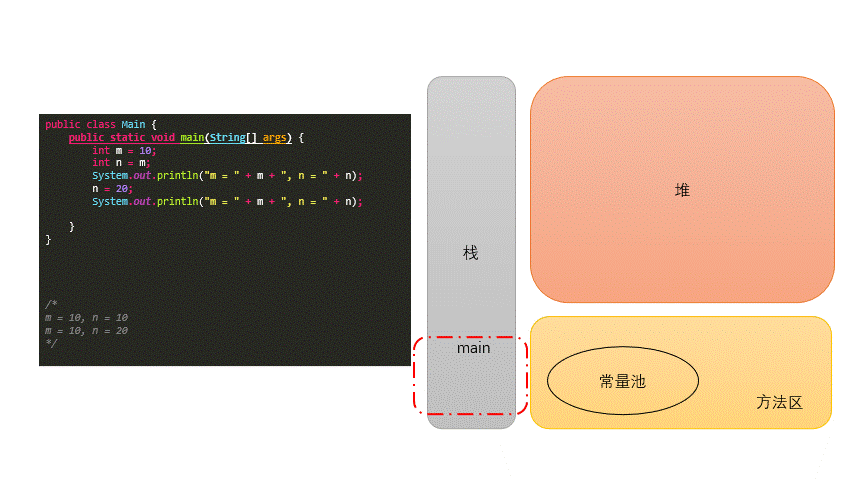

- 引用数据类型

  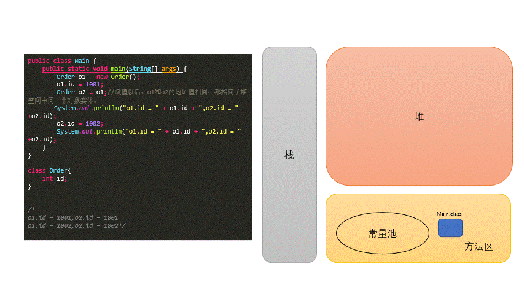

### 值传递机制

- 方法，必须由其所在类或对象调用才有意义。若方法含有参数：
  - 形参：方法声明时的参数
  - 实参：方法调用时实际传给形参的参数值
  
- `Java`里方法的参数传递方式只有一种：值传递。 即将实际参数值的副本（复制品）传入方法内，而参数本身不受影响。
  - 形参是基本数据类型：将实参基本数据类型变量的**`数据值`**传递给形参
  - 形参是引用数据类型：将实参引用数据类型变量的**`地址值`**传递给形参
  
- 基本数据类型

  ```java
  public class Main {
      public static void main(String[] args) {
          int m = 10;
          int n = 20;
          System.out.println("main方法中 m:" + m + "  n:" + n);
          swap(m,n);
          System.out.println("main方法中 m:" + m + "  n:" + n);
      }
  
      public static void swap(int m, int n) {
          int temp = m;
          m = n;
          n = temp;
          System.out.println("swap方法中 m:" + m + "  n:" + n);
      }
  }
  /*
  main方法中 m:10  n:20
  swap方法中 m:20  n:10
  main方法中 m:10  n:20*/
  ```

  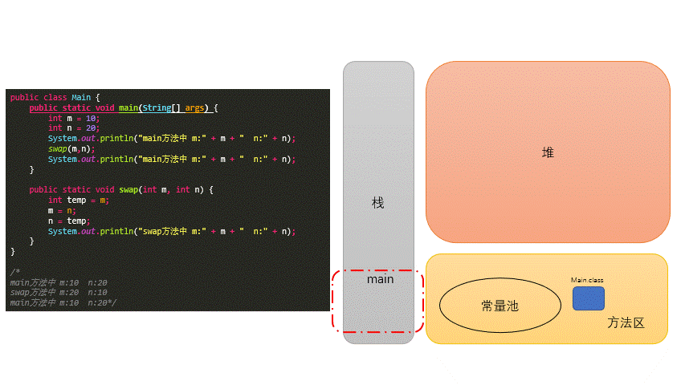

- 引用数据类型

  ```java
  public class Main {
      public static void main(String[] args) {
          Data data = new Data();
          data.m = 10;
          data.n = 20;
          System.out.println("main方法中 m:" + data.m + "  n:" + data.n);
          swap(data);
          System.out.println("main方法中 m:" + data.m + "  n:" + data.n);
      }
  
      public static void swap(Data data) {
          int temp = data.m;
          data.m = data.n;
          data.n = temp;
          System.out.println("swap方法中的 m:" + data.m + "  n:" + data.n);
      }
  }
  
  class Data {
      int m;
      int n;
  }
  
  /*
  main方法中 m:10  n:20
  swap方法中的 m:20  n:10
  main方法中 m:20  n:10*/
  ```

  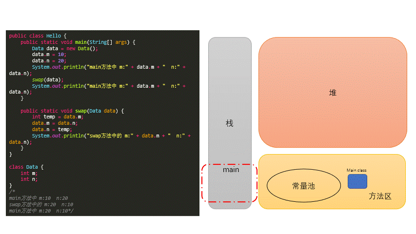

### 值传递面试题

- 第一题

  ```java
  public class Test {
      public static void main(String[] args) {
          int a = 10;
          int b = 10;
          method(a,b); // 需要调用method方法后 打印出a = 100 ,b = 200
          System.out.println("a = " + a);
          System.out.println("b = " + b);
      }
  }
  ```

- 第二题

  ```java
  //定义一个int型的数组：int[] arr = new int[]{12,3,3,34,56,77,432};
  //让数组的每个位置上的值去除以首位置的元素，得到的结果，作为该位置上的新值。遍历新的数组。
      
  public class Hello {
      public static void main(String[] args) {
          int[] arr = new int[]{12, 3, 3, 34, 56, 77, 432};
          // 方法一
          for (int i = arr.length - 1; i >= 0; i--) {
              arr[i] = arr[i] / arr[0];
          }
          // 方法二
          int temp = arr[0];
          for (int i = 0; i < arr.length; i++) {
              arr[i] = arr[i] / temp;
          }
          System.out.println(Arrays.toString(arr));
      }
  }
  ```

### 递归(recursion)方法

- 递归方法：一个方法体内调用它自身。

- 方法递归包含了一种隐式的循环，它会重复执行某段代码，但这种重复执行无须循环控制。

- 递归一定要向已知方向递归，否则这种递归就变成了无穷递归，类似于死循环。

- 计算1-n之间所自然数的和

  ```java
  public int getSum(int n) {
  		if (n == 1) {
  			return 1;
  		} else {
  			return n + getSum(n - 1);
  		}
  	}
  ```

- 计算1-n之间所自然数的乘积:n!

  ```java
  public int getSum1(int n) {
  		if (n == 1) {
  			return 1;
  		} else {
  			return n * getSum1(n - 1);
  		}
  	}
  ```

- 已知一个数列：`f(0) = 1,f(1) = 4,f(n+2)=2*f(n+1) + f(n)`,其中n是大于0的整数，求f(10)的值。

  ```java
  	public int f(int n){
  		if(n == 0){
  			return 1;
  		}else if(n == 1){
  			return 4;
  		}else{
  			return 2*f(n - 1) + f(n - 2);
  		}
  	}
  ```

- 斐波那契数列

  ```java
   public static int fibonacci(int n) {
          if (n <= 1) {
              return n;
          } else {
              return fibonacci(n - 1) + fibonacci(n - 2);
          }
      }
  ```


## 面向对象的特征一：封装性

### 封装与隐藏

- 程序设计追求`高内聚，低耦合`。
  - 高内聚 ：类的内部数据操作细节自己完成，不允许外部干涉；
  - 低耦合 ：仅对外暴露少量的方法用于使用。
- 隐藏对象内部的复杂性，只对外公开简单的接口。便于外界调用，从而提高系统的可扩展性、可维护性。通俗的说，把该隐藏的隐藏起来，该暴露的暴露出来。这就是封装性的设计思想。
- 封装性思想具体的代码体现：
  - 将类的属性xxx私化(private),同时，提供公共的(public)方法来获取(getXxx)和设置(setXxx)此属性的值
  - 不对外暴露的私有的方法
  - 单例模式（将构造器私有化）
  - 如果不希望类在包外被调用，可以将类设置为缺省的。

### `Java`规定的四种权限修饰符

- 权限从小到大顺序为：`private` < ` 缺省` < `protected` < `public`

- 种权限都可以用来修饰类的内部结构：属性、方法、构造器、内部类
- 修饰类的话，只能使用：缺省、public
- 具体的修饰范围：

| 修饰符      | 类内部 | 同一个包 | 不同包的子类 | 同一个工程 |
| :---------- | :----- | :------- | :----------- | :--------- |
| `private`   | `true` |          |              |            |
| (缺省)      | `true` | `true`   |              |            |
| `protected` | `true` | `true`   | `true`       |            |
| `public`    | `true` | `true`   | `true`       | `true`     |

## 构造器(Constructor）

### 构造器的作用：

- 创建对象
- 初始化对象的信息

### 说明

1. 如果没显式的定义类的构造器的话，则系统默认提供一个空参的构造器

2. 定义构造器的格式：`权限修饰符  类名(形参列表){}`

3. 一个类中定义的多个构造器，彼此构成重载

4. 一旦我们显式的定义了类的构造器之后，系统就不再提供默认的空参构造器

5. 一个类中，至少会有一个构造器。

   ```java
   class Person {
       private String name;
       private int age;
   
       //构造器
       public Person() {
       }
   	// 构成重载
       public Person(String name, int age) {
           this.name = name;
           this.age = age;
       }
   }
   ```

### `JavaBean`

- 类是公共的
- 一个无参的公共的构造器
- 属性，且对应的get、set方法

### 属性赋值的先后顺序

  1. 默认初始化
  2. 显式初始化
  3. 构造器中初始化
  4. 通过"对象.方法" 或 "对象.属性"的方式，赋值

以上操作的先后顺序：① - ② - ③ - ④  

## 关键字 `this`

### `this` 可以调用的结构

- 属性
- 方法
- 构造器

### `this`调用属性、方法：

- `this`理解为：当前对象  或 当前正在创建的对象
- 在类的方法中，我们可以使用`this.属性`或`this.方法`的方式，调用当前对象属性或方法。
- 通常情况下，我们都择省略`this.`。特殊情况下，如果方法的形参和类的属性同名时，我们必须显式的使用`this.变量`的方式，表明此变量是属性，而非形参。

### `this`调用构造器：

1.  我们在类的构造器中，可以显式的使用`this(形参列表)`方式，调用本类中指定的其他构造器
2.  构造器中不能通过`this(形参列表)`方式调用自己
3.  如果一个类中有`n`个构造器，则最多有 `n - 1`构造器中使用了`this(形参列表)`
4.  规定：`this(形参列表)`必须声明在当前构造器的首行
5.  构造器内部，最多只能声明一个`this(形参列表)`，用来调用其他的构造器

## 关键字：`package/import`

### `package`的使用

1.  为了更好的实现项目中类的管理，提供包的概念
2. 使用`package`声明类或接口所属的包，声明在源文件的首行
3. 包，属于标识符，遵循标识符的命名规则、规范(`xxxyyyzzz`)、`见名知意`
4. 每`.`一次，就代表一层文件目录。

### MVC的设计模式


### `JDK中`的主要包介绍：

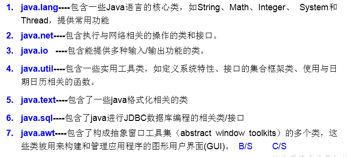

###  `import`的使用：

 1. 在源文件中显式的使用`import`结构导入指定包下的类、接口
 2. 声明在包的声明和类的声明之间
 3. 如果需要导入多个结构，则并列写出即可
 4. 可以使用`xxx.*`的方式，表示可以导入`xxx`包下的所结构
 5. 如果使用的类或接口是`java.lang`包下定义的，则可以省略`import`结构
 6. 如果使用的类或接口是本包下定义的，则可以省略`import`结构
 7. 如果在源文件中，使用了不同包下的同名的类，则必须至少一个类需要以全类名的方式显示。
 8. 使用`xxx.*`方式表明可以调用`xxx`包下的所结构。但是如果使用的是`xxx`子包下的结构，则仍需要显式导入
 9. `import static`:导入指定类或接口中的静态结构:属性或方法。 