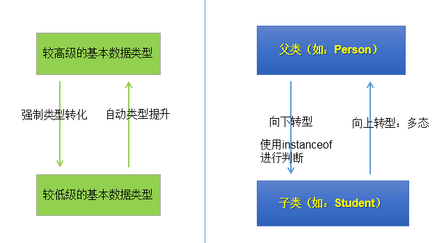

# 面对对象-中

## 面向对象的特征二：继承性

### 继承性(inheritance）

- 子类继承了父类，就继承了父类的方法和属性。

- 在子类中，可以使用父类中定义的方法和属性，也可以创建新的数据和方法。

- 在Java 中，继承的关键字用的是`extends`，即子类不是父类的子集，而是对父类的`扩展`。

- 关于继承的规则：

  - 子类不能直接访问父类中私有的(private)的成员变量和方法。

    

- 作用：
   - 减少了代码的冗余，提高了代码的复用性
   - 便于功能的扩展
   - 为之后多态性的使用，提供了前提
   - 注意：不要仅为了获取其他类中某个功能而去继承

### 继承性的格式：

- `class A extends B{}`
  - A:子类、派生类、`subclass`
  - B:父类、超类、基类、`superclass`

### `Java`中继承性的说明

- 一个类可以被多个子类继承。
- Java中类的单继承性：一个类只能有一个父类
- 子父类是相对的概念。
- 子类直接继承的父类，称为：直接父类。间接继承的父类称为：间接父类
- 子类继承父类以后，就获取了直接父类以及所间接父类中声明的属性和方法

### `java.lang.Object`类的理解

- 如果我们没显式的声明一个类的父类的话，则此类继承于`java.lang.Object`类
- 所的`java`类（除`java.lang.Object`类之外都直接或间接的继承于`java.lang.Object`类
- 意味着，所的`java`类具有`java.lang.Object`类声明的功能。

## 方法的重写

### 重写(`override `或 `overwrite`)

- 子类继承父类以后，可以对父类中同名同参数的方法，进行覆盖操作.

- 应用：重写以后，当创建子类对象以后，通过子类对象调用子父类中的同名同参数的方法时，实际执行的是子类重写父类的方法。

- 格式：

  ```java
   方法的声明：权限修饰符 返回值类型   方法名(形参列表){
        方法体
       }
  ```

- 子类中的叫重写的方法，父类中的叫被重写的方法

- 子类重写的方法的权限修饰符不小于父类被重写的方法的权限修饰符

- 特殊情况：子类不能重写父类中声明为private权限的方法

- 返回值类型：

  - 父类被重写的方法的返回值类型是void，则子类重写的方法的返回值类型只能是void
  - 父类被重写的方法的返回值类型是A类型，则子类重写的方法的返回值类型可以是A类或A类的子类
  - 父类被重写的方法的返回值类型是基本数据类型(比如：double)，则子类重写的方法的返回值类型必须是相同的基本数据类型(必须也是double)
  - 子类重写的方法抛出的异常类型不大于父类被重写的方法抛出的异常类型

- 子类和父类中的同名同参数的方法要么都声明为非static的 （考虑重写），要么都声明为static的（不是重写)。	

### 重写和重载

+ 二者的概念
+ 重载和重写的具体规则
+ 重载：不表现为多态性。重写：表现为多态性。
+ 重载，是指允许存在多个同名方法，而这些方法的参数不同。编译器根据方法不同的参数表，对同名方法的名称做修饰。对于编译器而言，这些同名方法就成了不同的方法。它们的调用地址在编译期就绑定了。Java的重载是可以包括父类和子类的，即子类可以重载父类的同名不同参数的方法。所以：对于重载而言，在方法调用之前，编译器就已经确定了所要调用的方法，这称为“早绑定”或“静态绑定”；而对于多态，只等到方法调用的那一刻，解释运行器才会确定所要调用的具体方法，这称为“晚绑定”或“动态绑定”。


### 举例：

```java
public class Overwrite {
    public static void main(String[] args) {
        Computer computer = new Computer("DELL");
        computer.sold();
    }
}

class Machine {
    private double price;
    private String shape;

    public Machine() {
    }

    public Machine(double price, String shape) {
        this.price = price;
        this.shape = shape;
    }

    public String getShape() {
        return shape;
    }

    public void setShape(String shape) {
        this.shape = shape;
    }

    public double getPrice() {
        return price;
    }

    public void setPrice(double price) {
        this.price = price;
    }

    public void sold() {
        System.out.println("被卖了");
    }
}

class Computer extends Machine {
    private String name;

    public Computer() {
    }

    public Computer(String name) {
        this.name = name;
    }

    public String getName() {
        return name;
    }

    public void setName(String name) {
        this.name = name;
    }

    @Override
    public void sold() {
        System.out.println(name + "牌的电脑被卖了");

    }
}
```

## 关键字:`super`

### `super`关键字

- 可以理解为：父类的
- 可以用来调用的结构：
  - 属性
  - 方法
  - 构造器

### `super`调用属性、方法：

- 我们可以在子类的方法或构造器中。通过使用`super.属性`或`super.方法`的方式，显式的调用父类中声明的属性或方法。但是，通常情况下，我们习惯省略`super.`
- 特殊情况：当子类和父类中定义了同名的属性时，我们要想在子类中调用父类中声明的属性，则必须显式的使用`super.属性`的方式，表明调用的是父类中声明的属性。
- 特殊情况：当子类重写了父类中的方法以后，我们想在子类的方法中调用父类中被重写的方法时，则必须显式的使用`super.方法`的方式，表明调用的是父类中被重写的方法。

### `super`调用构造器：

- 我们可以在子类的构造器中显式的使用`super(形参列表)`的方式，调用父类中声明的指定的构造器
- **`super(形参列表)`的使用，必须声明在子类构造器的首行！**
- 我们在类的构造器中，针对于`this(形参列表)`或`super(形参列表)`只能二一，不能同时出现
- 在构造器的首行，没显式的声明`this(形参列表)`或`super(形参列表)`，则默认调用的是父类中空参的构造器：`super()`
- 在类的多个构造器中，至少一个类的构造器中使用了`super(形参列表)`，调用父类中的构造器

### `this` 与`super`的区别

| 区别点     | `this`                                                 | `super`                                  |
| ---------- | ------------------------------------------------------ | ---------------------------------------- |
| 访问属性   | 访问本类中的属性，如果本类没有此属性则从父类中继续查找 | 直接访问父类中的属性                     |
| 调用方法   | 访问本类中的方法，如果本类没有此方法则从父类中继续查找 | 直接访问父类中的方法                     |
| 调用构造器 | 调用本类构造器，必须放在构造器的首行                   | 调用父类构造器，必须放在子类构造器的首行 |

## 面向对象的特征三：多态性

### 多态性

- 是面向对象中最重要的概念

- 可以理解为一个事物的多种形态。

- 何为多态性：

  - 对象的多态性：父类的引用指向子类的对象（或子类的对象赋给父类的引用）

- 举例：

  ```java
  Person p = new Man();
  Object obj = new Date();
  ```

- 多态性的使用：虚拟方法调用

  - 有了对象的多态性以后，我们在编译期，只能调用父类中声明的方法，但在运行期，我们实际执行的是子类重写父类的方法。
  - 总结：编译，看左边；运行，看右边。

- 子类可看做是特殊的父类，所以父类类型的引用可以指向子类的对象：向上转型(upcasting)。

- 多态性的使用前提：

  - 类的继承关系
  - 方法的重写

- 注意:

  - 对象的多态性，只适用于方法，不适用于属性（编译和运行都看左边）

### 向上转型与向下转型：

- 向上转型：多态
- 向下转型：使用强制类型转换符：()
- 为什么使用向下转型：
  - 有了对象的多态性以后，内存中实际上是加载了子类特有的属性和方法的，但是由于变量声明为父类类型，导致编译时，只能调用父类中声明的属性和方法。子类特有的属性和方法不能调用。如何才能调用子类特的属性和方法？使用向下转型。
- 注意：
  - 使用强转时，可能出现`ClassCastException`的异常。
  - 为了避免在向下转型时出现`ClassCastException`的异常，我们在向下转型之前，先进行`instanceof`的判断，一旦返回true，就进行向下转型。如果返回false，不进行向下转型。

### `instanceof`的使用：

- `a instanceof A`:判断对象a是否是类A的实例。如果是，返回true；如果不是，返回false。

- 要求a所属的类与类A必须是子类和父类的关系，否则编译错误。

- 如果 `a instanceof A`返回`true`,则 `a instanceof B`也返回`true`.其中，类`B`是类`A`的父类。

  

###   对多态性的理解

- 实现代码的通用性。
-  Object类中定义的public boolean equals(Object obj){  }
   JDBC:使用java程序操作(获取数据库连接、CRUD)数据库(MySQL、Oracle、DB2、SQL Server)
-  抽象类、接口的使用肯定体现了多态性。（抽象类、接口不能实例化）

### 多态是编译时行为，还是运行时行为

运行时行为。可利用random随机数随机生成对象，在运行时产生对象，来证明多态试运行时行为。

```java
import java.util.Random;

class Animal {
    String name = "animal";

    public String getinfo() {
        return null;
    }

}

class Cat extends Animal {
    String name = "cat";
    int age = 3;

    public String getinfo() {
        return String.format("name: %s age: %d", name, age);
    }

}

class Dog extends Animal {
    String name = "dog";
    int age = 5;

    public String getinfo() {
        return String.format("name: %s age: %d", name, age);
    }

}
public class PolymorphicDemo {

    public static void main(String[] args) {
        // TODO Auto-generated method stub
        PolymorphicDemo pd = new PolymorphicDemo();
        Animal a = pd.getInstance(new Random().nextInt(3));
        System.out.println(a.getinfo());

    }

    public Animal getInstance(int key) {
        switch (key) {
        case 0:
            return new Cat();
        case 1:
            return new Dog();
        default:
            return new Animal();

        }
    }
}
// name: cat age: 3
```

## `Object`类的使用

### `Object`类

- `java.lang.Object`类的说明：
   * `Object`类是所有`Java`类的根父类
   * 如果在类的声明中未使用`extends`关键字指明其父类，则默认父类为`java.lang.Object`类 
   * `Object`类中的功能(属性、方法)就具通用性。
   * 	属性：无
   *  方法：`equals() / toString() / getClass() /hashCode() / clone() / finalize() wait() 、 notify()、notifyAll()`
   * `Object`类只声明了一个空参的构造器
- [Object类的API](https://docs.oracle.com/en/java/javase/11/docs/api/java.base/java/lang/Object.html)
- 

### `equals()`方法

- 是一个方法，而非运算符

- 只能适用于引用数据类型

-  Object类中equals()的定义：

  ```java
  public boolean equals(Object obj) {
  	        return (this == obj);
  	  }
  ```

  说明：Object类中定义的equals()和==的作用是相同的：比较两个对象的地址值是否相同.即两个引用是否指向同一个对象实体

- 像String、Date、File、包装类等都重写了Object类中的equals()方法。重写以后，比较的不是两个引用的地址是否相同，而是比较两个对象的"实体内容"是否相同。

- 通常情况下，我们自定义的类如果使用equals()的话，也通常是比较两个对象的"实体内容"是否相同。就需要对Object类中的equals()进行重写

- 如何重写

  - `IDEA`  :`Alt + Insert 选择equals() and hashCode()`
  - 修改快捷键为`Alt + E`

### `==`操作符与`equals`方法

- `= =`：
  - 基本类型比较值:只要两个变量的值相等，即为`true`。
  - 引用类型比较引用(是否指向同一个对象)：只有指向同一个对象时，`==`才返回`true`。
  - 用`==`进行比较时，符号两边的数据类型必须兼容(可自动转换的基本数据类型除外)，否则编译出错
- `equals()`：
  - 所有类都继承了`Object`，也就获得了`equals()`方法。还可以重写。
    - 只能比较引用类型，其作用与`==`相同,比较是否指向同一个对象。
  - 特例：当用`equals()`方法进行比较时，对`类File、String、Date及包装类（Wrapper Class）`来说，是比较类型及内容而不考虑引用的是否是同一个对象；
    - 原因：在这些类中重写了`Object`类的`equals()`方法。
  - 当自定义使用`equals()`时，可以重写。用于比较两个对象的“内容”是否都相等

### 重写`equals()`方法的原则

- 对称性：如果`x.equals(y)`返回是`true`，那么`y.equals(x)`也应该返回是 `true`。
- 自反性：`x.equals(x)`必须返回是`true`。
- 传递性：如果`x.equals(y)`返回是`true`，而且`y.equals(z)`返回是`true`，那么`z.equals(x)`也应该返回是`true`。
- 一致性：如果`x.equals(y)`返回是`true`，只要`x`和`y`内容一直不变，不管你重复`x.equals(y)`多少次，返回都是`true`。
- 任何情况下，`x.equals(null)`，永远返回是`false`；`x.equals`(和x不同类型的对象)永远返回是`false`。

### `toString()` 方法

- `toString()`方法在`Object`类中定义，其返回值是`String`类型，返回类名和它的引用地址。

  ```java
   public String toString() {
          return getClass().getName() + "@" + Integer.toHexString(hashCode());
       }
  ```

- 在进行String与其它类型数据的连接操作时，自动调用`toString()`方法

- 可以根据需要在用户自定义类型中重写`toString()`方法

- 基本类型数据转换为String类型时，调用了对应包装类的`toString()`方法

### Java中的`JUnit`单元测试

- `add libraries` -> `JUnit 4` 
- 导入：`import org.junit.Test`
- 声明注解：`@Test`
- `run` 运行当前`test`

## 包装类

### 包装类(或封装类）

- 为了使基本数据类型的变量具有类的特征，引入包装类。

### 基本数据类型与对应的包装类：


### （基本数据类型、包装类、String）转换


### 简易版

- 基本数据类型、包装类、String 之间的转换

- 基本数据类型----> 包装类：调用包装的的构造器  自动装箱

- 包装类 ----> 基本数据类型：调用包装类的xxx.Value()

- 基本类型、包装类--->String类型：

- 方式一 xx + "" 连接运算

- 调用String的valueOf

  ```java
  	@Test
      public void EachtoString() {
          int n1 = 10;
          // 方式一
          System.out.println(n1 + "");
          // 方式二
          String s = String.valueOf(n1);
          System.out.println(s);
      }
  ```

- String类型 ----> 基本数据类型、包装类:调用包装的parseXxx方法

  ```java
   	@Test
      public void stringToOther() {
          String s = "123";
          System.out.println(Integer.parseInt(s));
  
      }
  ```

- JDK 5.0 新特性 自动装箱与拆箱

  ```java
  	@Test
      public void boxingTest() {
          /**
           * 自动装箱
           *  int n1 = 10;
           *  Integer n2 = new Integer(n1);
           */
          int n1 = 10;
          Integer n2 = n1;
  
          /**
           * 自动拆箱
           * int n3 = n2.intValue()
           */
          int n3 = n2;
          System.out.println(n3);
  
      }
  ```

### `IntegerCache` 

-    类似于python的小常量池
    -    Integer内部定义了`IntegerCache`结构，`IntegerCache`中定义了`Integer[]`,
    -    保存了从`-128~127`范围的整数。如果我们使用自动装箱的方式，给`Integer`赋值的范围在
    -    `-128~127`范围内时，可以直接使用数组中的元素，不用再去`new`了。