# 运算符

## 运算符

- 关于进制(补充)
- 运算符是一种特殊的符号，用以表示数据的运算、赋值和比较等。
- 分类
  - 算术运算符
  - 赋值运算符
  - 比较运算符（关系运算符）
  - 逻辑运算符
  - 位运算符

## 关于进制

### 进制

- 所有数字在计算机底层都以二进制形式存在。
- 对于整数，有四种表示方式：
  - 二进制(binary)：0,1 ，满2进1.以`0b`或`0B`开头。
  - 十进制(decimal)：0-9 ，满10进1。
  - 八进制(octal)：0-7 ，满8进1. 以数字`0`开头表示。
  - 十六进制(hex)：0-9及A-F，满16进1. 以`0x`或`0X`开头表示。此处的A-F不区分大小写。如：`0x21AF +1= 0X21B0`

### 二进制

- `Java`整数常量默认是int类型，当用二进制定义整数时，其第32位是符号位；当是`long`类型时，二进制默认占64位，第64位是符号位
- 二进制的整数有如下三种形式：
  - 原码：直接将一个数值换成二进制数。最高位是符号位
  - 负数的反码：是对原码按位取反，只是最高位（符号位）确定为1。
  - 负数的补码：其反码加1。
- 计算机以二进制补码的形式保存所有的整数。
  - 正数的原码、反码、补码都相同
  - 负数的补码是其反码+1
- 为什么要使用原码、反码、补码表示形式呢？
  - 计算机辨别`符号位`显然会让计算机的基础电路设计变得十分复杂! 于是人们想出了将符号位也参与运算的方法. 我们知道, 根据运算法则减去一个正数等于加上一个负数, 即:` 1-1 = 1 + (-1) = 0 `, 所以机器可以只有加法而没有减法, 这样计算机运算的设计就更简单了。
  - 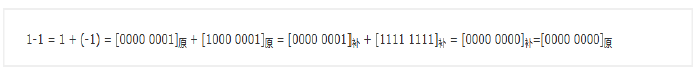

### 补码的加减法依据

- 补码的加法运算所依据的基本关系为：
- [x]补+ [y]补= [x+y]补
- 补码减法所依据的基本关系式：
- [x-y]补 =[x+(-y)]补= [x]补+ [-y]补

### 原、反、补示例讲解

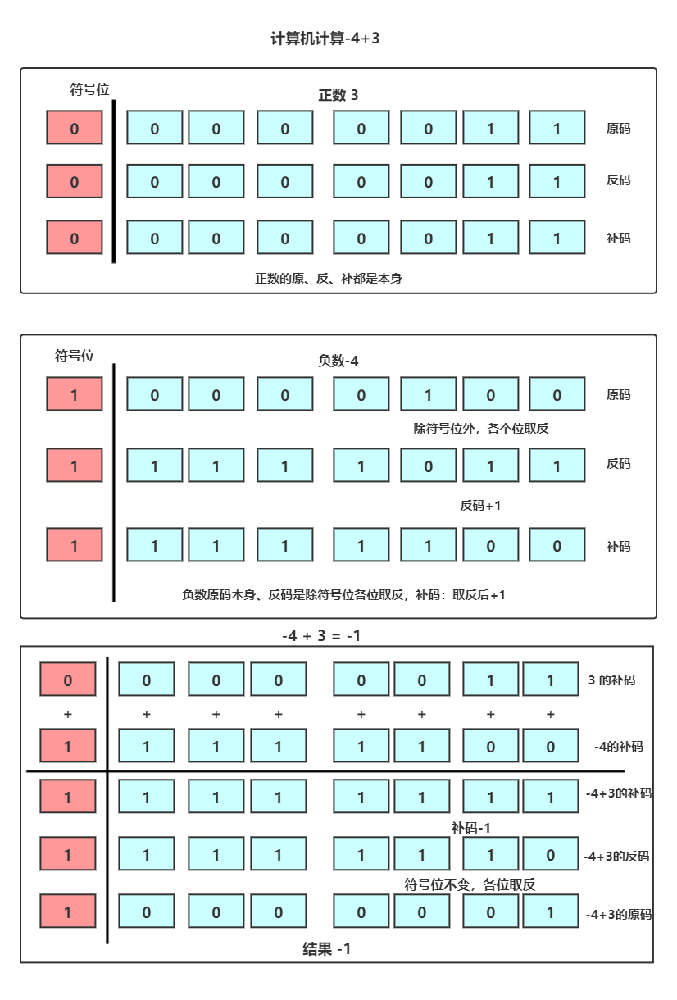

## 算术运算符

### 基本算是运算符

算术运算符用在数学表达式中，它们的作用和在数学中的作用一样。

表格中的实例假设整数变量A的值为10，变量B的值为20：

| 操作符 | 描述                              | 例子               |
| :----- | :-------------------------------- | :----------------- |
| +      | 加法 - 相加运算符两侧的值         | A + B 等于 30      |
| -      | 减法 - 左操作数减去右操作数       | A – B 等于 -10     |
| *      | 乘法 - 相乘操作符两侧的值         | A * B等于200       |
| /      | 除法 - 左操作数除以右操作数       | B / A等于2         |
| ％     | 取余 - 左操作数除以右操作数的余数 | B%A等于0           |
| ++     | 自增: 操作数的值增加1             | B++ 或 ++B 等于 21 |
| --     | 自减: 操作数的值减少1             | B-- 或 --B 等于 19 |

- 如果单独使用，++放在变量前和变量后没有任何区别。

- `++A` 和`A++`的区别:

  - `++A` 前++ ：先++然后在赋值(或运算)

  - `A++` 后++：先赋值(或运算)再++

    ```java
    public class Test {
        public static void main(String[] args) {
            int a = 10, d = 10;
            int b = a++;
            int c = ++d;
           	System.out.println("b:" + b + "  a:" + a);
            System.out.println("c:" + c + "  d:" + d);
        }
    }
    // console: b:10  a:11
    // 			c:11  d:11
    ```

- `--A`和`A--`的区别:

  - `--A` 前-- ：先--然后在赋值(或运算)

  - `A--` 后++：先赋值(或运算)再--

    ```java
    public class Hello {
        public static void main(String[] args) {
            int a = 10, d = 10;
            int b = a--;
            int c = --d;
            System.out.println("b:" + b + "  a:" + a);
            System.out.println("c:" + c + "  d:" + d);
        }
    }
    // console: b:10  a:9
    //			c:9  d:9
    ```

- 如果对负数取模，可以把模数负号忽略不记，如：`5%-2=1`。 但被模数是负数则不可忽略。此外，取模运算的结果不一定总是整数。

- 对于除号`/`，它的整数除和小数除是有区别的：整数之间做除法时，只保留整数部分而舍弃小数部分。 例如：`int x=3510;x=x/1000*1000; ` x的结果是3000

- `+`除字符串相加功能外，还能把非字符串转换成字符串.例如：`System.out.println(“5+5=”+5+5);`结果为`5+5=55` 

### `java`和`python`取余运算的不同

`java`取余

```java
public class Hello {
    public static void main(String[] args) {
        int a1 = 10;
        int b1 = 3;
        System.out.println(a1 % b1);

        int a2 = 10;
        int b2 = -3;
        System.out.println(a2 % b2);

        int a3 = -10;
        int b3 = 3;
        System.out.println(a3 % b3);

        int a4 = -10;
        int b4 = -3;
        System.out.println(a4 % b4);

    }
}
/*1,1,-1,-1*/
```

`python`取模

```python
a1 = 10
b1 = 3
print(a1 % b1)
a2 = 10
b2 = -3
print(a2 % b2)
a3 = -10
b3 = 3
print(a3 % b3)
a4 = -10
b4 = -3
print(a4 % b4)
# 1,-2,2,-1
```

可见 对于负数的取余结果是不一样的。

原因：**计算模或者余数： r = a - c\*b.**

求模运算和求余运算在第一步不同:**求余运算在取c的值时，向0 方向舍入(fix()函数)；**而**取模运算在计算c的值时，向无穷小方向舍入(floor()函数)。**

所谓**向0 方向舍入**，就是以小数点为界限，直接将小数部分去掉。如（Int）-1.324=-1（亦叫截断法）；

而**向无穷小方向舍入**，就是最终结果比真实值更小。如（Int）-1.324=-2；（int此处是强制转换数据类型）

因此当a和b

**符号一致**时，求模运算和求余运算所得的c的值一致，因此结果一致；

**符号不一致**时，结果不一样。

具体来说，求余运算结果的符号和a一致（截断法），求模运算结果的符号和b一致（更小法）。

## 赋值运算符

- 基本赋值运算符`=`
  - 当`=`两侧数据类型不一致时，可以使用自动类型转换或使用强制类型转换原则进行处理。
  - 支持连续赋值。
  
- 扩展赋值运算符`+=, -=, *=, /=, %=`
  - 作用：先求出运算符两边运算的结果，然后将该结果赋值给左边的变量。
  - 举例：
    - m += n，先求出m和n相加的结果，然后将该结果赋值给左边的变量m。运算结果相当于m = m + n
    - m *= n，先求出m和n相乘的结果，然后将该结果赋值给左边的变量m。运算结果相当于m = m * n
  - 注意：扩展的赋值运算符中蕴含了强制类型转换的操作。

  ```java
  //开发中，如果希望变量实现+2的操作，有几种方法？(前提：int num = 10;)
  //方式一：num = num + 2;
  //方式二：num += 2; (推荐)
  public class Test {
      public static void main(String[] args) {
          byte num = 127,num1 = 127;
          num +=2;
          num1 = num1 +2; // 报错
          System.out.println(num);
      }
  }
  
  //开发中，如果希望变量实现+1的操作，有几种方法？(前提：int num = 10;)
  //方式一：num = num + 1;
  //方式二：num += 1; 
  //方式三：num++; (推荐)
  public class Test {
      public static void main(String[] args) {
          byte num = 127,num1 = 127,num2=127;
          num +=1;
          num1 = num1 +1; // 报错
          num2 ++; //比较好
          System.out.println(num);
          System.out.println(num2);
      }
  }
  ```

  > **特别注意**：**运算的结果不会改变变量本身的数据类型**

### 扩展：

| 操作符  | 描述                                                         | 例子                                     |
| :------ | :----------------------------------------------------------- | :--------------------------------------- |
| =       | 简单的赋值运算符，将右操作数的值赋给左侧操作数               | C = A + B将把A + B得到的值赋给C          |
| + =     | 加和赋值操作符，它把左操作数和右操作数相加赋值给左操作数     | C + = A等价于C = C + A                   |
| - =     | 减和赋值操作符，它把左操作数和右操作数相减赋值给左操作数     | C - = A等价于C = C - A                   |
| * =     | 乘和赋值操作符，它把左操作数和右操作数相乘赋值给左操作数     | C * = A等价于C = C * A                   |
| / =     | 除和赋值操作符，它把左操作数和右操作数相除赋值给左操作数     | C / = A，C 与 A 同类型时等价于 C = C / A |
| （％）= | 取模和赋值操作符，它把左操作数和右操作数取模后赋值给左操作数 | C％= A等价于C = C％A                     |
| << =    | 左移位赋值运算符                                             | C << = 2等价于C = C << 2                 |
| >> =    | 右移位赋值运算符                                             | C >> = 2等价于C = C >> 2                 |
| ＆=     | 按位与赋值运算符                                             | C＆= 2等价于C = C＆2                     |
| ^ =     | 按位异或赋值操作符                                           | C ^ = 2等价于C = C ^ 2                   |
| \| =    | 按位或赋值操作符                                             | C \| = 2等价于C = C \| 2                 |

## 比较运算符

### 比较运算符

+ 下表为Java支持的关系运算符
+ 表格中的实例整数变量A的值为10，变量B的值为20：

| 运算符     | 描述                                                         | 例子                       |
| :--------- | :----------------------------------------------------------- | :------------------------- |
| ==         | 检查如果两个操作数的值是否相等，如果相等则条件为真。         | （A == B）为假。           |
| !=         | 检查如果两个操作数的值是否相等，如果值不相等则条件为真。     | (A != B) 为真。            |
| >          | 检查左操作数的值是否大于右操作数的值，如果是那么条件为真。   | （A> B）为假。             |
| <          | 检查左操作数的值是否小于右操作数的值，如果是那么条件为真。   | （A <B）为真。             |
| >=         | 检查左操作数的值是否大于或等于右操作数的值，如果是那么条件为真。 | （A> = B）为假。           |
| <=         | 检查左操作数的值是否小于或等于右操作数的值，如果是那么条件为真。 | （A <= B）为真。           |
| instanceof | 检查是否是类的对象                                           | "Hello"  instanceof String |

- 比较运算符的结果都是`boolean`型，也就是要么是`true`，要么是`false`。
- 比较运算符`==`不能误写成`=` 。

### `Java`中`equals`和`==`的区别

- `java`中的数据类型，可分为两类：

  1. 基本数据类型，也称原始数据类型。`byte,short,char,int,long,float,double,boolean`
      他们之间的比较，应用双等号（==）,比较的是他们的值。

  2. 复合数据类型(类)

     当他们用（==）进行比较的时候，比较的是他们在内存中的存放地址，所以，除非是同一个new出来的对象，他们的比较后的结果为true，否则比较后结果为false。 JAVA当中所有的类都是继承于Object这个基类的，在Object中的基类中定义了一个equals的方法，这个方法的初始行为是比较对象的内存地 址，但在一些类库当中这个方法被覆盖掉了，如String,Integer,Date在这些类当中equals有其自身的实现，而不再是比较类在堆内存中的存放地址了。
      对于复合数据类型之间进行equals比较，在没有覆写equals方法的情况下，他们之间的比较还是基于他们在内存中的存放位置的地址值的，因为Object的equals方法也是用双等号（==）进行比较的，所以比较后的结果跟双等号（==）的结果相同。

## 逻辑运算符

### 逻辑运算符

+ 与
  + `&`：逻辑与
  + `&&`:短路与
+ 或
  + `|`:逻辑或
  + `|`短路或
+ 非
  + `!`逻辑非
+ 异或
  + `^`逻辑异或

|   a   |   b   | a&b 和a&&b | a丨b和a丨丨b |  ！a  |  a^b  |
| :---: | :---: | :--------: | :----------: | :---: | :---: |
| true  | true  |    true    |     true     | false | false |
| true  | false |   false    |     true     | false | true  |
| false | true  |   false    |     true     | true  | true  |
| false | false |   false    |    false     | true  | false |

+ 逻辑运算符用于连接布尔型表达式，在Java中不可以写成`3<x<6`，应该写成`x>3 & x<6` 。
+ `&`和`&&`的区别：
  + 单&时，左边无论真假，右边都进行运算；
  + 双&时，如果左边为真，右边参与运算，如果左边为假，那么右边不参与运算。
+ `|`和`||`的区别同理，||表示：当左边为真，右边不参与运算
+ 异或( `^` )与或(` |` )的不同之处是：当左右都为`true`时，结果为`false`。
+ 开发中，推荐使用&&

### 例子

```java
public class Test {

    public static void main(String[] args) {
        boolean b1 = true;
        b1 = false;
        int num1 = 10;
        if(b1 & (num1++ > 0)){
            System.out.println("aa");
        }else{
            System.out.println("bb");
        }
        System.out.println("num1 = " + num1);
    }
}
// console  bb,num1 = 11

public class Test {

    public static void main(String[] args) {
        boolean b1 = true;
        b1 = false;
        int num1 = 10;
        if(b1 && (num1++ > 0)){
            System.out.println("aa");
        }else{
            System.out.println("bb");
        }
        System.out.println("num1 = " + num1);
    }
}
// console  bb,num1 = 10
```

## 位运算符

### 1.位运算符

运算符的基本运算，假设整数变量 A 的值为 60 和变量 B 的值为 13：

| 操作符 | 描述                                                         | 例子                          |
| :----- | :----------------------------------------------------------- | :---------------------------- |
| ＆     | 如果相对应位都是1，则结果为1，否则为0                        | （A＆B），得到12，即0000 1100 |
| 丨     | 如果相对应位都是 0，则结果为 0，否则为 1                     | （A B）得到61，即 0011 1101   |
| ^      | 如果相对应位值相同，则结果为0，否则为1                       | （A ^ B）得到49，即 0011 0001 |
| 〜     | 按位取反运算符翻转操作数的每一位，即0变成1，1变成0。         | （〜A）得到-61，即1100 0011   |
| <<     | 按位左移运算符。左操作数按位左移右操作数指定的位数。         | A << 2得到240，即 1111 0000   |
| >>     | 按位右移运算符。左操作数按位右移右操作数指定的位数。         | A >> 2得到15即 1111           |
| >>>    | 按位右移补零操作符。左操作数的值按右操作数指定的位数右移，移动得到的空位以零填充。 | A>>>2得到15即0000 1111        |

### 2. `& `: 按位与

`5 & 9 = 1`

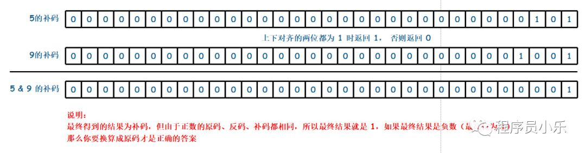

### 3. `|`:按位或

`5|9 = 13`

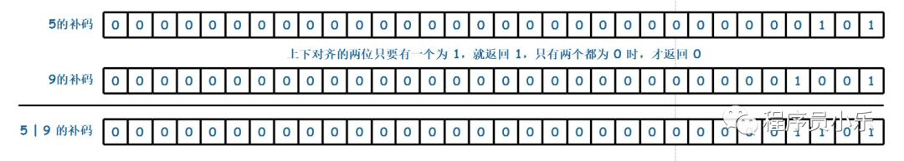

### 4. ^ : 按位异或

`5 ^ 9 = 12`

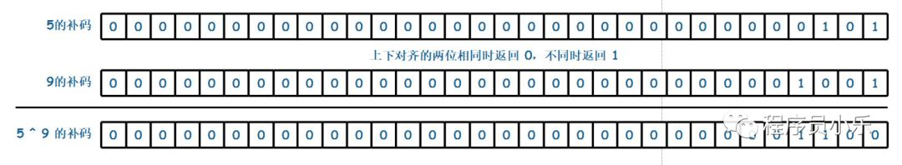

###  5. `~ `: 按位非

`~5 = -6`

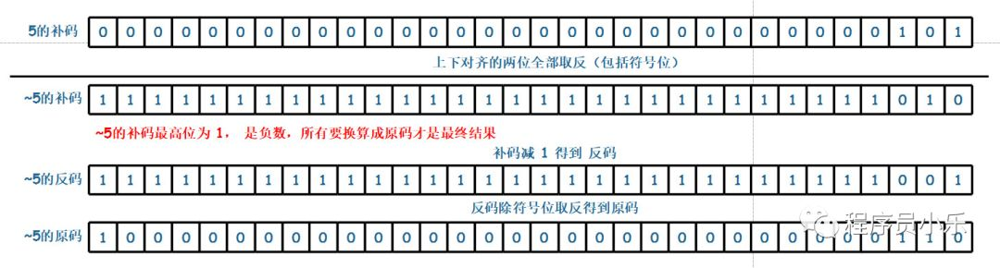

###  6. `<<` : 左移

`5 << 2 = 20`

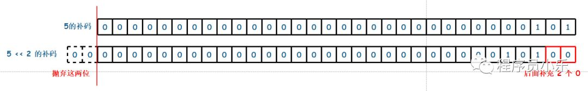

`-5 << 2 = -20`

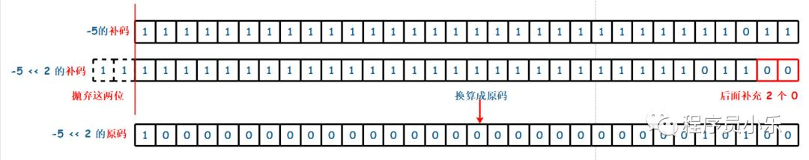

### 7. `>>` : 右移

`-5 >> 2 = -2`

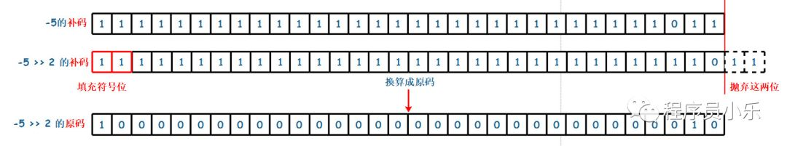

### 8. `>>>`: 无符号右移

`-5 >>> 2 = 1073741822`

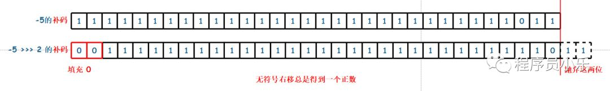

###  9. **注意**

- 对于低于 int 类型(如byte、short和char)的操作数总是先自动转换为int类型后再移位
- 对于 int 类型的整数移位 a >> b, 当 b>32 时，系统先用 b 对 32 求余(因为 int 是 32 位)，得到的结果才是真正移位的位数，例如，a >> 33 和 a >> 1 的结果相同，而 a >> 32 = a
- 对于 long 类型的整数移位 a >> b, 当 b>64 时，系统先用 b 对 64 求余(因为 long 是 64 位)，得到的结果才是真正移位的位数
- 当进行移位运算时，只要被移位的二进制码没有发生有效位的数字丢失(对于正数而言，通常指被移出去的位全部是 0)，不难发现左移 n 位就相当于乘以 2 的 n 次方，右移 n 位则是除以 2 的 n 次方
- 进行移位运算不会改变操作数本身，只是得到了一个新的运算结果

### 特别说明

- 位运算符操作的都是整型的数据
- `<< `：在一定范围内，每向左移1位，相当于 * 2
- `>>`:在一定范围内，每向右移1位，相当于 / 2

### 面试题：

1. 你能否写出最高效的2 * 8的实现方式？ 

   ```java
   // 2 << 3  或  8 << 1
   ```

2. 交换两个变量的值。

   ```java
   1、借助中间量交换 （开发常用） 
   int x = 10; 
   int y = 20; 
   int temp = x; 
   x = y; 
   y = temp; 
   
   2、位移运算交换 （面试常用）
   int x = 10; 
   int y = 20; 
   x = x ^ y; 
   y = x ^ y; 
   x = x ^ y;
   
   3、数值相加减交换 
   int x = 10; 
   int y = 20; 
   x = x + y; 
   y = x - y; 
   x = x - y; 
   ```

3. 实现60的二进制到十六进制的转换

   ```java
   public class Test {
   
       public static void main(String[] args) {
           int number = 60;
           int compare = 15;
           int lastForthBit = number & compare;
           String lastRet = (lastForthBit > 9) ? (char) (lastForthBit - 10 + 'A') + "" : lastForthBit + "";
           int temp = number >>> 4;
           int firstForthBit = temp & compare;
           String firstRet = (firstForthBit > 9) ? (char) (firstForthBit - 10 + 'A') + "" : firstForthBit + "";
           System.out.println(firstRet + "" +lastRet);
       }
   }
   
   ```

   ## 三元运算符
   
   ### 三元运算符
   
   + 格式：`variable x = (expression) ? value if true : value if false`
   
   + (条件表达式)?表达式1：表达式2；
   
     ```java
     public class Test {
        public static void main(String[] args){
           int a , b;
           a = 10;
           // 如果 a 等于 1 成立，则设置 b 为 20，否则为 30
           b = (a == 1) ? 20 : 30;
           System.out.println( "Value of b is : " +  b );
      
           // 如果 a 等于 10 成立，则设置 b 为 20，否则为 30
           b = (a == 10) ? 20 : 30;
           System.out.println( "Value of b is : " + b );
        }
     }
     ```
   
   + 注意：
   
     + 条件表达式的结果为boolean类型
     + 根据条件表达式真或假，决定执行表达式1，还是表达式2.
       +   如果表达式为true，则执行表达式1。
       +   如果表达式为false，则执行表达式2。
     + 表达式1 和表达式2要求是一致的。
     +  三元运算符可以嵌套使用
     + 凡是可以使用三元运算符的地方，都可以改写为if-else反之，不成立。
     + 如果程序既可以使用三元运算符，又可以使用if-else结构，那么优先选择三元运算符。原因：简洁、执行效率高。
   
   ### 转义字符
   
   - `\n` --> 回车 (`linux`系统)
   - `\r` --> 回车(`windows`系统 --> `\r\n`)
   - `\t` --> 制表符 (`tab`键)
   
   ### 算术运算符优先级
   
   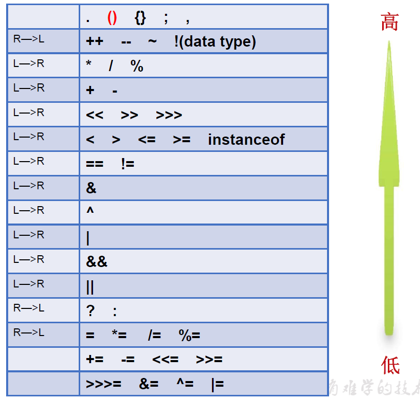