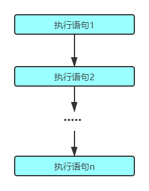
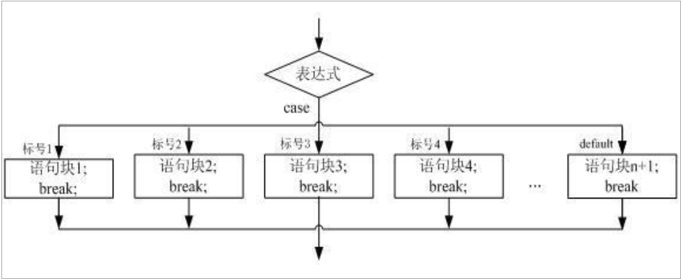
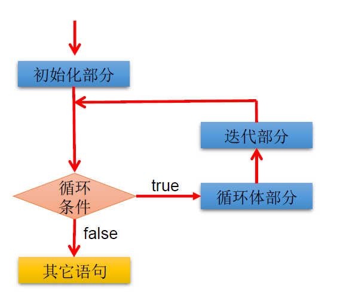

# 流程控制

## 流程控制

- 流程控制语句是用来控制程序中各语句执行顺序的语句，可以把语句组
  合成能完成 一定功能 的小逻辑模块 。
- 其 流程控制方式采用结构化程序设计中规定的三种基本流程结构
  - 顺序结构
    - 程序 从上到下逐行地执行，中间没有任何判断和跳转。
  - 分支结构
    - 根据 条件，选择性地执行某段代码。
    - 有 `if…else` 和 `switch case` 两种 分支语句。
  - 循环结构
    - 根据 循环条件，重复性的执行某段代码。
    - 有 while 、 do…while 、 for 三种循环语句。
    - 注 `JDK1.5` 提供了 `foreach` 循环，方便的遍历集合、数组元素。

## Scanner键盘录入的使用

Scanner是Java提供给我们直接使用的类，每一个类里面都包含了一些功能，Scanner这个类可以实现键盘录入的功能。 Scanner是一个类，类是属于引用数据类型的。所以Scanner的使用步骤和引用类型的使用步骤是一致的。

### 引用类型的使用步骤：

1. 导包

   `import 包名.类名`;

2. 创建对象
   `数据类型 对象名 = new 数据类型();`

3. 调用方法，完成功能
   `对象名.方法名();`

### Scanner的使用步骤：

1. 导包

   `import java.util.Scanner;`

2. 创建对象

   `Scanner scanner = new Scanner(System.in);`

3. 调用方法，键盘录入

   `int a = scanner.nextInt();` :录入整数

   录入其他类型的数据就`.nextXx()`

   [Scanner相关API查询](https://docs.oracle.com/en/java/javase/11/docs/api/java.base/java/util/Scanner.html)

## 顺序结构

### 顺序结构

Java中定义成员变量时采用合法的前向引用



## 分支结构

### `if-else`结构

- if语句的三种格式

  ```java
  格式：
  	if(条件) {
          执行语句;
  	}
  执行流程：
  	1. 先判断小括号中的条件。
  	2. 如果条件为true，那么就执行大括号中的内容。
  	   如果条件为false，那么就不执行大括号中的内容。
  特点：
  	要么执行，要么不执行。
  ```

- 二选一

  ```java
  格式：
  	if(条件) {
          执行语句1;
  	} else {
          执行语句2;
  	}
  执行流程：
  	1. 判断小括号中的条件
  	2. 如果条件为true，那么就执行if后面大括号中的执行语句1.
  	   如果条件为false，那么就执行else后面大括号中的执行语句2.
  特点：
  	要么执行第一个，要么执行第二个。（两者选其一）
  ```

- n选一

  ```java
  格式：
  	if(条件1) {
          执行语句1;
  	} else if(条件2) {
          执行语句2;
  	}... else if(条件n) {
          执行语句n;
  	} else {
          执行语句n + 1;
  	}
  	
  执行流程：
  	1. 先判断条件1是否成立。
  	2. 如果条件1成立，那么就执行条件1后面大括号中的执行语句1.
  	3. 如果条件1不成立，那么就继续判断条件2
  	4. 如果条件2成立，那么就执行条件2后面大括号中的执行语句2
  	5. 如果条件2不成立，那么就继续判断后面的条件....
  	6. 如果所有的条件都不成立，那么代码会执行else中的内容
  
  简单来说，哪个条件先成立那么就执行哪个条件后面的执行语句。如果所有条件都不成立，那么代码会执行else。一旦某个条件判断成立，执行完该条件后面的执行语句后就不会再判断后面的条件了，而是直接跳出整个的if语句。
  
  特点：
  	可以判断多种情况。
  ```

- 条件表达式必须是布尔表达式（关系表达式或逻辑表达式）、布尔变量

- 语句块只有一条执行语句时，一对{}可以省略，但建议保留

- if-else语句结构，根据需要可以嵌套使用

- 当if-else结构是“多选一”时，最后的else是可选的，根据需要可以省略

- 当多个条件是“互斥”关系时，条件判断语句及执行语句间顺序无所谓当多个条件是“包含”关系时，“小上大下 / 子上父下”

### `switch-case`结构

- 

- 格式：

  ```java
  switch(表达式) {
      case 目标值:
          执行语句;
          break;
      case 目标值:
          执行语句;
          break;
          ...
              default:
          执行语句;
          break;
  ```

- 解释：

  - 表达式：表达式的结果必须是`byte`，`short`，`char`，`int`。`JDK5`之后的枚举。`JDK7`之后的字符串。
    	       这个表达式也可以是一个常量，也可以是一个变量。
  - 目标值：目标值用来和表达式的结果进行匹配。
  - `break`：用来跳出`switch`语句的。
  - `default`：如果所有的目标值都没有和表达式的值匹配成功。那么代码会执行`default`。相当于之前的`else`。

- 执行流程：
  	1. 先计算表达式的结果。
  	2. 使用表达式的结果和每一个case后面的目标值进行匹配，那个能够匹配上，就执行哪个case后面的语句，然        后会遇到break，结束整个的switch语句
  	3. 如果所有的目标值都没有匹配上表达式的结果，那么代码会执行default。

- case穿透：

  - case中的break关键字可以省略，如果省略break，那么代码执行完当前的case中的内容后会继续向下执行，执行后面case中的内容，这个特性叫做case穿透。

### `switch`和`if`语句的对比

- 如果判断的具体数值不多，而且符合`byte、short 、char、int、String`、枚举等几种类型。虽然两个语句都可以使用，建议使用`swtich`语句。因为效率稍高。
- 其他情况：对区间判断，对结果为`boolean`判断，使用if，if的使用范围更广。也就是说，使用`switch-case`的，都可以改写为`if-else`。反之不成立。

## 循环结构

### 循环结构

- 在某些条件满足的情况下，反复执行特定代码的功能

### 循环语句分类

- `for` 循环
- `while `循环
- `do-while` 循环

### 循环语句的四个组成部分

- 初始化部分(`init_statement`)

- 循环条件部分(`test_exp`)

- 循环体部分(`body_statement`)

- 迭代部分(`alter_statement`)

  

### `for` 循环

- 语法格式

  ```java
  for (①初始化部分; ②循环条件部分; ④迭代部分){
      ③循环体部分;
  }
  ```

- 执行流程

  **①-②-③-④-②-③-④-②-③-④-.....-②**

- 说明：

  - ②循环条件部分为boolean类型表达式，当值为false时，退出循环
  - ①初始化部分可以声明多个变量，但必须是同一个类型，用逗号分隔
  - ④可以有多个变量更新，用逗号分隔

### `while `循环

- 语法格式

  ```java
  ①初始化部分;
  while (②循环条件部分){
      ③循环体部分;
      ④迭代部分
  }
  ```

- 执行流程

  **①-②-③-④-②-③-④-②-③-④-.....-②**

- 说明：

  - 注意不要忘记声明④迭代部分。否则，循环将不能结束，变成死循环。
  - for循环和while循环可以相互转换

### `do-while`

- 语法格式

  ```java
  ①初始化部分;
  do {
      ③循环体部分;
      ④迭代部分
  } while(②循环条件部分);
  ```

- 执行流程

  **①-③-④-②-③-④-②-③-④-.....-②**

- 说明：

  - `do-while`循环至少执行一次循环体。
  - 开发中，使用`for`和`while`更多一些。较少使用`do-while`
  - `for`循环适用于已知循环次数的场景。
  - `while`循环适用于未知循环次数的场景。

### 嵌套循环

- 将一个循环放在另一个循环体内，就形成了嵌套循环。其中`for ,while ,do…while`均可以作为外层循环或内层循环。
- 实质上，嵌套循环就是把内层循环当成外层循环的循环体。当只有内层循环的循环条件为false时，才会完全跳出内层循环，才可结束外层的当次循环，开始下一次的循环。
- 设外层循环次数为m次，内层为n次，则内层循环体实际上需要执行m*n次。

### 死循环

- 如果某个循环一直执行，永远停不下来，那么这个循环就是一个死循环。

- `while`死循环格式(常用)：

  ```java
  while(true) {
     循环体;
  	}
  ```

- `for`死循环格式(了解)：

  ```java
  for(;;) {
      循环体;
  	}
  ```

### 特殊关键字的使用

- `break`

  - 使用场景:

    1. switch语句

    2. 循环语句

  - `break`语句用于终止某个语句块的执行

    ```java
    {	
    	...
    	break;
    	...
    }
    ```

  - `break`语句出现在多层嵌套的语句块中时，可以通过标签指明要终止的是哪一层语句块

    ```java
    EXIT_FLG:{ ...
        EXIT_FLG_1:{ ...
            EXIT_FLG_2:{...
                break EXIT_FLG;
                    ...
            }
        }
    }
    ```

- `continue`

  - `continue`只能使用在循环结构中
  - `continue`语句用于跳过其所在循环语句块的一次执行，继续下一次循环
  - `continue`语句出现在多层嵌套的循环语句体中时，可以通过标签指明要跳过的是哪一层循环

- 附加`return`

  - 并非专门用于结束循环的，它的功能是结束一个方法。当一个方法执行到一个`return`语句时，这个方法将被结束。
  - 与`break`和`continue`不同的是，`return`结束整个方法，不管这个`return`处于多少层循环之内
  
- 很多语言都有`goto`语句，`goto`语句可以随意将控制转移到程序中的任意一条语句上，然后执行它。但使程序容易出错。`Java`中的`break`和`continue`是不同于`goto`的。
### 循环练习题

- ```java
  public class Main {
  
      public static void main(String[] args) {
  
          /*
           ******
           ******
           ******
           ******
           */
          for (int i = 0; i < 4; i++) {
              for (int j = 0; j < 6; j++) {
                  System.out.print("*");
              }
              System.out.println();
          }
      }
  }
  
  ```

- ```java
  public class Main {
  
      public static void main(String[] args) {
  		/*
           *
           **
           ***
           ****
           *****
           */
          for (int i = 1; i <= 5; i++) {
              for (int j = 1; j <= i; j++) {
                  System.out.print("*");
              }
              System.out.println();
          }
      }
  }
  ```

- 9*9乘法表

  ```java
  public class Main {
  
      public static void main(String[] args) {
  		for (int i = 1; i <= 9; i++) {
              for (int j = 1; j <= i; j++) {
                  System.out.print(j + " * " + i + " = " + (i * j) + " ");
              }
              System.out.println();
          }
      }
  }
  ```

- 输出100以内质数

  ```java
  public class Main {
      public static void main(String[] args) {
          boolean isPrime = true;
          for (int i = 2; i <= 100; i++) {
              for (int j = 2; j < Math.sqrt(i); j++) {
                  if (i % j == 0) {
                      isPrime = false;
                      break;
                  }
              }
              if (isPrime) {
                  System.out.println(i);
              }
              isPrime = true;
          }
      }
  }
  ```

- 优化后

  ```java
  public class Main {
      public static void main(String[] args) {
  		long startTime = System.currentTimeMillis();
          int primeCount = 0;
          liable:
          for (int i = 2; i <= 100000; i++) {
              for (int j = 2; j < Math.sqrt(i); j++) {
                  if (i % j == 0) {
                      continue liable;
                  }
              }
              primeCount++;
          }
          long endTime = System.currentTimeMillis();
          System.out.println("2-100质数的个数为：" + primeCount);
          System.out.println("执行时间为：" + (endTime - startTime));
      }
  }
  
  ```

- 补充:衡量一个功能代码的优劣：

  - 正确性
  - 可读性
  - 健壮性
  - 高效率与低存储：时间复杂度 、空间复杂度 （衡量算法的好坏）

  

  

  

  