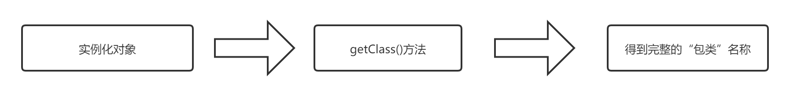
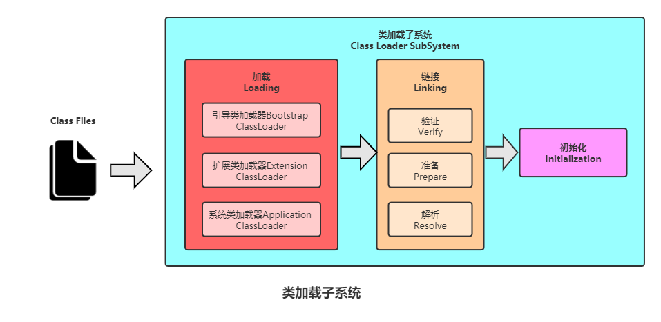
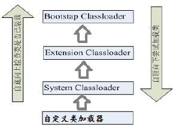

# Java的反射机制

## Java反射机制概述

### Java反射机制概述

- Reflection（反射）是被视为动态语言的关键，反射机制允许程序在执行期借助于Reflection API取得任何类的内部信息，并能直接操作任意对象的内部属性及方法。

- 加载完类之后，在堆内存的方法区中就产生了一个Class类型的对象（一个类只有一个Class对象），这个对象就包含了完整的类的结构信息。我们可以通过这个对象看到类的结构。这个对象就像一面镜子，透过这个镜子看到类的结构，所以，我们形象的称之为：反射。

- 正常方式：

  

- 反射方式：

  

### 动态语言 vs 静态语言

- 动态语言:
  - 是一类在运行时可以改变其结构的语言：例如新的函数、对象、甚至代码可以被引进，已有的函数可以被删除或是其他结构上的变化。通俗点说就是在运行时代码可以根据某些条件改变自身结构。
    主要动态语言：Object-C、C#、JavaScript、PHP、Python、Erlang。
- 静态语言:
  - 与动态语言相对应的，运行时结构不可变的语言就是静态语言。如Java、C、 C++。
- Java不是动态语言，但Java可以称之为“准动态语言”。即Java有一定的动态性，我们可以利用反射机制、字节码操作获得类似动态语言的特性。Java的动态性让编程的时候更加灵活！

### Java反射机制研究及应用

- 在运行时判断任意一个对象所属的类
- 在运行时构造任意一个类的对象
- 在运行时判断任意一个类所具有的成员变量和方法
- 在运行时获取泛型信息
- 在运行时调用任意一个对象的成员变量和方法
- 在运行时处理注解
- 生成动态代理

### 反射相关的主要API

- `java.lang.Class`:代表一个类
- `java.lang.reflect.Method`:代表类的方法
- `java.lang.reflect.Field`:代表类的成员变量
- `java.lang.reflect.Constructor`:代表类的构造器

## Class 类

### 理解

- 类的加载过程：
  - 程序经过javac.exe命令以后，会生成一个或多个字节码文件(.class结尾)。
  - 接着我们使用java.exe命令对某个字节码文件进行解释运行。相当于将某个字节码文件
  - 加载到内存中。此过程就称为类的加载。加载到内存中的类，我们就称为运行时类，此运行时类，就作为Class的一个实例。
- 换句话说，Class的实例就对应着一个运行时类。
- 加载到内存中的运行时类，会缓存一定的时间。在此时间之内，我们可以通过不同的方式
  来获取此运行时类。

### 获取Class类的实例

1. 调用运行时类的属性：`.class`

   ```java
   @Test
   public void test(){
       Class<String> aClass = String.class;
       System.out.println(aClass);
   }
   // class java.lang.String
   ```

2. 通过运行时类的对象,调用`getClass()`

   ```java
   @Test
   public void test1(){
       String s = new String();
       Class<? extends String> aClass = s.getClass();
       System.out.println(aClass);
   }
   // class java.lang.String
   ```

3. 调用Class的静态方法：`forName(String classPath)`

   ```java
   @Test
   public void test2() throws ClassNotFoundException {
       Class<?> person = Class.forName("Person");
       System.out.println(person);
   }
   // class Person
   ```

4. 使用类的加载器：`ClassLoader`

   ```java
   @Test
   public void test3() throws ClassNotFoundException {
       ClassLoader loader = ReflectionDemo.class.getClassLoader();
       Class<?> person = loader.loadClass("Person");
       System.out.println(person);
   }
   // class Person
   ```

### 创建对象的方式：

1. `new  Constructor`
2. 要创建Xxx类的对象，可以考虑：Xxx、Xxxs、XxxFactory、XxxBuilder类中查看是否有静态方法的存在。可以调用其静态方法，创建Xxx对象。
3. 通过反射创建

### Class实例可以是哪些结构的说明

1. `class`：外部类，成员(成员内部类，静态内部类)，局部内部类，匿名内部类
2. `interface`：接口
3. `[]`:数组
4. `enum`:枚举
5. `annotation`:注解
6. `primitive type`:基本数据类型
7. `void`

### 类的加载与ClassLoader的理解



- 类的加载(Load):
  - 将class文件字节码内容加载到内存中，并将这些静态数据转换成方法区的运行时数据结构，然后生成一个代表这个类的java.lang.Class对象，作为方法区中类数据的访问入口（即引用地址）。所有需要访问和使用类数据只能通过这个Class对象。这个加载的过程需要类加载器参与。
- 类的链接(Link)
  - 将Java类的二进制代码合并到JVM的运行状态之中的过程。
  - 验证：确保加载的类信息符合JVM规范，例如：以cafe开头，没有安全方面的问题
  - 准备：正式为类变量（static）分配内存并设置类变量默认初始值的阶段，这些内存都将在方法区中进行分配。
  - 解析：虚拟机常量池内的符号引用（常量名）替换为直接引用（地址）的过程。
- 类的初始化(Initialize)
  - 执行类构造器`<clinit>()`方法的过程。类构造器`<clinit>()`方法是由编译期自动收集类中所有类变量的赋值动作和静态代码块中的语句合并产生的。（类构造器是构造类信息的，不是构造该类对象的构造器）。
  - 当初始化一个类的时候，如果发现其父类还没有进行初始化，则需要先触发其父类的初始化。
  - 虚拟机会保证一个类的`<clinit>()`方法在多线程环境中被正确加锁和同步。

```java
public class ClassLoadingDemo {
    public static void main(String[] args) {
        System.out.println(A.m);
    }
}
class A{
    static {
        m = 30;
    }
    static int m =10;
}
```

1. 加载
2. 链接结束后m=0
3. 初始化后，m的值由`<clinit>()`方法执行决定 这个A的类构造器`<clinit>()`方法由类变量的赋值和静态代码块中的语句按照顺序合并产生，类似`  <clinit>(){ m = 30;m = 10}`

### \**什么时候会发生类初始化

- 类的主动引用（一定会发生类的初始化）
  - 当虚拟机启动，先初始化main方法所在的类
  - new一个类的对象
  - 调用类的静态成员（除了final常量）和静态方法
  - 使用java.lang.reflect包的方法对类进行反射调用
  - 当初始化一个类，如果其父类没有被初始化，则先会初始化它的父类
- 类的被动引用（不会发生类的初始化）
  - 当访问一个静态域时，只有真正声明这个域的类才会被初始化
  - 当通过子类引用父类的静态变量，不会导致子类初始化
  - 通过数组定义类引用，不会触发此类的初始化
  - 引用常量不会触发此类的初始化（常量在链接阶段就存入调用类的常量池中了）

```java
class Father {
    static int b = 2;
    static {
        System.out.println("父类被加载");
    }
}
class Son extends Father{
    static {
        System.out.println("子类被加载");
        m = 300;
    }
    static int m = 100;
    static final int M = 1;
}
public class ClassLoadingDemo {
    public static void main(String[] args) {
        // 主动引用：一定会导致A和Father的初始化
        Son son = new Son();
        System.out.println(son.m);
        // 被动引用，不会导致A和Father的初始化
        Son[] arr = new Son[5];
        System.out.println(Son.b);//只会初始化Father
        System.out.println(Son.M);//不会导致A和Father的初始化
    }
}
```

### 类的加载器的作用

- 类加载的作用：将class文件字节码内容加载到内存中，并将这些静态数据转换成方法区的运行时数据结构，然后在堆中生成一个代表这个类的java.lang.Class对象，作为方法区中类数据的访问入口。
- 类缓存：标准的JavaSE类加载器可以按要求查找类，但一旦某个类被加载到类加载器中，它将维持加载（缓存）一段时间。不过JVM垃圾回收机制可以回收这些Class对象。

### ClassLoader

类加载器作用是用来把类(class)装载进内存的。JVM 规范定义了如下类型的类的加载器。



- 引导类加载器：`用C++编写的，是JVM自带的类加载器，负责Java平台核心库，用来装载核心类库。该加载器无法直接获取`
- 扩展类加载器：`负责jre/lib/ext目录下的jar包或 –D java.ext.dirs 指定目录下的jar包装入工作库`
- 系统类加载器：`负责java –classpath 或 –D java.class.path所指的目录下的类与jar包装入工作 ，是最常用的加载器`

```java
@Test
public void test() {
    //1.获取一个系统类加载器
    ClassLoader classloader = ClassLoader.getSystemClassLoader();
    System.out.println(classloader);
    //2.获取系统类加载器的父类加载器，即扩展类加载器
    classloader = classloader.getParent();
    System.out.println(classloader);
    //3.获取扩展类加载器的父类加载器，即引导类加载器
    classloader = classloader.getParent();
    System.out.println(classloader);
}
```

- `getClassLoader()`：获取前类由哪个类加载器进行加载

## 反射应用一：创建运行时类的对象

根据全类名获取对应的Class对象

- ` newInstance()`:调用此方法，创建对应的运行时类的对象。内部调用了运行时类的空参的构造器。
-  要想此方法正常的创建运行时类的对象，要求：
- 运行时类必须提供空参的构造器
- 空参的构造器的访问权限得够。通常，设置为public。

```java
public Object getInstance(String classPath) throws Exception {
    Class clazz =  Class.forName(classPath);
    return clazz.newInstance();
}
```

## 反射应用二：获取运行时类的完整结构

1. 实现的全部接口:
   - `public Class<?>[] getInterfaces()`:确定此对象所表示的类或接口实现的接口。
2. .所继承的父类:
   - `public Class<? Super T> getSuperclass()`返回表示此 Class 所表示的实体（类、接口、基本类型）的父类的Class。
3. 全部的构造器:
   - `public Constructor<T>[] getConstructors()`:返回此 Class 对象所表示的类的所有public构造方法。
   - `public Constructor<T>[] getDeclaredConstructors()`:返回此 Class 对象表示的类声明的所有构造方法。
   - Constructor类中：
     - 取得修饰符: `public int getModifiers();`
     - 取得方法名称: `public String getName();`
     - 取得参数的类型：`public Class<?>[] getParameterTypes();`
4. 全部的方法:
   - `public Method[] getDeclaredMethods()`返回此Class对象所表示的类或接口的全部方法
   - `public Method[] getMethods()`返回此Class对象所表示的类或接口的public的方法
   - Method类中：
     - `public Class<?> getReturnType()`取得全部的返回值
     - `public Class<?>[] getParameterTypes()`取得全部的参数
     - `public int getModifiers()`取得修饰符
     - `public Class<?>[] getExceptionTypes()`取得异常信息
5. 全部的Field:
   - `public Field[] getFields()`返回此Class对象所表示的类或接口的public的Field。
   - `public Field[] getDeclaredFields()`返回此Class对象所表示的类或接口的全部Field。
   - Field方法中：
     - `public int getModifiers()`  以整数形式返回此Field的修饰符
     - `public Class<?> getType() ` 得到Field的属性类型
     - `public String getName()`  返回Field的名称。
6. Annotation相关:
   - `get Annotation(Class<T> annotationClass)`
   - `getDeclaredAnnotations()`
7. 泛型相关:
   - 获取父类泛型类型：`Type getGenericSuperclass()`
   - 泛型类型：`ParameterizedType`
   - 获取实际的泛型类型参数数组：`getActualTypeArguments()`
8. 类所在的包 `Package getPackage()`

## 反射应用三：调用运行时类的指定结构-

- 调用指定方法通过反射，调用类中的方法，通过Method类完成。步骤：
  - 通过Class类的getMethod(String name,Class…parameterTypes)方法取得一个Method对象，并设置此方法操作时所需要的参数类型。
  2.	之后使用Object invoke(Object obj, Object[] args)进行调用，并向方法中传递要设置的obj对象的参数信息。
  2.	Object 对应原方法的返回值，若原方法无返回值，此时返回null
  2.	若原方法若为静态方法，此时形参Object obj可为null
  3.	若原方法形参列表为空，则Object[] args为null
  4.	若原方法声明为private,则需要在调用此invoke()方法前，显式调用
  4.	方法对象的setAccessible(true)方法，将可访问private的方法。
- 调用指定属性
  - 在反射机制中，可以直接通过Field类操作类中的属性，通过Field类提供的set()和get()方法就可以完成设置和取得属性内容的操作。
  - `public Field getField(String name) `返回此Class对象表示的类或接口的指定的public的Field。
  - `public Field getDeclaredField(String name)`返回此Class对象表示的类或接口的指定的Field。
  - 在Field中：
    - `public Object get(Object obj) `取得指定对象obj上此Field的属性内容
    - `public void set(Object obj,Object value)` 设置指定对象obj上此Field的属性内容
- 关于setAccessible方法的使用
  - Method和Field、Constructor对象都有setAccessible()方法。
  - setAccessible启动和禁用访问安全检查的开关。
  - 参数值为true则指示反射的对象在使用时应该取消Java语言访问检查。
    - 提高反射的效率。如果代码中必须用反射，而该句代码需要频繁的被调用，那么请设置为true。
    - 使得原本无法访问的私有成员也可以访问
  - 参数值为false则指示反射的对象应该实施Java语言访问检查。

## 动态代理

### 原理

- 使用一个代理将对象包装起来, 然后用该代理对象取代原始对象。任何对原始对象的调用都要通过代理。代理对象决定是否以及何时将方法调用转到原始对象上。

- 动态代理是指客户通过代理类来调用其它对象的方法，并且是在程序运行时根据需要动态创建目标类的代理对象。
- 动态代理使用场合:
  - 调试
  - 远程方法调用
  - 动态代理相比于静态代理的优点：抽象角色中（接口）声明的所有方法都被转移到调用处理器一个集中的方法中处理，这样，我们可以更加灵活和统一的处理众多的方法。

### Java动态代理相关API

+ Proxy ：专门完成代理的操作类，是所有动态代理类的父类。通过此类为一个或多个接口动态地生成实现类。
+ 提供用于创建动态代理类和动态代理对象的静态方法
  + `static Class<?>   getProxyClass(ClassLoader loader, Class<?>... interfaces) ` 创建一个动态代理类所对应的Class对象
  + `static Object   newProxyInstance(ClassLoader loader, Class<?>[] interfaces, InvocationHandler h)`  直接创建一个动态代理对象

### 动态代理步骤

1. 创建一个实现接口InvocationHandler的类，它必须实现invoke方法，以完成代理的具体操作。
2. 创建被代理的类以及接口
3. 通过Proxy的静态方法
4. 通过 Subject代理调用RealSubject实现类的方法

### 动态代理与AOP（Aspect Orient Programming)

- 使用Proxy生成一个动态代理时，往往并不会凭空产生一个动态代理，这样没有太大的意义。通常都是为指定的目标对象生成动态代理
- 这种动态代理在AOP中被称为AOP代理，AOP代理可代替目标对象，AOP代理包含了目标对象的全部方法。但AOP代理中的方法与目标对象的方法存在差异：AOP代理里的方法可以在执行目标方法之前、之后插入一些通用处理

静态代理

```java
interface ClothFactory{

    void produceCloth();

}

//代理类
class ProxyClothFactory implements ClothFactory{

    private ClothFactory factory;//用被代理类对象进行实例化

    public ProxyClothFactory(ClothFactory factory){
        this.factory = factory;
    }

    @Override
    public void produceCloth() {
        System.out.println("代理工厂做一些准备工作");

        factory.produceCloth();

        System.out.println("代理工厂做一些后续的收尾工作");

    }
}

//被代理类
class NikeClothFactory implements ClothFactory{

    @Override
    public void produceCloth() {
        System.out.println("Nike工厂生产一批运动服");
    }
}

public class StaticProxyTest {
    public static void main(String[] args) {
        //创建被代理类的对象
        ClothFactory nike = new NikeClothFactory();
        //创建代理类的对象
        ClothFactory proxyClothFactory = new ProxyClothFactory(nike);

        proxyClothFactory.produceCloth();

    }
}

```

动态代理

```java
import java.lang.reflect.InvocationHandler;
import java.lang.reflect.Method;
import java.lang.reflect.Proxy;

interface Human{

    String getBelief();

    void eat(String food);

}
//被代理类
class SuperMan implements Human{


    @Override
    public String getBelief() {
        return "I believe I can fly!";
    }

    @Override
    public void eat(String food) {
        System.out.println("我喜欢吃" + food);
    }
}

class HumanUtil{

    public void method1(){
        System.out.println("====================通用方法一====================");

    }

    public void method2(){
        System.out.println("====================通用方法二====================");
    }

}

/*
要想实现动态代理，需要解决的问题？
问题一：如何根据加载到内存中的被代理类，动态的创建一个代理类及其对象。
问题二：当通过代理类的对象调用方法a时，如何动态的去调用被代理类中的同名方法a。


 */

class ProxyFactory{
    //调用此方法，返回一个代理类的对象。解决问题一
    public static Object getProxyInstance(Object obj){//obj:被代理类的对象
        MyInvocationHandler handler = new MyInvocationHandler();

        handler.bind(obj);

        return Proxy.newProxyInstance(obj.getClass().getClassLoader(),obj.getClass().getInterfaces(),handler);
    }

}

class MyInvocationHandler implements InvocationHandler{

    private Object obj;//需要使用被代理类的对象进行赋值

    public void bind(Object obj){
        this.obj = obj;
    }

    //当我们通过代理类的对象，调用方法a时，就会自动的调用如下的方法：invoke()
    //将被代理类要执行的方法a的功能就声明在invoke()中
    @Override
    public Object invoke(Object proxy, Method method, Object[] args) throws Throwable {

        HumanUtil util = new HumanUtil();
        util.method1();

        //method:即为代理类对象调用的方法，此方法也就作为了被代理类对象要调用的方法
        //obj:被代理类的对象
        Object returnValue = method.invoke(obj,args);

        util.method2();

        //上述方法的返回值就作为当前类中的invoke()的返回值。
        return returnValue;

    }
}

public class ProxyTest {

    public static void main(String[] args) {
        SuperMan superMan = new SuperMan();
        //proxyInstance:代理类的对象
        Human proxyInstance = (Human) ProxyFactory.getProxyInstance(superMan);
        //当通过代理类对象调用方法时，会自动的调用被代理类中同名的方法
        String belief = proxyInstance.getBelief();
        System.out.println(belief);
        proxyInstance.eat("四川麻辣烫");
        System.out.println("*****************************");
        NikeClothFactory nikeClothFactory = new NikeClothFactory();
        ClothFactory proxyClothFactory = (ClothFactory) ProxyFactory.getProxyInstance(nikeClothFactory);
        proxyClothFactory.produceCloth();

    }
}

```

