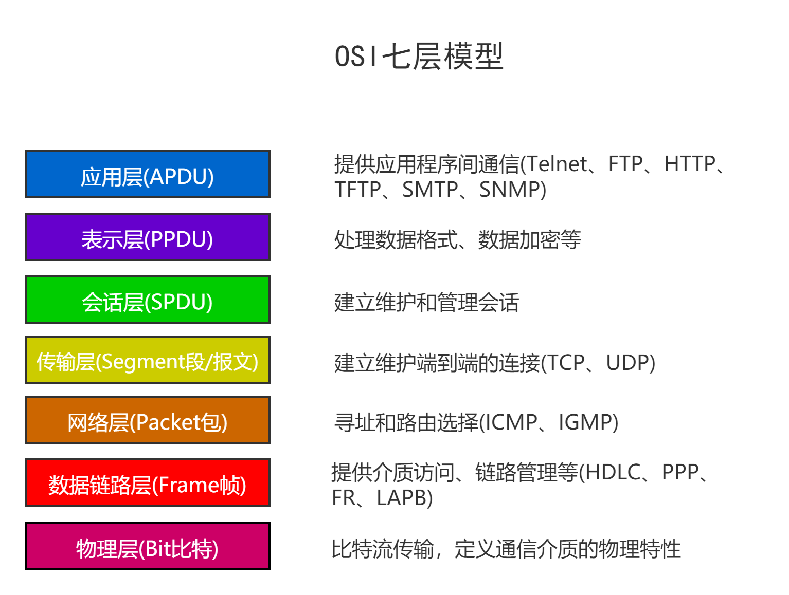
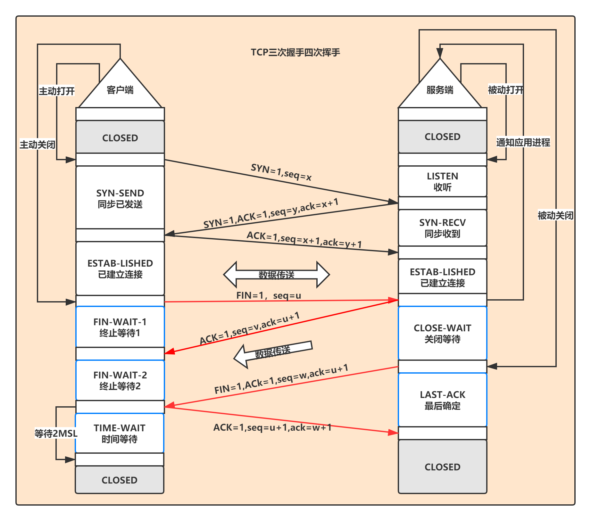
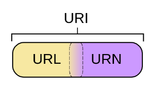
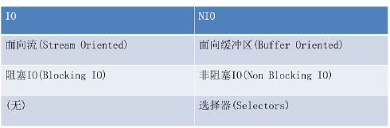
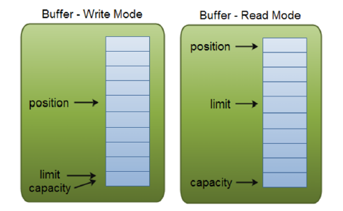
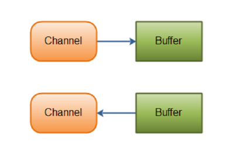
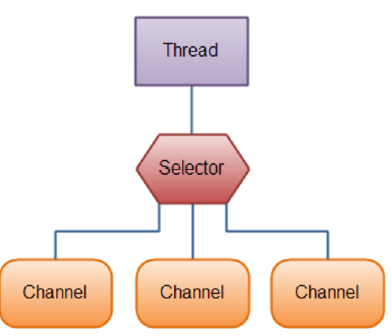

# 网络编程

## 网络编程概述

- Java是 Internet 上的语言，它从语言级上提供了对网络应用程序的支持，程序员能够很容易开发常见的网络应用程序。
- Java提供的网络类库，可以实现无痛的网络连接，联网的底层细节被隐藏在 Java 的本机安装系统里，由 JVM 进行控制。并且 Java 实现了一个跨平台的网络库，程序员面对的是一个统一的网络编程环境。

### 网络通信协议

- OSI模型



- TCP/IP


### IP 

`IP` 地址：`InetAddress`

- 唯一的标识` Internet `上的计算机（通信实体）
- 本地回环地址(`hostAddress`)：`127.0.0.1`     主机名(`hostName`)：`localhost`
- IP地址分类方式：
  - `IPV4` 和 `IPV6`
    - IPV4：4个字节组成，4个0-255。大概42亿，30亿都在北美，亚洲4亿。2011年初已经用尽。以点分十进制表示，如192.168.0.1
    -  IPV6：128位（16个字节），写成8个无符号整数，每个整数用四个十六进制位表示，数之间用冒号（：）分开，如：3ffe:3201:1401:1280:c8ff:fe4d:db39:1984
  - 公网地址(万维网使用)和私有地址(局域网使用)
    - 公网地址:
      - A类:地址范围`1.0.0.0~127.255.255.255`，主要分bai配给主机数量多、局域网数量少的大型网络;
      - B类:地址范围为`128.0.0.0至191.255.255.255`，一般为国际大公司及政府机构使用;
      - C类:地址范围为`192.0.0.0至223.255.255.255`，为一般小型公司校园网研究机构;
      - D类:地址范围由`224.0.0.0至239.255.255.255`。
      - E类:地址范围为`240.0.0.0至255.255.255.255`，暂时预留
    - 私有地址:
      - A类地址:`10.0.0.0~10.255.255.255`
      - B类地址:`172.16.0.0~172.31.255.255`
      - C类地址:`192.168.0.0~192.168.255.255`

### 端口

端口号标识正在计算机上运行的进程（程序）

- 不同的进程有不同的端口号
- 被规定为一个 16 位的整数 0~65535。
- 端口分类：
  - 公认端口：`0~1023`。被预先定义的服务通信占用（如：HTTP占用端口80，FTP占用端口21，Telnet占用端口23）~
  - 注册端口：`1024~49151`。分配给用户进程或应用程序。（如：Tomcat占用端口8080，MySQL占用端口3306，Oracle占用端口1521等）。
  - 动态/私有端口：49152~65535。
- 端口号与IP地址的组合得出一个网络套接字：Socket。

### InetAddress类

Internet上的主机有两种方式表示地址：

- 域名(hostName)：`localhost`

- IP 地址(hostAddress)：`127.0.0.1`

- InetAddress类主要表示IP地址，两个子类：Inet4Address、Inet6Address。

- 域名解析:

  - 域名容易记忆，当在连接网络时输入一个主机的域名后，域名服务器(DNS)负责将域名转化成IP地址，这样才能和主机建立连接。

- InetAddress类没有提供公共的构造器，而是提供了如下几个静态方法来获取InetAddress实例

  - `public static InetAddress getLocalHost()`
  - `public static InetAddress getByName(String host)`

- `InetAddress`提供了如下几个常用的方法

  - `public String getHostAddress()`：返回 IP 地址字符串（以文本表现形式）。
  - `public String getHostName()`：获取此 IP 地址的主机名
  - `public boolean isReachable(int timeout)`：测试是否可以达到该地址

  ```java
  public class InetAdressDemo {
      public static void main(String[] args) throws IOException {
          InetAddress inetAddress = InetAddress.getByName("www.baidu.com");
          System.out.println(inetAddress);
          InetAddress localhost = InetAddress.getLocalHost();
          System.out.println(localhost);
          // 获取域名
          System.out.println(localhost.getHostName());
          // 获取地址
          System.out.println(localhost.getHostAddress());
          // 相当于Ping
          System.out.println(localhost.isReachable(3));
      }
  }
  /*
  www.baidu.com/220.181.38.149
  Machine/192.168.133.1
  Machine
  192.168.133.1
  true*/
  ```

## 网络协议

- 网络通信协议
  - 计算机网络中实现通信必须有一些约定，即通信协议，对速率、传输代码、代码结构、传输控制步骤、出错控制等制定标准。
- TCP/IP协议簇:
  - 传输层协议中有两个非常重要的协议：
    - 传输控制协议TCP(Transmission Control Protocol)
    - 用户数据报协议UDP(User Datagram Protocol)。
- TCP/IP 以其两个主要协议：传输控制协议(TCP)和网络互联协议(IP)而得名，实际上是一组协议，包括多个具有不同功能且互为关联的协议。
- IP(Internet Protocol)协议是网络层的主要协议，支持网间互连的数据通信。
- TCP/IP协议模型从更实用的角度出发，形成了高效的四层体系结构，即物理链路层、IP层、传输层和应用层。

### TCP协议

- 使用TCP协议前，须先建立TCP连接，形成传输数据通道
- 传输前，采用“三次握手”方式，点对点通信，是可靠的
- TCP协议进行通信的两个应用进程：客户端、服务端。
- 在连接中可进行大数据量的传输
- 传输完毕，需释放已建立的连接，效率低
- TCP三次握手和四次挥手



### UDP协议：

- 将数据、源、目的封装成数据包，不需要建立连接
- 每个数据报的大小限制在64K内
- 发送不管对方是否准备好，接收方收到也不确认，故是不可靠的
- 可以广播发送
- 发送数据结束时无需释放资源，开销小，速度快

### Socket

- 利用套接字(Socket)开发网络应用程序早已被广泛的采用，以至于成为事实上的标准。
- 网络上具有唯一标识的IP地址和端口号组合在一起才能构成唯一能识别的标识符套接字。
- 通信的两端都要有Socket，是两台机器间通信的端点。
- 网络通信其实就是Socket间的通信。
- Socket允许程序把网络连接当成一个流，数据在两个Socket间通过IO传输。
- 一般主动发起通信的应用程序属客户端，等待通信请求的为服务端。
- Socket分类：
  - 流套接字（stream socket）：使用TCP提供可依赖的字节流服务
  - 数据报套接字（datagram socket）：使用UDP提供“尽力而为”的数据报服务
- Socket类的常用构造器：
  - `public Socket(InetAddress address,int port)`创建一个流套接字并将其连接到指定IP 地址的指定端口号。
  - `public Socket(String host,int port)`创建一个流套接字并将其连接到指定主机上的指定端口号。
- Socket类的常用方法：
  - `public InputStream getInputStream()`返回此套接字的输入流。可以用于接收网络消息
  - `public OutputStream getOutputStream()`返回此套接字的输出流。可以用于发送网络消息
  - `public InetAddress getInetAddress()`此套接字连接到的远程 IP 地址；如果套接字是未连接的，则返回null。
  - `public InetAddress getLocalAddress()`获取套接字绑定的本地地址。即本端的IP地址
  - `public int getPort()`此套接字连接到的远程端口号；如果尚未连接套接字，则返回0。
  - `public int getLocalPort()`返回此套接字绑定到的本地端口。 如果尚未绑定套接字，则返回 -1。即本端的端口号。
  - `public void close()`关闭此套接字。套接字被关闭后，便不可在以后的网络连接中使用（即无法重新连接或重新绑定）。需要创建新的套接字对象。 关闭此套接字也将会关闭该套接字的 InputStream 和OutputStream。
  - `public void shutdownInput()`如果在套接字上调用 shutdownInput() 后从套接字输入流读取内容，则流将返回EOF（文件结束符）。即不能在从此套接字的输入流中接收任何数据。
  - `public void shutdownOutput()`禁用此套接字的输出流。对于 TCP 套接字，任何以前写入的数据都将被发送，并且后跟 TCP 的正常连接终止序列。 如果在套接字上调用 shutdownOutput() 后写入套接字输出流，则该流将抛出IOException。即不能通过此套接字的输出流发送任何数据。

## TCP网络编程

### 客户端

- 客户端Socket的工作过程包含以下四个基本的步骤：
  - 创建Socket：根据指定服务端的 IP 地址或端口号构造 Socket 类对象。若服务器端响应，则建立客户端到服务器的通信线路。若连接失败，会出现异常。
  - 打开连接到Socket 的输入/出流：使用 getInputStream()方法获得输入流，使用getOutputStream()方法获得输出流，进行数据传输
  - 按照一定的协议对Socket  进行读/写操作：通过输入流读取服务器放入线路的信息（但不能读取自己放入线路的信息），通过输出流将信息写入线程。
  - 关闭Socket：断开客户端到服务器的连接，释放线路
- 客户端程序可以使用Socket类创建对象，创建的同时会自动向服务器方发起连接。Socket的构造器是：
  - Socket(String host,int port)throws UnknownHostException,IOException：向服务器(域名是host。端口号为port)发起TCP连接，若成功，则创建Socket对象，否则抛出异常。
  - Socket(InetAddress address,int port)throws IOException：根据InetAddress对象所表示的IP地址以及端口号port发起连接。
- 客户端建立socketAtClient对象的过程就是向服务器发出套接字连接请求

```java
public class SingleThreadServer {
    public static void main(String[] args) throws IOException {
        ServerSocket server = new ServerSocket(8090);
        Socket socket = server.accept();
        BufferedReader in = new BufferedReader(new InputStreamReader(socket.getInputStream()));
        PrintWriter out = new PrintWriter(socket.getOutputStream());

        while (true) {
            String msg = in.readLine();
            System.out.println(msg);
            out.println("Server received " + msg);
            out.flush();
            if (msg.equals("bye")) {
                break;
            }
        }
        socket.close();
    }
}
```

### 服务端

- 服务器程序的工作过程包含以下四个基本的步骤：
  - 调用 ServerSocket(int port) ：创建一个服务器端套接字，并绑定到指定端口上。用于监听客户端的请求。
  - 调用 accept()：监听连接请求，如果客户端请求连接，则接受连接，返回通信套接字对象。
  - 调用 该Socket类对象的 getOutputStream() 和 getInputStream ()：获取输出流和输入流，开始网络数据的发送和接收。
  - 关闭ServerSocket和Socket对象：客户端访问结束，关闭通信套接字
- ServerSocket 对象负责等待客户端请求建立套接字连接，类似邮局某个窗口中的业务员。也就是说，服务器必须事先建立一个等待客户请求建立套接字连接的ServerSocket对象。
- 所谓“接收”客户的套接字请求，就是accept()方法会返回一个 Socket 对象

```java
public class SingleThreadClient {
    public static void main(String[] args) throws IOException {
        Socket socket = new Socket("localhost", 8090);
        BufferedReader in = new BufferedReader(new InputStreamReader(socket.getInputStream()));
        PrintWriter out = new PrintWriter(socket.getOutputStream());
        BufferedReader reader = new BufferedReader(new InputStreamReader(System.in));

        while (true) {
            String msg = reader.readLine();
            out.println(msg);
            out.flush();
            if (msg.equals("bye")) {
                break;
            }
            System.out.println(in.readLine());
        }
        socket.close();
    }
}
```

## UDP网络编程

- 类 DatagramSocket 和 DatagramPacket 实现了基于 UDP 协议网络程序。
- UDP数据报通过数据报套接字 DatagramSocket 发送和接收，系统不保证UDP数据报一定能够安全送到目的地，也不能确定什么时候可以抵达。
- DatagramPacket 对象封装了UDP数据报，在数据报中包含了发送端的IP地址和端口号以及接收端的IP地址和端口号。
- UDP协议中每个数据报都给出了完整的地址信息，因此无须建立发送方和接收方的连接。如同发快递包裹一样。
- `DatagramSocket` 类的常用方法：
  - `public DatagramSocket(int port)`创建数据报套接字并将其绑定到本地主机上的指定端口。套接字将被绑定到通配符地址，IP 地址由内核来选择。
  - `public DatagramSocket(int port,InetAddress laddr)`创建数据报套接字，将其绑定到指定的本地地址。本地端口必须在 0 到 65535 之间（包括两者）。如果IP 地址为 0.0.0.0，套接字将被绑定到通配符地址，IP 地址由内核选择。
  - `public void close()`关闭此数据报套接字。
  - `public void send(DatagramPacket p)`从此套接字发送数据报包。DatagramPacket 包含的信息指示：将要发送的数据、其长度、远程主机的IP 地址和远程主机的端口号。
  - `public void receive(DatagramPacket p)`从此套接字接收数据报包。当此方法返回时，DatagramPacket的缓冲区填充了接收的数据。数据报包也包含发送方的 IP 地址和发送方机器上的端口号。 此方法在接收到数据报前一直阻塞。数据报包对象的 length 字段包含所接收信息的长度。如果信息比包的长度长，该信息将被截短。
  - `public InetAddress getLocalAddress()`获取套接字绑定的本地地址。
  - `public int getLocalPort()`返回此套接字绑定的本地主机上的端口号。
  - `public InetAddress getInetAddress()`返回此套接字连接的地址。如果套接字未连接，则返回null。
  - `public int getPort()`返回此套接字的端口。如果套接字未连接，则返回-1。
  - `public DatagramPacket(byte[] buf,int length)`构造 DatagramPacket，用来接收长度为length 的数据包。length 参数必须小于等于buf.length。
  - `public DatagramPacket(byte[] buf,int length,InetAddress address,int port)`构造数据报包，用来将长度为 length 的包发送到指定主机上的指定端口号。length参数必须小于等于buf.length。
  - `public InetAddress getAddress()`返回某台机器的 IP 地址，此数据报将要发往该机器或者是从该机器接收到的。
  - `public int getPort()`返回某台远程主机的端口号，此数据报将要发往该主机或者是从该主机接收到的。
  - `public byte[] getData()`返回数据缓冲区。接收到的或将要发送的数据从缓冲区中的偏移量offset 处开始，持续length 长度
  - `public int getLength()`返回将要发送或接收到的数据的长度。
- 流 程：
  1. DatagramSocket与DatagramPacket
  2. 建立发送端，接收端
  3. 建立数据包
  4. 调用Socket的发送、接收方法
  5. 关闭Socket

### 发送端

```java
@Test
public void client() {
    try (DatagramSocket socket = new DatagramSocket();) {
        byte[] bytes = "UDP 通信".getBytes();
        DatagramPacket packet = new DatagramPacket(bytes, 0, bytes.length, InetAddress.getByName("127.0.0.1"), 9999);
        socket.send(packet);
    } catch (IOException e) {
        e.printStackTrace();
    }
}
```

### 接收端

```java
@Test
public void server() {
    try (DatagramSocket socket = new DatagramSocket(9999);) {
        byte[] bytes = new byte[1024];
        DatagramPacket packet = new DatagramPacket(bytes, 0, bytes.length);
        socket.receive(packet);
        String s = new String(packet.getData(), 0, packet.getLength());
        System.out.println(s + ":" + packet.getAddress());
    } catch (IOException e) {
        e.printStackTrace();
    }
}
```

## URL编程

- URL(Uniform Resource Locator)：统一资源定位符，它表示 Internet 上某一资源的地址。
- 它是一种具体的URI，即URL可以用来标识一个资源，而且还指明了如何locate这个资源。
- 通过 URL 我们可以访问 Internet 上的各种网络资源，比如最常见的 www，ftp站点。浏览器通过解析给定的 URL 可以在网络上查找相应的文件或其他资源。
- URL的基本结构由5部分组成：
  - <传输协议>://<主机名>:<端口号>/<文件名>#片段名?参数列表#片段名：即锚点，例如看小说，直接定位到章节
  - 参数列表格式：参数名=参数值&参数名=参数值
- 为了表示URL，java.net 中实现了类 URL。我们可以通过下面的构造器来初始化一个 URL 对象：
  - `public URL (String spec)`：通过一个表示URL地址的字符串可以构造一个URL对象。
  - `public URL(URL context, String spec)`：通过基 URL 和相对 URL 构造一个 URL 对象。
  - `public URL(String protocol, String host, String file)`; 
  - `public URL(String protocol, String host, int port, String file);` 
- URL类的构造器都声明抛出非运行时异常，必须要对这一异常进行处理，通常是用 try-catch 语句进行捕获。
- HTTP协议的URLConnection类:
  - URL的方法 openStream()：能从网络上读取数据
  - 若希望输出数据，例如向服务器端的 CGI （公共网关接口-Common Gateway Interface-的简称，是用户浏览器和服务器端的应用程序进行连接的接口）程序发送一些数据，则必须先与URL建立连接，然后才能对其进行读写，此时需要使用URLConnection
  - URLConnection：表示到URL所引用的远程对象的连接。当与一个URL建立连接时，首先要在一个 URL 对象上通过openConnection() 生成对应的 URLConnection对象。如果连接过程失败，将产生IOException.

```java
public class URLDemo {
    public static void main(String[] args) throws IOException {
        URL url = new URL("https://compounds.oss-cn-beijing.aliyuncs.com/study/img-0b1faaf53ef51e5d33a8f40e4dd8d36f.jpg");
        InputStream stream = url.openConnection().getInputStream();
        File file = new File("photo.jpg");
        FileOutputStream fileOutputStream = new FileOutputStream(file);
        byte[] bytes = new byte[1024];
        int len = 0;
        while ((len = stream.read(bytes)) != -1) {
            fileOutputStream.write(bytes,0,len);
        }
    }
}
```

### URI、URL和URN的区别

- URI: Uniform Resource Identifier 统一资源标识符
  - URI 的格式由 **URI 协议名**（例如 http, ftp, mailto, file），**一个冒号**，和**协议对应的内容**组成。**特定的协议定义了协议内容的语法和语义，而所有的协议都必须遵循一定的 URI 文法通用规则**。URI 文法同时也就各种原因对协议内容加以其他的限制，例如，保证各种分层协议之间的协同性。百分号编码也为 URI 提供了附加信息。
- URL: Uniform Resource Locator 统一资源定位符
  - 一种具体的 URI，即 URL 可以用来标识一个资源，而且还指名了如何 locate（定位）这个资源。通俗的讲，URL 是 Internet 上用来描述资源的字符串，标识了一个互联网资源，并指定了对其进行操作或者获取资源的方法。目前最大的缺点是当信息资源的存放地点发生变化时，必须对 URL 作出相应的改变
- URN: Uniform Resource Name 统一资源名称
  - URN 是基于某名字空间通过名称指定资源的 URI。人们可以通过 URN 来指出某个资源，而无需指出其位置和获得方式。资源无需是基于互联网的
- 区别：
  - **URI 指的是一个资源，URL 指的是用地址定位一个资源，URN 指的是用名称定位一个资源。 即URL 和 URN 是 URI 的子集。**



## [NIO](http://tutorials.jenkov.com/java-nio/index.html)

### 简介

> java.nio全称Java non-blocking IO或Java New IO，是从jdk1.4 开始引入的一套新的IO api（New IO） ，为所有的原始类型（boolean类型除外）提供缓存支持的数据容器，使用它可以提供非阻塞式的高伸缩性网络。

- IO操作的模式：
  - PIO(Programming Input Ouput): 所有的IO操作由CPU处理，CPU占用率比较高
  - DMA(Direct Memory Access):CPU把IO操作控制权交给DMA控制器，只能以固定的方式读写，CPU空闲做其他工作。
  - 通道方式(Channel)：能执行有限通道指令的IO控制器，代替CPU管理控制外设。通道有自己的指令系统，是一个协处理器，具有更强的独立处理数据输入和输出的能力。
- Java NIO 由以下几个核心部分组成
  - Buffer:缓存区
  - Channel:通道
  - Selector:选择器(轮询器)
- NIO 和 普通IO的区别



### Buffer

- Java NIO中的Buffer用于和NIO通道进行交互。如你所知，数据是从通道读入缓冲区，从缓冲区写入到通道中的。
- 缓冲区本质上是一块可以写入数据，然后可以从中读取数据的内存。这块内存被包装成NIO Buffer对象，并提供了一组方法，用来方便的访问该块内存。
- Java NIO 里 Buffer的实现
  - ByteBuffer 
  - CharBuffer 
  - DoubleBuffer
  -  FloatBuffer
  - IntBuffer 
  - LongBuffer 
  - ShortBuffer

- Buffer的基本用法

  - 创建缓冲区，写入数据到Buffer
  2.	调flip()方法
  3.	从Buffer中读取数据
  - 调用clear()方法或者compact()方法
  - 当向buffer写入数据时，buffer会记录下写了多少数据。一旦要读取数据，需要通过flip()方法将Buffer从写模式切换到读模式。在读模式下，可以读取之前写入到buffer的所有数据。
  - 一旦读完了所有的数据，就需要清空缓冲区，让它可以再次被写入。有两种方式能清空缓冲区：调用clear()或compact()方法。clear()方法会清空整个缓冲区。compact()方法只会清除已经读过的数据。任何未读的数据都被移到缓冲区的起始处，新写入的数据将放到缓冲区未读数据的后面。

- Buffer 中的`capacity,position ,limit`

  - 缓冲区本质上是一块可以写入数据，然后可以从中读取数据的内存。这块内存被包装成NIO Buffer对象，并提供了一组方法，用来方便的访问该块内存。

  - position和limit的含义取决于Buffer处在读模式还是写模式。不管Buffer处在什么模式，capacity的含义总是一样的。

    

- 为了理解Buffer的工作原理，需要熟悉它的三个属性：

  - capacity

    作为一个内存块，Buffer有一个固定的大小值，也叫“capacity”.你只能往里写capacity个byte、long，char等类型。一旦Buffer满了，需要将其清空（通过读数据或者清除数据）才能继续写数据往里写数据。

  - position
    当你写数据到Buffer中时，position表示当前的位置。初始的position值为0.当一个byte、long等数据写到Buffer后， position会向前移动到下一个可插入数据的Buffer单元。position最大可为capacity – 1.
    当读取数据时，也是从某个特定位置读。当将Buffer从写模式切换到读模式，position会被重置为0. 当从Buffer的position处读取数据时，position向前移动到下一个可读的位置。

  - limit
    在写模式下，Buffer的limit表示你最多能往Buffer里写多少数据。 写模式下，limit等于Buffer的capacity。
    当切换Buffer到读模式时， limit表示你最多能读到多少数据。因此，当切换Buffer到读模式时，limit会被设置成写模式下的position值。换句话说，你能读到之前写入的所有数据（limit被设置成已写数据的数量，这个值在写模式下就是position）

- Buffer的分配

  - 要想获得一个Buffer对象首先要进行分配。 每一个Buffer类都有一个allocate方法。下面是一个分配1024字节capacity的ByteBuffer的例子。

  ```java
   ByteBuffer buf = ByteBuffer.allocate(1024);//创建间接缓冲区，大小为1024个字节ByteBuffer   	
   buf2= ByteBuffer.allocateDirect(1024);//直接缓冲区
  ```

  - 直接缓冲区和间接缓冲区的区别：间接缓冲区：在堆中开辟，易于管理，垃圾回收器可以回收，空间有限，读写文件速度较慢。
  - 直接缓冲区：不在堆中，物理内存中开辟空间，空间比较大，读写文件速度快，缺点：不受垃圾回收器控制，创建和销毁耗性能。

- 写数据到Buffer有两种方式

  - 从Channel写到Buffer。
  - 通过Buffer的put()方法写到Buffer里。`buf.put(127);`
  - put方法有很多版本，允许你以不同的方式把数据写入到Buffer中。例如， 写到一个指定的位置，或者把一个字节数组写入到Buffer。 

- `flip()`:

  - flip方法将Buffer从写模式切换到读模式。调用flip()方法会将position设回0，并将limit设置成之前position的值。

- 从Buffer中读取数据有两种方式：

  - 从Buffer读取数据到Channel。
  2.	使用get()方法从Buffer中读取数据。` byte aByte = buf.get();` 

- `rewind()`:

  - Buffer.rewind()将position设回0，所以你可以重读Buffer中的所有数据。limit保持不变，仍然表示能从Buffer中读取多少个元素（byte、char等）。

- `clear() compact()`:

  -   一旦读完Buffer中的数据，需要让Buffer准备好再次被写入。可以通过clear()或compact()方法来完成。
  - 如果调用的是clear()方法，position将被设回0，limit被设置成 capacity的值。换句话说，Buffer 被清空了。 Buffer中的数据并未清除，只是这些标记告诉我们可以从哪里开始往Buffer里写数据。
  - 如果Buffer中有一些未读的数据，调用clear()方法，数据将“被遗忘”，意味着不再有任何标记会告诉你哪些数据被读过，哪些还没有。
  - 如果Buffer中仍有未读的数据，且后续还需要这些数据，但是此时想要先写些数据，那么使用compact()方法。
  - compact()方法将所有未读的数据拷贝到Buffer起始处。然后将position设到最后一个未读元素正后面。limit属性依然clear()方法一样，设置成capacity。现在Buffer准备好写数据了，但是不会覆盖未读的数据。

- `mark() reset()`:

  - 通过调用Buffer.mark()方法，可以标记Buffer中的一个特定position。之后可以通过调用Buffer.reset()方法恢复到这个position

    ```java
    buffer.mark(); //添加标记
    buffer.reset();//恢复到标记位置
    ```

### Channel

基本上，所有的 IO 在NIO 中都从一个Channel 开始。Channel 有点象流。 数据可以从Channel读到Buffer中，也可以从Buffer 写到Channel中。这里有个图示：



JAVA NIO中的一些主要Channel的实现：

- FileChannel 

  - Java NIO中的FileChannel是一个连接到文件的通道。可以通过文件通道读写文件。 FileChannel无法设置为非阻塞模式，它总是运行在阻塞模式下。

  -  创建FileChannel

    - 第一种：使用一个InputStream、OutputStream或RandomAccessFile来获取一个FileChannel实例。

    - 第二种：JDK1.7之后才能使用, FileChannel.open()方法。

      ```java
       //第一种
      RandomAccessFile aFile = new RandomAccessFile("data/nio-data.txt", "rw");
      FileChannel inChannel = aFile.getChannel();
      //第二种
      FileChannel inChannel = FileChannel.open(Paths.get("d:\\aaa.txt"),StandardOpenOption.READ);
      ```

  - FileChannel读取数据

    -   调用多个read()方法之一从FileChannel中读取数据。

      ```java
      ByteBuffer buf = ByteBuffer.allocate(48); 
      int bytesRead = inChannel.read(buf);
      ```

    - 首先，分配一个Buffer。从FileChannel中读取的数据将被读到Buffer中。

    - 然后，调用FileChannel.read()方法。该方法将数据从FileChannel读取到Buffer中。read()方法返回的int值表示了有多少字节被读到了Buffer中。如果返回-1，表示到了文件末尾。

  - 向FileChannel写入数据

    - 使用FileChannel.write()方法向FileChannel写数据，该方法的参数是一个Buffer。

      ```java
      String newData = "New String to write to file..." + System.currentTimeMillis();
      ByteBuffer buf = ByteBuffer.allocate(48);
      buf.clear();
      buf.put(newData.getBytes());
      buf.flip();
      while(buf.hasRemaining()) {
           channel.write(buf);
      }
      ```

    -  注意FileChannel.write()是在while循环中调用的。因为无法保证write()方法一次能向FileChannel写完所有字节，因此需要重复调用write()方法，直到Buffer中已经没有尚未写入通道的字节。

  - 关闭`FileChannel`:` channel.close();`

  ```java
  public class FileChannelDemo {
      public static void main(String[] args) throws IOException {
          //1获取通道
          FileChannel ifc = FileChannel.open(Paths.get("photo.jpg"), StandardOpenOption.READ);
          FileChannel ofc = FileChannel.open(Paths.get("photo2.jpg"), StandardOpenOption.CREATE, StandardOpenOption.WRITE);
          //2创建缓冲区
          ByteBuffer bf = ByteBuffer.allocate(1024);
          //4向缓冲区中放入数据
          int len;
          while ((len = ifc.read(bf)) != -1) {
              bf.flip();
              ofc.write(bf);
              bf.clear();
          }
          ifc.close();
          ofc.close();
      }
  }
  ```

  - 使用内存映射

  ```java
  public class FileChannelDemo {
      public static void main(String[] args) throws IOException {
          FileChannel ifc = new RandomAccessFile("photo.jpg", "r").getChannel();
          FileChannel ofc = new RandomAccessFile("photo1.jpg", "rw").getChannel();
          MappedByteBuffer map = ifc.map(FileChannel.MapMode.READ_ONLY, 0, ifc.size());
          ofc.write(map);
          ifc.close();
          ofc.close();
      }
  }
  ```

- DatagramChannel 

  - UDP

  - 发送端

    ```java
    @Test
    public void client() throws IOException {
        DatagramChannel open = DatagramChannel.open();
        InetSocketAddress address = new InetSocketAddress("127.0.0.1", 9898);
        open.send(ByteBuffer.wrap("发包".getBytes("UTF-8")), address);
    
    }
    ```

  - 收送端

    ```java
    @Test
    public void server() throws IOException {
        DatagramChannel dc = DatagramChannel.open();
        DatagramChannel channel = dc.bind(new InetSocketAddress(9898));
        ByteBuffer buffer = ByteBuffer.allocate(1024);
        SocketAddress receive = channel.receive(buffer);
        System.out.println(receive.toString());
        System.out.println(new String(buffer.array()));
    }
    ```

  - 连接到特定的地址

    - 可以将DatagramChannel“连接”到网络中的特定地址的。由于UDP是无连接的，连接到特定地址并不会像TCP通道那样创建一个真正的连接。而是锁住DatagramChannel ，让其只能从特定地址收发数据。

    ```java
    channel.connect(new InetSocketAddress("jenkov.com", 80));
    ```

    - 当连接后，也可以使用read()和write()方法，就像在用传统的通道一样。只是在数据传送方面没有任何保证。

    ```java
    int bytesRead = channel.read(buf);
    int bytesWritten = channel.write(but);
    ```

- SocketChannel

  - SocketChannel是一个基于通道的客户端套接字,等同于Socket类。

  - TCPClient

    ```java
    public class NIOTCPClient {
        public static void main(String[] args) throws IOException {
            //1创建SocketChannel
            SocketChannel sc=SocketChannel.open(new InetSocketAddress("127.0.0.1", 1234));  //2创建缓冲区
            String string="你还好吗?";
            ByteBuffer buffer= ByteBuffer.allocate(1024);
            buffer.put(string.getBytes());
            buffer.flip();
            //3发送数据
            sc.write(buffer);
            //4关闭
            sc.close();
        }
    }
    ```

-  ServerSocketChannel

  - ServerSocketChannel是一个基于通道的socket监听器,等同于ServerSocket类。

    - TCPServer 

    ```java
    public class NIOTCPServer {
        public static void main(String[] args) throws IOException {
            //1创建ServerSocketChannel
            ServerSocketChannel ssc = ServerSocketChannel.open();  //2绑定地址
            ssc.bind(new InetSocketAddress("127.0.0.1", 1234));  //3监听
            SocketChannel sc = ssc.accept();
            //4创建缓冲区
            ByteBuffer buffer = ByteBuffer.allocate(1024);
            // 读数据
            int len = sc.read(buffer);
            buffer.flip();
            System.out.println(new String(buffer.array(), 0, len));
            //5关闭
            sc.close();
        }
    }
    ```

### Selector

- 要使用Selector，得向Selector注册Channel，然后调用它的select()方法。这个方法会一直阻塞到某个注册的通道有事件就绪。一旦这个方法返回，线程就可以处理这些事件，事件的例子有如新连接进来，数据接收等。
- 选择器提供选择执行已经就绪的任务的能力.从底层来看，Selector提供了询问通道是否已经准备好执行每个I/O操作的能力。Selector 允许单线程处理多个Channel。仅用单个线程来处理多个Channels的好处是，只需要更少的线程来处理通道。事实上，可以只用一个线程处理所有的通道，这样会大量的减少线程之间上下文切换的开销。



- `Selector`
  -  Selector选择器类管理着一个被注册的通道集合的信息和它们的就绪状态。通道是和选择器一起选被择注器册（的，并且使：用选择器来更新通道的就绪状态。
- `SelectableChannel`
  -  SelectableChannel这个抽象类提供了实现通道的可选择性所需要的公共方法可。选它择是通所道有支持就绪检查的通道类：的父类。因为FileChannel类没有继承SelectableChannel因此是不是可选通道，而所有socket通道都是可选择的，SocketChannel和ServerSocketChannel是SelectableChannel的子类。
- `SelectionKey`
  -  选择键封装了特定的通道与特定的选择器的注册关系。选择键对象被S选el择ec键tableChannel.regi：ster()返回并提供一个表示这种注册关系的标记。选择键包含了两个比特集(以整数的形式进行编码)，选择键支持四种操作类型：
    - Connect 连接
    - Accept  接受请求
    - Read 读
    - Write 写
  - Java中定义了四个常量来表示这四种操作类型：
    - `SelectionKey.OP_CONNECT `
    - `SelectionKey.OP_ACCEPT `
    - `SelectionKey.OP_READ `
    - `SelectionKey.OP_WRITE`

### 非阻塞IO的TCP

服务端

```java
public class NIOServer {
    public static void main(String[] args) throws IOException {
        //1创建ServerSocketChannel
        ServerSocketChannel ssc = ServerSocketChannel.open();  //2设置为非阻塞式
        ssc.configureBlocking(false);
        //3绑定地址
        ssc.bind(new InetSocketAddress("127.0.0.1", 9999));  //4创建选择器
        Selector selector = Selector.open();
        //5注册选择器
        ssc.register(selector, SelectionKey.OP_ACCEPT);
        while (selector.select() > 0) {
            Iterator<SelectionKey> it = selector.selectedKeys().iterator();
            while (it.hasNext()) {
                SelectionKey selectionKey = it.next();
                if (selectionKey.isAcceptable()) {
                    SocketChannel socketChannel = ssc.accept();
                    socketChannel.configureBlocking(false);
                    socketChannel.register(selector, selectionKey.OP_READ);
                } else if (selectionKey.isReadable()) {
                    //获取SocketChannel
                    SocketChannel channel = (SocketChannel) selectionKey.channel();  //创建缓冲区
                    ByteBuffer buffer = ByteBuffer.allocate(1024);
                    int len = 0;
                    while ((len = channel.read(buffer)) > 0) {
                        buffer.flip();
                        System.out.println(new String(buffer.array(), 0, len));
                        buffer.clear();
                    }
                    if (len == -1) {//客户端已经退出
                        channel.close();
                    }
                }
                it.remove();
            }
        }
    }
}
```

客户端

```java
public class NIOClient {
    public static void main(String[] args) throws IOException {
        //1创建SocketChannel
        SocketChannel sc = SocketChannel.open(new InetSocketAddress("127.0.0.1", 9999));  //2设置为非阻塞式
        sc.configureBlocking(false);
        //3创建缓冲区
        ByteBuffer buffer = ByteBuffer.allocate(1024);
        Scanner input = new Scanner(System.in);
        while (input.hasNext()) {
            String s = input.nextLine();
            buffer.put(s.getBytes());
            buffer.flip();
            sc.write(buffer);
            buffer.clear();
            if (s.equals("exit")) {
                break;
            }
        }
        sc.close();
    }
}
```

