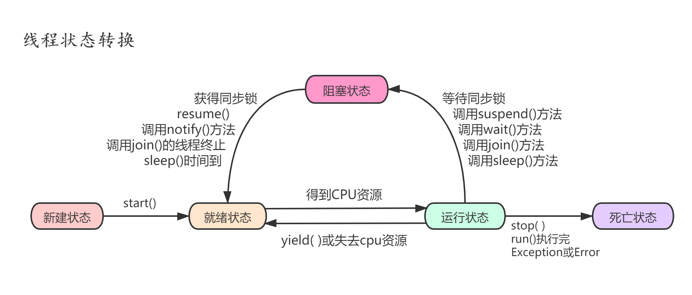

# 多线程

## 基本概念：程序、进程、线程

- 程序
  - 程序(program)是为完成特定任务、用某种语言编写的一组指令的集合。即指一段静态的代码，静态对象。

- 进程
  - 进程(process)是程序的一次执行过程，或是正在运行的一个程序。是一个动态的过程：有它自身的产生、存在和消亡的过程。——生命周期

    - 如：运行中的QQ，运行中的MP3播放器
    - 程序是静态的，进程是动态的
    - 进程作为资源分配的单位，系统在运行时会为每个进程分配不同的内存区域

- 线程
  - 线程(thread)，进程可进一步细化为线程，是一个程序内部的一条执行路径。
    - 若一个进程同一时间并行执行多个线程，就是支持多线程的
    - 线程作为调度和执行的单位，每个线程拥有独立的运行栈和程序计数器(pc)，线程切换的开销小
    - 一个进程中的多个线程共享相同的内存单元/内存地址空间它们从同一堆中分配对象，可以访问相同的变量和对象。这就使得程间通信更简便、高效。但多个线程操作共享的系统资源可能就会带来安全的隐患。
- 单核CPU和多核CPU的理解
  - 单核CPU，其实是一种假的多线程，因为在一个时间单元内，也只能执行一个线程的任务。例如：虽然有多车道，但是收费站只有一个工作人员在收费，只有收了费才能通过，那么CPU就好比收费人员。如果有某个人不想交钱，那么收费人员可以把他“挂起”（晾着他，等他想通了，准备好了钱，再去收费）。但是因为CPU时间单元特别短，因此感觉不出来。
  - 如果是多核的话，才能更好的发挥多线程的效率。（现在的服务器都是多核的）
  - 一个Java应用程序java.exe，其实至少有三个线程：main()主线程，gc()垃圾回收线程，异常处理线程。当然如果发生异常，会影响主线程。
- 并行与并发
  - 并行：多个CPU同时执行多个任务。比如：多个人同时做不同的事。
  - 并发：一个CPU(采用时间片)同时执行多个任务。比如：秒杀、多个人做同一件事。
- 使用多线程的优点
  - 提高应用程序的响应。对图形化界面更有意义，可增强用户体验。
  2.	提高计算机系统CPU的利用率
  3.	改善程序结构。将既长又复杂的进程分为多个线程，独立运行，利于理解和修改
- 注意：以单核CPU为例，只使用单个线程先后完成多个任务（调用多个方法），肯定比用多个线程来完成用的时间更短。

## JDK5之前创建多线程的两种方式

### 继承Thread类的方式

- 定义子类继承Thread类。
- 子类中重写Thread类中的run方法。
- 创建Thread子类对象，即创建了线程对象。
- 调用线程对象start方法：启动线程，调用run方法。

```java
public class ThreadWayI {

    public static void main(String[] args) {
        System.out.println(Thread.currentThread().getName());
        PrimeThread p1 = new PrimeThread();
        p1.start();
    }
}

class PrimeThread extends Thread {

    @Override
    public void run() {
        System.out.println(Thread.currentThread().getName());
    }
}
```

- 注意点:
  - 如果自己手动调用run()方法，那么就只是普通方法，没有启动多线程模式。
  2.	run()方法由JVM调用，什么时候调用，执行的过程控制都有操作系统的CPU调度决定。
  3.	想要启动多线程，必须调用start方法。
  4.	一个线程对象只能调用一次start()方法启动，如果重复调用了，则将抛出以上的异常`IllegalThreadStateException`。

### 实现Runnable接口的方式

- 定义子类，实现Runnable接口。
- 子类中重写Runnable接口中的run方法。
- 通过Thread类含参构造器创建线程对象。
- 将Runnable接口的子类对象作为实际参数传递给Thread类的构造器中。
- 调用Thread类的start方法：开启线程，调用Runnable子类接口的run方法。

```java
public class ThreadWayII {
    public static void main(String[] args) {
//        3.创建实现类对象
        MyPrimeThread m1 = new MyPrimeThread();
        // 4.创建Thread对象,将实现类对象作为参数放入Thread构造器中
        // 5.通过Thread对象调用start()方法
 /*        为什么会调用我们重写的run()方法
         原因：  if (this.target != null) {
                    this.target.run();
                }
         private Runnable target;
         public Thread(Runnable var1) 调用的是这个构造器*/
        new Thread(m1).start();
        System.out.println(Thread.currentThread().getName());
    }
}

//1.创建一个实现了Runnable接口的类
class MyPrimeThread implements Runnable{
//    2.实现类中抽象方法run()
    @Override
    public void run() {
        System.out.println(Thread.currentThread().getName());
    }
}
```

### 两种方式的对比：

- 区别
  - 继承Thread：线程代码存放Thread子类run方法中。
  - 实现Runnable：线程代码存在接口的子类的run方法。
- 实现方式的好处
  - 避免了单继承的局限性
  - 多个线程可以共享同一个接口实现类的对象，非常适合多个相同线程来处理同一份资源。

### Thread类的有关方法

- `void start()`:  启动线程，并执行对象的run()方法
- `run()`:  线程在被调度时执行的操作
- `String getName()`:  返回线程的名称
- `void setName(String name)`:设置该线程名称
- `static Thread currentThread()`: 返回当前线程。在Thread子类中就是this，通常用于主线程和Runnable实现类
- `static  void  yield()`：线程让步
  - 暂停当前正在执行的线程，把执行机会让给优先级相同或更高的线程
  - 若队列中没有同优先级的线程，忽略此方法
- `join()` ：当某个程序执行流中调用其他线程的 join() 方法时，调用线程将被阻塞，直到 join() 方法加入的 join 线程执行完为止
  - 低优先级的线程也可以获得执行
- `static  void  sleep(long millis)`：(指定时间:毫秒)
  - 令当前活动线程在指定时间段内放弃对CPU控制,使其他线程有机会被执行,时间到后重排队。
  - 抛出`InterruptedException`异常
- `stop()`: 强制线程生命期结束，不推荐使用
- `boolean isAlive()`：返回boolean，判断线程是否还活着

```java
public class ThreadMethod {
    public static void main(String[] args) {
        MyThread thread = new MyThread();
        thread.setName("子线程一");
        thread.setPriority(Thread.MAX_PRIORITY);
        thread.start();
        Thread.currentThread().setName("主线程");
        Thread.currentThread().setPriority(Thread.MIN_PRIORITY);
        for (int i = 0; i < 100; i++) {
            System.out.println(Thread.currentThread().getName() + " :" + i);
            if (i == 50) {
                try {
                    thread.join();
                } catch (InterruptedException e) {
                    e.printStackTrace();
                }
            }
        }
    }
}

class MyThread extends Thread {
    @Override
    public void run() {
        for (int i = 0; i < 100; i++) {
            System.out.println(getName() + " :" + i);
            if (i == 20) {
                Thread.yield();
            }
        }
    }
}
```

### 线程的调度

- 调度策略
  - 时间片
  - 抢占式：高优先级的线程抢占CPU
- Java的调度方法
  - 同优先级线程组成先进先出队列（先到先服务），使用时间片策略
  - 对高优先级，使用优先调度的抢占式策略
- 线程的优先级
  - 线程的优先级等级
    - `MAX_PRIORITY：10`
    - `MIN _PRIORITY：1`
    - `NORM_PRIORITY：5`
- 涉及的方法
  - `getPriority() `：返回线程优先值
  - `setPriority(int newPriority)` ：改变线程的优先级
- 说明
  - 线程创建时继承父线程的优先级
  - 低优先级只是获得调度的概率低，并非一定是在高优先级线程之后才被调用

### 线程的分类

- Java中的线程分为两类：一种是守护线程，一种是用户线程。
- 它们在几乎每个方面都是相同的，唯一的区别是判断JVM何时离开。
- 守护线程是用来服务用户线程的，通过在start()方法前调用thread.setDaemon(true)可以把一个用户线程变成一个守护线程。
- Java垃圾回收就是一个典型的守护线程。
- 若JVM中都是守护线程，当前JVM将退出。
- 形象理解：兔死狗烹，鸟尽弓藏

### 线程的生命周期

- `JDK中用Thread.State`类定义了线程的几种状态
- 要想实现多线程，必须在主线程中创建新的线程对象。Java语言使用Thread类及其子类的对象来表示线程，在它的一个完整的生命周期中通常要经历如下的五种状态：
  - 新建： 当一个Thread类或其子类的对象被声明并创建时，新生的线程对象处于新建状态
  - 就绪：处于新建状态的线程被start()后，将进入线程队列等待CPU时间片，此时它已具备了运行的条件，只是没分配到CPU资源
  - 运行：当就绪的线程被调度并获得CPU资源时,便进入运行状态， run()方法定义了线程的操作和功能
  - 阻塞：在某种特殊情况下，被人为挂起或执行输入输出操作时，让出 CPU 并临时中止自己的执行，进入阻塞状态
  - 死亡：线程完成了它的全部工作或线程被提前强制性地中止或出现异常导致结束



- 生命周期关注两个概念：状态、相应的方法
- 关注：状态a-->状态b:哪些方法执行了（回调方法）
  - 某个方法主动调用：状态a-->状态b
- 阻塞：临时状态，不可以作为最终状态
- 死亡：最终状态。

## 线程的同步机制

- 多个线程执行的不确定性引起执行结果的不稳定
- 多个线程对账本的共享，会造成操作的不完整性，会破坏数据。
- 问题的原因：
  - 当多条语句在操作同一个线程共享数据时，一个线程对多条语句只执行了一部分，还没有执行完，另一个线程参与进来执行。导致共享数据的错误。
3.	解决办法：
- 对多条操作共享数据的语句，只能让一个线程都执行完，在执行过程中，其他线程不可以参与执行。
- Java解决方案：同步机制
  - 在Java中，我们通过同步机制，来解决线程的安全问题。

### 方式一：同步代码块

```java
synchronized(同步监视器){
    //需要被同步的代码
}
```

- 说明
  - 操作共享数据的代码，即为需要被同步的代码。  -->不能包含代码多了，也不能包含代码少了。
  - 共享数据：多个线程共同操作的变量。比如：ticket就是共享数据。
  - 同步监视器，俗称：锁。任何一个类的对象，都可以充当锁。
  - 要求：多个线程必须要共用同一把锁。
- 在实现Runnable接口创建多线程的方式中，我们可以考虑使用this充当同步监视器。在继承Thread类创建多线程的方式中，慎用this充当同步监视器，考虑使用当前类充当同步监视器。

### 方式二：同步方法

```java
public synchronized void show (String name){ 
    …
}
```

如果操作共享数据的代码完整的声明在一个方法中，我们不妨将此方法声明同步的。
*  关于同步方法的总结：
   *  同步方法仍然涉及到同步监视器，只是不需要我们显式的声明。
   *  非静态的同步方法，同步监视器是：this
   *     静态的同步方法，同步监视器是：当前类本身

### 方式三： Lock(锁)

- 从JDK 5.0开始，Java提供了更强大的线程同步机制——通过显式定义同步锁对象来实现同步。同步锁使用Lock对象充当。
- `java.util.concurrent.locks.Lock`接口是控制多个线程对共享资源进行访问的工具。锁提供了对共享资源的独占访问，每次只能有一个线程对Lock对象加锁，线程开始访问共享资源之前应先获得Lock对象。
- `ReentrantLock `类实现了 Lock ，它拥有与 synchronized 相同的并发性和内存语义，在实现线程安全的控制中，比较常用的是`ReentrantLock`，可以显式加锁、释放锁。
- synchronized 与 Lock 的对比
  - Lock是显式锁（手动开启和关闭锁，别忘记关闭锁），synchronized是隐式锁，出了作用域自动释放
  2.	Lock只有代码块锁，synchronized有代码块锁和方法锁
  3.	使用Lock锁，JVM将花费较少的时间来调度线程，性能更好。并且具有更好的扩展性（提供更多的子类）
- 优先使用顺序：
  - Lock >同步代码块（已经进入了方法体，分配了相应资源） >同步方法（在方法体之外）

```java
public class LockAndUnlock {
    public static void main(String[] args) {
        LockThread l1 = new LockThread();

        Thread t1 = new Thread(l1);
        Thread t2 = new Thread(l1);
        Thread t3 = new Thread(l1);

        t1.setName("线程1");
        t2.setName("线程2");
        t3.setName("线程3");

        t1.start();
        t2.start();
        t3.start();

    }
}

class LockThread implements Runnable {

    private int ticket = 100;
    //1.实例化ReentrantLock
    private ReentrantLock lock = new ReentrantLock();

    @Override
    public void run() {
        while (true) {
            try {

                //2.调用锁定方法lock()
                lock.lock();
                if (ticket > 0) {
                    try {
                        Thread.sleep(100);
                    } catch (InterruptedException e) {
                        e.printStackTrace();
                    }
                    System.out.println(Thread.currentThread().getName() + "：售票，票号为：" + ticket);
                    ticket--;
                } else {
                    break;
                }
            } finally {
                //3.调用解锁方法：unlock()
                lock.unlock();
            }
        }
    }
}
```


### 线程安全的单例模式(懒汉式)

```java

class Order {
    public Order() {
    }

    private static Order instance = null;

    // 第一种情况
    //  private static synchronized Order getInstance()
    private static Order getInstance() {
        /*if (instance == null) {
            instance = new Order();
        }
        return instance;*/
        // 第二种情况
        synchronized (Order.class) {
            if (instance == null) {
                instance = new Order();
            }
            return instance;
        }
    }
}

// 效率高的懒汉式
class Bank {
    public Bank() {
    }

    private static Bank instance = null;

    private static Bank getInstance() {

        if (instance == null) {
            synchronized (Bank.class) {
                if (instance == null) {
                    instance = new Bank();
                }
            }
        }
        return instance;
    }
}
```

### 线程的死锁问题

- 死锁

  - 不同的线程分别占用对方需要的同步资源不放弃，都在等待对方放弃自己需要的同步资源，就形成了线程的死锁
  - 出现死锁后，不会出现异常，不会出现提示，只是所有的线程都处于阻塞状态，无法继续

- 解决方法

  - 专门的算法、原则
  - 尽量减少同步资源的定义
  - 尽量避免嵌套同步

- 线程死锁举例

  ```java
  public class DeadLock {
      public static void main(String[] args) {
          StringBuffer s1 = new StringBuffer();
          StringBuffer s2 = new StringBuffer();
  
  
          new Thread() {
              @Override
              public void run() {
  
                  synchronized (s1) {
                      s1.append("a");
                      s2.append("1");
                      try {
                          Thread.sleep(100);
                      } catch (InterruptedException e) {
                          e.printStackTrace();
                      }
                      synchronized (s2) {
                          s1.append("b");
                          s2.append("2");
  
                          System.out.println(s1);
                          System.out.println(s2);
                      }
                  }
              }
          }.start();
  
          new Thread(new Runnable() {
              @Override
              public void run() {
                  synchronized (s2) {
                      s1.append("c");
                      s2.append("3");
                      try {
                          Thread.sleep(100);
                      } catch (InterruptedException e) {
                          e.printStackTrace();
                      }
                      synchronized (s1) {
                          s1.append("d");
                          s2.append("4");
                          System.out.println(s1);
                          System.out.println(s2);
                      }
                  }
              }
          }).start();
      }
  }
  ```

## 线程的通信

- `wait() 与 notify() 和 notifyAll()`
  - `wait()`:一旦执行此方法，当前线程就进入阻塞状态，并释放同步监视器。
  * `notify()`:一旦执行此方法，就会唤醒被wait的一个线程。如果有多个线程被wait，就唤醒优先级高的那个。
  * `notifyAll()`:一旦执行此方法，就会唤醒所有被wait的线程。
- 说明
  - `wait()，notify()，notifyAll()`三个方法必须使用在同步代码块或同步方法中。
  - `wait()，notify()，notifyAll()`三个方法的调用者必须是同步代码块或同步方法中的同步监视器。否则，会出现`IllegalMonitorStateException`异常
  - `wait()，notify()，notifyAll()`三个方法是定义在`java.lang.Object`类中。
- sleep() 和 wait()的异同？
  * 相同点：一旦执行方法，都可以使得当前的线程进入阻塞状态。
  * 不同点：
    * 两个方法声明的位置不同：Thread类中声明sleep() , Object类中声明wait()
    * 调用的要求不同：sleep()可以在任何需要的场景下调用。 wait()必须使用在同步代码块或同步方法中
    * 关于是否释放同步监视器：如果两个方法都使用在同步代码块或同步方法中，sleep()不会释放锁，wait()会释放锁。

```java
public class Communication {
    public static void main(String[] args) {
        Number number = new Number();
        Thread t1 = new Thread(number);
        Thread t2 = new Thread(number);
        t1.setName("线程1");
        t2.setName("线程2");
        t1.start();
        t2.start();
    }
}

class Number implements Runnable {
    private int number = 1;

    @Override
    public void run() {
        while (true) {
            synchronized (this) {
                notify();
                if (number <= 100) {
                    try {
                        sleep(10);
                    } catch (InterruptedException e) {
                        e.printStackTrace();
                    }
                    System.out.println(Thread.currentThread().getName() + "：打印出：" + number);
                    number++;
                    try {
                        wait();
                    } catch (InterruptedException e) {
                        e.printStackTrace();
                    }
                } else {
                    break;
                }
            }
        }
    }
}
```

### 生产者/消费者问题

> 生产者(Productor)将产品交给店员(Clerk)，而消费者(Customer)从店员处取走产品，店员一次只能持有固定数量的产品(比如:20），如果生产者试图生产更多的产品，店员会叫生产者停一下，如果店中有空位放产品了再通知生产者继续生产；如果店中没有产品了，店员会告诉消费者等一下，如果店中有产品了再通知消费者来取走产品。
>
> 这里可能出现两个问题：
>
> - 生产者比消费者快时，消费者会漏掉一些数据没有取到。
> - 消费者比生产者快时，消费者会取相同的数据。

```java
public class Product {
    public static void main(String[] args) {
        Clerk clerk = new Clerk();
        Producer producer = new Producer(clerk);
        Consumer consumer = new Consumer(clerk);
        producer.setName("生产者");
        consumer.setName("消费者");
        producer.start();
        consumer.start();
    }
}

class Clerk {
    private int productCount = 0;

    public synchronized void producerProduct() {
        if (productCount < 20) {
            productCount++;
            System.out.println(Thread.currentThread().getName() + "：开始生产了第" + productCount + "件产品");
            notify();
        } else {
            try {
                wait();
            } catch (InterruptedException e) {
                e.printStackTrace();
            }
        }
    }

    public synchronized void consumerProduct() {
        if (productCount > 0) {
            System.out.println(Thread.currentThread().getName() + "：开始消费了第" + productCount + "件产品");
            productCount--;
            notify();
        } else {
            try {
                wait();
            } catch (InterruptedException e) {
                e.printStackTrace();
            }
        }
    }
}
// 生产者
class Producer extends Thread {
    private Clerk clerk;

    public Producer(Clerk clerk) {
        this.clerk = clerk;
    }

    @Override
    public void run() {
        System.out.println(getName() + "开始生产了...");
        while (true) {
            try {
                sleep(15);
            } catch (InterruptedException e) {
                e.printStackTrace();
            }
            clerk.producerProduct();
        }
    }
}
// 消费者
class Consumer extends Thread {
    private Clerk clerk;

    public Consumer(Clerk clerk) {
        this.clerk = clerk;
    }

    @Override
    public void run() {
        System.out.println(getName() + "开始消费了...");
        while (true) {
            try {
                sleep(10);
            } catch (InterruptedException e) {
                e.printStackTrace();
            }
            clerk.consumerProduct();
        }
    }
}
```

### 释放锁的操作

- 当前线程的同步方法、同步代码块执行结束。
- 当前线程在同步代码块、同步方法中遇到break、return终止了该代码块、该方法的继续执行。
- 当前线程在同步代码块、同步方法中出现了未处理的Error或Exception，导致异常结束。
- 当前线程在同步代码块、同步方法中执行了线程对象的wait()方法，当前线程暂停，并释放锁。

### 不会释放锁的操作

- 线程执行同步代码块或同步方法时，程序调用`Thread.sleep()`、` Thread.yield()`方法暂停当前线程的执行
- 线程执行同步代码块时，其他线程调用了该线程的suspend()方法将该线程挂起，该线程不会释放锁（同步监视器）。
  - 应尽量避免使用suspend()和resume()来控制线程

## JDK5.0新增线程创建的方式

### 实现Callable接口

- 与使用Runnable相比， Callable功能更强大些
  - 相比run()方法，可以有返回值
  - 方法可以抛出异常
  - 支持泛型的返回值
  - 需要借助`FutureTask`类，比如获取返回结果
- `Future`接口
  - 可以对具体Runnable、Callable任务的执行结果进行取消、查询是否完成、获取结果等。
  - `FutrueTask`是`Futrue`接口的唯一的实现类
  - `FutureTask` 同时实现了`Runnable, Future`接口。它既可以作为`Runnable`被线程执行，又可以作为`Future`得到`Callable`的返回值

```java
public class ThreadWayIII {
    public static void main(String[] args) {
        //3.创建Callable接口实现类的对象
        othersPrimeThread othersPrimeThread = new othersPrimeThread();
        //4.将此Callable接口实现类的对象作为传递到FutureTask构造器中，创建FutureTask的对象
        FutureTask futureTask = new FutureTask(othersPrimeThread);
        //5.将FutureTask的对象作为参数传递到Thread类的构造器中，创建Thread对象，并调用start()
        new Thread(futureTask).start();

        try {
            //6.获取Callable中call方法的返回值
            //get()返回值即为FutureTask构造器参数Callable实现类重写的call()的返回值。
            Object count = futureTask.get();
            System.out.println(Thread.currentThread().getName() + " 输出的总和为：" + count);
        } catch (InterruptedException e) {
            e.printStackTrace();
        } catch (ExecutionException e) {
            e.printStackTrace();
        }

    }
}

//1.创建一个实现Callable的实现类
class othersPrimeThread implements Callable {
    private int count = 0;
    //2.实现call方法，将此线程需要执行的操作声明在call()中
    @Override
    public Object call() throws Exception {
        for (int i = 0; i <= 100; i++) {
            if (i % 2 == 0) {
                System.out.println(Thread.currentThread().getName() + "打印了：" + i);
                count += i;
            }
        }
        return count;
    }
}
```

### 线程池

- 背景：经常创建和销毁、使用量特别大的资源，比如并发情况下的线程，对性能影响很大。
- 思路：提前创建好多个线程，放入线程池中，使用时直接获取，使用完放回池中。可以避免频繁创建销毁、实现重复利用。类似生活中的公共交通工具。
- 好处：
  - 提高响应速度（减少了创建新线程的时间）
  - 降低资源消耗（重复利用线程池中线程，不需要每次都创建）
  - 便于线程管理
    - `corePoolSize`：核心池的大小
    - `maximumPoolSize`：最大线程数
    - `keepAliveTime`：线程没有任务时最多保持多长时间后会终止
- JDK 5.0起提供了线程池相关`API：ExecutorService 和 Executors`
- `ExecutorService`：真正的线程池接口。常见子类`ThreadPoolExecutor`
  - `void execute(Runnable command)` ：执行任务/命令，没有返回值，一般用来执行Runnable
  - `<T> Future<T> submit(Callable<T> task)`：执行任务，有返回值，一般又来执行Callable
  - `void shutdown()` ：关闭连接池
- `Executors`：工具类、线程池的工厂类，用于创建并返回不同类型的线程池
  - `Executors.newCachedThreadPool()`：创建一个可根据需要创建新线程的线程池
  - `Executors.newFixedThreadPool(n)`; 创建一个可重用固定线程数的线程池
  - `Executors.newSingleThreadExecutor()` ：创建一个只有一个线程的线程池
  - `Executors.newScheduledThreadPool(n)`：创建一个线程池，它可安排在给定延迟后运行命令或者定期地执行。

```java
public class ThreadPool {
    public static void main(String[] args) {
        ThreadPoolExecutor service = (ThreadPoolExecutor) Executors.newFixedThreadPool(10);
        // 设置属性
        // service.setCorePoolSize(15);
        service.submit(new ThreadTest()); // 支持Runnable 和 Callable
//        service.execute(new ThreadTest()); // 仅支持Runnable
        service.shutdown();

    }
}

class ThreadTest implements Runnable {
    @Override
    public void run() {
        for (int i = 0; i <= 100; i++) {
            System.out.println(Thread.currentThread().getName() + ":打印了:" + i);
        }
    }
}
```


