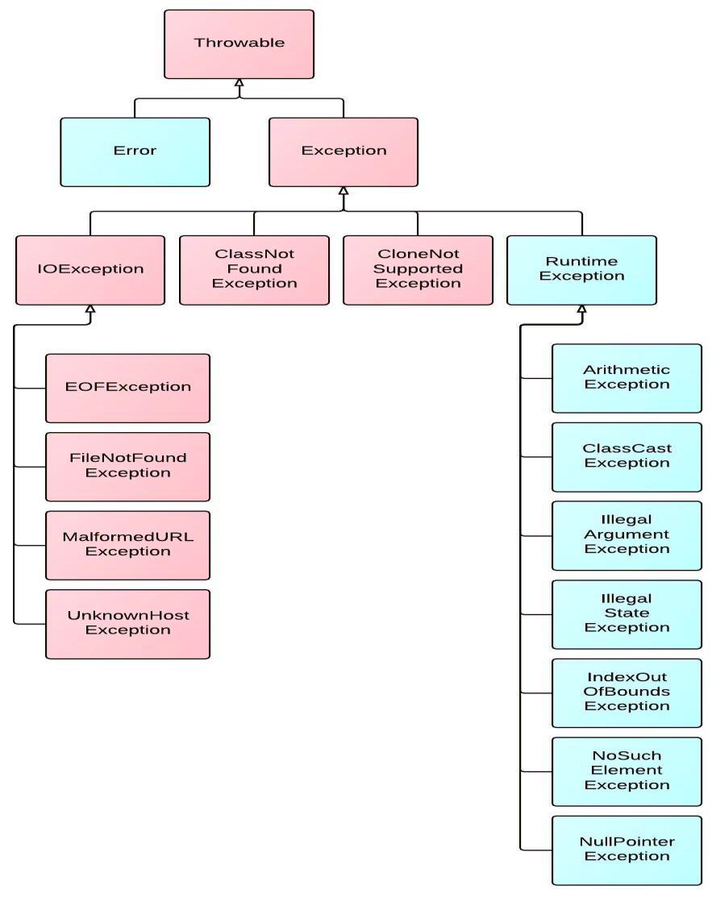

# 异常

### 异常概述

- 在`Java`语言中，将程序执行中发生的不正常情况称为“异常”。(开发过程中的语法错误和逻辑错误不是异常)
- `Java`程序在执行过程中所发生的异常事件可分为两类：
  - `Error`：`Java`虚拟机无法解决的严重问题。如：`JVM`系统内部错误、资源耗尽等严重情况。比如：`StackOverflowError`和`OOM`。一般不编写针对性的代码进行处理。
  - `Exception`: 其它因编程错误或偶然的外在因素导致的一般性问题，可以使用针对性的代码进行处理。例如：
    - 空指针访问
    - 试图读取不存在的文件
    - 网络连接中断
    - 数组角标越界
- 对于这些错误，一般有两种解决方法：一是遇到错误就终止程序的运行。另一种方法是由程序员在编写程序时，就考虑到错误的检测、错误消息的提示，以及错误的处理。
- 捕获错误最理想的是在编译期间，但有的错误只有在运行时才会发生。比如：除数为0，数组下标越界等
- 分类：编译时异常和运行时异常

### 异常体系结构



```
* java.lang.Throwable
*     |-----java.lang.Error:一般不编写针对性的代码进行处理。
*     |-----java.lang.Exception:可以进行异常的处理
*        |------编译时异常(checked)
*              |-----IOException
*                 |-----FileNotFoundException
*              |-----ClassNotFoundException
*        |------运行时异常(unchecked,RuntimeException)
*              |-----NullPointerException
*              |-----ArrayIndexOutOfBoundsException
*              |-----ClassCastException
*              |-----NumberFormatException
*              |-----InputMismatchException
*              |-----ArithmeticException
```

`java.lang.Throwable`

- `java.lang.Error:一般不编写针对性的代码进行处理。`
- `java.lang.Exception:可以进行异常的处理`
  - `编译时异常(checked)`
    - `IOException`
      - `FileNotFoundException`
    - `ClassNotFoundException`
  - `运行时异常(unchecked,RuntimeException)`
    - `NullPointerException`
    - `ArrayIndexOutOfBoundsException`
    - `ClassCastException`
    - `NumberFormatException`
    - `InputMismatchException`
    - `ArithmeticException`

## 异常处理

### java异常处理的抓抛模型

- `抛`：
  - 程序在正常执行的过程中，一旦出现异常，就会在异常代码处生成一个对应异常类的对象。并将此对象抛出。一旦抛出对象以后，其后的代码就不再执行。
- `抓`:
  - 可以理解为异常的处理方式：
    - `try-catch-finally`  
    - `throws`

### 异常处理方式

- `try-catch-finally`

  - 结构

    ```java
    try{
            //可能出现异常的代码
        }catch(异常类型1 变量名1){
        	//处理异常的方式1
        }catch(异常类型2 变量名2){
         	//处理异常的方式2
        }...
        finally{
     		//一定会执行的代码
        }
    ```

  - 说明

    1. `finally`是可选的。
    2. 使用`try`将可能出现异常代码包装起来，在执行过程中，一旦出现异常，就会生成一个对应异常类的对象，根据此对象的类型，去`catch`中进行匹配
    3. 一旦`try`中的异常对象匹配到某一个`catch`时，就进入`catch`中进行异常的处理。一旦处理完成，就跳出当前的`try-catch`结构（在没写`finally`的情况。继续执行其后的代码
    4. `catch`中的异常类型如果没子父类关系，则谁声明在上，谁声明在下无所谓。`catch`中的异常类型如果满足子父类关系，则要求子类一定声明在父类的上面。否则，报错
    5. 常用的异常对象处理的方式：
       - `String  getMessage()   `
       - `printStackTrace()`
    6. 在`try`结构中声明的变量，再出了`try`结构以后，就不能再被调用
    7. `try-catch-finally`结构可以嵌套
    8. 注意：
       - finally中声明的是一定会被执行的代码。即使catch中又出现异常了，try中return语句，catch中return语句等情况。
       - 像数据库连接、输入输出流、网络编程`Socket`等资源，`JVM`是不能自动的回收的，我们需要自己手动的进行资源的释放。此时的资源释放，就需要声明在`finally`中。
    
    ```java
    public class TryCatchFinally {
    
        // NumberFormatException
        @Test
        public void numberFormatException() {
            method();
    
        }
    
        public int method(){
            String str = "123";
            str = "abc";
            int num = 0;
            try {
                num = Integer.parseInt(str);
                return 1;
            }catch (NumberFormatException e){
                e.printStackTrace();
                return 2;
            }finally {
                System.out.println("一定会执行到我");
                return 3;
            }
        }
    
    }
    ```

- `throws + 异常类型`

  - `throws +异常类型`写在方法的声明处。指明此方法执行时，可能会抛出的异常类型。

  - 一旦当方法体执行时，出现异常，仍会在异常代码处生成一个异常类的对象，此对象满足`throws`后异常类型时，就会被抛出。异常代码后续的代码，就不再执行!

  - `try-catch-finally`:真正的将异常给处理掉了。`throws`的方式只是将异常抛给了方法的调用者。并没有真正将异常处理掉。

  - 体会开发中应该如何选择两种处理方式？

    - 如果父类中被重写的方法没`throws`方式处理异常，则子类重写的方法也不能使用throws，意味着如果子类重写的方法中异常，必须使用`try-catch-finally`方式处理。
    - 执行的方法`a`中，先后又调用了另外的几个方法，这几个方法是递进关系执行的。建议这几个方法使用`throws`的方式进行处理。而执行的方法a可以考虑使用`try-catch-finally`方式进行处理。

    ```java
    public class Throws {
        public static void main(String[] args) {
            try {
                method1();
            } catch (IOException e) {
                e.printStackTrace();
            }
    
        }
    
        public static void method() throws FileNotFoundException, IOException {
            File file = new File("hello.txt");
            FileInputStream fis = new FileInputStream(file);
            int data = fis.read();
            while (data != -1) {
                System.out.println((char) data);
                data = fis.read();
            }
            fis.close();
        }
        public static void method1() throws IOException {
            method();
        }
    }
    ```

- 手动抛出异常对象

  - 在程序执行中，除了自动抛出异常对象的情况之外，我们还可以手动的`throw`一个异常类的对象。

  - `throw` 和  `throws`区别：
    - `throw` 表示抛出一个异常类的对象，生成异常对象的过程。声明在方法体内。(更像动词)
    - `throws` 属于异常处理的一种方式，声明在方法的声明处。(更像形容词有异常的)

    ```java
    class Student{
    	
    	private int id;
    	
    	public void regist(int id) throws Exception {
    		if(id > 0){
    			this.id = id;
    		}else{
    			//手动抛出异常对象
    //			throw new RuntimeException("您输入的数据非法！");
    //			throw new Exception("您输入的数据非法！");
    			throw new MyException("不能输入负数");
    		}	
    	}
    	@Override
    	public String toString() {
    		return "Student [id=" + id + "]";
    	}		
    }
    ```


### 自定义一个异常类

- 如何自定义异常类？

  - 继承于现的异常结构：`RuntimeException` 、`Exception`
   - 提供全局常量：`serialVersionUID`
   - 提供重载的构造器

- 举例

  ```java
  public class MyException extends Exception{
  	
  	static final long serialVersionUID = -7034897193246939L;
  	
  	public MyException(){
  	}
  	
  	public MyException(String msg){
  		super(msg);
  	}
  }
  ```
  