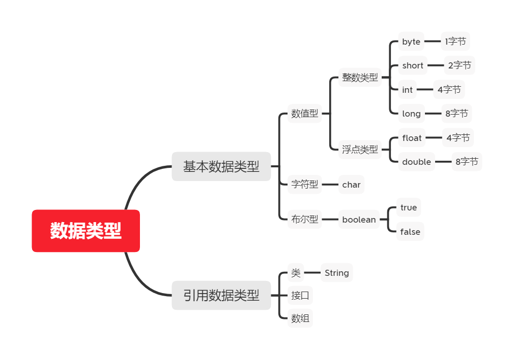
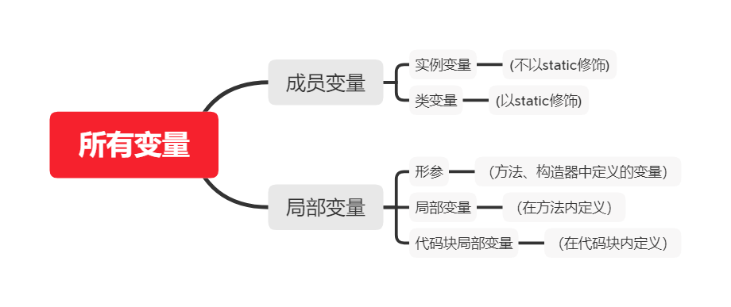
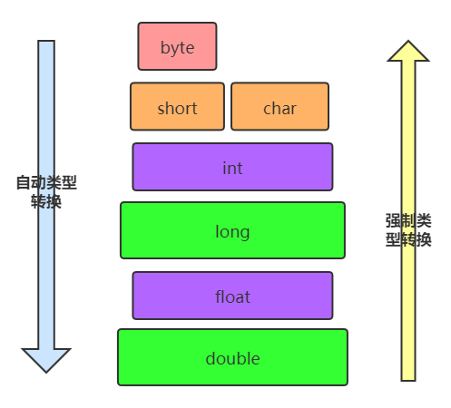

# 变量

## 变量

### 变量的概念：

- 内存中的一个存储区域
- 该区域的数据可以在同一类型范围内不断变化
- 变量是程序中最基本的存储单元。包含变量类型、变量名和存储的值

### 变量的作用：

- 用于在内存中保存数据
- 使用变量注意：
- Java中每个变量必须先声明，后使用
- 使用变量名来访问这块区域的数据

### 变量的作用域：其定义所在的一对`{ }`内

- 变量只有在其作用域内才有效
- 同一个作用域内，不能定义重名的变量

### 声明变量

- 语法：<数据类型> <变量名称>
- 例如：int var;

### 变量的赋值

- 语法：<变量名称> =  <值>
- 例如：var = 10;

### 声明和赋值变量

- 语法： <数据类型> <变量名> =  <初始化值>
- 例如：int var = 10;

> **注意: <数据类型> <变量名> =  <初始化值>,<变量名> =  <初始化值>**

### 变量的注意事项：

1. 变量不能重复定义。

2. 整数默认是int类型，如果想要直接定义一个long类型的数字，那么可以在这个数字后面加上l或者L，推荐L
3. 小数默认是double类型，如果想要定义一个float类型的数字，那么可以在这个数字后面加上f或者F，推荐F
4. 变量在使用前必须要赋值。
5. 变量只在自己的作用域（大括号）内有效，变量一旦离开自己的作用域就会消失

   ### 变量的分类

- **按数据类型分类**

  - 对于每一种数据都定义了明确的具体数据类型（强类型语言），在内存中分配了不同大小的内存空间。

  

- **按声明的位置的不同**

  - 在方法体外，类体内声明的变量称为成员变量。
  - 在方法体内部声明的变量称为局部变量。
  
  

## 整数类型

### 整数类型：

- `byte`、`short`、`int(默认)`、`long`
- `java`各整数类型有固定的表数范围和字段长度，不受具体`OS`的影响，以保证`java`程序的可移植性。
- `java`的整型常量默认为` int` 型，声明`long`型常量须后加`l`或`L`
- `java`程序中变量通常声明为`int`型，除非不足以表示较大的数，才使用`long`

### 各类型对比

| 类型    | 占用存储空间    | 范围                                     |
| ------- | --------------- | ---------------------------------------- |
| `byte`  | 1字节 = 8 (bit) | -128 ~ 127                               |
| `short` | 2字节 = 16(bit) | -32768~ 32767                            |
| `int`   | 4字节 = 32(bit) | -2147483648~2147483647                   |
| `long`  | 8字节 = 64(bit) | -9223372036854775808~9223372036854775807 |

> 		注意:整数类型中 第一个bit 代表的是符号 其余的组合起来就是当前代表的2进制数字
>		
> 	 因此： byte 最大存储 0111 ，1111 最小存储 1111, 1111
>		
> 	 因此当  byte n = 127;  n++ ; 结果就变成了 -128 

### 例如：

```java
public class Test {
    public static void main(String[] args) {
        byte maxByteValue = Byte.MAX_VALUE;
        System.out.println(++maxByteValue );
    }
}
// console: -127
```

## 浮点类型

### 浮点类型：

- `float`:单精度，尾数可以精确到7位有效数字。很多情况下，精度很难满足需求。
- `double`:双精度，精度是`float`的两倍。通常采用此类型后面也可以加`d`通常不加。
- `Java `的浮点型常量默认为`double`型，声明`float`型常量，须后加`f`或`F`
- `java`中可以用`_`来三位三位输出。`double otherNumber = 3_000_000.4_567_890;`

| 类型           | 占用存储空间    | 范围                   |
| -------------- | --------------- | ---------------------- |
| 单精度`float`  | 4字节 = 32(bit) | -3.403E38 ~ 3.403E38   |
| 双精度`double` | 8字节 = 64(bit) | -1.798E308 ~ 1.798E308 |

## 字符类型：(char)

### 字符类型

- char 型数据用来表示通常意义上“字符”(2字节)
- Java中的所有字符都使用Unicode编码，故一个字符可以存储一个字母，一个汉字，或其他书面语的一个字符。
- 字符型变量的三种表现形式：
  - 字符常量是用单引号(‘ ’)括起来的单个字符。例如：`char c1 = 'a';   char c2 = '中'; char c3 =  '9';`
  - `Java`中还允许使用转义字符‘\’来将其后的字符转变为特殊字符型常量。例如：`char c3 = ‘\n’;  // '\n'`表示换行符
  - 直接使用 `Unicode` 值来表示字符型常量：`‘\uXXXX’`。其中，`XXXX`代表一个十六进制整数。如：`\u000a `表示 `\n`。
- `char`类型是可以进行运算的。因为它都对应有Unicode码。

### ASCII 码

- 上个世纪60年代，美国制定了一套字符编码，对英语字符与二进制位之间的关系，做了统一规定。这被称为ASCII码。ASCII码一共规定了128个字符的编码，比如空格“SPACE”是32（二进制00100000），大写的字母A是65（二进制01000001）。这128个符号（包括32个不能打印出来的控制符号），只占用了一个字节的后面7位，最前面的1位统一规定为0。

- 缺点：

  - 不能表示所有字符。
  - 相同的编码表示的字符不一样：比如，130在法语编码中代表了`é`，在希伯来语编码中却代表了字母`Gimel (ג)`

- `ASCII`编码表

  

### Unicode 编码

- Unicode：一种编码，将世界上所有的符号都纳入其中。每一个符号都给予一个独一无二的编码，使用 Unicode 没有乱码的问题。
- 缺点：
  - Unicode 只规定了符号的二进制代码，却没有规定这个二进制代码应该如何存储：无法区别 Unicode 和ASCII：计算机无法区分三个字节表示一个符号还是分别表示三个符号。另外，我们知道，英文字母只用一个字节表示就够了，如果unicode统一规定，每个符号用三个或四个字节表示，那么每个英文字母前都必然有二到三个字节是0，这对于存储空间来说是极大的浪费。

### UTF-8

- `UTF-8` 是在互联网上使用最广的一种 `Unicode` 的实现方式。
- `UTF-8` 是一种变长的编码方式。它可以使用 1-6 个字节表示一个符号，根据不同的符号而变化字节长度。
- UTF-8的编码规则：
  - 对于单字节的UTF-8编码，该字节的最高位为0，其余7位用来对字符进行编码（等同于ASCII码）。
  - 对于多字节的UTF-8编码，如果编码包含 n 个字节，那么第一个字节的前 n 位为1，第一个字节的第 n+1 位为0，该字节的剩余各位用来对字符进行编码。在第一个字节之后的所有的字节，都是最高两位为"10"，其余6位用来对字符进行编码
- [Unicode查询网址](https://unicode-table.com/en/)

## 布尔类型(Boolean)

### 布尔类型

- `boolean` 类型用来判断逻辑条件，一般用于程序流程控制：
  - `if`条件控制语句；
  - `while`循环控制语句；
  - `do-while`循环控制语句；
  - `for`循环控制语句；
- `boolean`类型数据只允许取值`true`和`false`，无`nul`l。
  - 不可以使用`0`或`非 0 `的整数替代`false`和`true`，这点和`C`语言,`python`语言不同。
  - Java虚拟机中没有任何供`boolean`值专用的字节码指令，`Java`语言表达所操作的`boolean`值，在编译之后都使用`Jvm`中的`int`数据类型来代替：`true`用`1`表示，`false`用`0`表示。

## 类型转换

### 类型转换问题

- `boolean`类型不参与数据类型转换问题

  

- **自动类型转换**：

  - 容量小的类型自动转换为容量大的数据类型。
  - 有多种类型的数据混合运算时，系统首先自动将所有数据转换成容量最大的那种数据类型，然后再进行计算。
  - byte,short,char之间不会相互转换，他们三者在计算时首先转换为int类型。
  - 当把任何基本数据类型的值和字符串(String)进行连接运算时(+)，基本数据类型的值将自动转化为字符串(String)类型。
  - 此时的容量大小指的是，表示数的范围的大和小。比如：float容量要大于long的容量

- **强制类型转换**

  - 自动类型转换的逆过程，将容量大的数据类型转换为容量小的数据类型。使用时要加上强制转换符：()，但可能造成精度降低或溢出,格外要注意。

  - 通常，字符串不能直接转换为基本类型，但通过基本类型对应的包装类则可以实现把字符串转换成基本类型。

    > 	**注意 :因为java程序默认整数位int 默认浮点数为double ，如果声明比默认小的类型变量进行+-运算 一定要(cast)强制转换一下**